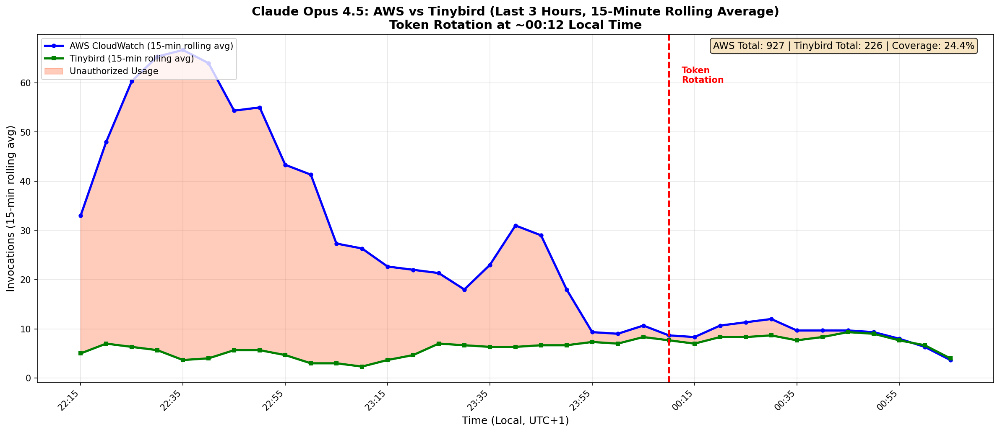

# Usage Monitoring Skill

Use this skill when:
- Checking model usage and costs (AWS Bedrock, Azure, etc.)
- Comparing provider metrics with Tinybird logging coverage
- Analyzing token consumption by model
- Investigating discrepancies between billed usage and logged usage
- Real-time comparison of text.pollinations.ai logs vs Tinybird

---

# Prerequisites

- **AWS CLI**: Configured with credentials for the Pollinations AWS account
- **tb CLI**: Tinybird CLI (`pip install tinybird-cli`)
- **jq**: For JSON parsing (`brew install jq`)
- **python3**: With matplotlib for plotting

---

# AWS Bedrock Models

| Our Model Name | AWS Model ID | Tier |
|----------------|--------------|------|
| `nova-fast` | `amazon.nova-micro-v1:0` | Free |
| `claude-large` | `global.anthropic.claude-opus-4-5-20251101-v1:0` | Paid |
| `claude` | `us.anthropic.claude-sonnet-4-5-20250929-v1:0` | Paid |
| `claude-fast` | `us.anthropic.claude-haiku-4-5-20251001-v1:0` | Paid |
| `chickytutor` | `us.anthropic.claude-3-5-haiku-20241022-v1:0` | Special |
| - | `amazon.nova-lite-v1:0` | Free |
| - | `us.anthropic.claude-opus-4-1-20250805-v1:0` | Legacy |

---

# Quick Commands

## List All Bedrock Models in Use

```bash
aws cloudwatch list-metrics --namespace AWS/Bedrock --metric-name Invocations --region us-east-1 --output json | jq -r '.Metrics[].Dimensions[] | select(.Name=="ModelId") | .Value' | sort -u
```

## Get 48-Hour Usage Summary for All Models

```bash
for model in "amazon.nova-micro-v1:0" "global.anthropic.claude-opus-4-5-20251101-v1:0" "us.anthropic.claude-sonnet-4-5-20250929-v1:0" "us.anthropic.claude-haiku-4-5-20251001-v1:0" "us.anthropic.claude-3-5-haiku-20241022-v1:0" "amazon.nova-lite-v1:0"; do
  echo "=== $model ==="
  inv=$(aws cloudwatch get-metric-statistics --namespace AWS/Bedrock --metric-name Invocations --dimensions Name=ModelId,Value="$model" --start-time $(date -u -v-48H +%Y-%m-%dT%H:%M:%SZ) --end-time $(date -u +%Y-%m-%dT%H:%M:%SZ) --period 172800 --statistics Sum --region us-east-1 --output json | jq -r '.Datapoints[0].Sum // 0')
  inp=$(aws cloudwatch get-metric-statistics --namespace AWS/Bedrock --metric-name InputTokenCount --dimensions Name=ModelId,Value="$model" --start-time $(date -u -v-48H +%Y-%m-%dT%H:%M:%SZ) --end-time $(date -u +%Y-%m-%dT%H:%M:%SZ) --period 172800 --statistics Sum --region us-east-1 --output json | jq -r '.Datapoints[0].Sum // 0')
  out=$(aws cloudwatch get-metric-statistics --namespace AWS/Bedrock --metric-name OutputTokenCount --dimensions Name=ModelId,Value="$model" --start-time $(date -u -v-48H +%Y-%m-%dT%H:%M:%SZ) --end-time $(date -u +%Y-%m-%dT%H:%M:%SZ) --period 172800 --statistics Sum --region us-east-1 --output json | jq -r '.Datapoints[0].Sum // 0')
  printf "Invocations: %s | Input: %.1fM | Output: %.1fM\n" "$inv" "$(echo "scale=1; $inp/1000000" | bc)" "$(echo "scale=1; $out/1000000" | bc)"
done
```

## Get Hourly Data for a Specific Model (48 Hours)

```bash
MODEL="global.anthropic.claude-opus-4-5-20251101-v1:0"

# Invocations
aws cloudwatch get-metric-statistics \
  --namespace AWS/Bedrock \
  --metric-name Invocations \
  --dimensions Name=ModelId,Value="$MODEL" \
  --start-time $(date -u -v-48H +%Y-%m-%dT%H:%M:%SZ) \
  --end-time $(date -u +%Y-%m-%dT%H:%M:%SZ) \
  --period 3600 \
  --statistics Sum \
  --region us-east-1 \
  --output json > /tmp/bedrock_invocations.json

# Input Tokens
aws cloudwatch get-metric-statistics \
  --namespace AWS/Bedrock \
  --metric-name InputTokenCount \
  --dimensions Name=ModelId,Value="$MODEL" \
  --start-time $(date -u -v-48H +%Y-%m-%dT%H:%M:%SZ) \
  --end-time $(date -u +%Y-%m-%dT%H:%M:%SZ) \
  --period 3600 \
  --statistics Sum \
  --region us-east-1 \
  --output json > /tmp/bedrock_input.json

# Output Tokens
aws cloudwatch get-metric-statistics \
  --namespace AWS/Bedrock \
  --metric-name OutputTokenCount \
  --dimensions Name=ModelId,Value="$MODEL" \
  --start-time $(date -u -v-48H +%Y-%m-%dT%H:%M:%SZ) \
  --end-time $(date -u +%Y-%m-%dT%H:%M:%SZ) \
  --period 3600 \
  --statistics Sum \
  --region us-east-1 \
  --output json > /tmp/bedrock_output.json
```

## Check Throttling Rates

```bash
MODEL="global.anthropic.claude-opus-4-5-20251101-v1:0"

aws cloudwatch get-metric-statistics \
  --namespace AWS/Bedrock \
  --metric-name InvocationThrottles \
  --dimensions Name=ModelId,Value="$MODEL" \
  --start-time $(date -u -v-48H +%Y-%m-%dT%H:%M:%SZ) \
  --end-time $(date -u +%Y-%m-%dT%H:%M:%SZ) \
  --period 3600 \
  --statistics Sum \
  --region us-east-1 \
  --output json | jq '.Datapoints | sort_by(.Timestamp) | .[] | "\(.Timestamp): \(.Sum) throttles"'
```

---

# Tinybird Queries

**Important**: Run Tinybird commands from `enter.pollinations.ai/observability/` directory where `.tinyb` config is located.

## Get All Bedrock Models Usage (48 Hours)

```bash
cd enter.pollinations.ai/observability

tb sql "SELECT 
  model_requested, 
  model_used, 
  SUM(token_count_prompt_text) as input_tokens, 
  SUM(token_count_completion_text) as output_tokens, 
  COUNT(*) as invocations 
FROM generation_event 
WHERE start_time >= now() - INTERVAL 48 HOUR 
  AND (model_used LIKE '%anthropic%' OR model_used LIKE '%nova%' OR model_used LIKE '%amazon%') 
GROUP BY model_requested, model_used 
ORDER BY invocations DESC 
LIMIT 30"
```

## Get Hourly Breakdown for a Model

```bash
cd enter.pollinations.ai/observability

tb sql "SELECT 
  toStartOfHour(start_time) as hour, 
  SUM(token_count_prompt_text) as input_tokens, 
  SUM(token_count_completion_text) as output_tokens, 
  COUNT(*) as invocations 
FROM generation_event 
WHERE start_time >= now() - INTERVAL 48 HOUR 
  AND model_used LIKE '%opus%' 
GROUP BY hour 
ORDER BY hour"
```

## Compare Coverage by Model

```bash
cd enter.pollinations.ai/observability

tb sql "SELECT 
  CASE 
    WHEN model_used LIKE '%nova-micro%' THEN 'nova-micro'
    WHEN model_used LIKE '%opus%' THEN 'claude-opus'
    WHEN model_used LIKE '%sonnet%' THEN 'claude-sonnet'
    WHEN model_used LIKE '%haiku%' THEN 'claude-haiku'
    ELSE 'other'
  END as model_family,
  SUM(token_count_prompt_text) as input_tokens, 
  SUM(token_count_completion_text) as output_tokens, 
  COUNT(*) as invocations 
FROM generation_event 
WHERE start_time >= now() - INTERVAL 48 HOUR 
  AND (model_used LIKE '%anthropic%' OR model_used LIKE '%nova%') 
GROUP BY model_family 
ORDER BY invocations DESC"
```

---

# Coverage Analysis

## Expected Coverage Rates (Jan 2026 Baseline)

| Model | Invocation Coverage | Input Token Coverage | Notes |
|-------|---------------------|---------------------|-------|
| Nova Micro (`nova-fast`) | ~100% | ~100% | All traffic via enter |
| Claude Haiku 4.5 (`claude-fast`) | ~70% | ~96% | Good coverage |
| Claude Sonnet 4.5 (`claude`) | ~64% | ~48% | Some direct traffic |
| Claude Opus 4.5 (`claude-large`) | ~35% | ~18% | Significant bypass |

**Low Opus coverage** indicates traffic bypassing enter.pollinations.ai - likely:
- Direct Portkey calls
- Long-context conversations from internal tools
- Batch processing jobs

---

# Plotting Commands

## Generate Comparison Plot

Save this script and run with Python:

```python
# Save as /tmp/bedrock_plot.py
import matplotlib.pyplot as plt
import json
from datetime import datetime

# Load AWS data
with open('/tmp/bedrock_invocations.json') as f:
    aws_inv = json.load(f)

# Parse and plot
points = [(datetime.strptime(d['Timestamp'][:19], "%Y-%m-%dT%H:%M:%S"), d['Sum']) 
          for d in aws_inv['Datapoints']]
points.sort()
times, values = zip(*points)

plt.figure(figsize=(14, 6))
plt.bar(times, values, width=0.03, color='#2196F3')
plt.title('Bedrock Model Invocations (48 Hours)')
plt.xlabel('Time (UTC)')
plt.ylabel('Invocations')
plt.xticks(rotation=45)
plt.tight_layout()
plt.savefig('/tmp/bedrock_usage.png', dpi=150)
print('Saved to /tmp/bedrock_usage.png')
```

---

# Cost Estimation

## Bedrock Pricing (us-east-1, Jan 2026)

| Model | Input (per 1M tokens) | Output (per 1M tokens) |
|-------|----------------------|------------------------|
| Claude Opus 4.5 | $15.00 | $75.00 |
| Claude Sonnet 4.5 | $3.00 | $15.00 |
| Claude Haiku 4.5 | $0.80 | $4.00 |
| Nova Micro | $0.035 | $0.14 |
| Nova Lite | $0.06 | $0.24 |

## Quick Cost Calculation

```bash
# Get totals and estimate cost
MODEL="global.anthropic.claude-opus-4-5-20251101-v1:0"
INPUT_PRICE=15.00  # per 1M tokens
OUTPUT_PRICE=75.00

inp=$(aws cloudwatch get-metric-statistics --namespace AWS/Bedrock --metric-name InputTokenCount --dimensions Name=ModelId,Value="$MODEL" --start-time $(date -u -v-48H +%Y-%m-%dT%H:%M:%SZ) --end-time $(date -u +%Y-%m-%dT%H:%M:%SZ) --period 172800 --statistics Sum --region us-east-1 --output json | jq -r '.Datapoints[0].Sum // 0')
out=$(aws cloudwatch get-metric-statistics --namespace AWS/Bedrock --metric-name OutputTokenCount --dimensions Name=ModelId,Value="$MODEL" --start-time $(date -u -v-48H +%Y-%m-%dT%H:%M:%SZ) --end-time $(date -u +%Y-%m-%dT%H:%M:%SZ) --period 172800 --statistics Sum --region us-east-1 --output json | jq -r '.Datapoints[0].Sum // 0')

echo "Input tokens: $inp"
echo "Output tokens: $out"
echo "Estimated cost: \$$(echo "scale=2; ($inp/1000000)*$INPUT_PRICE + ($out/1000000)*$OUTPUT_PRICE" | bc)"
```

---

# Real-Time Comparison (text.pollinations.ai logs vs Tinybird)

These commands compare token counts from the text.pollinations.ai service logs with Tinybird data to verify logging accuracy.

## Get Token Counts from Service Logs (Last N Minutes)

```bash
# Replace N with minutes (e.g., 10)
ssh enter-services "sudo journalctl -u text-pollinations.service --since 'N minutes ago' --no-pager | grep TOKEN-USAGE | awk -F'=' '{m=\$2; gsub(/ input.*/,\"\",m); i=\$3; gsub(/ output.*/,\"\",i); o=\$4; print m,i,o}' | awk '{c[\$1]++;i[\$1]+=\$2;o[\$1]+=\$3} END {for(m in c) printf \"%s|%d|%d|%d\\n\",m,c[m],i[m],o[m]}' | sort -t'|' -k2 -rn"
```

Output format: `model|calls|input_tokens|output_tokens`

## Get Token Counts from Tinybird (Last N Minutes)

```bash
cd enter.pollinations.ai/observability

# Replace N with minutes (e.g., 10)
tb sql "SELECT model_used, COUNT(*) as calls, SUM(token_count_prompt_text) as input, SUM(token_count_completion_text) as output FROM generation_event WHERE start_time > now() - INTERVAL N MINUTE GROUP BY model_used ORDER BY calls DESC LIMIT 20"
```

## Quick Side-by-Side Comparison

Run both commands with the same time window and compare:
- **Logs ≈ Tinybird**: Logging is working correctly
- **Logs >> Tinybird**: Tinybird ingestion issues
- **Logs << Tinybird**: Cache hits or other sources logging to Tinybird

## Filter for Bedrock Models Only

```bash
# Service logs - Bedrock models only
ssh enter-services "sudo journalctl -u text-pollinations.service --since '10 minutes ago' --no-pager | grep TOKEN-USAGE | grep -E 'anthropic|nova' | awk -F'=' '{m=\$2; gsub(/ input.*/,\"\",m); i=\$3; gsub(/ output.*/,\"\",i); o=\$4; print m,i,o}' | awk '{c[\$1]++;i[\$1]+=\$2;o[\$1]+=\$3} END {for(m in c) printf \"%s|%d|%d|%d\\n\",m,c[m],i[m],o[m]}' | sort -t'|' -k2 -rn"

# Tinybird - Bedrock models only
tb sql "SELECT model_used, COUNT(*) as calls, SUM(token_count_prompt_text) as input, SUM(token_count_completion_text) as output FROM generation_event WHERE start_time > now() - INTERVAL 10 MINUTE AND (model_used LIKE '%anthropic%' OR model_used LIKE '%nova%') GROUP BY model_used ORDER BY calls DESC"
```

---

# Security Investigation

## Detecting Unauthorized Usage

**Key indicator:** AWS CloudWatch shows significantly more usage than Tinybird logs.

```bash
# Quick coverage check - compare AWS vs Tinybird for last hour
MODEL="global.anthropic.claude-opus-4-5-20251101-v1:0"

# AWS total
aws cloudwatch get-metric-statistics --namespace AWS/Bedrock --metric-name Invocations \
  --dimensions Name=ModelId,Value="$MODEL" \
  --start-time $(date -u -v-1H +%Y-%m-%dT%H:%M:%SZ) --end-time $(date -u +%Y-%m-%dT%H:%M:%SZ) \
  --period 3600 --statistics Sum --region us-east-1 --output json | jq '.Datapoints[0].Sum'

# Tinybird total (run from enter.pollinations.ai/observability/)
tb sql "SELECT COUNT(*) FROM generation_event WHERE start_time >= now() - INTERVAL 1 HOUR AND model_used LIKE '%opus%'"
```

**Coverage < 50%** = likely unauthorized access bypassing the gateway.

## Check IP Logs for Suspicious Activity

```bash
# View recent IPs hitting text service with token prefix
ssh enter-services "sudo journalctl -u text-pollinations.service --since '5 minutes ago' --no-pager | grep IP-LOG | tail -20"

# Check for specific suspicious IP
ssh enter-services "sudo journalctl -u text-pollinations.service --since '1 hour ago' --no-pager | grep '51.178.209.163'"

# Count requests by IP (requires token logging enabled)
ssh enter-services "sudo journalctl -u text-pollinations.service --since '10 minutes ago' --no-pager | grep IP-LOG | awk '{print \$NF}' | sort | uniq -c | sort -rn | head -20"
```

## Add Token Logging (Temporary Debug)

To see which token attackers are using, add token prefix to IP logs:

```bash
# On enter-services, edit server.js to log token prefix
ssh enter-services "sed -i 's/logIp(socketIp, \"text\", \`path=\${req.path} model=\${model}\`);/const tokenPrefix = req.headers[\"x-enter-token\"] ? req.headers[\"x-enter-token\"].substring(0, 4) : \"none\"; logIp(socketIp, \"text\", \`path=\${req.path} model=\${model} token=\${tokenPrefix}\`);/' /home/ubuntu/pollinations/text.pollinations.ai/server.js && sudo systemctl restart text-pollinations.service"
```

**Remember to revert this after investigation!**

## Generate AWS vs Tinybird Comparison Plot

```python
# Save as /tmp/plot_comparison.py
import matplotlib.pyplot as plt
import json
from datetime import datetime, timedelta
import numpy as np

# Load data (after running AWS/Tinybird queries above)
with open('/tmp/aws_data.json') as f:
    aws_data = json.load(f)
with open('/tmp/tb_data.json') as f:
    tb_data = json.load(f)

# Parse and align timestamps
utc_offset = timedelta(hours=1)  # Adjust for local time

aws_points = {}
for d in aws_data['Datapoints']:
    ts = datetime.strptime(d['Timestamp'][:19], "%Y-%m-%dT%H:%M:%S")
    ts = ts.replace(minute=(ts.minute // 5) * 5, second=0) + utc_offset
    aws_points[ts] = aws_points.get(ts, 0) + d['Sum']

tb_points = {}
for d in tb_data['data']:
    ts = datetime.strptime(d['ts'], "%Y-%m-%d %H:%M:%S")
    ts = ts.replace(minute=(ts.minute // 5) * 5, second=0) + utc_offset
    tb_points[ts] = tb_points.get(ts, 0) + d['invocations']

all_times = sorted(set(list(aws_points.keys()) + list(tb_points.keys())))
aws_values = np.array([aws_points.get(t, 0) for t in all_times])
tb_values = np.array([tb_points.get(t, 0) for t in all_times])

# Rolling average
window = 3
aws_rolling = np.convolve(aws_values, np.ones(window)/window, mode='valid')
tb_rolling = np.convolve(tb_values, np.ones(window)/window, mode='valid')
times_rolling = all_times[window-1:]

fig, ax = plt.subplots(figsize=(16, 7))
ax.plot(range(len(times_rolling)), aws_rolling, 'b-', linewidth=2.5, label='AWS CloudWatch')
ax.plot(range(len(times_rolling)), tb_rolling, 'g-', linewidth=2.5, label='Tinybird (Legitimate)')
ax.fill_between(range(len(times_rolling)), tb_rolling, aws_rolling, 
                where=(aws_rolling > tb_rolling), color='#FF5722', alpha=0.3, label='Unauthorized')

ax.set_xlabel('Time (Local)')
ax.set_ylabel('Invocations (rolling avg)')
ax.set_title('AWS vs Tinybird - Unauthorized Usage Detection')
ax.legend()
plt.savefig('/tmp/usage_comparison.png', dpi=150)
print('Saved to /tmp/usage_comparison.png')
```

## Token Rotation Checklist

When rotating `PLN_ENTER_TOKEN`:

1. **Generate new token**: `openssl rand -base64 32 | tr -d '/+=' | cut -c1-43`
2. **Update SOPS files**: `enter.pollinations.ai/secrets/*.vars.json`
3. **Update GitHub secrets**: `PLN_ENTER_TOKEN` in repo settings
4. **Update Wrangler secrets**: `wrangler secret put PLN_ENTER_TOKEN`
5. **Update EC2 service**: SSH to `enter-services`, update `.env`, restart service
6. **Update Modal**: Redeploy flux-klein and flux-klein-9b
7. **Update io.net instances**: SSH to zimage/flux instances, update env vars
8. **Verify**: Check IP logs show new token prefix, old token rejected

**NEVER hardcode tokens in scripts or config files in the repo!**

## Known Attack Patterns (Jan 2026 Incident)

- **Attacker IP**: `51.178.209.163` (OVH Strasbourg)
- **Method**: Direct access to text.pollinations.ai EC2, bypassing enter gateway
- **Root cause**: `PLN_ENTER_TOKEN` hardcoded in `setup-ionet.sh` (public repo)
- **Detection**: AWS CloudWatch >> Tinybird (24% coverage during attack)
- **Resolution**: Token rotated, hardcoded default removed, attacker blocked

### Reference Graphs (Jan 29, 2026)

See `artifacts/` folder for example comparison plots:
- `aws_vs_tinybird_rolling.png` - 15-min rolling average showing attack and resolution
- `aws_vs_tinybird_3h_5min_local.png` - 5-minute intervals, local time
- `aws_vs_tinybird_3h_local.png` - 10-minute intervals, local time



---

# Notes

- **CloudWatch metrics** show actual AWS Bedrock usage (what we're billed for)
- **Tinybird logs** show usage through enter.pollinations.ai (what we track)
- **Service logs** show real-time token counts from text.pollinations.ai (`[TOKEN-USAGE]` format)
- **Coverage gap** = traffic not going through enter (direct API calls, internal tools, or **unauthorized access**)
- Run Tinybird commands from `enter.pollinations.ai/observability/` directory
- AWS region is `us-east-1` for all Bedrock models
- SSH host: `enter-services` (configured in ~/.ssh/config)
- Security incident report: `enter.pollinations.ai/observability/SECURITY_INCIDENT_REPORT_2026-01-28.md`
