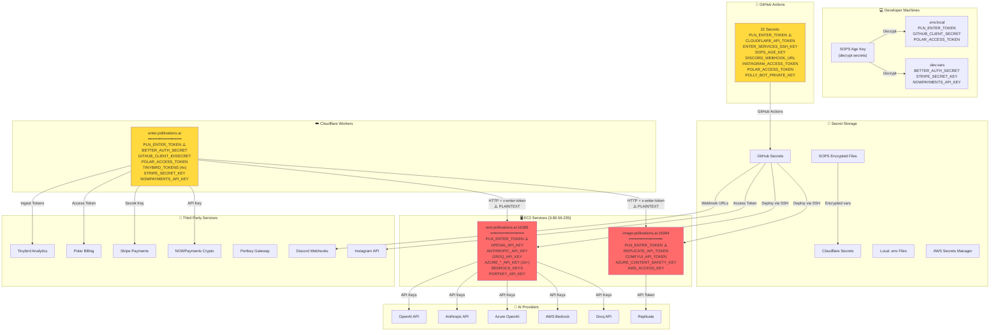

# 🔐 Pollinations Security Token Architecture

## Complete Token & Secret Flow Diagram



## Token Categories & Risk Assessment

### 🔴 **CRITICAL - Internal Authentication**
| Token | Purpose | Storage Locations | Risk |
|-------|---------|------------------|------|
| `PLN_ENTER_TOKEN` | Internal service auth | GitHub Secrets, Cloudflare, EC2, .dev.vars | **COMPROMISED** - Transmitted in plaintext HTTP |

### 🟡 **HIGH - AI Provider Keys**
| Token | Purpose | Storage Locations | Risk |
|-------|---------|------------------|------|
| `OPENAI_API_KEY` | OpenAI API access | EC2 (.env), SOPS | High cost if leaked |
| `ANTHROPIC_API_KEY` | Claude API access | EC2 (.env), SOPS | High cost if leaked |
| `GROQ_API_KEY` | Groq API access | EC2 (.env), SOPS | Medium cost if leaked |
| `AZURE_*_API_KEY` | Azure OpenAI (10+ keys) | EC2 (.env), SOPS | High cost if leaked |
| `AWS_ACCESS_KEY_ID/SECRET` | AWS Bedrock access | EC2 (.env), SOPS | **CRITICAL** - Full AWS access |
| `REPLICATE_API_TOKEN` | Replicate models | EC2 (.env), SOPS | High cost if leaked |

### 🟠 **MEDIUM - Payment & Billing**
| Token | Purpose | Storage Locations | Risk |
|-------|---------|------------------|------|
| `STRIPE_SECRET_KEY` | Stripe payments | Cloudflare, .dev.vars | Financial transactions |
| `POLAR_ACCESS_TOKEN` | Polar subscriptions | GitHub, Cloudflare, .dev.vars | Billing access |
| `NOWPAYMENTS_API_KEY` | Crypto payments | Cloudflare, .dev.vars | Crypto transactions |

### 🟢 **LOW - Analytics & Monitoring**
| Token | Purpose | Storage Locations | Risk |
|-------|---------|------------------|------|
| `TINYBIRD_*_TOKEN` | Analytics (5 tokens) | Cloudflare, .dev.vars | Read/write analytics |
| `DISCORD_WEBHOOK_URL` | Notifications | GitHub Secrets | Spam potential |
| `INSTAGRAM_ACCESS_TOKEN` | Social posts | GitHub Secrets | Account access |

### 🔵 **INFRASTRUCTURE**
| Token | Purpose | Storage Locations | Risk |
|-------|---------|------------------|------|
| `CLOUDFLARE_API_TOKEN` | Deploy to CF Workers | GitHub Secrets | Infrastructure control |
| `ENTER_SERVICES_SSH_KEY` | EC2 SSH access | GitHub Secrets | **CRITICAL** - Server access |
| `SOPS_AGE_KEY` | Decrypt secrets | GitHub Secrets, Dev machines | **CRITICAL** - All secrets exposed |
| `BETTER_AUTH_SECRET` | Session encryption | Cloudflare, .dev.vars | Session hijacking |
| `GITHUB_CLIENT_SECRET` | OAuth login | Cloudflare, .dev.vars | Auth bypass |

## Security Issues Identified

### 🚨 **Critical Vulnerabilities**
1. **PLN_ENTER_TOKEN transmitted in plaintext** (HTTP between Cloudflare → EC2)
2. **EC2 IP addresses hardcoded** in public `wrangler.toml`
3. **No IP restrictions** on EC2 ports 16384/16385
4. **Token prefix logged** in server logs ("token=1Slz")

### ⚠️ **High Risk Areas**
1. **AWS credentials on EC2** - If server compromised, attacker gets AWS access
2. **SOPS_AGE_KEY in GitHub** - Can decrypt all SOPS files if GitHub compromised
3. **Multiple AI API keys** on same server - Single breach exposes all providers
4. **Payment tokens** in Cloudflare - Stripe/Polar/NOWPayments all in one place

### 📊 **Token Exposure Matrix**

| Location | # of Secrets | Risk Level | Compromise Impact |
|----------|--------------|------------|-------------------|
| EC2 Services | 20+ | 🔴 Critical | All AI providers + internal auth |
| Cloudflare Workers | 15+ | 🟡 High | Payments + analytics + internal auth |
| GitHub Secrets | 22 | 🟡 High | Deploy access + notifications |
| Developer .env | 18+ | 🟠 Medium | Dev/test tokens |
| SOPS Files | All | 🟢 Low | Encrypted (need age key) |

## Recommendations

### Immediate Actions
1. ✅ **Rotate PLN_ENTER_TOKEN** after securing infrastructure
2. ✅ **Enable HTTPS** between Cloudflare and EC2
3. ✅ **Implement IP allowlist** on EC2 (Cloudflare IPs only)
4. ✅ **Remove EC2 IPs** from public wrangler.toml

### Short Term (This Week)
1. 🔐 **Move to AWS Secrets Manager** or similar for AI API keys
2. 🌐 **Use Cloudflare Tunnel** instead of public EC2 IPs
3. 📝 **Separate token scopes** (read vs write, service-specific)
4. 🔄 **Implement token rotation** schedule

### Long Term (This Month)
1. 🛡️ **Zero Trust Architecture** - mutual TLS between services
2. 🔑 **Hardware Security Module** for critical keys
3. 📊 **Secret scanning** in CI/CD pipeline
4. 🚨 **Anomaly detection** for token usage

## Token Leak Detection Commands

```bash
# Check for exposed tokens in git history
git log -p --all -S 'sk_\|pk_\|polar_\|token' | grep -E 'sk_|pk_|polar_|token'

# Find plaintext tokens in filesystem
grep -r "OPENAI_API_KEY\|ANTHROPIC_API_KEY\|PLN_ENTER_TOKEN" . --include="*.env" --include="*.vars"

# Monitor token usage in logs
ssh enter-services "sudo journalctl -f | grep -i token"

# Check for tokens in running processes
ps aux | grep -E "PLN_ENTER_TOKEN|API_KEY"
```

---

*Generated: 2026-01-29 23:45 UTC*
*Security Incident: Token Compromise via HTTP Interception*
*Status: Partially Mitigated (3 attackers blocked, infrastructure still vulnerable)*