# App Submission Workflow

Community apps built with Pollinations.AI can be submitted for inclusion on [pollinations.ai](https://pollinations.ai). Approved submissions earn contributors the **🌸 Flower tier** (10 pollen/day).

## Quick Start

1. **Submit** → Open issue using [App Submission template](https://github.com/pollinations/pollinations/issues/new?template=tier-app-submission.yml)
2. **Review** → Bot validates and creates PR if valid
3. **Approve** → Maintainer merges PR
4. **Reward** → Contributor upgraded to Flower tier

---

## Labels

| Label                 | Stage     | Description                       |
| --------------------- | --------- | --------------------------------- |
| `TIER-APP`            | New       | Submission received               |
| `TIER-APP-INCOMPLETE` | Waiting   | Needs user action (info/register) |
| `TIER-APP-REVIEW`     | In Review | PR created, awaiting maintainer   |
| `TIER-APP-COMPLETE`   | Done      | Approved and merged               |
| `TIER-APP-REJECTED`   | Closed    | Declined (duplicate/invalid)      |

---

## Workflow: app-review-submission.yml

Lightweight Python agent using Pollinations API directly with `SKILL.md` as system prompt.

### Triggers

| Event         | Condition                          |
| ------------- | ---------------------------------- |
| Issue opened  | Has `TIER-APP` label               |
| Issue edited  | Has `TIER-APP-INCOMPLETE` label    |
| Comment       | Has `TIER-APP-INCOMPLETE`, not bot |
| Manual        | Workflow dispatch with issue number|

### Step 1: Validation (`app-validate-submission.ts`)

| Check        | What                             | Result if failed         |
| ------------ | -------------------------------- | ------------------------ |
| Registration | User registered at Enter         | `TIER-APP-INCOMPLETE`    |
| Duplicates   | URL/repo/name already in APPS.md | `TIER-APP-REJECTED`      |
| Stars        | Fetch GitHub stars if repo found | Pass (0 if unavailable)  |
| Existing PR  | Detect PR for this issue         | Update existing branch   |

### Step 2: AI Processing (`app-review-agent.py`)

If validation failed:
- AI generates contextual error comment
- Adds appropriate label

If validation passed:
- AI picks emoji, category, description, language
- Creates branch from `origin/main`
- Adds row to `apps/APPS.md`
- Updates README
- Commits as bot with issue author as co-author
- Creates PR with `TIER-APP-REVIEW-PR` label

### Step 3: PR Outcome

| PR Action | Result |
| --------- | ------ |
| Merged    | `TIER-APP-COMPLETE` + congrats comment + close issue |
| Closed    | `TIER-APP-REJECTED` + decline comment |

---

## Duplicate Detection

| Check      | What                       | Action |
| ---------- | -------------------------- | ------ |
| URL exact  | App URL already in APPS.md | Reject |
| Repo exact | GitHub repo already listed | Reject |
| Name+User  | Same user + same app name  | Reject |

---

## Scripts

| Script                       | Purpose                                          |
| ---------------------------- | ------------------------------------------------ |
| `app-review-agent.py`        | Main agent - calls Pollinations API, creates PR  |
| `app-validate-submission.ts` | Pre-validation (registration, duplicates, stars) |
| `app-prepend-row.js`         | Add app row to APPS.md                           |
| `app-update-readme.js`       | Update README showcase                           |
| `app-check-duplicate.ts`     | Duplicate detection logic                        |

---

## Flow Diagram

```mermaid
%%{init: {'theme': 'dark'}}%%
flowchart TD
    A[User submits issue] --> B[TIER-APP]
    B --> V{Validation}
    V -->|Duplicate| X[TIER-APP-REJECTED]
    V -->|Not registered| E[TIER-APP-INCOMPLETE]
    E --> F[User fixes + edits/comments]
    F --> V
    V -->|Valid| G[AI creates PR]
    G --> H[TIER-APP-REVIEW]
    H --> I{Maintainer review}
    I -->|Reject| X
    I -->|Merge| J[TIER-APP-COMPLETE]
    J --> K[Upgrade to Flower tier]
    K --> L[🎉 Celebrate!]
```

---

## Categories

| Category    | Description                                    |
| ----------- | ---------------------------------------------- |
| Vibes       | No-code / describe-to-code playgrounds         |
| Creative    | Images, video, music, design, slides           |
| Games       | AI-powered play, interactive fiction           |
| Dev_Tools   | SDKs, extensions, dashboards, MCP servers      |
| Chat        | Chat UIs / multi-model playgrounds             |
| Social_Bots | Discord / Telegram / WhatsApp bots             |
| Learn       | Tutorials, guides, educational demos           |

---

## Tier Hierarchy

| Tier       | Benefit                                |
| ---------- | -------------------------------------- |
| Spore      | Free tier                              |
| Seed       | Basic tier                             |
| **Flower** | **10 pollen/day** (contributor reward) |
| Nectar     | Higher tiers                           |
