# App Submission Workflow

Community apps built with Pollinations.AI can be submitted for inclusion on [pollinations.ai](https://pollinations.ai). Approved submissions earn contributors the **🌸 Flower tier** (10 pollen/day).

## Quick Start

1. **Submit** → Open issue using [App Submission template](https://github.com/pollinations/pollinations/issues/new?template=tier-app-submission.yml)
2. **Review** → Bot checks registration + duplicates, creates PR if valid
3. **Approve** → Maintainer merges PR
4. **Reward** → Contributor upgraded to Flower tier

---

## Labels

| Label                 | Stage     | Description                       |
| --------------------- | --------- | --------------------------------- |
| `TIER-APP`            | New       | Submission received               |
| `TIER-APP-INCOMPLETE` | Waiting   | Needs user action (info/register) |
| `TIER-APP-REVIEW`     | In Review | PR created, awaiting maintainer   |
| `TIER-APP-COMPLETE`   | Done      | Approved and merged               |
| `TIER-APP-REJECTED`   | Closed    | Declined (duplicate/invalid)      |

---

## Workflow: app-review-submission.yml

### Job 1: Parse & Validate

**Triggers:** issue opened, edited, or commented

1. Parse submission with AI
2. Check for duplicates (see below)
3. Check [Enter](https://enter.pollinations.ai) registration
4. Route based on result:
   - **Duplicate** → `TIER-APP-REJECTED` + close
   - **Not registered** → `TIER-APP-INCOMPLETE` + request signup
   - **Valid** → proceed to Job 2

### Duplicate Detection

| Check         | What                               | Action |
| ------------- | ---------------------------------- | ------ |
| URL exact     | App URL already in APPS.md         | Reject |
| Repo exact    | GitHub repo already listed         | Reject |
| Name+User     | Same user + same app name          | Reject |
| AI similarity | >80% match to user's previous apps | Reject |

### Job 2: Create PR

**Runs if:** valid submission (no duplicate, registered)

1. Fetch GitHub stars
2. AI-generate emoji + description
3. Prepend to `apps/APPS.md`
4. Create PR with `TIER-APP-REVIEW` label
5. Update issue to `TIER-APP-REVIEW`

### Job 3: Handle PR Outcome

**Triggers:** PR closed

- **Merged** → `TIER-APP-COMPLETE` + success comment + close issue
- **Closed without merge** → `TIER-APP-REJECTED` + decline comment

---

## Workflow: app-upgrade-tier.yml

**Triggers:** PR with `TIER-APP-REVIEW` merged

1. Update PR label → `TIER-APP-COMPLETE`
2. Upgrade user to Flower tier (D1 + Polar)
3. Verify upgrade in both systems
4. Post celebration comment on PR + issue

---

## Workflow: app-check-registration.yml

**Triggers:** Comment on PR with `TIER-APP-INCOMPLETE`

Re-checks Enter registration when user comments after signing up.

---

## Scripts

| Script                   | Purpose                |
| ------------------------ | ---------------------- |
| `app-prepend-row.js`     | Add app row to APPS.md |
| `app-update-readme.js`   | Update README showcase |
| `app-check-duplicate.js` | Duplicate detection    |
| `app-check-links.js`     | Check for broken links |

---

## Flow Diagram

```mermaid
%%{init: {'theme': 'dark'}}%%
flowchart TD
    A[User submits issue] --> B[TIER-APP]
    B --> C{Duplicate?}
    C -->|Yes| X[TIER-APP-REJECTED]
    C -->|No| D{Registered?}
    D -->|No| E[TIER-APP-INCOMPLETE]
    E --> F[User signs up + comments]
    F --> C
    D -->|Yes| G[Create PR]
    G --> H[TIER-APP-REVIEW]
    H --> I{Maintainer review}
    I -->|Reject| X
    I -->|Merge| J[TIER-APP-COMPLETE]
    J --> K[Upgrade to Flower tier]
    K --> L[🎉 Celebrate!]
```

---

## Tier Hierarchy

| Tier       | Level | Benefit                                |
| ---------- | ----- | -------------------------------------- |
| Spore      | 1     | Free tier                              |
| Seed       | 2     | Basic tier                             |
| **Flower** | 3     | **10 pollen/day** (contributor reward) |
| Nectar     | 4+    | Higher tiers                           |

---

## Code Contributions _(future)_

Labels for code contributions (`TIER-CODE-*`) are planned but not yet implemented.
