# App Submission Workflow

Community apps built with Pollinations.AI can be submitted for inclusion on [pollinations.ai](https://pollinations.ai). Approved submissions earn contributors the **🌸 Flower tier** (10 pollen/day).

## Quick Start

1. **Submit** → Open issue using [App Submission template](https://github.com/pollinations/pollinations/issues/new?template=tier-app-submission.yml)
2. **Review** → Bot validates and creates PR if valid
3. **Approve** → Maintainer merges PR
4. **Reward** → Contributor upgraded to Flower tier

---

## Labels

| Label                 | Stage     | Description                       |
| --------------------- | --------- | --------------------------------- |
| `TIER-APP`            | New       | Submission received               |
| `TIER-APP-INCOMPLETE` | Waiting   | Needs user action (info/register) |
| `TIER-APP-REVIEW`     | In Review | PR created, awaiting maintainer   |
| `TIER-APP-COMPLETE`   | Done      | Approved and merged               |
| `TIER-APP-REJECTED`   | Closed    | Declined (duplicate/invalid)      |

---

## Workflow: app-review-submission.yml

Uses Claude Code via router (deepseek model) with pre-validation.

### Triggers

- Issue opened/edited with `TIER-APP` label
- Comment on issue with `TIER-APP-INCOMPLETE` label (by issue author or org members only)
- Manual dispatch with issue number

### Step 1: Pre-Validation (Script)

`app-validate-submission.ts` runs before Claude:

| Check        | What                             | Result if failed         |
| ------------ | -------------------------------- | ------------------------ |
| Registration | User registered at Enter         | `TIER-APP-INCOMPLETE`    |
| Duplicates   | URL/repo/name already in APPS.md | `TIER-APP-REJECTED`      |
| Stars        | Fetch GitHub stars if repo found | Pass (0 if unavailable)  |
| Existing PR  | Detect PR for this issue         | Update existing branch   |

### Step 2: Claude Processing

Claude handles the "fuzzy" parts:

- Parse issue body (name, url, description, category, discord, language)
- Pick appropriate category if unclear
- Pick creative emoji
- Create branch from `origin/main`
- Add row to `apps/APPS.md` using `app-prepend-row.js`
- Update README using `app-update-readme.js`
- Create PR with `TIER-APP-REVIEW-PR` label

**Rules for Claude:**
- Only edit `apps/APPS.md` and `README.md`
- Concise PR body (no test plans, no todos)

### Step 3: Handle PR Outcome

**Triggers:** PR with `TIER-APP-REVIEW-PR` closed

- **Merged** → `TIER-APP-COMPLETE` + success comment + close issue
- **Closed without merge** → `TIER-APP-REJECTED` + decline comment

---

## Duplicate Detection

| Check      | What                       | Action |
| ---------- | -------------------------- | ------ |
| URL exact  | App URL already in APPS.md | Reject |
| Repo exact | GitHub repo already listed | Reject |
| Name+User  | Same user + same app name  | Reject |

---

## Workflow: app-upgrade-tier.yml

**Triggers:** PR with `TIER-APP-REVIEW` merged

1. Update PR label → `TIER-APP-COMPLETE`
2. Upgrade user to Flower tier (D1 + Polar)
3. Verify upgrade in both systems
4. Post celebration comment on PR + issue

---

## Scripts

| Script                       | Purpose                           |
| ---------------------------- | --------------------------------- |
| `app-validate-submission.ts` | Pre-validation (registration, duplicates, stars) |
| `app-prepend-row.js`         | Add app row to APPS.md            |
| `app-update-readme.js`       | Update README showcase            |
| `app-check-duplicate.js`     | Duplicate detection logic         |

---

## Flow Diagram

```mermaid
%%{init: {'theme': 'dark'}}%%
flowchart TD
    A[User submits issue] --> B[TIER-APP]
    B --> V{Validation Script}
    V -->|Duplicate| X[TIER-APP-REJECTED]
    V -->|Not registered| E[TIER-APP-INCOMPLETE]
    E --> F[User signs up + comments]
    F --> V
    V -->|Valid| G[Claude creates PR]
    G --> H[TIER-APP-REVIEW]
    H --> I{Maintainer review}
    I -->|Reject| X
    I -->|Merge| J[TIER-APP-COMPLETE]
    J --> K[Upgrade to Flower tier]
    K --> L[🎉 Celebrate!]
```

---

## Tier Hierarchy

| Tier       | Level | Benefit                                |
| ---------- | ----- | -------------------------------------- |
| Spore      | 1     | Free tier                              |
| Seed       | 2     | Basic tier                             |
| **Flower** | 3     | **10 pollen/day** (contributor reward) |
| Nectar     | 4+    | Higher tiers                           |

---

## Categories

| Category     | Code           | Description                                    |
| ------------ | -------------- | ---------------------------------------------- |
| Vibe Coding  | `vibeCoding`   | No-code / describe-to-code playgrounds         |
| Creative     | `creative`     | Images, video, music, design, slides           |
| Games        | `games`        | AI-powered play, interactive fiction           |
| Hack & Build | `hackAndBuild` | SDKs, extensions, dashboards, MCP servers      |
| Chat         | `chat`         | Chat UIs / multi-model playgrounds             |
| Social Bots  | `socialBots`   | Discord / Telegram / WhatsApp bots             |
| Learn        | `learn`        | Tutorials, guides, educational demos           |
