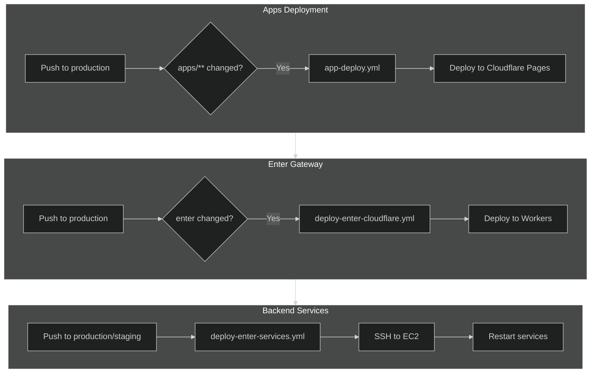

# Deployment

## Workflows

-   **app-deploy.yml** - Auto-deploys apps to Cloudflare Pages when `apps/**` changes on `production` branch.
-   **app-deploy-manual.yml** - Manual deployment of specific app to Cloudflare Pages.
-   **deploy-enter-cloudflare.yml** - Deploys `enter.pollinations.ai` to Cloudflare Workers on `production` push.
-   **deploy-enter-services.yml** - Deploys `text.pollinations.ai` and `image.pollinations.ai` to EC2 via SSH. Supports staging and production.
-   **deploy-portkey-gateway.yml** - Deploys Portkey gateway to Cloudflare Workers.

## Flow Diagram

