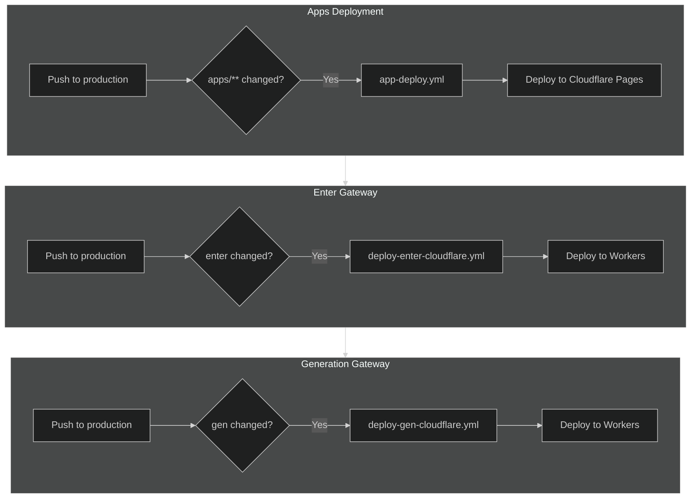

# Deployment

## Workflows

-   **app-deploy.yml** - Auto-deploys apps to Cloudflare Pages when `apps/**` changes on `production` branch.
-   **app-deploy-manual.yml** - Manual deployment of specific app to Cloudflare Pages.
-   **deploy-enter-cloudflare.yml** - Deploys `enter.pollinations.ai` to Cloudflare Workers on `production` push.
-   **deploy-gen-cloudflare.yml** - Deploys `gen.pollinations.ai` to Cloudflare Workers on `production` push.
-   **deploy-portkey-gateway.yml** - Deploys Portkey gateway to Cloudflare Workers.

## Flow Diagram

```mermaid
%%{init: {'theme': 'dark'}}%%
flowchart TD
    subgraph APPS["Apps Deployment"]
        A1[Push to production] --> A2{apps/** changed?}
        A2 -->|Yes| A3[app-deploy.yml]
        A3 --> A4[Deploy to Cloudflare Pages]
    end

    APPS --> ENTER

    subgraph ENTER["Enter Gateway"]
        B1[Push to production] --> B2{enter changed?}
        B2 -->|Yes| B3[deploy-enter-cloudflare.yml]
        B3 --> B4[Deploy to Workers]
    end

    ENTER --> GEN

    subgraph GEN["Generation Gateway"]
        C1[Push to production] --> C2{gen changed?}
        C2 -->|Yes| C3[deploy-gen-cloudflare.yml]
        C3 --> C4[Deploy to Workers]
    end
```
