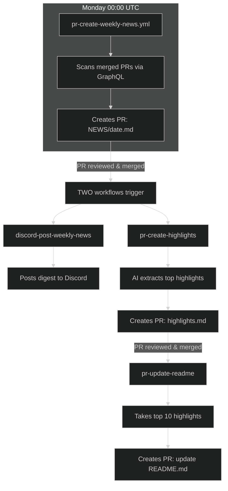
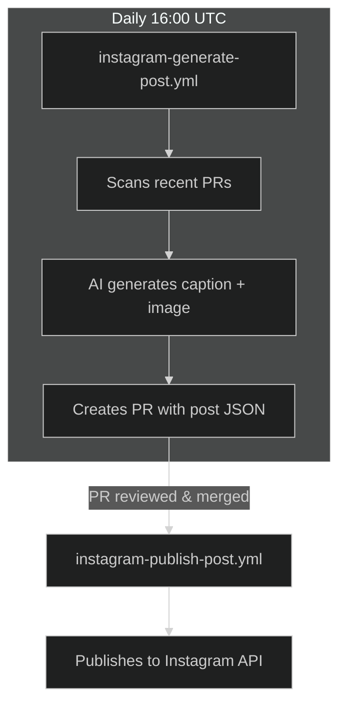
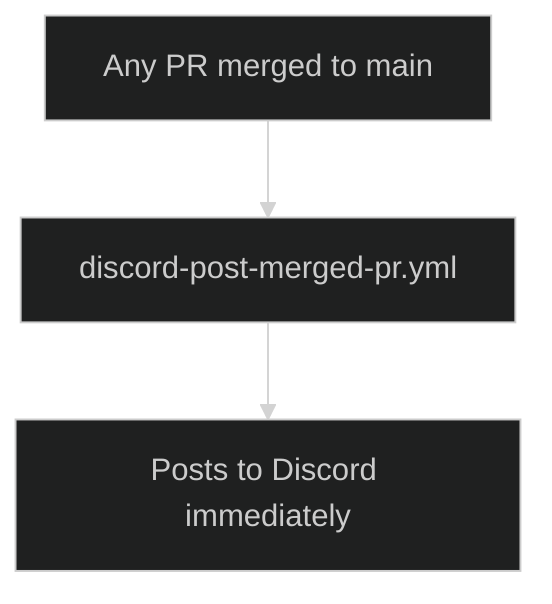

# News & Social

## Weekly News Pipeline

- **pr-create-weekly-news.yml** - Runs Monday 00:00 UTC. Scans merged PRs, creates `NEWS/{date}.md` PR.
- **pr-create-highlights.yml** - When NEWS PR merges, AI extracts top highlights → creates PR for `NEWS/transformed/highlights.md`.
- **pr-update-readme.yml** - When highlights PR merges, takes top 10 entries → creates PR to update README's "Latest News" section.

## Discord

- **discord-post-weekly-news.yml** - Triggered when `NEWS/*.md` is pushed. Posts weekly digest to Discord.
- **discord-post-merged-pr.yml** - Posts every merged PR to Discord immediately.

## Instagram

- **instagram-generate-post.yml** - Daily at 16:00 UTC. Scans recent PRs, generates Instagram post content, creates PR with image and caption.
- **instagram-publish-post.yml** - When Instagram post PR is merged, publishes to Instagram via API.

## Flow Diagrams

### Weekly News Pipeline



### Instagram Pipeline



### Live PR Notifications



## Scripts

All scripts are in `.github/scripts/` and use Python 3 with the pollinations.ai API.

### Weekly News Scripts

| Script                     | Purpose                                       | AI Model     |
| -------------------------- | --------------------------------------------- | ------------ |
| `pr_create_weekly_news.py` | Scans merged PRs via GraphQL, creates NEWS PR | -            |
| `pr_create_highlights.py`  | Extracts top highlights from news             | gemini-large |
| `pr_update_readme.py`      | Updates README "Latest News" section          | -            |

### Discord Scripts

| Script                        | Purpose                                   | AI Model     |
| ----------------------------- | ----------------------------------------- | ------------ |
| `discord_post_weekly_news.py` | Posts weekly digest to Discord            | gemini-large |
| `discord_post_merged_pr.py`   | AI-generated announcements for merged PRs | gemini-large |

**Discord limits**: 2000 characters per message (chunked to 1900 for safety)

### Instagram Scripts

| Script                       | Purpose                                 | AI Model     |
| ---------------------------- | --------------------------------------- | ------------ |
| `instagram_generate_post.py` | Generates caption + image for Instagram | gemini-large |
| `instagram_publish_post.py`  | Publishes to Instagram via Graph API    | -            |

## Reddit Bot

Automated bot for **r/pollinations_ai** subreddit. Located at `.github/scripts/reddit_workflow/`.

**Note**: This is **not** a GitHub Action - it runs as a self-hosted Devvit app.

### Stack

- **Framework**: [Devvit](https://developers.reddit.com/docs/) (Reddit's developer platform)
- **Language**: TypeScript
- **Trigger**: `AppUpgrade` event (posts on app update)

### Files

| File              | Purpose                               |
| ----------------- | ------------------------------------- |
| `src/main.ts`     | Entry point, Devvit app configuration |
| `src/pipeline.ts` | Content generation pipeline           |
| `src/link.ts`     | Reddit API utilities                  |
| `devvit.json`     | Devvit app configuration              |
| `cron.sh`         | Self-hosted cron job script           |
| `deploy.sh`       | Deployment script                     |

### Deployment

```bash
cd .github/scripts/reddit_workflow
./deploy.sh  # Deploy the Devvit app
./cron.sh    # Set up cron on your server
```
