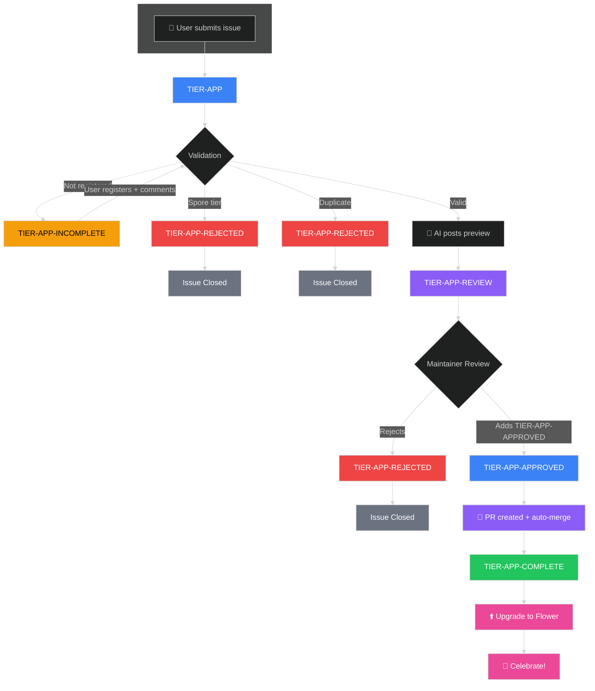

# Tier System

The pollinations.ai tier system rewards contributors with increasing API credits based on their engagement level.

## Tier Hierarchy

| Tier | Pollen | Cadence | Notes |
|------|--------|---------|-------|
| Microbe* | 0 | — | Internal: Account under review |
| Spore* | 0.01 | Hourly | Internal: Verified account |
| **Seed** | 0.15 | Hourly | Automatic via GitHub activity |
| **Flower** | 10 | Daily | Contributor (app submission) |
| **Nectar** | 20 | Daily | Coming soon |

> **Note:** *Microbe/Spore are internal-only. Spore and Seed refill hourly. Flower/Nectar refill daily at midnight UTC. No rollover.

---

## Spore → Seed Upgrade

**Automatic** - runs daily via cron job. No user action required.

### Eligibility Criteria

Users are scored based on GitHub profile metrics:

| Metric | Points | Max |
|--------|--------|-----|
| Account age | 0.5 pts/month | 6 pts |
| Commits (any repo) | 0.1 pts each | 2 pts |
| Public repos | 0.5 pts each | 1 pt |
| Stars (total) | 0.1 pts each | 5 pts |

**Threshold: ≥ 8 points** to qualify for Seed tier.

Example: A 12-month-old account (6 pts) with 20 commits (2 pts) qualifies.

### Step-by-Step Process

#### Step 1: Fetch Spore Users
- **Workflow:** `user-upgrade-spore-to-seed.yml` runs daily at midnight UTC
- **Script:** `user_upgrade_spore_to_seed.py`
- **Action:** Queries D1 database for all users with `tier = 'spore'`

#### Step 2: Validate GitHub Profiles
- **Script:** `user_validate_github_profile.py`
- **Action:** For each user, fetches GitHub profile via GraphQL API
- **Validation:**
  - Account creation date → age score
  - Total commits → commit score
  - Public repos count → repo score
  - Total stars across repos → stars score
- **Result:** Users with ≥ 8 points are approved

#### Step 3: Upgrade Approved Users
- **Script:** `tier-update-user.ts` (in `enter.pollinations.ai`)
- **Action:** For each approved user:
  1. Updates D1 database: `tier = 'seed'`
  2. Balance refills automatically at next refill cycle (hourly for Spore/Seed, daily for Flower+)
- **Rate limiting:** 1 second delay between upgrades

### Scripts

| Script | Purpose |
|--------|---------|
| `user_upgrade_spore_to_seed.py` | Main orchestrator - fetch, validate, upgrade |
| `user_validate_github_profile.py` | GitHub profile scoring logic |

### Manual Run

```bash
# Dry run (validate only, no upgrades)
python .github/scripts/user_upgrade_spore_to_seed.py --dry-run

# Live run
python .github/scripts/user_upgrade_spore_to_seed.py
```

---

## Seed → Flower Upgrade (App Submission)

**Manual** - user submits an app for review.

### Requirements

1. User must be registered at [enter.pollinations.ai](https://enter.pollinations.ai)
2. User must have at least **Seed tier** (Spore users cannot submit apps)
3. App must not be a duplicate

### Flow Diagram


```mermaid
%%{init: {'theme': 'dark'}}%%
flowchart TD
    subgraph submit [" "]
        A[👤 User submits issue]
    end

    A --> B[TIER-APP]
    B --> V{Validation}

    V -->|Not registered| E1[TIER-APP-INCOMPLETE]
    V -->|Spore tier| E2[TIER-APP-REJECTED]
    V -->|Duplicate| E3[TIER-APP-REJECTED]

    E1 -->|User registers + comments| V
    E2 --> CLOSED1[Issue Closed]
    E3 --> CLOSED2[Issue Closed]

    V -->|Valid| G[🤖 AI posts preview]
    G --> H[TIER-APP-REVIEW]
    H --> I{Maintainer Review}

    I -->|Rejects| REJ[TIER-APP-REJECTED]
    REJ --> CLOSED3[Issue Closed]

    I -->|Adds TIER-APP-APPROVED| AP[TIER-APP-APPROVED]
    AP --> PR[🔀 PR created + auto-merge]
    PR --> J[TIER-APP-COMPLETE]
    J --> K[⬆️ Upgrade to Flower]
    K --> L[🎉 Celebrate!]

    style B fill:#3b82f6,color:#fff
    style E1 fill:#f59e0b,color:#000
    style E2 fill:#ef4444,color:#fff
    style E3 fill:#ef4444,color:#fff
    style H fill:#8b5cf6,color:#fff
    style AP fill:#3b82f6,color:#fff
    style PR fill:#8b5cf6,color:#fff
    style REJ fill:#ef4444,color:#fff
    style J fill:#22c55e,color:#fff
    style CLOSED1 fill:#6b7280,color:#fff
    style CLOSED2 fill:#6b7280,color:#fff
    style CLOSED3 fill:#6b7280,color:#fff
    style K fill:#ec4899,color:#fff
    style L fill:#ec4899,color:#fff
```

**Color Legend:**
- 🔵 **Blue** - New submission (`TIER-APP`)
- 🟠 **Orange** - Incomplete, can retry (`TIER-APP-INCOMPLETE`)
- 🟣 **Purple** - In review (`TIER-APP-REVIEW`, `TIER-APP-REVIEW-PR`)
- 🟢 **Green** - Complete (`TIER-APP-COMPLETE`)
- 🔴 **Red** - Rejected (`TIER-APP-REJECTED`)
- ⚫ **Gray** - Closed

### Step-by-Step Process

---

#### Step 1: User Submits Issue

**Trigger:** User opens issue using [App Submission template](https://github.com/pollinations/pollinations/issues/new?template=tier-app-submission.yml)

**What happens:**
1. Issue is created with `TIER-APP` label (auto-applied by template)
2. Workflow `app-review-submission.yml` triggers on `issues: opened`
3. Bot adds 👀 reaction to issue

---

#### Step 2: Validation

**Script:** `app-validate-submission.ts`

**Tests performed (in order):**

| Test | Query/Check | Pass | Fail |
|------|-------------|------|------|
| **Registration** | `SELECT id, tier FROM user WHERE github_username = '${author}'` | User exists | → `NOT_REGISTERED` |
| **Tier Set** | `tier !== null` | Tier exists | → `TIER_NOT_SET` (system bug) |
| **Tier Level** | `tier !== 'spore'` | Seed or higher | → `SPORE_TIER` + closed |
| **Duplicate URL** | Check `apps/APPS.md` for same URL | Not found | → REJECTED + closed |
| **Duplicate Repo** | Check `apps/APPS.md` for same GitHub repo | Not found | → REJECTED + closed |
| **Duplicate Name+User** | Same app name by same user | Not found | → REJECTED + closed |
**Validation output:** JSON with `valid: true/false`, `errors: []`

---

#### Step 3A: Validation FAILED

| Error Code | Error Type | Label | Issue State |
|------------|------------|-------|-------------|
| `NOT_REGISTERED` | Not registered | `TIER-APP-INCOMPLETE` | Open (can retry) |
| `TIER_NOT_SET` | No tier (system bug) | `TIER-APP-INCOMPLETE` | Open (investigate) |
| `SPORE_TIER` | Spore tier | `TIER-APP-REJECTED` | Closed |
| — | Duplicate | `TIER-APP-REJECTED` | Closed |

**Bot comments posted:**

> 🟠 **Not Registered** (`NOT_REGISTERED`)
> 
> Hey @user! To submit an app, you need to register at enter.pollinations.ai first. Once registered, comment here and we'll retry.

> 🟠 **Tier Not Set** (`TIER_NOT_SET`)
> 
> Your account exists but has no tier set. This is a system error on our side - please contact support or try again later.

> 🔴 **Spore Tier** (`SPORE_TIER`)
> 
> Thanks for your interest! To submit an app, you need at least Seed tier. This is automatically granted based on your GitHub activity. Please try again later.

> 🔴 **Duplicate**
> 
> This app appears to already be listed. If you believe this is an error, please comment here.

---

#### Step 3B: Validation PASSED → Preview Posted

| Action | Details |
|--------|---------|
| AI processing | Selects emoji, category, description, language |
| Preview comment | Table with all fields + `APP_REVIEW_DATA` JSON block |
| Issue label | `TIER-APP` → `TIER-APP-REVIEW` |

**Bot posts preview comment** with app details table and JSON data block for the approval workflow.

---

#### Step 4: Maintainer Review (Approval Gate)

**Manual step** - maintainer reviews the preview comment on the issue.

**Options:**
- **Approve:** Add `TIER-APP-APPROVED` label → triggers PR creation + auto-merge
- **Reject:** Close issue → `TIER-APP-REJECTED`

---

#### Step 4B: Approval → PR Created + Auto-Merged

**Trigger:** Maintainer adds `TIER-APP-APPROVED` label to issue.

| Action | Details |
|--------|---------|
| Branch | `auto/app-{issue_number}-{app_name_slug}` |
| Files updated | `apps/APPS.md`, `GREENHOUSE.md` |
| PR label | `TIER-APP-REVIEW-PR` |
| Auto-merge | Enabled (squash + delete branch) |

The `app-approve` job in `app-review-submission.yml` parses the `APP_REVIEW_DATA` JSON from the bot's preview comment, creates a branch, updates APPS.md, and opens a PR with auto-merge enabled.

---

#### Step 5A: PR Merged → Tier Upgrade

**Workflow:** `app-upgrade-tier.yml`

| Action | Details |
|--------|---------|
| Trigger | PR closed + merged |
| Condition | Has `TIER-APP-REVIEW-PR` label |
| PR label | `TIER-APP-REVIEW-PR` → `TIER-APP-COMPLETE` |
| User tier | Upgraded to `flower` in D1 |
| Issue | Closed automatically |

**Bot comment posted:**

> 🎉 **App Approved & Verified!**
> 
> Your app has been added to the pollinations.ai showcase!
> 
> **🌸 Flower Tier Activated!**
> 
> @user, you've been upgraded to **Flower tier** (10 pollen/day)!
> 
> Check your balance at enter.pollinations.ai 🌻

---

#### Step 5B: PR Closed Without Merge → Rejected

**Workflow:** `app-upgrade-tier.yml` triggers on `pull_request_target: closed`

**Condition:** `merged == false` AND has `TIER-APP-REVIEW-PR` label

**What happens:**

1. **PR label updated:** `TIER-APP-REVIEW-PR` → `TIER-APP-REJECTED`
2. **Issue label updated:** `TIER-APP-REVIEW` → `TIER-APP-REJECTED`
3. **Comment posted to issue:**
   ```
   ❌ Unfortunately, this submission was not approved. 
   Feel free to submit a different app in the future!
   ```
4. **Issue closed**

---

### Workflow Triggers Summary

| Event | Workflow | Condition |
|-------|----------|-----------|
| Issue opened | `app-review-submission.yml` | Has `TIER-APP` label |
| Issue edited | `app-review-submission.yml` | Has `TIER-APP-INCOMPLETE` label |
| Issue comment | `app-review-submission.yml` | Has `TIER-APP-INCOMPLETE`, not from bot |
| Issue labeled | `app-review-submission.yml` | `TIER-APP-APPROVED` added + has `TIER-APP-REVIEW` |
| Manual | `app-review-submission.yml` | `workflow_dispatch` with issue number |
| PR merged | `app-upgrade-tier.yml` | Has `TIER-APP-REVIEW-PR` label |
| PR closed | `app-upgrade-tier.yml` | Has `TIER-APP-REVIEW-PR` label |

---

### Scripts Reference

| Script | Location | Purpose |
|--------|----------|---------|
| `app-review-agent.py` | `.github/scripts/` | Main agent - validation handling, preview posting |
| `app-validate-submission.js` | `.github/scripts/` | Pre-validation (registration, tier, duplicates) |
| `app-check-duplicate.js` | `.github/scripts/` | Duplicate detection logic |
| `app-prepend-row.js` | `.github/scripts/` | Add app row to APPS.md |
| `app-update-greenhouse.js` | `.github/scripts/` | Generate GREENHOUSE.md (curated app showcase) |
| `tier-update-user.ts` | `enter.pollinations.ai/scripts/` | Update user tier in D1 |

---

## Labels Reference

| Label | Stage | Description |
|-------|-------|-------------|
| `TIER-APP` | New | Submission received, validation pending |
| `TIER-APP-INCOMPLETE` | Waiting | Validation failed, user can fix and retry |
| `TIER-APP-REVIEW` | In Review | AI reviewed, preview posted, awaiting human approval |
| `TIER-APP-APPROVED` | Approved | Maintainer approved, PR created with auto-merge |
| `TIER-APP-REVIEW-PR` | PR | Applied to the PR itself |
| `TIER-APP-COMPLETE` | Done | PR merged, tier upgraded |
| `TIER-APP-REJECTED` | Closed | Declined (duplicate/invalid/spore tier) |

---

## App Categories

| Category | Description |
|----------|-------------|
| Image (`image`) | Image gen, editing, design, avatars, stickers |
| Video & Audio (`video_audio`) | Video gen, animation, music, TTS |
| Write (`writing`) | Content creation, storytelling, copy, slides |
| Chat (`chat`) | Assistants, companions, AI studio, multi-modal chat |
| Play (`games`) | AI games, roleplay, interactive fiction |
| Learn (`learn`) | Education, tutoring, language learning |
| Bots (`bots`) | Discord, Telegram, WhatsApp bots |
| Build (`build`) | Dev tools, SDKs, integrations, vibe coding |
| Business (`business`) | Productivity, finance, marketing, health, food |

---

## Tier Update Script

The actual tier updates use the shared script in `enter.pollinations.ai`:

```bash
# Update user tier
npx tsx scripts/tier-update-user.ts update-tier \
  --githubUsername "username" \
  --tier flower \
  --env production

# Verify tier was set correctly
npx tsx scripts/tier-update-user.ts verify-tier \
  --githubUsername "username" \
  --tier flower \
  --env production
```

This script updates:
- **D1 database** (Cloudflare) - `tier` column in `user` table

> Balance refills automatically at next refill cycle (hourly for Spore/Seed, daily for Flower+).

---

## Environment Variables

| Variable | Required For |
|----------|--------------|
| `GITHUB_TOKEN` | GitHub API access |
| `CLOUDFLARE_API_TOKEN` | D1 database access (wrangler) |
| `CLOUDFLARE_ACCOUNT_ID` | D1 database access (wrangler) |
| `POLLY_BOT_APP_ID` | GitHub App authentication |
| `POLLY_BOT_PRIVATE_KEY` | GitHub App authentication |
| `POLLINATIONS_API_KEY` | AI agent (LLM calls) |
