# Tier System

The pollinations.ai tier system rewards contributors with increasing API credits based on their engagement level.

## Tier Hierarchy

| Tier | Pollen/Day | How to Get |
|------|------------|------------|
| **Spore** | 0 | Default tier on registration |
| **Seed** | 3 | Automatic via GitHub activity |
| **Flower** | 10 | Submit an approved app |
| **Nectar** | 20 | Reserved for maintainers/sponsors |

---

## Spore → Seed Upgrade

**Automatic** - runs daily via cron job. No user action required.

### Eligibility Criteria

Users are scored based on GitHub profile metrics:

| Metric | Points | Max |
|--------|--------|-----|
| Account age | 0.5 pts/month | 6 pts |
| Commits (any repo) | 0.1 pts each | 2 pts |
| Public repos | 0.5 pts each | 1 pt |
| Stars (total) | 0.1 pts each | 5 pts |

**Threshold: ≥ 8 points** to qualify for Seed tier.

Example: A 12-month-old account (6 pts) with 20 commits (2 pts) qualifies.

### Workflow

```
user-upgrade-spore-to-seed.yml
├── Runs daily at midnight UTC
├── Fetches all spore users from D1
├── Validates GitHub profiles via GraphQL API
└── Upgrades eligible users to seed tier
```

### Scripts

| Script | Purpose |
|--------|---------|
| `user_upgrade_spore_to_seed.py` | Main orchestrator - fetch, validate, upgrade |
| `user_validate_github_profile.py` | GitHub profile scoring logic |

### Manual Run

```bash
# Dry run (validate only)
python .github/scripts/user_upgrade_spore_to_seed.py --dry-run

# Live run
python .github/scripts/user_upgrade_spore_to_seed.py
```

---

## Seed → Flower Upgrade

**Manual** - user submits an app for review.

### Requirements

1. User must be registered at [enter.pollinations.ai](https://enter.pollinations.ai)
2. User must have at least **Seed tier** (Spore users cannot submit apps)
3. App must not be a duplicate

### Submission Flow

```mermaid
%%{init: {'theme': 'dark'}}%%
flowchart TD
    A[User submits issue] --> B[TIER-APP]
    B --> V{Validation}
    V -->|Not registered| E1[TIER-APP-INCOMPLETE]
    V -->|Spore tier| E2[TIER-APP-REJECTED + closed]
    V -->|Duplicate| E3[TIER-APP-REJECTED + closed]
    E1 --> F[User registers + comments]
    F --> V
    V -->|Valid| G[AI creates PR]
    G --> H[TIER-APP-REVIEW]
    H --> I{Maintainer review}
    I -->|Reject| X[TIER-APP-REJECTED]
    I -->|Merge| J[TIER-APP-COMPLETE]
    J --> K[Upgrade to Flower tier]
    K --> L[🎉 Celebrate!]
```



### Validation Checks

| Check | What | Result if Failed |
|-------|------|------------------|
| Registration | User in Enter database | `TIER-APP-INCOMPLETE` (can retry) |
| Tier | Must be Seed or higher | `TIER-APP-REJECTED` (closed) |
| Duplicate URL | App URL already listed | `TIER-APP-REJECTED` (closed) |
| Duplicate Repo | GitHub repo already listed | `TIER-APP-REJECTED` (closed) |
| Duplicate Name+User | Same user + app name | `TIER-APP-REJECTED` (closed) |

### Workflow Triggers

| Event | Condition |
|-------|-----------|
| Issue opened | Has `TIER-APP` label |
| Issue edited | Has `TIER-APP-INCOMPLETE` label |
| Comment | Has `TIER-APP-INCOMPLETE`, not from bot |
| Manual | `workflow_dispatch` with issue number |

### Workflow Steps

```
app-review-submission.yml
├── Step 1: Validate (registration, tier, duplicates)
├── Step 2: AI generates PR or error comment
└── Step 3: On merge → upgrade to Flower tier (via app-upgrade-tier.yml)
```

### Scripts

| Script | Purpose |
|--------|---------|
| `app-review-agent.py` | Main agent - calls Pollinations API, creates PR |
| `app-validate-submission.ts` | Pre-validation (registration, tier, duplicates) |
| `app-check-duplicate.ts` | Duplicate detection logic |
| `app-prepend-row.js` | Add app row to APPS.md |
| `app-update-readme.js` | Update README showcase |

---

## Labels Reference

| Label | Stage | Description |
|-------|-------|-------------|
| `TIER-APP` | New | Submission received |
| `TIER-APP-INCOMPLETE` | Waiting | Needs user action (register/fix) |
| `TIER-APP-REVIEW` | In Review | PR created, awaiting maintainer |
| `TIER-APP-REVIEW-PR` | PR | Applied to the PR itself |
| `TIER-APP-COMPLETE` | Done | Approved and merged |
| `TIER-APP-REJECTED` | Closed | Declined (duplicate/invalid/spore) |

---

## App Categories

| Category | Description |
|----------|-------------|
| Vibes | No-code / describe-to-code playgrounds |
| Creative | Images, video, music, design, slides |
| Games | AI-powered play, interactive fiction |
| Dev_Tools | SDKs, extensions, dashboards, MCP servers |
| Chat | Chat UIs / multi-model playgrounds |
| Social_Bots | Discord / Telegram / WhatsApp bots |
| Learn | Tutorials, guides, educational demos |

---

## Tier Update Scripts

The actual tier updates use the shared script in `enter.pollinations.ai`:

```bash
# Update user tier
npx tsx scripts/tier-update-user.ts update-tier \
  --githubUsername "username" \
  --tier flower \
  --env production

# Verify tier
npx tsx scripts/tier-update-user.ts verify-tier \
  --githubUsername "username" \
  --tier flower \
  --env production
```

This script updates both:
- D1 database (Cloudflare)
- Polar subscription (billing)

---

## Environment Variables

| Variable | Required For |
|----------|--------------|
| `GITHUB_TOKEN` | GitHub API access |
| `CLOUDFLARE_API_TOKEN` | D1 database access |
| `CLOUDFLARE_ACCOUNT_ID` | D1 database access |
| `POLAR_ACCESS_TOKEN` | Polar subscription updates |
| `POLLY_BOT_APP_ID` | GitHub App authentication |
| `POLLY_BOT_PRIVATE_KEY` | GitHub App authentication |
