# Tier System

The pollinations.ai tier system rewards contributors with increasing API credits based on their engagement level.

## Tier Hierarchy

| Tier | Pollen/Day | How to Get |
|------|------------|------------|
| **Spore** | 0 | Default tier on registration |
| **Seed** | 3 | Automatic via GitHub activity |
| **Flower** | 10 | Submit an approved app |
| **Nectar** | 20 | Reserved for maintainers/sponsors |

---

## Spore → Seed Upgrade

**Automatic** - runs daily via cron job. No user action required.

### Eligibility Criteria

Users are scored based on GitHub profile metrics:

| Metric | Points | Max |
|--------|--------|-----|
| Account age | 0.5 pts/month | 6 pts |
| Commits (any repo) | 0.1 pts each | 2 pts |
| Public repos | 0.5 pts each | 1 pt |
| Stars (total) | 0.1 pts each | 5 pts |

**Threshold: ≥ 8 points** to qualify for Seed tier.

Example: A 12-month-old account (6 pts) with 20 commits (2 pts) qualifies.

### Step-by-Step Process

#### Step 1: Fetch Spore Users
- **Workflow:** `user-upgrade-spore-to-seed.yml` runs daily at midnight UTC
- **Script:** `user_upgrade_spore_to_seed.py`
- **Action:** Queries D1 database for all users with `tier = 'spore'`

#### Step 2: Validate GitHub Profiles
- **Script:** `user_validate_github_profile.py`
- **Action:** For each user, fetches GitHub profile via GraphQL API
- **Validation:**
  - Account creation date → age score
  - Total commits → commit score
  - Public repos count → repo score
  - Total stars across repos → stars score
- **Result:** Users with ≥ 8 points are approved

#### Step 3: Upgrade Approved Users
- **Script:** `tier-update-user.ts` (in `enter.pollinations.ai`)
- **Action:** For each approved user:
  1. Updates D1 database: `tier = 'seed'`
  2. Updates Polar subscription (billing system)
- **Rate limiting:** 1 second delay between upgrades (Polar API limit)

### Scripts

| Script | Purpose |
|--------|---------|
| `user_upgrade_spore_to_seed.py` | Main orchestrator - fetch, validate, upgrade |
| `user_validate_github_profile.py` | GitHub profile scoring logic |

### Manual Run

```bash
# Dry run (validate only, no upgrades)
python .github/scripts/user_upgrade_spore_to_seed.py --dry-run

# Live run
python .github/scripts/user_upgrade_spore_to_seed.py
```

---

## Seed → Flower Upgrade (App Submission)

**Manual** - user submits an app for review.

### Requirements

1. User must be registered at [enter.pollinations.ai](https://enter.pollinations.ai)
2. User must have at least **Seed tier** (Spore users cannot submit apps)
3. App must not be a duplicate

### Flow Diagram

```mermaid
%%{init: {'theme': 'dark'}}%%
flowchart TD
    subgraph submit [" "]
        A[👤 User submits issue]
    end
    
    A --> B[TIER-APP]
    B --> V{Validation}
    
    V -->|Not registered| E1[TIER-APP-INCOMPLETE]
    V -->|Spore tier| E2[TIER-APP-REJECTED]
    V -->|Duplicate| E3[TIER-APP-REJECTED]
    
    E1 -->|User registers + comments| V
    E2 --> CLOSED1[Issue Closed]
    E3 --> CLOSED2[Issue Closed]
    
    V -->|Valid| G[🤖 AI creates PR]
    G --> H[TIER-APP-REVIEW]
    H --> PR[TIER-APP-REVIEW-PR]
    PR --> I{Maintainer Review}
    
    I -->|Close| REJ[TIER-APP-REJECTED]
    REJ --> CLOSED3[Issue Closed]
    
    I -->|Merge| J[TIER-APP-COMPLETE]
    J --> K[⬆️ Upgrade to Flower]
    K --> L[🎉 Celebrate!]

    style B fill:#3b82f6,color:#fff
    style E1 fill:#f59e0b,color:#000
    style E2 fill:#ef4444,color:#fff
    style E3 fill:#ef4444,color:#fff
    style H fill:#8b5cf6,color:#fff
    style PR fill:#8b5cf6,color:#fff
    style REJ fill:#ef4444,color:#fff
    style J fill:#22c55e,color:#fff
    style CLOSED1 fill:#6b7280,color:#fff
    style CLOSED2 fill:#6b7280,color:#fff
    style CLOSED3 fill:#6b7280,color:#fff
    style K fill:#ec4899,color:#fff
    style L fill:#ec4899,color:#fff
```



**Color Legend:**
- 🔵 **Blue** - New submission (`TIER-APP`)
- 🟠 **Orange** - Incomplete, can retry (`TIER-APP-INCOMPLETE`)
- 🟣 **Purple** - In review (`TIER-APP-REVIEW`, `TIER-APP-REVIEW-PR`)
- 🟢 **Green** - Complete (`TIER-APP-COMPLETE`)
- 🔴 **Red** - Rejected (`TIER-APP-REJECTED`)
- ⚫ **Gray** - Closed

### Step-by-Step Process

---

#### Step 1: User Submits Issue

**Trigger:** User opens issue using [App Submission template](https://github.com/pollinations/pollinations/issues/new?template=tier-app-submission.yml)

**What happens:**
1. Issue is created with `TIER-APP` label (auto-applied by template)
2. Workflow `app-review-submission.yml` triggers on `issues: opened`
3. Bot adds 👀 reaction to issue

---

#### Step 2: Validation

**Script:** `app-validate-submission.ts`

**Tests performed (in order):**

| Test | Query/Check | Pass | Fail |
|------|-------------|------|------|
| **Registration** | `SELECT id, tier FROM user WHERE github_username = '${author}'` | User exists | → INCOMPLETE |
| **Tier Check** | `tier !== 'spore'` | Seed or higher | → REJECTED + closed |
| **Duplicate URL** | Check `apps/APPS.md` for same URL | Not found | → REJECTED + closed |
| **Duplicate Repo** | Check `apps/APPS.md` for same GitHub repo | Not found | → REJECTED + closed |
| **Duplicate Name+User** | Same app name by same user | Not found | → REJECTED + closed |
| **GitHub Stars** | `gh api repos/{owner}/{repo}` | Fetches count | 0 if unavailable |

**Validation output:** JSON with `valid: true/false`, `errors: []`, `stars: number`

---

#### Step 3A: Validation FAILED

**Script:** `app-review-agent.py` (lines 148-184)

**What happens:**

1. **AI generates comment:** LLM creates friendly error message explaining what's wrong
2. **Comment posted:** Bot posts comment to issue via GitHub API
3. **Label updated:**
   - Duplicate → `TIER-APP-REJECTED`
   - Spore tier → `TIER-APP-REJECTED`
   - Not registered → `TIER-APP-INCOMPLETE`
4. **Issue closed:** If `TIER-APP-REJECTED`, issue is closed
5. **Issue stays open:** If `TIER-APP-INCOMPLETE`, user can fix and retry

**Example comments:**

- **Not registered:** "Hey @user! To submit an app, you need to register at enter.pollinations.ai first. Once registered, comment here and we'll retry."
- **Spore tier:** "Thanks for your interest! To submit an app, you need at least Seed tier. This is automatically granted based on your GitHub activity. Please try again later."
- **Duplicate:** "This app appears to already be listed. If you believe this is an error, please comment here."

---

#### Step 3B: Validation PASSED → PR Created

**Script:** `app-review-agent.py` (lines 186-280)

**What happens:**

1. **AI processing:** LLM selects emoji, category, description, language code
2. **Branch created:** `auto/app-{issue_number}-{app_name_slug}`
3. **APPS.md updated:** New row prepended via `app-prepend-row.js`
4. **README updated:** Last 10 apps section via `app-update-readme.js`
5. **Commit created:** 
   ```
   Add {App Name} to {category}
   
   Co-authored-by: {username} <{user_id}+{username}@users.noreply.github.com>
   ```
6. **PR created:** With `TIER-APP-REVIEW-PR` label
7. **Issue label updated:** `TIER-APP` → `TIER-APP-REVIEW`
8. **Comment posted to issue:**
   ```
   🎉 Thanks @user! PR created to add **App Name** to **category**.
   
   A maintainer will review shortly. Issue closes automatically when PR merges.
   ```
9. **Credit suggestion comment:**
   ```
   💡 @user, it would be awesome if you could add a credit to pollinations.ai in your app!
   ```

---

#### Step 4: Maintainer Review

**Manual step** - maintainer reviews the PR

**Options:**
- **Approve & Merge:** Triggers tier upgrade
- **Request changes:** User updates, PR re-reviewed
- **Close without merge:** Submission rejected

---

#### Step 5A: PR Merged → Tier Upgrade

**Workflow:** `app-upgrade-tier.yml` triggers on `pull_request_target: closed`

**Condition:** `merged == true` AND has `TIER-APP-REVIEW-PR` label

**What happens:**

1. **PR label updated:** `TIER-APP-REVIEW-PR` → `TIER-APP-COMPLETE`
2. **Linked issue found:** Parses PR body for `Fixes #123`
3. **User tier upgraded:**
   - Script: `tier-update-user.ts`
   - D1 database: `tier = 'flower'`
   - Polar: subscription updated
4. **Verification:** Script confirms tier was set correctly
5. **Celebration comment posted to issue:**
   ```
   ✅ **Congratulations!** Your app **App Name** is now live on pollinations.ai! 🌸
   ```
6. **Issue closed automatically** (via `Fixes #123` in PR)

**If user not found in database:**
```
⚠️ Action Required: Claim Your Flower Tier

@user, your contribution has been merged but we couldn't find your account to upgrade your tier.

To claim your 🌸 Flower tier (10 pollen/day):
1. Sign up at enter.pollinations.ai using GitHub
2. Reply to this issue once you've signed up

We'll upgrade your tier once you're registered. Thanks for contributing! 🌻
```

---

#### Step 5B: PR Closed Without Merge → Rejected

**Workflow:** `app-upgrade-tier.yml` triggers on `pull_request_target: closed`

**Condition:** `merged == false` AND has `TIER-APP-REVIEW-PR` label

**What happens:**

1. **PR label updated:** `TIER-APP-REVIEW-PR` → `TIER-APP-REJECTED`
2. **Issue label updated:** `TIER-APP-REVIEW` → `TIER-APP-REJECTED`
3. **Comment posted to issue:**
   ```
   ❌ Unfortunately, this submission was not approved. 
   Feel free to submit a different app in the future!
   ```
4. **Issue closed**

---

### Workflow Triggers Summary

| Event | Workflow | Condition |
|-------|----------|-----------|
| Issue opened | `app-review-submission.yml` | Has `TIER-APP` label |
| Issue edited | `app-review-submission.yml` | Has `TIER-APP-INCOMPLETE` label |
| Issue comment | `app-review-submission.yml` | Has `TIER-APP-INCOMPLETE`, not from bot |
| Manual | `app-review-submission.yml` | `workflow_dispatch` with issue number |
| PR merged | `app-upgrade-tier.yml` | Has `TIER-APP-REVIEW-PR` label |
| PR closed | `app-upgrade-tier.yml` | Has `TIER-APP-REVIEW-PR` label |

---

### Scripts Reference

| Script | Location | Purpose |
|--------|----------|---------|
| `app-review-agent.py` | `.github/scripts/` | Main agent - validation handling, PR creation |
| `app-validate-submission.ts` | `.github/scripts/` | Pre-validation (registration, tier, duplicates) |
| `app-check-duplicate.ts` | `.github/scripts/` | Duplicate detection logic |
| `app-prepend-row.js` | `.github/scripts/` | Add app row to APPS.md |
| `app-update-readme.js` | `.github/scripts/` | Update README showcase |
| `tier-update-user.ts` | `enter.pollinations.ai/scripts/` | Update user tier in D1 + Polar |

---

## Labels Reference

| Label | Stage | Description |
|-------|-------|-------------|
| `TIER-APP` | New | Submission received, validation pending |
| `TIER-APP-INCOMPLETE` | Waiting | Validation failed, user can fix and retry |
| `TIER-APP-REVIEW` | In Review | PR created, awaiting maintainer |
| `TIER-APP-REVIEW-PR` | PR | Applied to the PR itself |
| `TIER-APP-COMPLETE` | Done | PR merged, tier upgraded |
| `TIER-APP-REJECTED` | Closed | Declined (duplicate/invalid/spore tier) |

---

## App Categories

| Category | Description |
|----------|-------------|
| Vibes | No-code / describe-to-code playgrounds |
| Creative | Images, video, music, design, slides |
| Games | AI-powered play, interactive fiction |
| Dev_Tools | SDKs, extensions, dashboards, MCP servers |
| Chat | Chat UIs / multi-model playgrounds |
| Social_Bots | Discord / Telegram / WhatsApp bots |
| Learn | Tutorials, guides, educational demos |

---

## Tier Update Script

The actual tier updates use the shared script in `enter.pollinations.ai`:

```bash
# Update user tier
npx tsx scripts/tier-update-user.ts update-tier \
  --githubUsername "username" \
  --tier flower \
  --env production

# Verify tier was set correctly
npx tsx scripts/tier-update-user.ts verify-tier \
  --githubUsername "username" \
  --tier flower \
  --env production
```

This script updates both:
- **D1 database** (Cloudflare) - `tier` column in `user` table
- **Polar subscription** (billing system) - subscription tier

---

## Environment Variables

| Variable | Required For |
|----------|--------------|
| `GITHUB_TOKEN` | GitHub API access |
| `CLOUDFLARE_API_TOKEN` | D1 database access (wrangler) |
| `CLOUDFLARE_ACCOUNT_ID` | D1 database access (wrangler) |
| `POLAR_ACCESS_TOKEN` | Polar subscription updates |
| `POLLY_BOT_APP_ID` | GitHub App authentication |
| `POLLY_BOT_PRIVATE_KEY` | GitHub App authentication |
| `POLLINATIONS_API_KEY` | AI agent (LLM calls) |
