# Tier Upgrade System

## Issue Template

The app submission process starts with the issue template at `.github/ISSUE_TEMPLATE/tier-app-submission.yml`:

-   **Form fields**: App name, description, URL, GitHub repo, Discord, category, language
-   **Categories**: Chat 💬, Creative 🎨, Games 🎲, Hack & Build 🛠️, Learn 📚, Social Bots 🤖, Vibe Coding ✨
-   **Auto-label**: `tier:review` applied on creation

## Workflows

-   **tier-app-submission.yml** - AI-powered app submission pipeline. Split into 3 jobs:
    -   `tier-parse-issue` - Parse submission with AI, validate, check Enter registration
    -   `tier-create-app-pr` - Fetch stars, AI-format (emoji + description), prepend to `apps/APPS.md`, create PR
    -   `tier-close-issue-on-pr` - Close linked issue when PR is merged/closed
-   **tier-upgrade-on-merge.yml** - When PR with `tier:review` label merges, upgrades labels (`tier:review` → `tier:flower` → `tier:done`) and user to Flower tier in D1 + Polar.
-   **tier-recheck-registration.yml** - When user comments on issue/PR with `tier:info-needed`, re-checks registration.

## Scripts

| Script                       | Purpose                         | Usage                                                     |
| ---------------------------- | ------------------------------- | --------------------------------------------------------- |
| `tier-apps-prepend.js`       | Prepend new app to APPS.md      | `NEW_ROW="..." node .github/scripts/tier-apps-prepend.js` |
| `tier-apps-update-readme.js` | Update README with last 10 apps | `node .github/scripts/tier-apps-update-readme.js`         |
| `tier-apps-check-links.js`   | Check for broken app links      | `node .github/scripts/tier-apps-check-links.js [options]` |

**tier-apps-check-links.js options**: `--timeout=<ms>`, `--category=<name>`, `--verbose`, `--update`, `--report`

## Tier Hierarchy

| Tier   | Level | Description                      |
| ------ | ----- | -------------------------------- |
| None   | 0     | Not registered                   |
| Spore  | 1     | First tier                       |
| Seed   | 2     | Second tier                      |
| Flower | 3     | Contributor tier (10 pollen/day) |
| Nectar | 4     | Higher tier                      |

## Flow Diagram

```mermaid
%%{init: {'theme': 'dark'}}%%
flowchart TD
    subgraph APP["App Submission"]
        A1[User opens issue] --> A2[tier:review label]
        A2 --> A3[tier-app-submission.yml]
        A3 --> A4{Registered?}
        A4 -->|No| A5[tier:info-needed + comment]
        A5 --> A6[User comments]
        A6 --> A7[tier-recheck-registration.yml]
        A7 --> A4
        A4 -->|Yes| A8[Fetch stars + AI format]
        A8 --> A9[Prepend to apps/APPS.md]
        A9 --> A10[Create PR automatically]
    end

    A10 --> C[Maintainer reviews]

    C --> D{Approve?}
    D -->|Yes| E[Merge PR]
    D -->|No| F[Close without merge]

    E --> G[tier-upgrade-on-merge.yml]
    G --> G1[tier:review → tier:flower]
    G1 --> I{User registered?}
    I -->|Yes| J[Upgrade D1 + Polar]
    J --> K[tier:done + celebration comment]
    I -->|No| L[tier:info-needed + reminder]
```

