# Tier Upgrade System

## Issue Template

The app submission process starts with the issue template at `.github/ISSUE_TEMPLATE/tier-app-submission.yml`:

- **Form fields**: App name, description, URL, GitHub repo, Discord, category, language
- **Categories**: chat, creative, games, hackAndBuild, learn, socialBots, vibeCoding
- **Auto-label**: `tier:review` applied on creation

## Workflows

### tier-app-submission.yml

AI-powered app submission pipeline. Split into 2 jobs:

**Job 1: `tier-parse-issue`** (runs on issue open/edit/comment)

1. Parse submission with AI
2. **Check for duplicates** (URL, repo, name+user, semantic similarity)
3. Check Enter registration
4. If duplicate → reject + close issue (NO PR created)
5. If not registered → request registration
6. Set `valid=true` only if: no duplicate AND registered

**Job 2: `tier-create-app-pr`** (runs only if valid=true)

- Fetch GitHub stars
- AI-generate emoji + description
- Prepend to `apps/APPS.md`
- Create PR with `tier:review` label

**Skips if**: issue has `tier:done`/`tier:flower` label, issue is closed, or comment is from bot.

### tier-upgrade-on-merge.yml

Handles ALL post-merge actions for both **apps** and **code** contributions:

1. `tier:review` → `tier:flower`
2. Upgrade D1 + Polar to flower tier
3. Verify tier in both systems
4. **Celebrate on PR** (always - apps + code)
5. **Celebrate on issue + close** (apps only)
6. `tier:flower` → `tier:done`

### tier-check-registration.yml

When PR author comments on PR with `tier:info-needed`, re-checks registration.

## Scripts

### GitHub Scripts (`.github/scripts/`)

| Script                       | Purpose                         | Usage                                                     |
| ---------------------------- | ------------------------------- | --------------------------------------------------------- |
| `tier-apps-prepend.js`       | Prepend new app to APPS.md      | `NEW_ROW="..." node .github/scripts/tier-apps-prepend.js` |
| `tier-apps-update-readme.js` | Update README with last 10 apps | `node .github/scripts/tier-apps-update-readme.js`         |
| `tier-apps-check-links.js`   | Check for broken app links      | `node .github/scripts/tier-apps-check-links.js [options]` |

**tier-apps-check-links.js options**: `--timeout=<ms>`, `--category=<name>`, `--verbose`, `--update`, `--report`

### Enter Scripts (`enter.pollinations.ai/scripts/`)

| Script                | Purpose                              | Usage                                                                                |
| --------------------- | ------------------------------------ | ------------------------------------------------------------------------------------ |
| `tier-update-user.ts` | Update single user tier (D1 + Polar) | `npx tsx scripts/tier-update-user.ts update-tier --githubUsername "x" --tier flower` |
| `tier-sync/`          | Bulk sync D1 ↔ Polar                 | See `enter.pollinations.ai/scripts/README.md`                                        |

**tier-sync workflow** (D1 is source of truth):

1. `fetch-polar-data.ts` - Fetch all Polar subscriptions → `polar-data.json`
2. `compare-tiers.ts` - Compare with D1 → `mismatches.json`
3. `apply-fixes.ts` - Apply fixes to Polar

## Tier Hierarchy

| Tier   | Level | Description                      |
| ------ | ----- | -------------------------------- |
| None   | 0     | Not registered                   |
| Spore  | 1     | First tier                       |
| Seed   | 2     | Second tier                      |
| Flower | 3     | Contributor tier (10 pollen/day) |
| Nectar | 4     | Higher tier                      |

## Flow Diagram

```mermaid
%%{init: {'theme': 'dark'}}%%
flowchart TD
    subgraph APP["App Submission (tier-app-submission.yml)"]
        A1[User opens issue] --> A2[tier:review label]
        A2 --> A3{Duplicate?}
        A3 -->|Yes| A3a[tier:duplicate + close]
        A3 -->|No| A4{Registered?}
        A4 -->|No| A5[tier:info-needed]
        A5 --> A6[User comments/edits]
        A6 --> A3
        A4 -->|Yes| A8[Create PR with tier:review]
    end

    subgraph CODE["Code Contribution"]
        B1[User opens PR] --> B2[tier:review label added]
    end

    A8 --> C[Maintainer reviews]
    B2 --> C

    C --> D{Approve & Merge?}
    D -->|No| F[Close without merge]

    subgraph MERGE["Post-Merge (tier-upgrade-on-merge.yml)"]
        D -->|Yes| E[PR Merged]
        E --> G1[tier:review → tier:flower]
        G1 --> G2[Upgrade D1 + Polar]
        G2 --> G3{Verified?}
        G3 -->|Yes| G4[🎉 Celebrate on PR]
        G4 --> G5{App?}
        G5 -->|Yes| G6[🎉 Celebrate on issue + close]
        G5 -->|No| G7[Done]
        G6 --> G7
        G3 -->|No| G8[tier:info-needed]
    end

    G7 --> H[tier:done]
```

