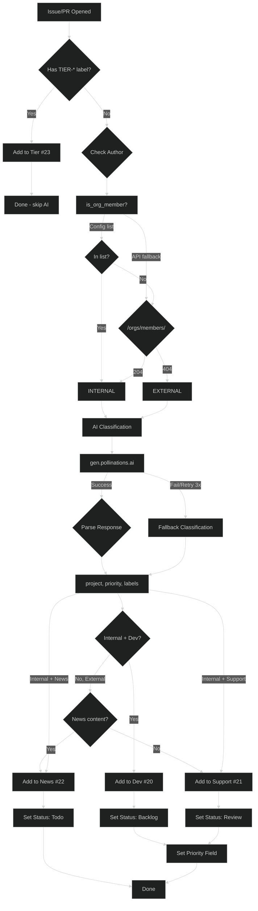
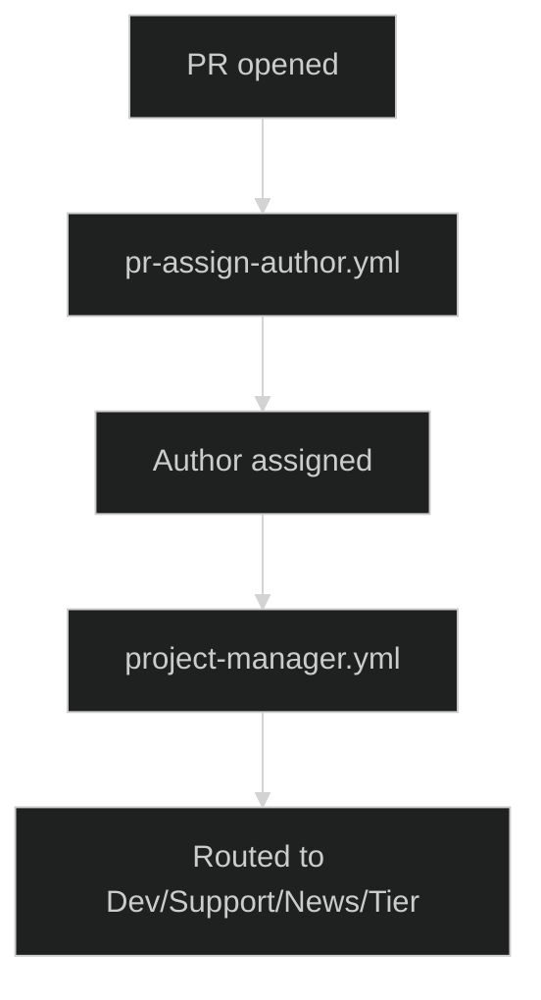
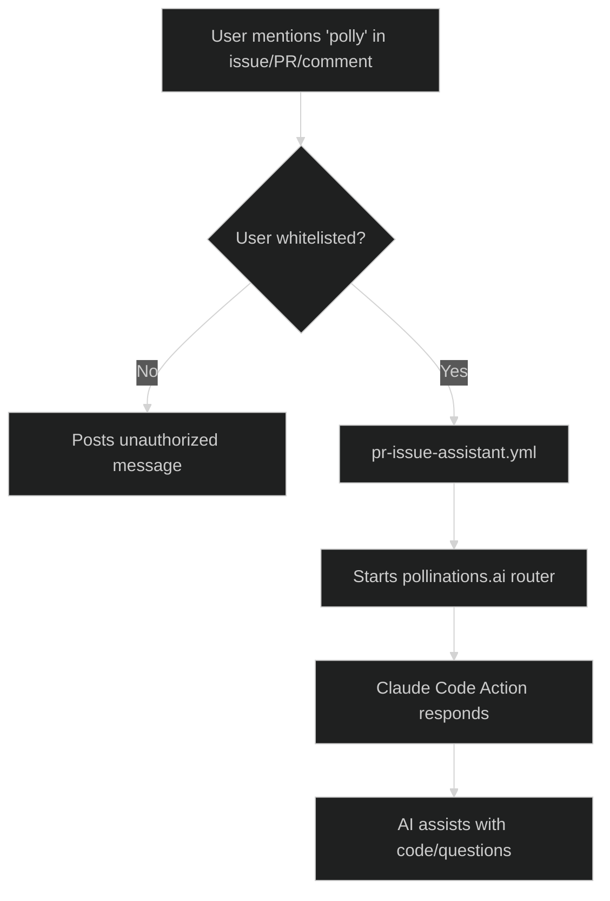

# Triage & Project Management

## Issue & PR Labeling

- **pr-assign-author.yml** - Assigns the PR creator to the PR when opened.

## AI Agents

- **pr-issue-assistant.yml** - AI assistant (Polly) via pollinations.ai, triggered by `polly` in issues/PRs. Whitelisted users only.
- **issue-pr-review-changes.yml** - Claude Opus agent triggered by `@claude` in issues/PRs. Performs code reviews and answers questions.

## Project Management

- **project-manager.yml** - AI-powered auto-kanban. Classifies issues/PRs and routes to Dev/Support/News/Tier projects with priority.
- **issue-close-discarded.yml** - Auto-closes issues marked "Discarded" in project (hourly).
- **pr-update-project-status.yml** - Updates PR status in project (In Progress/In Review/Done/Discarded).

### Project Manager (Auto-Kanban)

Routes issues and PRs to the appropriate project board using AI classification:

| Project | #   | Who           | Purpose                             |
| ------- | --- | ------------- | ----------------------------------- |
| Dev     | 20  | Internal only | Features, refactors, infrastructure |
| Support | 21  | Everyone      | User help, bugs, API questions      |
| News    | 22  | Everyone      | Releases, announcements             |
| Tier    | 23  | External      | App submissions, code contributions |

**Features:**

- **TIER-\* bypass**: Items with `TIER-*` labels skip AI classification and route directly to Tier project
- AI classification via `gen.pollinations.ai` with retry + random seed
- Sets Priority field (Urgent/High/Medium/Low) in project
- Sets Status field (Backlog/Review/Todo)
- Adds labels (DEV-_ for dev, SUPPORT-_ for support, none for news)
- Enforces internal-only rule for Dev project
- Fallback classification if AI fails

## Flow Diagrams

### Project Manager (Auto-Kanban)

### PR Assignment

### AI Assistant (Polly)

## Scripts

| Script                 | Purpose        | AI Model                  | Trigger               |
| ---------------------- | -------------- | ------------------------- | --------------------- |
| `project-manager.py`   | Auto-kanban    | openai (via pollinations) | Issue/PR opened       |
| `pr_comment_review.py` | AI code review | claude-large              | Comment `Review=True` |

**project-manager.py details:**

- Retry: 3 attempts with exponential backoff + random seed
- Timeout: 5 minutes for AI, 30s for GraphQL
- Fallback: Internal→Dev, External→Support with EXTERNAL label

**pr_comment_review.py details:**

- Context: 900k tokens, Max output: 65k tokens
- Skips: lock files, minified, assets, source maps

---

## Label System

### Tier Labels (App Submissions)

| Label                 | Purpose                           | Applied by                  |
| --------------------- | --------------------------------- | --------------------------- |
| `TIER-APP`            | New app submission                | Issue template              |
| `TIER-APP-INCOMPLETE` | Needs user action (info/register) | `app-review-submission.yml` |
| `TIER-APP-REVIEW`     | Issue awaiting maintainer review  | `app-review-submission.yml` |
| `TIER-APP-REVIEW-PR`  | PR awaiting maintainer review     | `app-review-submission.yml` |
| `TIER-APP-COMPLETE`   | Approved and merged               | `app-upgrade-tier.yml`      |
| `TIER-APP-REJECTED`   | Submission rejected               | `app-review-submission.yml` |

**Code Contributions** _(future)_: `TIER-CODE`, `TIER-CODE-REVIEW-PR`, `TIER-CODE-COMPLETE`, `TIER-CODE-REJECTED` planned.

### Dev Labels

| Label          | Purpose                                          | Applied by           |
| -------------- | ------------------------------------------------ | -------------------- |
| `DEV-BUG`      | Something is broken                              | `project-manager.py` |
| `DEV-FEATURE`  | New functionality request                        | `project-manager.py` |
| `DEV-QUEST`    | Community task - One off Pollen reward if merged | `project-manager.py` |
| `DEV-TRACKING` | Meta-issue tracking other items                  | `project-manager.py` |
| `DEV-VOTING`   | Community vote on a proposal                     | Manual               |

### Support Labels

**TYPE (pick exactly 1):**

| Label           | Purpose             | Applied by           |
| --------------- | ------------------- | -------------------- |
| `S-BUG`         | Something broken    | `project-manager.py` |
| `S-OUTAGE`      | Service down        | `project-manager.py` |
| `S-QUESTION`    | How-to/usage        | `project-manager.py` |
| `S-REQUEST`     | Feature request     | `project-manager.py` |
| `S-DOCS`        | Documentation issue | `project-manager.py` |
| `S-INTEGRATION` | SDK/API integration | `project-manager.py` |

**SERVICE (pick 1 or more):**

| Label       | Purpose               | Applied by           |
| ----------- | --------------------- | -------------------- |
| `S-IMAGE`   | Image generation      | `project-manager.py` |
| `S-TEXT`    | Text/chat completion  | `project-manager.py` |
| `S-AUDIO`   | Audio/TTS             | `project-manager.py` |
| `S-VIDEO`   | Video generation      | `project-manager.py` |
| `S-API`     | API/SDK general       | `project-manager.py` |
| `S-WEB`     | Website/dashboard     | `project-manager.py` |
| `S-CREDITS` | Pollen balance issues | `project-manager.py` |
| `S-BILLING` | Payment/credit card   | `project-manager.py` |
| `S-ACCOUNT` | Account/login/auth    | `project-manager.py` |

### News Labels

| Label  | Purpose                | Applied by                 |
| ------ | ---------------------- | -------------------------- |
| `NEWS` | News/social content PR | News & Instagram workflows |
