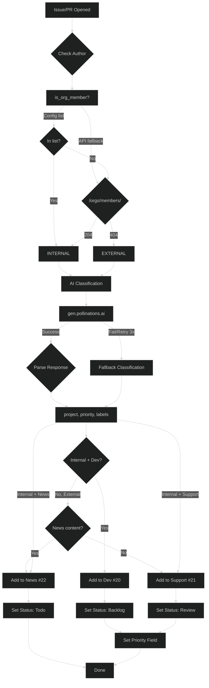
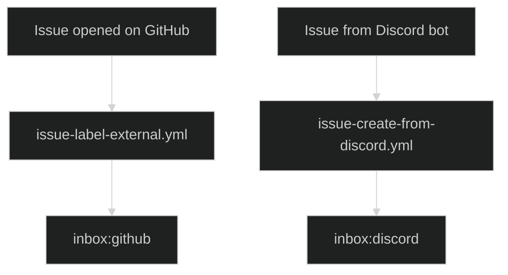
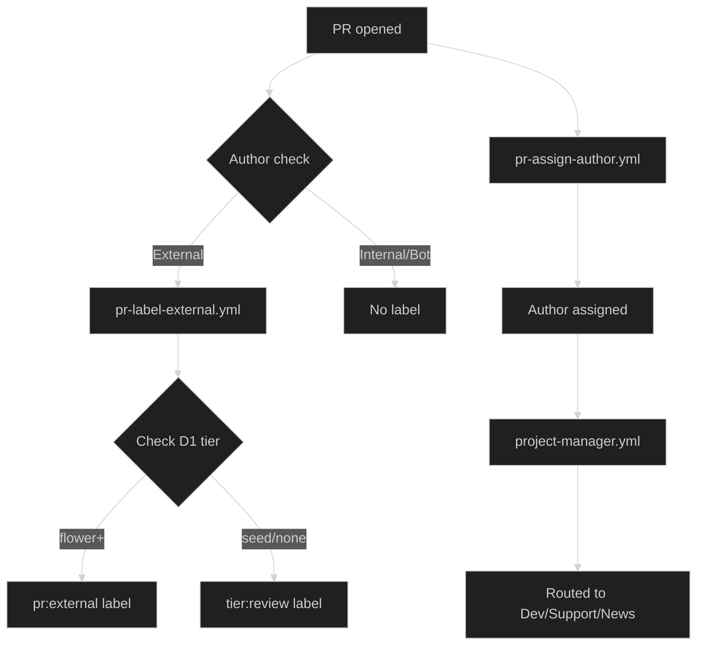
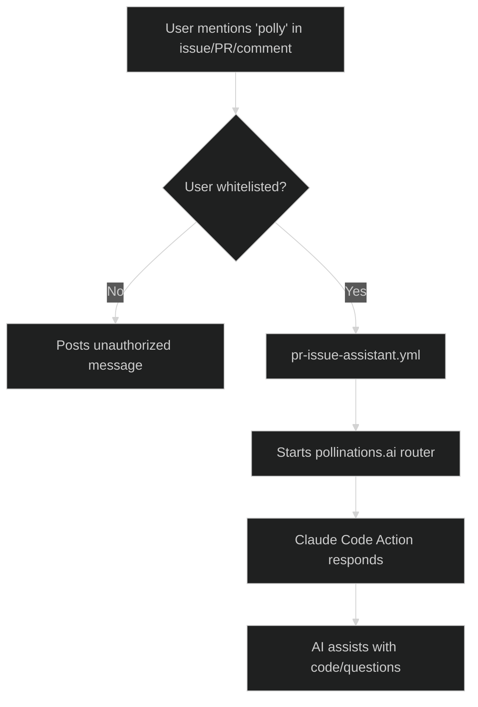

# Triage & Project Management

## Issue & PR Labeling

- **issue-label-external.yml** - Adds `inbox:github` to external issues. Skips if `inbox:discord` or `app:*` labels exist.
- **pr-label-external.yml** - Checks user tier in D1: flower+ gets `pr:external`, others get `tier:review`. Skips internal users and bots.
- **pr-assign-author.yml** - Assigns the PR creator to the PR when opened.

## AI Agents

- **pr-issue-assistant.yml** - AI assistant (Polly) via pollinations.ai, triggered by `polly` in issues/PRs. Whitelisted users only.
- **issue-pr-review-changes.yml** - Claude Opus agent triggered by `@claude` in issues/PRs. Performs code reviews and answers questions.

## Project Management

- **project-manager.yml** - AI-powered auto-kanban. Classifies issues/PRs and routes to Dev/Support/News projects with priority.
- **issue-close-discarded.yml** - Auto-closes issues marked "Discarded" in project (hourly).
- **pr-update-project-status.yml** - Updates PR status in project (In Progress/In Review/Done/Discarded).

### Project Manager (Auto-Kanban)

Routes issues and PRs to the appropriate project board using AI classification:

| Project | #   | Who           | Purpose                             |
| ------- | --- | ------------- | ----------------------------------- |
| Dev     | 20  | Internal only | Features, refactors, infrastructure |
| Support | 21  | Everyone      | User help, bugs, API questions      |
| News    | 22  | Everyone      | Releases, announcements             |

**Features:**

- AI classification via `gen.pollinations.ai` with retry + random seed
- Sets Priority field (Urgent/High/Medium/Low) in project
- Sets Status field (Backlog/Review/Todo)
- Adds labels (BUG, FEATURE, SUPPORT, EXTERNAL, etc.)
- Enforces internal-only rule for Dev project
- Fallback classification if AI fails

## Flow Diagrams

### Project Manager (Auto-Kanban)

### Issue Triage

### PR Triage

### AI Assistant (Polly)

## Scripts

| Script                 | Purpose        | AI Model                  | Trigger               |
| ---------------------- | -------------- | ------------------------- | --------------------- |
| `project-manager.py`   | Auto-kanban    | openai (via pollinations) | Issue/PR opened       |
| `pr_comment_review.py` | AI code review | claude-large              | Comment `Review=True` |

**project-manager.py details:**

- Retry: 3 attempts with exponential backoff + random seed
- Timeout: 5 minutes for AI, 30s for GraphQL
- Fallback: Internal→Dev, External→Support with EXTERNAL label

**pr_comment_review.py details:**

- Context: 900k tokens, Max output: 65k tokens
- Skips: lock files, minified, assets, source maps
