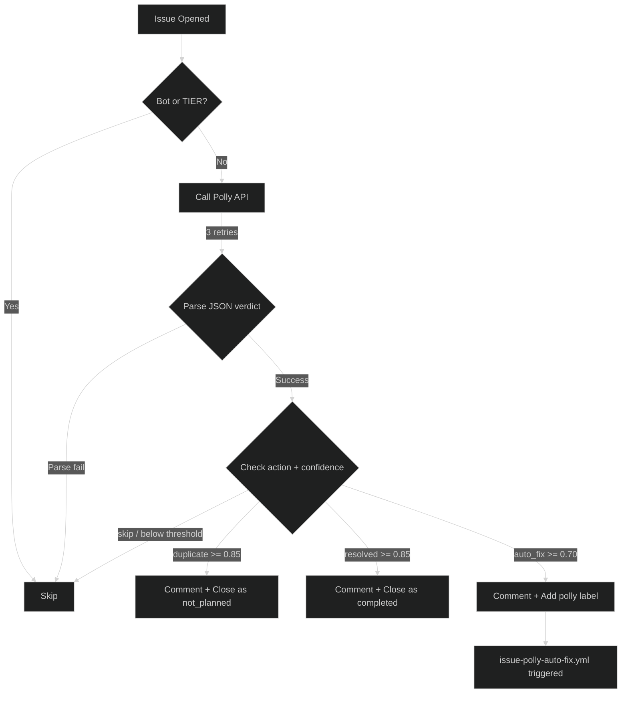
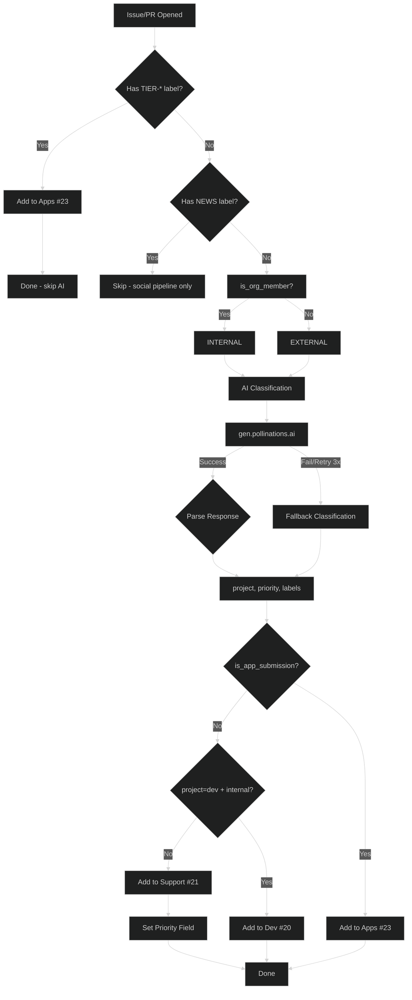
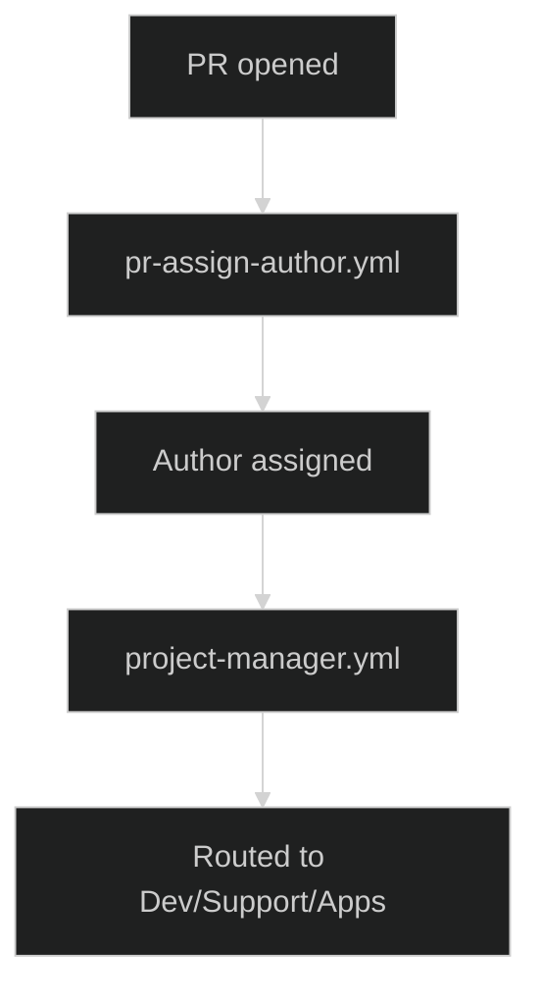
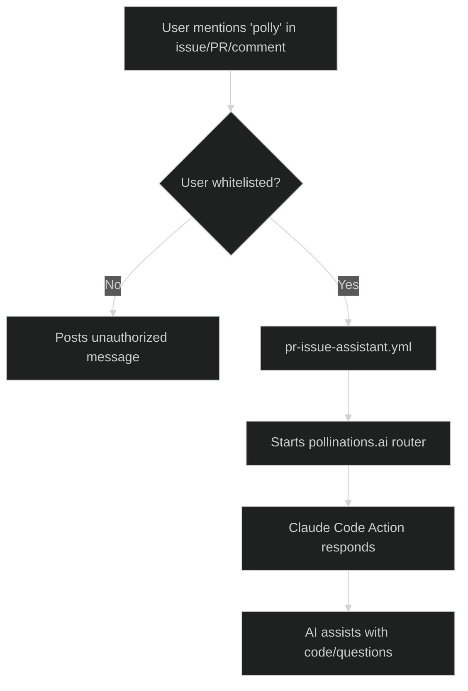

# Triage & Project Management

## Issue & PR Labeling

- **pr-assign-author.yml** - Assigns the PR creator to the PR when opened.

## AI Agents

- **pr-issue-assistant.yml** - AI assistant (Polly) via pollinations.ai, triggered by `polly` in issues/PRs. Whitelisted users only.
- **issue-pr-review-changes.yml** - Claude Opus agent triggered by `@claude` in issues/PRs. Performs code reviews and answers questions.

## Issue Automation Pipeline

- **issue-automation.yml** - Automated triage on every new issue. Calls Polly API to detect duplicates, already-resolved issues, and minor auto-fixable problems.

### Flow

```mermaid
%%{init: {'theme': 'dark'}}%%
flowchart TD
    A[Issue Opened] --> B{Bot or TIER?}
    B -->|Yes| C[Skip]
    B -->|No| D[Call Polly API]
    D -->|3 retries| E{Parse JSON verdict}
    E -->|Parse fail| C
    E -->|Success| F{Check action + confidence}
    F -->|duplicate >= 0.85| G[Comment + Close as not_planned]
    F -->|resolved >= 0.85| H[Comment + Close as completed]
    F -->|auto_fix >= 0.70| I[Comment + Add polly label]
    F -->|skip / below threshold| C
    I --> J[issue-polly-auto-fix.yml triggered]
```

### Model Routing (Auto-Fix)

| Role | Model | Purpose |
|------|-------|---------|
| Default | GLM | Code generation and fixes |
| Thinking | Kimi K2.5 | Reasoning and planning |
| Web Search | Perplexity Reasoning | Web lookups |

## Project Management

- **project-manager.yml** - AI-powered auto-kanban. Classifies issues/PRs and routes to Dev/Support/Apps projects with priority.
- **issue-close-discarded.yml** - Auto-closes issues marked "Discarded" in project (hourly).
- **pr-update-project-status.yml** - Updates PR status in project (In Progress/In Review/Done/Discarded).

### Project Manager (Auto-Kanban)

Routes issues and PRs to the appropriate project board using AI classification:

| Project | #   | Who           | Purpose                             |
| ------- | --- | ------------- | ----------------------------------- |
| Dev     | 20  | Internal only | Features, refactors, infrastructure |
| Support | 21  | Everyone      | User help, bugs, API questions      |
| Apps    | 23  | External      | App submissions                     |

**Features:**

- **TIER-\* bypass**: Items with `TIER-*` labels skip AI classification and route directly to Apps project
- **NEWS skip**: Items with `NEWS` label are skipped entirely (label is used by the social pipeline, not project routing)
- AI classification via `gen.pollinations.ai` with retry + random seed
- Sets Priority field on Support items (see [Priority Rules](#priority-rules))
- Adds labels (`DEV-*` for dev, `.TYPE` + `SERVICE` for support)
- Enforces internal-only rule for Dev project (external authors classified as dev get reassigned to support)
- Fallback classification if AI fails

### Priority Rules

Priority is only set on Support items. The AI picks one of two values; `Urgent` is applied automatically when the author is a paid Stripe customer.

| Priority | Who applies it | When |
| -------- | -------------- | ---- |
| `Urgent` | `project-manager.py` (override) | Issue author's GitHub ID matches a paid Stripe customer (`paid_customers.json` Tinybird endpoint) |
| `High`   | AI | Bugs breaking functionality, blocking issues, billing problems, outages |
| `Low`    | AI | Minor issues, cosmetic bugs, questions, docs, feature requests, integration help |

`Medium` is no longer used. The paid-customer lookup joins `stripe_event.user_id → d1_user.id → d1_user.github_id` filtered to the latest `synced_at`. GitHub IDs are used instead of usernames so the flag survives username changes.
### Project Manager (Auto-Kanban)

```mermaid
%%{init: {'theme': 'dark'}}%%
flowchart TD
    A[Issue/PR Opened] --> AA{Has TIER-* label?}
    AA -->|Yes| AB[Add to Apps #23]
    AB --> AC[Done - skip AI]
    AA -->|No| AN{Has NEWS label?}
    AN -->|Yes| AX[Skip - social pipeline only]
    AN -->|No| B[is_org_member?]
    B -->|Yes| F[INTERNAL]
    B -->|No| G[EXTERNAL]

    F --> H[AI Classification]
    G --> H

    H --> I[gen.pollinations.ai]
    I -->|Success| J{Parse Response}
    I -->|Fail/Retry 3x| K[Fallback Classification]
    J --> L[project, priority, labels]
    K --> L

    L --> IAS{is_app_submission?}
    IAS -->|Yes| AP[Add to Apps #23]
    IAS -->|No| M{project=dev + internal?}
    M -->|Yes| N[Add to Dev #20]
    M -->|No| Q[Add to Support #21]

    Q --> U[Set Priority Field]
    U --> V[Done]
    N --> V
    AP --> V
```

### PR Assignment

```mermaid
%%{init: {'theme': 'dark'}}%%
flowchart TD
    A[PR opened] --> B[pr-assign-author.yml]
    B --> C[Author assigned]
    C --> D[project-manager.yml]
    D --> E[Routed to Dev/Support/Apps]
```

### AI Assistant (Polly)

```mermaid
%%{init: {'theme': 'dark'}}%%
flowchart TD
    A[User mentions 'polly' in issue/PR/comment] --> B{User whitelisted?}
    B -->|No| C[Posts unauthorized message]
    B -->|Yes| D[pr-issue-assistant.yml]
    D --> E[Starts pollinations.ai router]
    E --> F[Claude Code Action responds]
    F --> G[AI assists with code/questions]
```

## Scripts

| Script                 | Purpose        | AI Model                  | Trigger               |
| ---------------------- | -------------- | ------------------------- | --------------------- |
| `project-manager.py`   | Auto-kanban    | openai (via pollinations) | Issue/PR opened       |
| `pr_comment_review.py` | AI code review | claude-large              | Comment `Review=True` |

**project-manager.py details:**

- Retry: 3 attempts with exponential backoff + random seed
- Timeout: 5 minutes for AI, 30s for GraphQL
- Fallback: Internal→Dev, External→Support with EXTERNAL label

**pr_comment_review.py details:**

- Context: 900k tokens, Max output: 65k tokens
- Skips: lock files, minified, assets, source maps

---

## Label System

### Apps Project Labels (App Submissions)

Any `TIER-*` labeled issue routes to the Apps project (#23). The state machine:

| Label                 | Purpose                           | Applied by                                         |
| --------------------- | --------------------------------- | -------------------------------------------------- |
| `TIER-APP`            | New app submission                | Issue template                                     |
| `TIER-APP-INCOMPLETE` | Needs user action (info/register) | `app-review-submission.yml`                        |
| `TIER-APP-REVIEW`     | Issue awaiting maintainer review  | `app-review-submission.yml` (stripped on approval) |
| `TIER-APP-APPROVED`   | Maintainer approved, PR created   | Maintainer (manual)                                |
| `TIER-APP-REJECTED`   | Submission rejected               | `app-review-submission.yml`                        |

### Dev Labels

| Label          | Purpose                                          | Applied by           |
| -------------- | ------------------------------------------------ | -------------------- |
| `DEV-BUG`      | Something is broken                              | `project-manager.py` |
| `DEV-FEATURE`  | New functionality request                        | `project-manager.py` |
| `DEV-TRACKING` | Meta-issue tracking other items                  | `project-manager.py` |
| `DEV-DOCS`     | Documentation - dev docs, API docs, READMEs      | `project-manager.py` |
| `DEV-INFRA`    | Infrastructure - CI/CD, deployments, monitoring  | `project-manager.py` |
| `DEV-CHORE`    | Maintenance - dependency updates, cleanup        | `project-manager.py` |
| `DEV-VOTING`   | Community vote on a proposal                     | Manual               |

### Support Labels

**TYPE (pick exactly 1):**

| Label          | Purpose             | Applied by           |
| -------------- | ------------------- | -------------------- |
| `.BUG`         | Something broken    | `project-manager.py` |
| `.OUTAGE`      | Service down        | `project-manager.py` |
| `.QUESTION`    | How-to/usage        | `project-manager.py` |
| `.REQUEST`     | Feature request     | `project-manager.py` |
| `.DOCS`        | Documentation issue | `project-manager.py` |
| `.INTEGRATION` | SDK/API integration | `project-manager.py` |

**SERVICE (pick 1 or more):**

| Label     | Purpose               | Applied by           |
| --------- | --------------------- | -------------------- |
| `IMAGE`   | Image generation      | `project-manager.py` |
| `TEXT`    | Text/chat completion  | `project-manager.py` |
| `AUDIO`   | Audio/TTS             | `project-manager.py` |
| `VIDEO`   | Video generation      | `project-manager.py` |
| `API`     | API/SDK general       | `project-manager.py` |
| `WEB`     | Website/dashboard     | `project-manager.py` |
| `CREDITS` | Pollen balance issues | `project-manager.py` |
| `BILLING` | Payment/credit card   | `project-manager.py` |
| `ACCOUNT` | Account/login/auth    | `project-manager.py` |

**TOPIC (optional, at most 1):**

| Label  | Purpose                                                       | Applied by           |
| ------ | ------------------------------------------------------------- | -------------------- |
| `TIER` | User questions about tiers (spore/seed/flower/nectar/upgrade) | `project-manager.py` |

Unrelated to the `TIER-APP-*` family used for app submissions.

### News Labels

The `NEWS` label is used by the social pipeline (`social/` workflows), not by Project Manager routing. Issues/PRs carrying it are skipped by `project-manager.py` and don't land on any project board.

| Label  | Purpose                | Applied by                                          |
| ------ | ---------------------- | --------------------------------------------------- |
| `NEWS` | News/social content PR | `readme-daily-update.yml`, `NEWS_summary.yml`, etc. |
