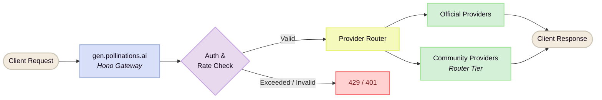
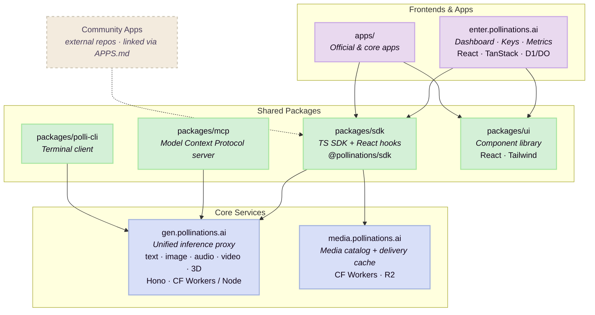

# Architecture & Services

The platform operates as a high-throughput, privacy-first gateway proxying generation requests directly to inference providers and community hosts. Prompt data is not stored.

### Request Flow

### Monorepo Map

### Monorepo Directory Breakdown

| Directory | Service / Purpose | Primary Stack |
| :--- | :--- | :--- |
| `gen.pollinations.ai/` | Unified inference proxy for text, image, audio, video, 3D | Hono, Cloudflare / Node |
| `enter.pollinations.ai/` | Developer dashboard, API key management, account metrics | React, TanStack Router, D1/DO |
| `media.pollinations.ai/` | Media cataloguing and delivery cache | Cloudflare Workers, R2 |
| `packages/sdk/` | Official TypeScript SDK and React hooks (`@pollinations/sdk`) | TypeScript, React |
| `packages/mcp/` | Model Context Protocol server for local and agent tooling | Node.js |
| `packages/ui/` | Shared component library and design system | React, Tailwind |
| `packages/polli-cli/` | Terminal client for script execution | Node.js CLI |
| `packages/n8n/` | Official workflow automation nodes (`@pollinations/n8n`) | TypeScript, n8n |
| `apps/` | Official and core applications maintained by the team | Mixed |

*Note: Community applications are maintained in their respective external repositories and indexed via `APPS.md`.*
