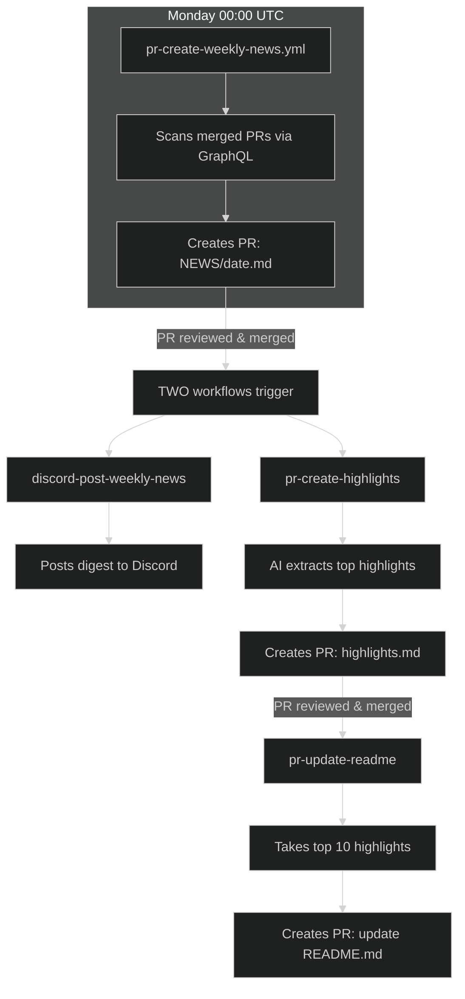
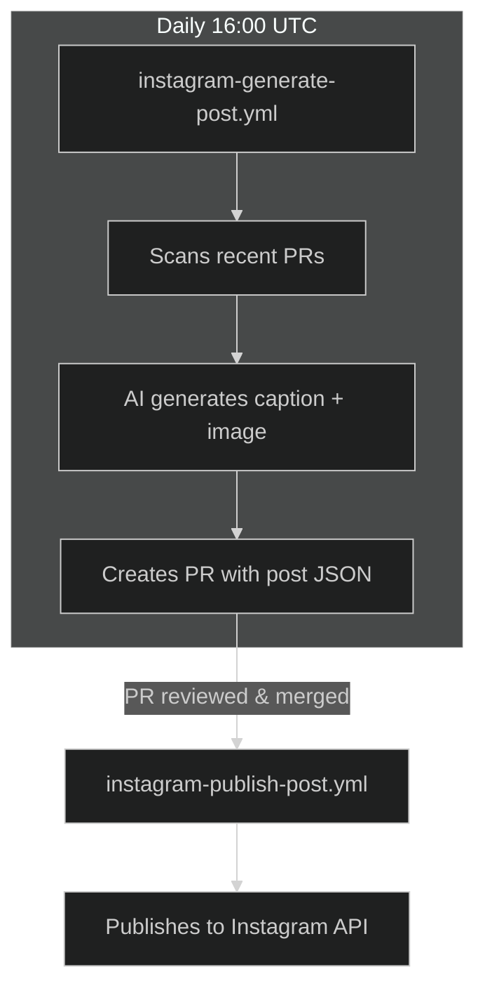
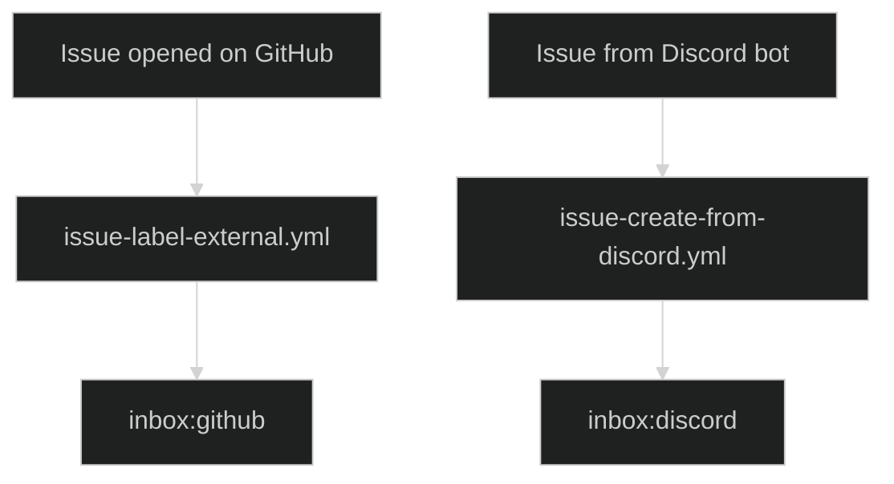
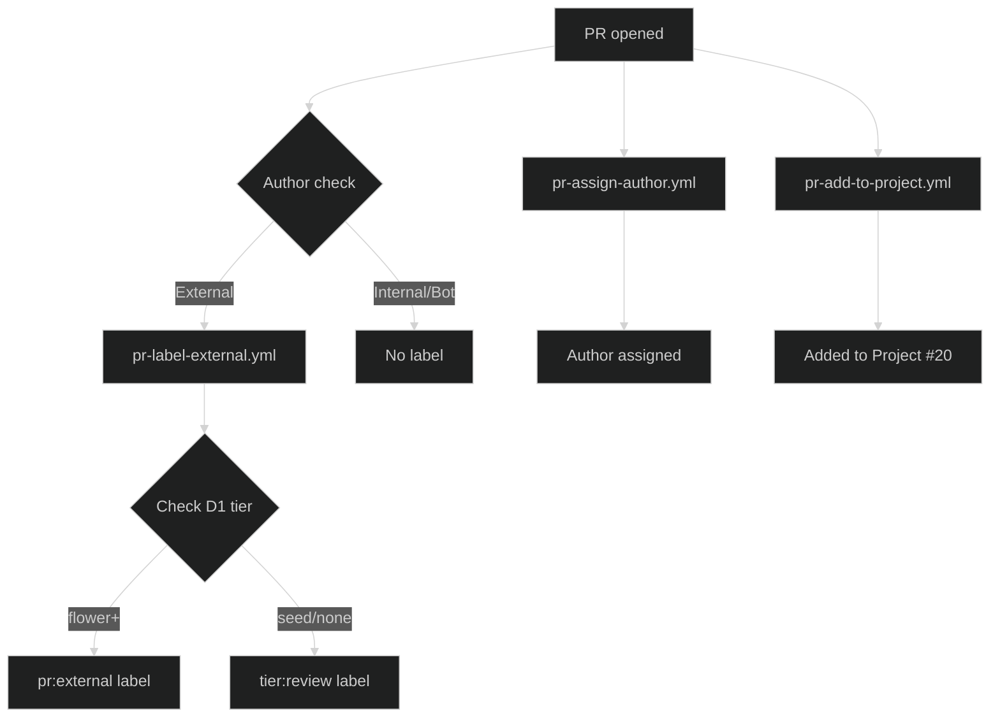
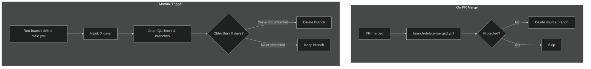
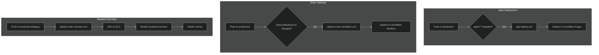
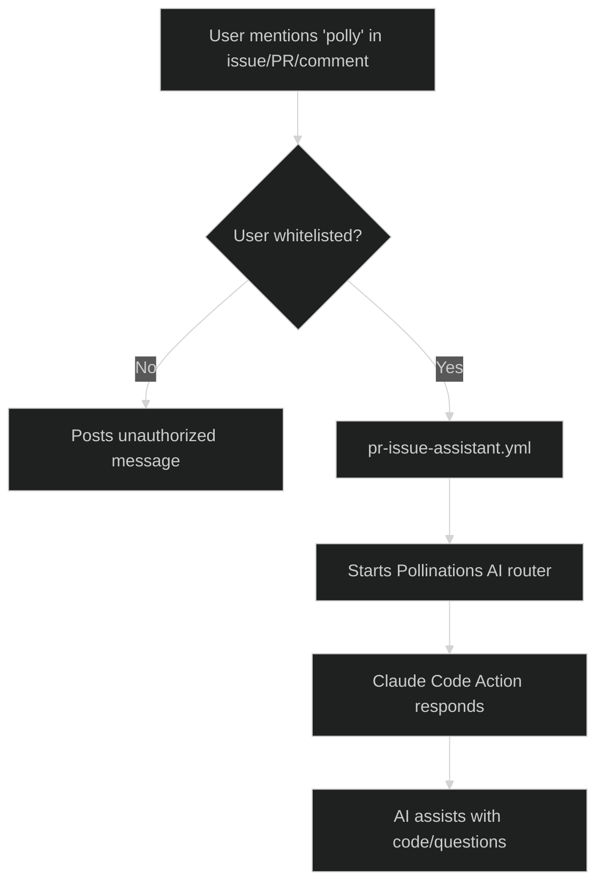
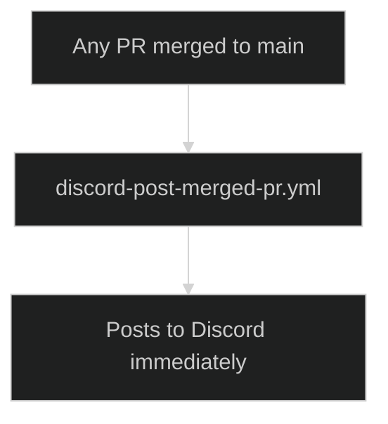
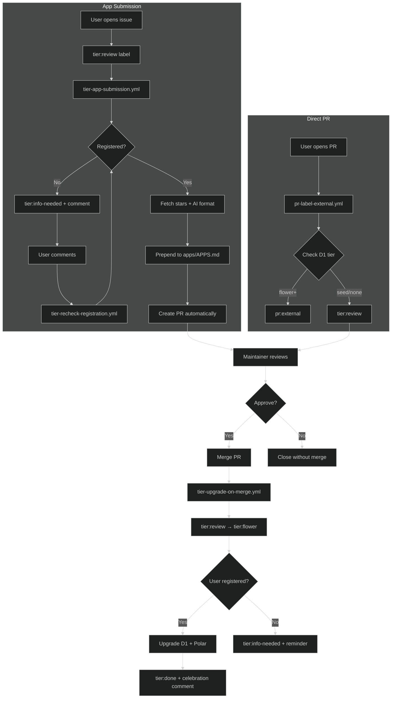

# GitHub Workflows

## Naming Convention

**Pattern: `ENTITY-ACTION-WHAT`**

| Part       | Description              | Examples                                                  |
| ---------- | ------------------------ | --------------------------------------------------------- |
| **Entity** | What is being acted upon | `issue`, `pr`, `discord`, `website`, `app`, `branch`      |
| **Action** | The verb/operation       | `create`, `post`, `generate`, `update`, `review`, `label` |
| **What**   | The target/result        | `weekly-news`, `merged-pr`, `external`, `code`            |

**Examples:**

-   `discord-post-merged-pr` → Discord / post / merged PR
-   `issue-label-external` → Issue / label / external
-   `pr-create-weekly-news` → PR / create / weekly news
-   `branch-delete-stale` → Branch / delete / stale

**Entity = Effect** (what is affected/created, not what triggers it).

---

## Authentication

Most workflows use **Polly Bot** (GitHub App) for authentication instead of personal access tokens. This provides:

-   Better security (scoped permissions)
-   Actions appear as bot, not a user
-   No PAT expiration issues

Secrets required: `POLLY_BOT_APP_ID`, `POLLY_BOT_PRIVATE_KEY`

## Label System

### Inbox Labels (Triage)

| Label           | Purpose                          | Applied by                                        |
| --------------- | -------------------------------- | ------------------------------------------------- |
| `inbox:github`  | External issue needs triage      | `issue-label-external.yml`                        |
| `inbox:discord` | Issue created from Discord       | `issue-create-from-discord.yml` (via Discord bot) |
| `inbox:news`    | PR related to weekly news update | `pr-create-weekly-news.yml`                       |

### Tier Labels (Unified for Apps & PRs)

| Label              | Purpose                                         | Applied by                                              |
| ------------------ | ----------------------------------------------- | ------------------------------------------------------- |
| `tier:review`      | No tier/spore/seed, eligible for Flower upgrade | Issue template / `pr-label-external.yml`                |
| `tier:info-needed` | Awaiting registration or more info              | `tier-app-submission.yml` / `tier-upgrade-on-merge.yml` |
| `tier:flower`      | Approved for Flower tier                        | `tier-upgrade-on-merge.yml` (auto on merge)             |
| `tier:done`        | Tier upgrade completed                          | `tier-upgrade-on-merge.yml`                             |

### PR Labels

| Label              | Purpose                                           | Applied by              |
| ------------------ | ------------------------------------------------- | ----------------------- |
| `pr:external`      | Returning external contributor (has flower tier+) | `pr-label-external.yml` |
| `pr:review-needed` | Needs maintainer review                           | Manual                  |
| `pr:merge-ready`   | Approved, ready to merge                          | Manual                  |
| `pr:news`          | PR related to news/social                         | Instagram workflows     |

## Workflows

### AI Agents

-   **pr-issue-assistant.yml** - AI assistant (Polly) via Pollinations AI, triggered by `polly` in issues/PRs. Whitelisted users only.
-   **issue-pr-review-changes.yml** - Claude Opus agent triggered by `@claude` in issues/PRs. Performs code reviews and answers questions.

### Triage

-   **issue-label-external.yml** - Adds `inbox:github` to external issues. Skips if `inbox:discord` or `app:*` labels exist.
-   **pr-label-external.yml** - Checks user tier in D1: flower+ gets `pr:external`, others get `tier:review`. Skips internal users and bots.
-   **pr-assign-author.yml** - Assigns the PR creator to the PR when opened.

### Tier Upgrade System

-   **tier-app-submission.yml** - AI-powered app submission pipeline. Split into 3 jobs:
    -   `tier-parse-issue` - Parse submission with AI, validate, check Enter registration
    -   `tier-create-app-pr` - Fetch stars, AI-format (emoji + description), prepend to `apps/APPS.md`, create PR
    -   `tier-close-issue-on-pr` - Close linked issue when PR is merged/closed
-   **tier-upgrade-on-merge.yml** - When PR with `tier:review` label merges, upgrades labels (`tier:review` → `tier:flower` → `tier:done`) and user to Flower tier in D1 + Polar.
-   **tier-recheck-registration.yml** - When user comments on issue/PR with `tier:info-needed`, re-checks registration.

### News & Discord

-   **pr-create-weekly-news.yml** - Runs Monday 00:00 UTC. Scans merged PRs, creates `NEWS/{date}.md` PR with `inbox:news` label.
-   **pr-create-highlights.yml** - When NEWS PR merges, AI extracts top highlights → creates PR for `NEWS/transformed/highlights.md`.
-   **pr-update-readme.yml** - When highlights PR merges, takes top 10 entries → creates PR to update README's "Latest News" section.
-   **discord-post-weekly-news.yml** - Triggered when `NEWS/*.md` is pushed. Posts weekly digest to Discord.
-   **discord-post-merged-pr.yml** - Posts every merged PR to Discord immediately.

### Instagram

-   **instagram-generate-post.yml** - Daily at 16:00 UTC. Scans recent PRs, generates Instagram post content, creates PR with image and caption.
-   **instagram-publish-post.yml** - When Instagram post PR is merged, publishes to Instagram via API.

### Project Management

-   **issue-add-to-project.yml** - Adds all new issues to Project #20.
-   **pr-add-to-project.yml** - Adds all new PRs to Project #20.
-   **issue-close-discarded.yml** - Auto-closes issues marked "Discarded" in project (hourly).
-   **pr-update-project-status.yml** - Updates PR status in project (In Progress/In Review/Done/Discarded).

### Deployment

-   **app-deploy.yml** - Auto-deploys apps to Cloudflare Pages when `apps/**` changes on `production` branch.
-   **app-deploy-manual.yml** - Manual deployment of specific app to Cloudflare Pages.
-   **deploy-enter-cloudflare.yml** - Deploys `enter.pollinations.ai` to Cloudflare Workers on `production` push.
-   **deploy-enter-services.yml** - Deploys `text.pollinations.ai` and `image.pollinations.ai` to EC2 via SSH. Supports staging and production.
-   **deploy-portkey-gateway.yml** - Deploys Portkey gateway to Cloudflare Workers.

### CI & Testing

-   **backend-run-tests.yml** - Runs backend tests for `text` and `image` services when files change.

### Tier Scripts

-   **.github/scripts/tier-apps-prepend.js** - Prepends a new row to `apps/APPS.md`.
-   **.github/scripts/tier-apps-update-readme.js** - Updates README with last 10 apps from `apps/APPS.md`.
-   **.github/scripts/tier-apps-check-links.js** - Checks all app URLs for broken links. Run with `--report` to generate `apps/BROKEN_APPS.md`.

### Branch Cleanup

-   **branch-delete-stale.yml** - Manual workflow to delete branches older than X days. Protected branches (main, master, production) always excluded.
-   **branch-delete-merged.yml** - Auto-deletes the source branch when a PR is merged. Skips forks and protected branches.

## Flow Diagrams

### Weekly News Pipeline

### Instagram Pipeline

### Issue Triage

### PR Triage

### Branch Cleanup

### Deployment Pipeline

### AI Assistant (Polly)

### Live PR Notifications

### Tier Upgrade Flow

