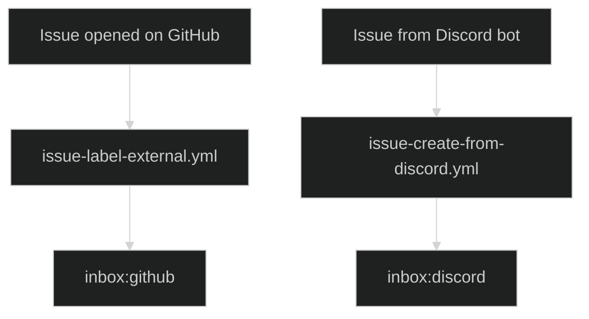
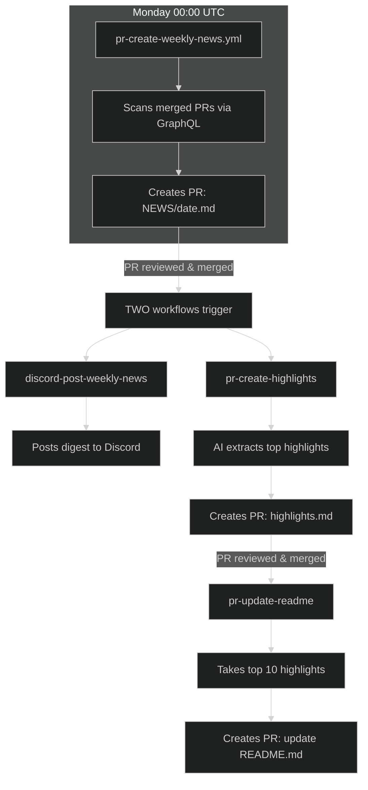
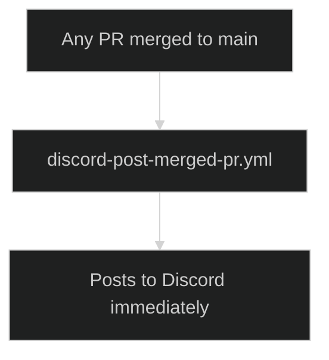

# GitHub Workflows

## Naming Convention

**Pattern: `ENTITY-ACTION-WHAT`**

| Part       | Description              | Examples                                                  |
| ---------- | ------------------------ | --------------------------------------------------------- |
| **Entity** | What is being acted upon | `issue`, `pr`, `discord`, `website`, `app`                |
| **Action** | The verb/operation       | `create`, `post`, `generate`, `update`, `review`, `label` |
| **What**   | The target/result        | `weekly-news`, `merged-pr`, `external`, `code`            |

**Examples:**

-   `discord-post-merged-pr` → Discord / post / merged PR
-   `issue-label-external` → Issue / label / external
-   `pr-create-weekly-news` → PR / create / weekly news
-   `app-sync-stars` → App / sync / stars

**Entity = Effect** (what is affected/created, not what triggers it).

---

## Authentication

Most workflows use **Polly Bot** (GitHub App) for authentication instead of personal access tokens. This provides:

-   Better security (scoped permissions)
-   Actions appear as bot, not a user
-   No PAT expiration issues

Secrets required: `POLLY_BOT_APP_ID`, `POLLY_BOT_PRIVATE_KEY`

## Label System

### Inbox Labels (Triage)

| Label           | Purpose                          | Applied by                                        |
| --------------- | -------------------------------- | ------------------------------------------------- |
| `inbox:github`  | External issue needs triage      | `issue-label-external.yml`                        |
| `inbox:discord` | Issue created from Discord       | `issue-create-from-discord.yml` (via Discord bot) |
| `inbox:news`    | PR related to weekly news update | `pr-create-weekly-news.yml`                       |

### App Submission Labels

| Label             | Purpose                       | Applied by                         |
| ----------------- | ----------------------------- | ---------------------------------- |
| `app:review`      | App submission pending review | Issue template                     |
| `app:info-needed` | Awaiting submitter response   | `pr-create-app-submission.yml`     |
| `app:approved`    | App merged to showcase        | `app-issue-celebrate-approval.yml` |
| `app:denied`      | Submission rejected           | Manual                             |

## Workflows

### AI Agents

-   **issue-pr-review-changes.yml** - Claude Opus agent triggered by `@claude` in issues/PRs. Performs code reviews and answers questions.

### Triage

-   **issue-label-external.yml** - Adds `inbox:github` to external issues. Skips if `inbox:discord` or `app:*` labels exist.
-   **issue-create-from-discord.yml** - Creates GitHub issues from Discord bot via `repository_dispatch`.
-   **pr-assign-author.yml** - Assigns the PR creator to the PR when opened.

### App Submissions

-   **pr-create-app-submission.yml** - AI-powered review of app submissions. Parses issue, creates PR to add project.
-   **app-issue-celebrate-approval.yml** - Post-merge: adds `app:approved` label and celebration comment.

### News & Discord

-   **pr-create-weekly-news.yml** - Runs Monday 00:00 UTC. Scans merged PRs, creates `NEWS/{date}.md` PR with `inbox:news` label.
-   **pr-create-highlights.yml** - When NEWS PR merges, AI extracts top highlights → creates PR for `NEWS/transformed/highlights.md`.
-   **pr-update-readme.yml** - When highlights PR merges, takes top 10 entries → creates PR to update README's "Latest News" section.
-   **discord-post-weekly-news.yml** - Triggered when `NEWS/*.md` is pushed. Posts weekly digest to Discord.
-   **discord-post-merged-pr.yml** - Posts every merged PR to Discord immediately.

### Project Management

-   **issue-add-to-project.yml** - Adds all new issues to Project #20.
-   **issue-close-discarded.yml** - Auto-closes issues marked "Discarded" in project.
-   **pr-update-project-status.yml** - Updates PR status in project (In Progress/In Review/Done/Discarded).

### CI & Testing

-   **backend-run-tests.yml** - Runs backend tests for `text` and `image` services when files change.

### Maintenance

-   **app-list-update-entries.yml** - Regenerates PROJECTS.md and README.md when projectList.js changes.
-   **app-list-update-stars.yml** - Updates star counts from GitHub for app showcase projects (weekly).

## Flow Diagrams

### Issue Triage

### Weekly News Pipeline

### Live PR Notifications

