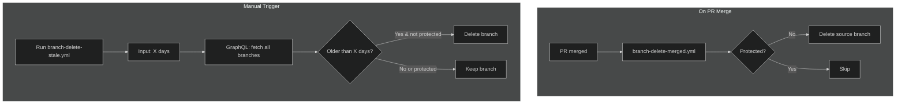

# Maintenance

## CI & Testing

-   **backend-run-tests.yml** - Runs backend tests for `text` and `image` services when files change.

## Branch Cleanup

-   **branch-delete-stale.yml** - Manual workflow to delete branches older than X days. Protected branches (main, master, production) always excluded.
-   **branch-delete-merged.yml** - Auto-deletes the source branch when a PR is merged. Skips forks and protected branches.

## Flow Diagram

