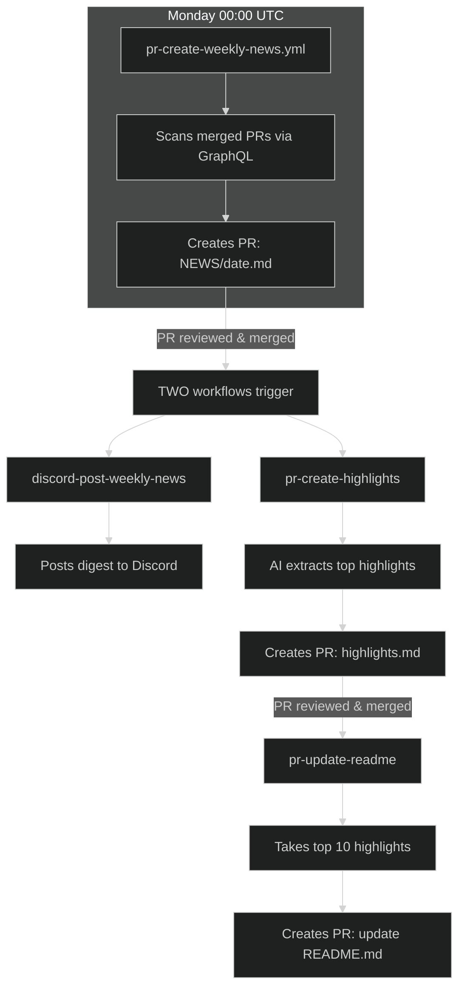
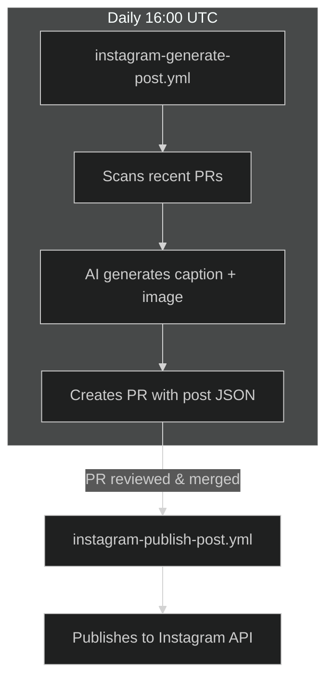
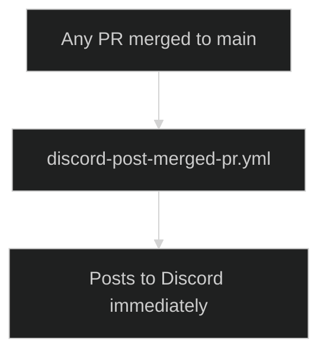

# News & Social

## Weekly News Pipeline

-   **pr-create-weekly-news.yml** - Runs Monday 00:00 UTC. Scans merged PRs, creates `NEWS/{date}.md` PR with `inbox:news` label.
-   **pr-create-highlights.yml** - When NEWS PR merges, AI extracts top highlights → creates PR for `NEWS/transformed/highlights.md`.
-   **pr-update-readme.yml** - When highlights PR merges, takes top 10 entries → creates PR to update README's "Latest News" section.

## Discord

-   **discord-post-weekly-news.yml** - Triggered when `NEWS/*.md` is pushed. Posts weekly digest to Discord.
-   **discord-post-merged-pr.yml** - Posts every merged PR to Discord immediately.

## Instagram

-   **instagram-generate-post.yml** - Daily at 16:00 UTC. Scans recent PRs, generates Instagram post content, creates PR with image and caption.
-   **instagram-publish-post.yml** - When Instagram post PR is merged, publishes to Instagram via API.

## Flow Diagrams

### Weekly News Pipeline

### Instagram Pipeline

### Live PR Notifications

