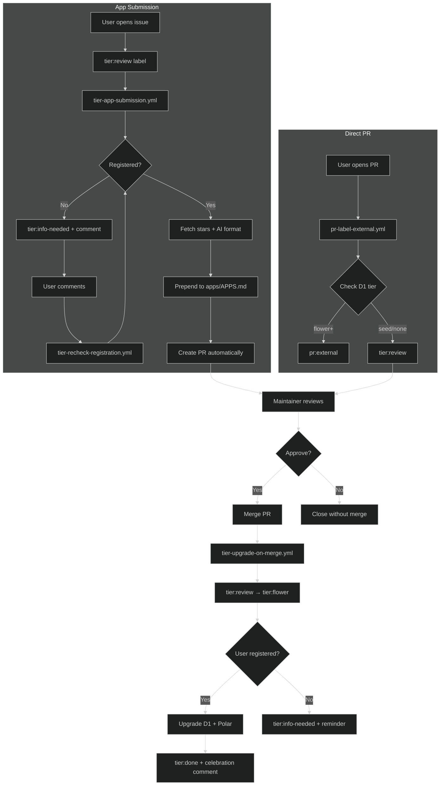

# Tier Upgrade System

## Workflows

-   **tier-app-submission.yml** - AI-powered app submission pipeline. Split into 3 jobs:
    -   `tier-parse-issue` - Parse submission with AI, validate, check Enter registration
    -   `tier-create-app-pr` - Fetch stars, AI-format (emoji + description), prepend to `apps/APPS.md`, create PR
    -   `tier-close-issue-on-pr` - Close linked issue when PR is merged/closed
-   **tier-upgrade-on-merge.yml** - When PR with `tier:review` label merges, upgrades labels (`tier:review` → `tier:flower` → `tier:done`) and user to Flower tier in D1 + Polar.
-   **tier-recheck-registration.yml** - When user comments on issue/PR with `tier:info-needed`, re-checks registration.

## Scripts

-   **.github/scripts/tier-apps-prepend.js** - Prepends a new row to `apps/APPS.md`.
-   **.github/scripts/tier-apps-update-readme.js** - Updates README with last 10 apps from `apps/APPS.md`.
-   **.github/scripts/tier-apps-check-links.js** - Checks all app URLs for broken links. Run with `--report` to generate `apps/BROKEN_APPS.md`.

## Tier Hierarchy

| Tier   | Level | Description                      |
| ------ | ----- | -------------------------------- |
| None   | 0     | Not registered                   |
| Spore  | 1     | First tier                       |
| Seed   | 2     | Second tier                      |
| Flower | 3     | Contributor tier (10 pollen/day) |
| Nectar | 4     | Higher tier                      |

## Flow Diagram

