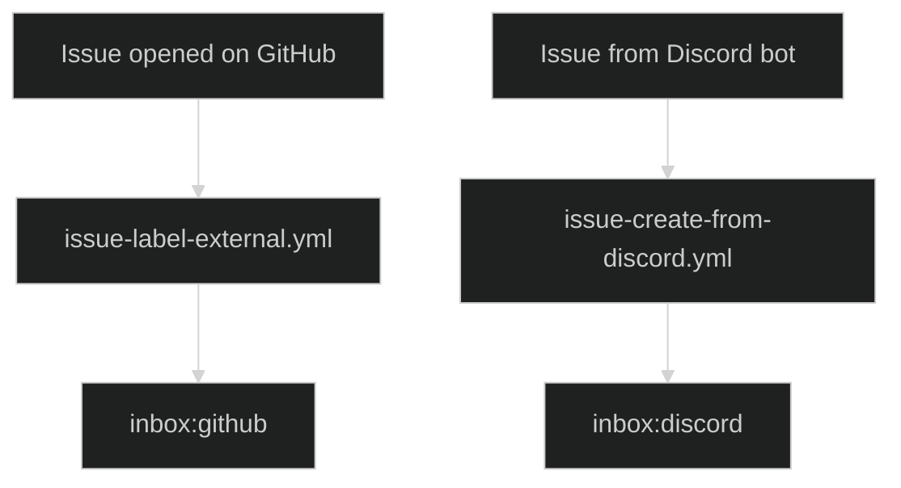
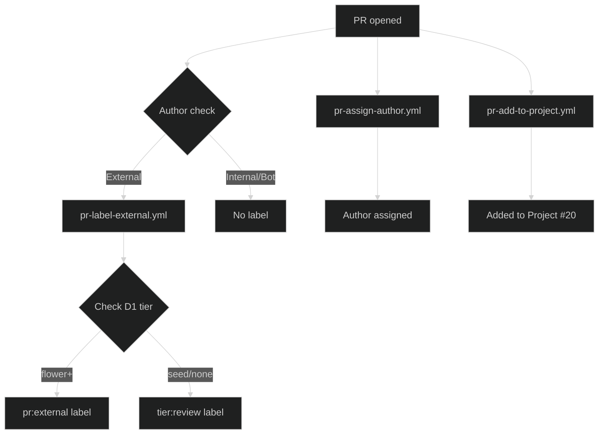
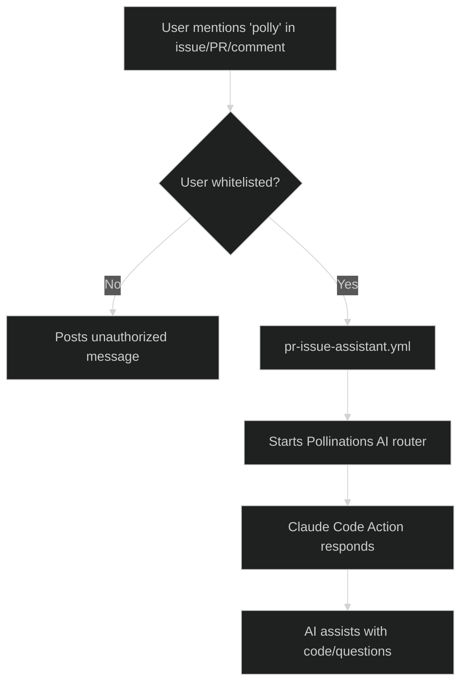

# Triage & Project Management

## Issue & PR Labeling

-   **issue-label-external.yml** - Adds `inbox:github` to external issues. Skips if `inbox:discord` or `app:*` labels exist.
-   **pr-label-external.yml** - Checks user tier in D1: flower+ gets `pr:external`, others get `tier:review`. Skips internal users and bots.
-   **pr-assign-author.yml** - Assigns the PR creator to the PR when opened.

## AI Agents

-   **pr-issue-assistant.yml** - AI assistant (Polly) via Pollinations AI, triggered by `polly` in issues/PRs. Whitelisted users only.
-   **issue-pr-review-changes.yml** - Claude Opus agent triggered by `@claude` in issues/PRs. Performs code reviews and answers questions.

## Project Management

-   **issue-add-to-project.yml** - Adds all new issues to Project #20.
-   **pr-add-to-project.yml** - Adds all new PRs to Project #20.
-   **issue-close-discarded.yml** - Auto-closes issues marked "Discarded" in project (hourly).
-   **pr-update-project-status.yml** - Updates PR status in project (In Progress/In Review/Done/Discarded).

## Flow Diagrams

### Issue Triage

### PR Triage

### AI Assistant (Polly)

