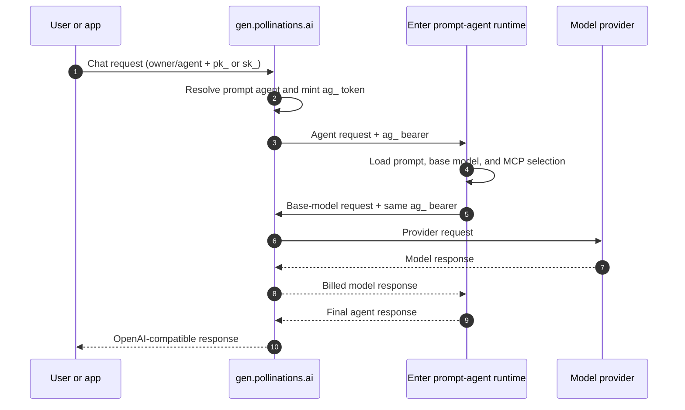
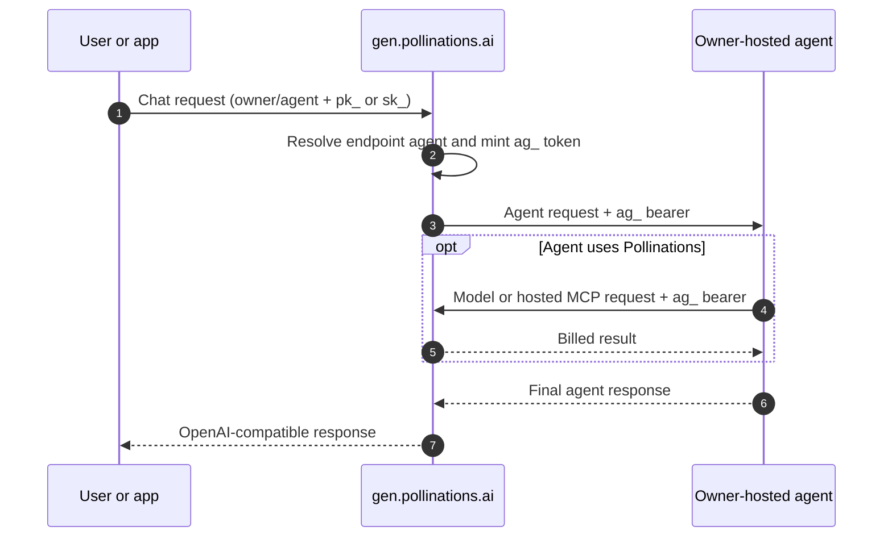
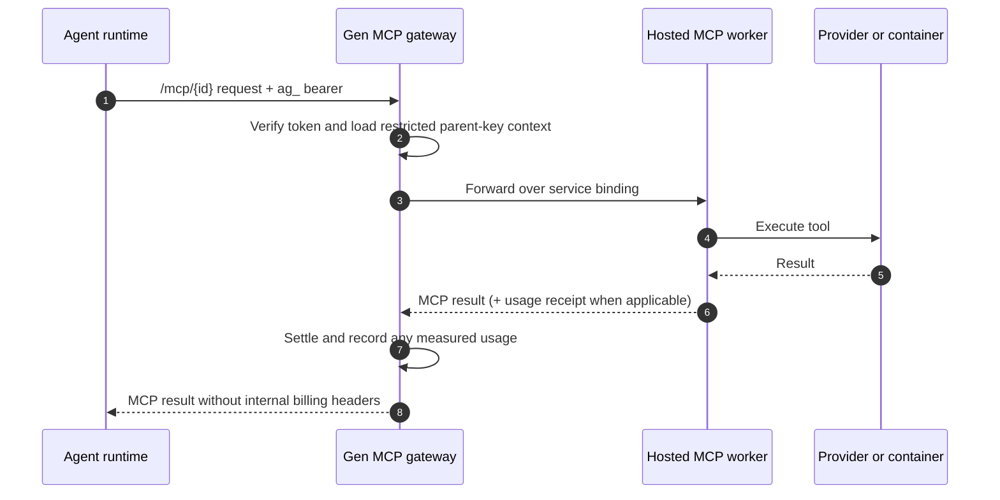
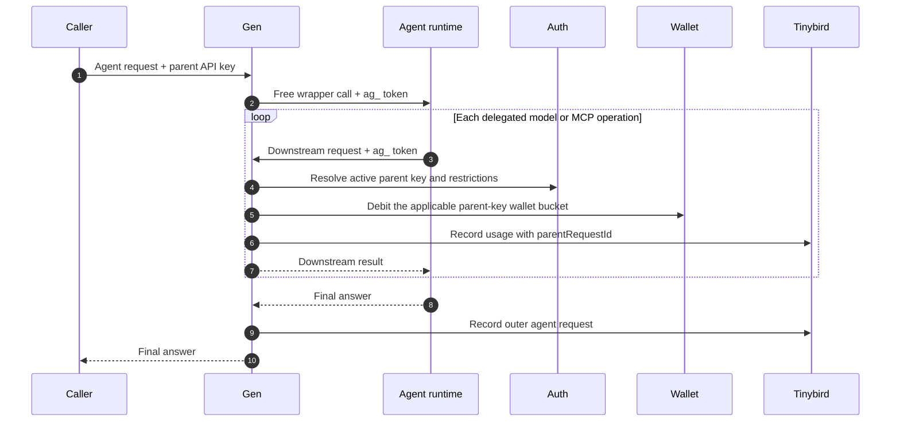

# Agents and MCP Architecture

This document describes how Pollinations agents, MCP servers, run tokens, and
billing fit together today. It ends with a snapshot of current behavior and
links to related work.

## Terms and boundaries

| Term                              | Meaning                                                                                                                                                                                                                 |
| --------------------------------- | ----------------------------------------------------------------------------------------------------------------------------------------------------------------------------------------------------------------------- |
| Prompt agent (`prompt_agent`)     | A Pollinations-hosted agent. Enter stores its system prompt, base model, and selected MCP servers, then runs its tool loop.                                                                                             |
| Endpoint agent (`endpoint_agent`) | An externally hosted OpenAI-compatible agent. Pollinations calls the owner's endpoint and supplies a short-lived `ag_` run token as its bearer credential. The owner operates its runtime and private tool connections. |
| Hosted MCP                        | An MCP server exposed through `https://gen.pollinations.ai/mcp/{serverId}`. The current registry contains Pollinations, FFmpeg, and Exa.                                                                                |
| Parent API key                    | The caller's `pk_` or `sk_` key. It remains inside Pollinations and is never forwarded to an agent.                                                                                                                     |
| Agent run token                   | A signed `ag_` bearer token that delegates limited spending authority from the parent key for one agent run.                                                                                                            |

Both agent types are callable through the normal text API under an
`owner/name` model ID. Agent listings have no independent price or fallback
chain: the caller pays for the Pollinations models and hosted MCP work the
agent actually performs.

The main implementation boundaries are:

- [community model registry](./gen.pollinations.ai/src/community-models.ts) —
  resolves proxy, prompt-agent, and endpoint-agent listings;
- [agent gateway context](./gen.pollinations.ai/src/text/communityEndpoint.ts)
  — mints run tokens and selects the upstream agent;
- [prompt-agent runtime](./enter.pollinations.ai/src/services/prompt-agent-runtime.ts)
  — runs the hosted model/tool loop;
- [run-token authentication](./shared/auth/api-key.ts) — verifies `ag_` tokens
  and resolves their parent key;
- [MCP gateway](./gen.pollinations.ai/src/routes/mcp.ts) and
  [MCP registry](./shared/registry/mcp.ts) — expose hosted MCPs and settle their
  usage.

## Calling a prompt agent

The caller always enters through Gen with their own API key. For a prompt
agent, Gen replaces that key with a run token before calling the Pollinations
runtime in Enter. Enter uses the same run token for the agent's base-model
requests.

A prompt-agent token includes its managed agent ID. Enter rejects it if the
requested runtime configuration does not match that ID.

## Calling an endpoint agent

For an endpoint agent, Gen sends the run token to the owner's server. The
owner operates the agent runtime and may use that token to call Pollinations
models or hosted MCPs. The parent API key never leaves Pollinations.

An endpoint-agent token has no managed agent ID because the owner selects the
runtime on their own server.

## Agent to MCP

Prompt agents connect to the MCP servers selected in their stored
configuration. Endpoint agents own their MCP client configuration. After that
setup difference, both use the same hosted MCP request path shown below.

The endpoint-agent path is implemented by the shared authentication layer,
while end-to-end production verification is tracked in
[#14171](https://github.com/pollinations/pollinations/issues/14171).

FFmpeg and Exa return usage receipts that Gen settles after execution. The
Pollinations MCP instead makes generation calls with the same run token, so
those downstream calls are billed normally.

Generated binary media is returned by HTTPS resource link rather than embedded
in MCP messages. This keeps media out of model context and uses the existing
`media.pollinations.ai` lifecycle.

## Run-token security

The [run-token format](./shared/auth/agent-run-token.ts) is a signed JWT with an
`ag_` prefix. Its maximum lifetime is 30 minutes, and it carries the parent API
key ID and parent request ID.

- Run tokens are accepted only as `Authorization: Bearer` credentials, never
  as query parameters.
- Every use reloads the parent key. A disabled, expired, or deleted parent key
  invalidates the run token.
- The token inherits the parent key's model allowlist and spending budget, but
  account-management permissions are removed.
- The caller's raw `pk_` or `sk_` value is never included in or forwarded with
  the token.
- The signed parent request ID links downstream usage to the agent invocation;
  an agent cannot replace it with a caller-controlled header.
- Agent responses use an agent-scoped cache boundary so one caller's tool work
  is not replayed to another caller.

## Billing and delegation

The billing path below is the same for both agent types. `Agent runtime` means
either the Enter prompt-agent runtime or the owner's endpoint-agent runtime.

The outer agent listing is free; it does not reserve or add a wrapper price.
Each billable base-model generation and hosted MCP operation settles according
to its own registry price. Usage-receipt MCPs report measured work after
execution; the Pollinations MCP is billed by its downstream generation calls.
The same parent key controls wallet selection, model permissions, and any key
budget across the whole run.

Native model-to-model delegation is not part of the current prompt-agent
runtime. Its minimal allowlist and nested-call behavior are tracked in
[#13788](https://github.com/pollinations/pollinations/issues/13788).

## Current behavior and planned work

| Area             | Current behavior                                                                                      | Next decision or work                                                                                                                                                                        |
| ---------------- | ----------------------------------------------------------------------------------------------------- | -------------------------------------------------------------------------------------------------------------------------------------------------------------------------------------------- |
| Prompt agents    | Enter runs a loop capped at 8 model steps and 16 tool calls, with selected hosted MCP servers.        | Per-tool allowlists and model restrictions: [#13783](https://github.com/pollinations/pollinations/issues/13783).                                                                             |
| Endpoint agents  | The owner runs the OpenAI-compatible endpoint and receives an `ag_` bearer.                           | Verify hosted MCP calls from a real endpoint agent and wire Floret: [#14171](https://github.com/pollinations/pollinations/issues/14171).                                                     |
| Model delegation | Agents can call models through enabled MCP tools. There is no native delegate tool.                   | Add one allowlisted delegate tool without routing rules or classifiers: [#13788](https://github.com/pollinations/pollinations/issues/13788).                                                 |
| Hosted MCPs      | Gen is the public auth, registry, and billing gateway for Pollinations, FFmpeg, and Exa MCPs.         | Keep tool discovery dynamic and filter at the prompt-agent runtime for the first restriction implementation.                                                                                 |
| Media transport  | Tools use public HTTPS inputs and resource-link outputs; media does not travel inline through MCP.    | Preserve this contract for future media operations.                                                                                                                                          |
| Long work        | Durable generation requests support up to 300 seconds.                                                | Work expected to exceed 300 seconds needs a separately approved asynchronous contract; MCP tasks are proposed but not implemented.                                                           |
| Tool hosting     | Existing FFmpeg and Exa MCPs run on Cloudflare infrastructure behind registry-owned service bindings. | Evaluate listing hosted external MCPs, and compare Cloudflare with the E2B spike before choosing a new toolbox runtime: [#14168](https://github.com/pollinations/pollinations/issues/14168). |

## Related work

- [Agent media-tool architecture proposal](https://github.com/pollinations/pollinations/issues/13657)
- [Prompt-agent MCP tool and model restrictions](https://github.com/pollinations/pollinations/issues/13783)
- [Native model delegation for prompt agents](https://github.com/pollinations/pollinations/issues/13788)
- [Crawl MCP and E2B hosting spike](https://github.com/pollinations/pollinations/issues/14168)
- [Endpoint-agent MCP verification and Floret integration](https://github.com/pollinations/pollinations/issues/14171)
- [Responses API support for managed prompt agents](https://github.com/pollinations/pollinations/issues/14243)
- [Caller-supplied hosted and MCP tools in Responses](https://github.com/pollinations/pollinations/issues/14305)
