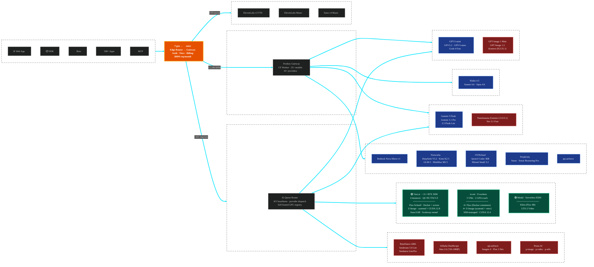

# Setup the development environment


##### SOPS
We use [sops](https://github.com/getsops/sops) with [age](https://github.com/FiloSottile/age) encryption for secrets management.

###### Installation
Install sops via your package manager:
```bash
# macOS
brew install sops

# Linux (see https://github.com/getsops/sops/releases)
```

Set up your SOPS age key:
```bash
mkdir -p $HOME/.config/sops/age/
mv /path/to/keys.txt $HOME/.config/sops/age/
```

By default, sops will look for your key file in `$HOME/.config/sops/age/keys.txt`. If you want to use a different location, set `SOPS_AGE_KEY_FILE` to your preferred path.

To decrypt service env files, run the command that matches the service:
```bash
sops --output-type dotenv decrypt secrets/dev.vars.json > .dev.vars   # enter.pollinations.ai
sops --output-type dotenv decrypt secrets/env.json > .env             # generation service secrets
``` 

The variables are kept encrypted in `**/secrets/*.json`. If you need to edit them, run `sops edit /secrets/file.json`. This will open an editor and when you save the file, write it to the encrypted file. `enter.pollinations.ai` uses `secrets/{dev,staging,prod}.vars.json` for app/runtime secrets; `tools/scripts/rotation/secrets.vars.json` is only for local operator admin credentials used by rotation scripts. (hint: set the editor env variable: `export EDITOR=/path/to/your/editor` to open with your favorite editor)


###### Common SOPS commands:
| Command | Description |
| :--- | :--- |
| `sops -d secrets/dev.vars.json` | View decrypted content |
| `sops edit secrets/dev.vars.json` | Edit encrypted file directly (set `EDITOR` env var) |
| `sops -e .dev.vars > secrets/dev.vars.json` | Encrypt .env → .encrypted.env |


##### Running Multiple Services

To run multiple services simultaneously during development:

```bash
# Install dependencies for all services
npm run install:all

# Run all services (enter, gen) with auto-restart
npm run dev

# Run individual services
npm run dev:enter
npm run dev:gen
```

The `npm run dev` command uses `concurrently` to run all services with colored output and automatic restart on failure.

##### Debugging
For verbose logging and debugging across all services, you can use:

```bash
DEBUG=* npm start
```

This will enable comprehensive debug output to help troubleshoot issues during development.

---

# Architecture Overview

Current-state architecture diagrams for pollinations.ai infrastructure and model routing.

## Models & Providers



## Infrastructure & Services

```mermaid
%%{init: {'theme': 'dark', 'themeVariables': { 'background': '#1a1a1a', 'primaryColor': '#2a2a2a', 'primaryBorderColor': '#555555', 'primaryTextColor': '#eeeeee', 'lineColor': '#00e5ff', 'clusterBkg': 'transparent', 'clusterBorder': '#888888', 'fontSize': '14px', 'fontFamily': 'Inter, system-ui, sans-serif'}}}%%

graph TD
    CDN["🌍 Cloudflare CDN\nDNS · WAF · DDoS\n~280M req/month"]:::cfEdge

    CDN --> GEN

    GEN["⚡ gen.pollinations.ai\nEdge Router\nText · Image · Video · Audio"]:::cfWorker

    GEN -->|"service binding\n(zero latency)"| ENTER

    subgraph CF["☁️ Cloudflare Workers"]
        ENTER["🔐 enter.pollinations.ai · API Gateway\n─────────────────\n🔑 OAuth + API Keys (pk_ / sk_)\n🏷️ 6 Tiers: microbe → router\n💰 Pollen balance (tier + packs + crypto)\n⏱️ Rate Limiting (Durable Objects)\n📊 Usage → TinyBird\n🔄 Response dedup"]:::cfWorker
        IMG_ROUTER["🎨 Image/video router\nHono routes · KV heartbeats\nProvider + GPU dispatch"]:::cfWorkerLight
        PORTKEY_W["🔀 portkey.pollinations.ai\nText routing worker"]:::cfWorkerLight
        MEDIA["📁 media.pollinations.ai\nSHA-256 uploads · 10MB"]:::cfWorkerLight
        FRONT["🌐 pollinations.ai\nReact + Vite SPA"]:::cfWorkerLight
    end

    subgraph STORAGE["💾 Cloudflare Storage"]
        D1["🗃️ D1 SQLite\n40K users · auth\nkeys · tiers · balance"]:::cfStorage
        KV_S["⚡ KV Store\nstats · refills · dedup"]:::cfStorage
        R2["📦 R2 · 48 TB\n4 buckets · images\ntext · media · cache"]:::cfStorage
        DO["🔒 Durable Objects\nPollenRateLimiter\n10K req/10s per IP"]:::cfStorage
    end

    ENTER --> D1
    ENTER --> KV_S
    ENTER --> R2
    ENTER --> DO

    GEN -->|"image / video"| IMG_ROUTER
    ENTER -->|"audio"| AUD_API

    GEN -->|"text / chat"| PORTKEY_W

    subgraph PROVIDERS["🔌 AI Provider APIs"]
        PROV_TEXT["☁️ Text Providers\nAzure · Anthropic · Vertex\nBedrock · Fireworks · OVH\nPerplexity · airforce"]:::provider
        IMG_API["🖼️ Image/Video\nAzure · Vertex · ByteDance\nAlibaba · Pruna · airforce"]:::provider
        AUD_API["🔊 Audio\nElevenLabs · Suno"]:::provider
    end

    PORTKEY_W --> PROV_TEXT
    IMG_ROUTER --> IMG_API

    subgraph GPU["⚡ Self-Hosted GPUs"]
        VAST["🟢 Vast.ai · ~11 RTX 5090\n4 inst · QC/NC/TW/CZ\nFlux · Z-Image · Sana"]:::gpu
        IONET["🔵 io.net · 8 workers\n5 VMs · Flux + Z-Image"]:::gpu
        MODAL["🟣 Modal · H200\nKlein · LTX-2 Video"]:::gpu
    end

    IMG_ROUTER -->|"heartbeat /register"| VAST
    IMG_ROUTER --> IONET
    IMG_ROUTER --> MODAL

    subgraph OBS["📊 TinyBird · ClickHouse"]
        TB_S["📈 Analytics\n10 tables · 18 API pipes\nusage · payments · health\nKPIs · retention · revenue"]:::tinybird
    end

    ENTER -.->|"async NDJSON"| TB_S

    subgraph PAY["💳 Payments"]
        STRIPE["Stripe · packs"]:::payment
        POLAR["Polar · subs"]:::payment
        NOWPAY["NOWPay · crypto"]:::payment
    end

    STRIPE -.->|"webhooks"| ENTER
    POLAR -.->|"webhooks"| ENTER
    NOWPAY -.->|"IPN"| ENTER

    subgraph SOCIAL["📢 Social Automation"]
        BUFFER["Buffer\nX · LinkedIn · IG"]:::social
        REDDIT["Reddit VPS\nSSH deploy"]:::social
        DISCORD_W["Discord\nWebhooks"]:::social
    end

    subgraph CICD["🔧 GitHub Actions · CI/CD"]
        GH["29 workflows\n5 deploys · 7 crons\nPolly bot · app review\nBiome · CodeQL · tests"]:::cicd
        SOPS_S["🔒 SOPS + AGE\n28 secrets"]:::cicd
    end

    GH -.->|"wrangler deploy"| CF
    SOPS_S -.->|"wrangler secrets"| CF

    ENTER -.->|"cron: refills\nabuse · D1 sync"| D1

    style CF fill:none,stroke:#888,stroke-width:2px,stroke-dasharray: 5 5
    style STORAGE fill:none,stroke:#888,stroke-width:2px,stroke-dasharray: 5 5
    style PROVIDERS fill:none,stroke:#888,stroke-width:2px,stroke-dasharray: 5 5
    style GPU fill:none,stroke:#888,stroke-width:2px,stroke-dasharray: 5 5
    style OBS fill:none,stroke:#888,stroke-width:2px,stroke-dasharray: 5 5
    style PAY fill:none,stroke:#888,stroke-width:2px,stroke-dasharray: 5 5
    style SOCIAL fill:none,stroke:#888,stroke-width:2px,stroke-dasharray: 5 5
    style CICD fill:none,stroke:#888,stroke-width:2px,stroke-dasharray: 5 5

    linkStyle default stroke-width:3px,stroke:#00E5FF

    classDef cfEdge fill:#E65100,color:#fff,stroke:#FFB300,stroke-width:2px,font-weight:bold
    classDef cfWorker fill:#E65100,color:#fff,stroke:#FFB300,stroke-width:2px,font-weight:bold
    classDef cfWorkerLight fill:#BF360C,color:#fff,stroke:#FFB300,stroke-width:1px
    classDef cfStorage fill:#4E342E,color:#fff,stroke:#FFB300,stroke-width:1px
    classDef gpu fill:#064E3B,color:#ECFDF5,stroke:#34D399,stroke-width:2px
    classDef provider fill:#1E3A8A,color:#EFF6FF,stroke:#60A5FA,stroke-width:1px
    classDef tinybird fill:#164E63,color:#CFFAFE,stroke:#22D3EE,stroke-width:1px
    classDef payment fill:#4C1D95,color:#F5F3FF,stroke:#A78BFA,stroke-width:1px
    classDef social fill:#713F12,color:#FEFCE8,stroke:#FACC15,stroke-width:1px
    classDef cicd fill:#374151,color:#F3F4F6,stroke:#9CA3AF,stroke-width:1px
```


