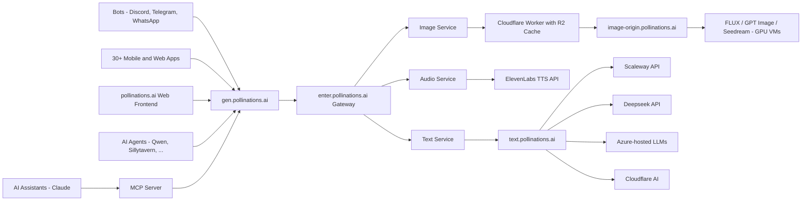

<div align="center">
  
  
  <p><strong>Open-source AI for people who make things.</strong></p>

[](https://github.com/pollinations/pollinations)
[](LICENSE)
[](https://discord.gg/pollinations-ai-885844321461485618)

[Website](https://pollinations.ai) · [Dashboard](https://enter.pollinations.ai) · [API Docs](APIDOCS.md) · [Discord](https://discord.gg/pollinations-ai-885844321461485618)

</div>

<p align="center"></p>

## 🆕 Recent Apps

| Name | Description | Author |
|------|-------------|--------|
| [SILENOS](https://www.silenos.es) | AI creative production suite with art studios, storytelling, music, and multi-modal generation. | @todoh |
| [SAIL Solver](https://ail-solver.vercel.app) | Academic test-solving tool that generates answers for multiple-choice and open-ended questions. | @unKnownNG |
| [FastStoryboard](https://faststoryboard.cloud) | AI video creation platform for generating storyboards and visual narratives. | @thomazandreywalicoski |
| [Strudel AI REPL](https://strudel-ai-repl.pages.dev) | AI-powered live-coding music environment for generating and performing algorithmic compositions. | @voodoohop |
| [PollinCoder](https://pollincoder.vercel.app) | AI app builder that generates and previews full web applications from natural language prompts. | @Spit-fires |
| [7Studio](https://7studio.edgeone.app) | AI image generation studio with prompt input, model selection, and gallery display. | @ims111we-cmd |
| [AI Studio](https://ai-studio.puter.site) | Chat and audio AI interface with text-to-speech and conversation features. | @Chess-Base |
| [Pollinations.ai Image Model Comparison](https://dseeker.github.io/pollinations/image-comparison/) | Side-by-side comparison of AI image generation models — test cost, speed, quality. | @dseeker |
| [My Web Site](https://proyectodescartes.org/IATools/85_Generador_de_c%C3%B3digo_con_IA/ejemplos/game.html) | Sitio web para proyectos de aula de bachillerato con estructura completa. | @theteacherbot |
| [Flipbook-style digital book designer](https://proyectodescartes.org/IATools/Crea_libros_3D_caps/) | AI-powered flipbook digital book designer creating illustrated 3D page-flip books. | @Juanrivera126 |

[View all apps →](apps/APPS.md)
## 🚀 New Unified API — Now Live

We've launched **https://gen.pollinations.ai** — a single endpoint for all your AI generation needs: text, images, audio, video — all in one place.

### What's New

- **Unified endpoint** — single API at `gen.pollinations.ai` for all generation
- **Pollen credits** — simple pay-as-you-go system ($1 ≈ 1 Pollen)
- **All models, one place** — Flux, GPT-5, Claude, Gemini, Seedream, and more
- **API keys** — publishable keys for frontend, secret keys for backend

> Get started at [enter.pollinations.ai](https://enter.pollinations.ai) and check out the [API docs](https://enter.pollinations.ai/api/docs)

## 🆕 Latest News

- **2026-02-15** – **🚀 Polly API** Access Polly's web research and coding skills via a new OpenAI-compatible endpoint. Check the [API Docs](https://enter.pollinations.ai/api/docs).
- **2026-02-15** – **🛡️ New Safety Model** Qwen3Guard-8B is now available via the API for fast content moderation and safety classification.
- **2026-02-15** – **✨ Showcase Upgrade** Explore the redesigned [App Showcase](https://hello.pollinations.ai) with AI-enhanced descriptions and real-time usage metrics.
- **2026-02-15** – **🎮 Community Apps** New additions include the "Nova Defense" Discord bot and the AI-powered Roblox game "Convince the CRAZY Idol".
- **2026-02-14** – **🦞 pollinations.ai × OpenClaw** Power your [OpenClaw](https://openclaw.ai) agent with 25+ AI models — Kimi K2.5, DeepSeek, Claude, Gemini & more. One script, free credits, 30 seconds. [Get started →](https://openclaw.pollinations.ai)
- **2026-02-11** – **🤖 OpenClaw Integration** Set up AI coding agents in one command with the new OpenClaw landing page and auto-install script.
- **2026-02-10** – **📚 Docs Meet Play** Documentation merged directly into the Play page—configure models visually and copy generated API code instantly.
- **2026-02-09** – **🚀 Massive Model Drop** Added `imagen-4`, `flux-2-dev`, `grok-video`, and `LTX-2` for next-level image and video generation.
- **2026-02-09** – **🎵 Audio Studio** Generate music with `elevenmusic`, transcribe with `whisper`, and use emotive TTS with `eleven_v3`.
- **2026-02-09** – **🧠 Smarter Claude** Upgraded `claude-large` to the latest Claude 3 Opus 4.6 for enhanced reasoning.
---

## 🌟 Google Summer of Code 2026 (GSOC)

Hello folks! This year, `pollinations.ai` is participating in [Google Summer of Code 2026](https://summerofcode.withgoogle.com)! 
We're looking for talented developers to contribute to our open-source AI platform. 

**Website:** [Pollinations GSOC 2026](https://gsoc.pollinations.ai)

**Mentors:** Thomas Haferlach, Ayushman Bhattacharya, Nihal Gazi.

**Projects:** Check out our [Project Ideas](https://gsoc.pollinations.ai/projects).

**Timeline:** Applications open **March 16th 2026** 
Coding starts **May 25th 2026**

> Please reach out to us about any queries on [Discord](https://discord.gg/pollinations-ai-885844321461485618) or via email at `gsoc@pollinations.ai`


## 🌱 Introduction

[pollinations.ai](https://pollinations.ai) is an open-source generative AI platform based in Berlin, powering 500+ community projects with accessible text, image, video, and audio generation APIs. We build in the open and keep AI accessible to everyone—thanks to our amazing supporters.

## 🚀 Key Features

- 🔓 **100% Open Source** — code, decisions, roadmap all public
- 🤝 **Community-Built** — 500+ projects already using our APIs
- 🌱 **Pollen Tiers** — earn daily credits by contributing (tiers in beta)
- 🖼️ **Image Generation** — Flux, GPT Image, Seedream, Kontext
- 🎬 **Video Generation** — Seedance, Veo (alpha)
- 🎵 **Audio** — Text-to-speech and speech-to-text
- 🎣 **_Easy-to-use Packages_** ([Packages](packages/))

<a href="https://star-history.com/#pollinations/pollinations&Date">
 <picture>
   <source media="(prefers-color-scheme: dark)" srcset="https://api.star-history.com/svg?repos=pollinations/pollinations&type=Date&theme=dark" width="600" />
   <source media="(prefers-color-scheme: light)" srcset="https://api.star-history.com/svg?repos=pollinations/pollinations&type=Date" width="600" />
   
 </picture>
</a>

<p align="center"></p>

## 🚀 Getting Started

[](https://deepwiki.com/pollinations/pollinations)

### Image Generation

```bash
curl 'https://gen.pollinations.ai/image/a%20beautiful%20sunset' -o image.jpg
```

Or visit [pollinations.ai](https://pollinations.ai) for an interactive experience.

### Text Generation

```bash
curl 'https://gen.pollinations.ai/text/Hello%20world'
```

### Audio Generation

**Simple GET endpoint:**

```bash
curl 'https://gen.pollinations.ai/audio/Hello%20from%20Pollinations?voice=nova&key=YOUR_API_KEY' -o speech.mp3
```

**OpenAI TTS compatible:**

```bash
curl 'https://gen.pollinations.ai/v1/audio/speech' \
  -H 'Content-Type: application/json' \
  -H 'Authorization: Bearer YOUR_API_KEY' \
  -d '{"model": "tts-1", "input": "Hello from Pollinations!", "voice": "nova"}' \
  -o speech.mp3
```

Available voices: `alloy`, `echo`, `fable`, `onyx`, `nova`, `shimmer`, plus [30+ ElevenLabs voices](https://enter.pollinations.ai/api/docs).

### MCP Server for AI Assistants

Our MCP (Model Context Protocol) server enables AI assistants like Claude to generate images and audio directly. [Learn more](./packages/mcp/README.md)

#### Configuration

Add this to your MCP client configuration:

```json
{
  "mcpServers": {
    "pollinations": {
      "command": "npx",
      "args": ["@pollinations/model-context-protocol"]
    }
  }
}
```

### Run with npx (no installation required)

```bash
npx @pollinations/model-context-protocol
```

Community alternatives like [MCPollinations](https://github.com/pinkpixel-dev/MCPollinations) and [Sequa MCP Server](https://mcp.sequa.ai/v1/pollinations/contribute) are also available.

AI assistants can:

- Generate images from text descriptions
- Create text-to-speech audio with various voice options
- Play audio responses through the system speakers
- Access all pollinations.ai models and services
- List available models, voices, and capabilities

For more advanced usage, check out our [API documentation](APIDOCS.md).

## 🔐 Authentication

Get your API key at [enter.pollinations.ai](https://enter.pollinations.ai)

### Key Types

| Key             | Prefix | Use Case                       | Rate Limits              | Status  |
| --------------- | ------ | ------------------------------ | ------------------------ | ------- |
| **Publishable** | `pk_`  | Client-side, demos, prototypes | 1 pollen per IP per hour | ⚠️ Beta |
| **Secret**      | `sk_`  | Server-side only               | No rate limits           | Stable  |

> ⚠️ **Publishable keys:** Turnstile protection coming soon. Not recommended for production yet.

> ⚠️ **Never expose `sk_` keys** in client-side code, git repos, or public URLs

> 💡 **Building an app?** Use [Bring Your Own Pollen](./BRING_YOUR_OWN_POLLEN.md) — users pay for their own usage, you pay $0

### Model Restrictions

Each API key can be scoped to specific models. When creating a key at [enter.pollinations.ai](https://enter.pollinations.ai), you can:

- **Allow all models** — key works with any available model
- **Restrict to specific models** — select exactly which models the key can access (e.g., only `flux` and `openai`, or just `gptimage-large`)

### Usage

```bash
curl 'https://gen.pollinations.ai/image/a%20cat?key=YOUR_KEY'
```

**Environment variable (best practice):**

```bash
export POLLINATIONS_API_KEY=sk_...
```

See [full API docs](APIDOCS.md) for detailed authentication information.

## 🖥️ How to Use

### Web Interface

Our web interface is user-friendly and doesn't require any technical knowledge. Simply visit [https://pollinations.ai](https://pollinations.ai) and start creating!

### API

Use our API directly in your browser or applications:

    https://pollinations.ai/p/conceptual_isometric_world_of_pollinations_ai_surreal_hyperrealistic_digital_garden

Replace the description with your own, and you'll get a unique image based on your words!

<p align="center"></p>

## 🎨 Examples

### Image Generation

Python code to download the generated image:

    import requests

    def download_image(prompt):
        url = f"https://pollinations.ai/p/{prompt}"
        response = requests.get(url)
        with open('generated_image.jpg', 'wb') as file:
            file.write(response.content)
        print('Image downloaded!')

    download_image("conceptual_isometric_world_of_pollinations_ai_surreal_hyperrealistic_digital_garden")

### Text Generation

To generate text:

    https://gen.pollinations.ai/text/What%20is%20artificial%20intelligence?

### Audio Generation

Generate speech from text:

    https://gen.pollinations.ai/audio/Hello%20from%20Pollinations?voice=alloy&key=YOUR_API_KEY

Or use the OpenAI TTS-compatible endpoint:

```bash
curl 'https://gen.pollinations.ai/v1/audio/speech' \
  -H 'Content-Type: application/json' \
  -H 'Authorization: Bearer YOUR_API_KEY' \
  -d '{"model": "tts-1", "input": "Hello from Pollinations!", "voice": "alloy"}' \
  -o speech.mp3
```

## 🛠️ Integration

### SDK

Check out our [Pollinations SDK](./packages/sdk/README.md) for Node.js, browser, and React integration.

## Architecture



## 🔮 Future Developments

We're constantly exploring new ways to push the boundaries of AI-driven content creation. Some areas we're excited about include:

- Digital Twins: Creating interactive AI-driven avatars
- Music Video Generation: Combining AI-generated visuals with music for unique video experiences
- Real-time AI-driven Visual Experiences: Projects like our Dreamachine, which create immersive, personalized visual journeys

## 🌍 Our Vision

pollinations.ai envisions a future where AI technology is:

- **Open & Accessible**: We believe AI should be available to everyone — earn daily Pollen by contributing, no credit card required

- **Transparent & Ethical**: Our open-source approach ensures transparency in how our models work and behave

- **Community-Driven**: We're building a platform where developers, creators, and AI enthusiasts can collaborate and innovate

- **Interconnected**: We're creating an ecosystem where AI services can seamlessly work together, fostering innovation through composability

- **Evolving**: We embrace the rapid evolution of AI technology while maintaining our commitment to openness and accessibility

We're committed to developing AI technology that serves humanity while respecting ethical boundaries and promoting responsible innovation. Join us in shaping the future of AI.

<p align="center"></p>

## 🤝 Community and Development

We believe in community-driven development. You can contribute to pollinations.ai in several ways:

1. **Coding Assistant**: The easiest way to contribute! Just [create a GitHub issue](https://github.com/pollinations/pollinations/issues/new) describing the feature you'd like to see implemented. The [MentatBot AI assistant](https://mentat.ai/) will analyze and implement it directly! No coding required - just describe what you want.

2. **Project Submissions**: Have you built something with pollinations.ai? [Use our project submission template](https://github.com/pollinations/pollinations/issues/new?template=project-submission.yml) (labeled as **APPS**) to share it with the community and get it featured in our README.

3. **Feature Requests & Bug Reports**: Have an idea or found a bug? [Open an issue](https://github.com/pollinations/pollinations/issues/new) and let us know. Our team and the MentatBot assistant will review it.

4. **Community Engagement**: Join our vibrant [Discord community](https://discord.gg/pollinations-ai-885844321461485618) to:
   - Share your creations
   - Get support and help others
   - Collaborate with fellow AI enthusiasts
   - Discuss feature ideas before creating issues

For any questions or support, please visit our [Discord channel](https://discord.gg/pollinations-ai-885844321461485618) or create an issue on our [GitHub repository](https://github.com/pollinations/pollinations).

## 🗂️ Project Structure

Our codebase is organized into several key folders, each serving a specific purpose in the pollinations.ai ecosystem:

- [`pollinations.ai/`](./app/): The main React application for the Pollinations.ai website.

- [`image.pollinations.ai/`](./image.pollinations.ai/): Backend service for image generation and caching with Cloudflare Workers and R2 storage.

- [`packages/sdk/`](./packages/sdk/): SDK and React component library for Pollinations.ai.

- [`text.pollinations.ai/`](./text.pollinations.ai/): Backend service for text generation.

- [`packages/mcp/`](./packages/mcp/): Model Context Protocol (MCP) server for AI assistants like Claude to generate images directly.

This structure encompasses the frontend website, backend services for image and text generation, and integrations like the Discord bot and MCP server, providing a comprehensive framework for the pollinations.ai platform.

For development setup and environment management, see [DEVELOP.md](./DEVELOP.md).

## 🏢 Supported By

> pollinations.ai is proud to be supported by:

<p align="center"></p>

- [Perplexity AI](https://www.perplexity.ai/): AI-powered search and conversational answer engine
- [AWS Activate](https://aws.amazon.com/): GPU Cloud Credits
- [io.net](https://io.net/): Decentralized GPU network for AI compute
- [BytePlus](https://www.byteplus.com/): Official ByteDance cloud services and AI solutions
- [Google Cloud for Startups](https://cloud.google.com/): GPU Cloud Credits
- [NVIDIA Inception](https://www.nvidia.com/en-us/deep-learning-ai/startups/): AI startup support
- [Azure (MS for Startups)](https://azure.microsoft.com/): OpenAI credits
- [Cloudflare](https://developers.cloudflare.com/workers-ai/): Put the connectivity cloud to work for you.
- [Scaleway](https://www.scaleway.com/): Europe's empowering cloud provider
- [Modal](https://modal.com/): High-performance AI infrastructure
- [Nebius](https://nebius.com/): AI-optimized cloud infrastructure with NVIDIA GPU clusters
- [api.airforce](https://api.airforce): AI API gateway — alpha models (imagen-4, grok-video, qwen-character), may be unstable

## 💚 Support Us

The best way to support pollinations.ai is by using our product! Get your API key and start building at **[enter.pollinations.ai](https://enter.pollinations.ai)**.

## 📣 Stay Connected

[𝕏 Twitter](https://twitter.com/pollinations_ai) · [Instagram](https://instagram.com/pollinations_ai) · [LinkedIn](https://www.linkedin.com/company/pollinations-ai) · [Facebook](https://facebook.com/pollinations) · [Reddit](https://www.reddit.com/r/pollinations_ai/) · [YouTube](https://www.youtube.com/c/pollinations)

## 📜 License

pollinations.ai is open-source software licensed under the [MIT license](LICENSE).

---

Made with ❤️ by the pollinations.ai team
