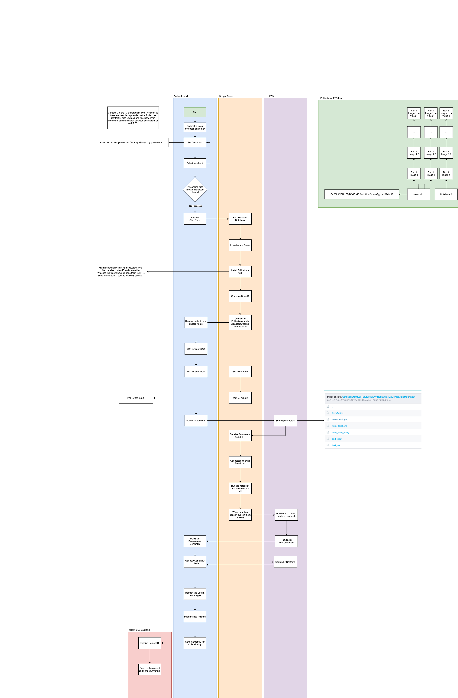

## 🌸 Pollinations

Pollinations are an effort to make generative art more approachable. 
- A frontend hosting a set of [curated notebooks](https://github.com/pollinations/hive) that allow creating and experimenting with generative art.
- The Interplanetary Filesystem (IPFS) for decentralized censorship-resistant storage of models, code and generated content
- Pollinations are run on Google Colab at the moment (for the free cloud GPUs)

[Instructions](docs/instructions.md) on using Pollinations.AI.

## 🔗 Links

- Frontend: https://pollinations.ai/
- Instructions: [docs/instructions.md](docs/instructions.md)
- Discord: https://discord.gg/azGuNpvPu8

## �👩‍💻 Development

  
Development of Pollinations.AI Web App

    `make dev` to start the development server of web app.% 

    Enable logging:
    `localStorage.debug = "*"`

    If logs don't appear in Chrome enable logging "All Aevels" (including Verbose)
  
 
    ## Optionally it is possible to develop with a local IPFS node
    
    Enable connect to local IPFS:
    `localStorage.localIFS = true

    `make up` to start the releant services. See next section for details
  

  
Development of Notebooks

   All notebooks at [pollinations/hive](https://github.com/pollinations/hive) are automatically deployed to Pollinations. 
   
   We will add an easy way to include custom notebooks. For now, to use an external notebook it needs to be uploaded to IPFS wrapped in a folder in the form `input/notebook.ipynb`. The resulting IPFS hash can be used directly like so: `https://pollinations.ai/p/[hash]`
  

  
Development with Local IPFS node

    Development environment requires `docker` & `docker-compose` for running a loca IPFS node. For docker installation, please navigate to https://docs.docker.com/get-docker/.

    After docker is setup, `make` is used for managing the IPFS and development environment.

    ## 🟡 Initialization

    To run pollinations development environment first time,

    - Run `make init`, this will initialize start the IPFS docker image and fill `tmp/ipfs` folder by migrating IPFS.

    ## 🟢 Running

    After IPFS migrated, to start development environment,
    - Run `make up`, this will start the dockerized IPFS instance and detach.
    - Run `make dev` to start the react application living under `/app`

    ## 🔴 Stopping

    - Run `make down` to stop running IPFS instance.
    - Run `make clean` to remove the `tmp` folder and its contents.

    ## ⚙️ Configuration

    IPFS configuration can be found and updated in `docker/ipfs/config.json`. Every time the docker containers are started, the config file under `tmp/ipfs/config` is overwritten with this json file.

  
Architecture Diagram

  The following diagram has an editable copy embedded. Use https://draw.io/#Hpollinations/pollinations/master/pollinations_architecture.png to edit the file.

  Export the results as PNG with "Include a copy of my diagram" option selected and replace the current diagram.

  
  
 

