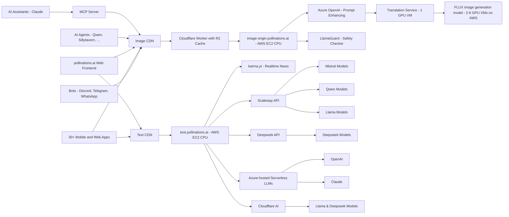

<div align="center">
  
</div>

## 🆕 Recent Apps

| Name | Description | Author |
|------|-------------|--------|
| [VisionAI](https://superheroghost.github.io/VisionAI/) | A public AI image generator UI for Pollinations AI models. Supports using your o | @Superheroghost |
| [Pollinations VisionAI](https://superheroghost.github.io/VisionAI/) | Public AI image generator UI for Pollinations models; supports API keys | @Superheroghost |
| [Donjon.studio](https://donjon.studio/) | AI-generated interactive adventures with evolving stories and images | @PassepartoutFR |
| [Insight Engine](https://erbharatmalhotra.github.io/insight-engine/) | Experimental frontend app that turns a single idea into refined text insights and AI-generated visuals | @ErBharatMalhotra |
| [IDPhotoGen](https://id-photo-gen.thangoffer91.workers.dev) | Create professional ID photos in 30 seconds with AI | @thangoffer91 |
| [AquaMind](https://aquamind.app) | AI-powered aquarium management and fish care assistant | @aquamind |
| [Word Wagon](https://wordwagon.app) | AI-powered vocabulary learning app with spaced repetition | @wordwagon |
| [nusanexus](https://nusanexus.com) | AI-powered chat platform for Indonesian users | @nusanexus |
| [Nuvole AI Lite](https://nuvoleai.com) | Lightweight AI chat app with clean UI and fast responses | @nuvoleai |
| [BCA Nepal](https://play.google.com/store/apps/details/BCA_Nepal_BCA_Notes_Course?id=com.bcanepal&hl=en_IN) | BCA Nepal: Notes, courses, AI chat & PDF AI tools for smarter study | @sushilbalami |
| [PromptPi!](https://chromewebstore.google.com/detail/promptpi-image-to-prompt/dmcckiclfondnkgncnajmdcblimekgbk) | Reverse-engineer images into pro AI prompts with batch & multi-model support | @dreamm160 |

[View all apps →](apps/APPS.md)
## 🚀 New Unified API — Now Live

We've launched **https://gen.pollinations.ai** — a single endpoint for all your AI generation needs: text, images, audio, video — all in one place.

### What's New

-   **Unified endpoint** — no more juggling between image.pollinations.ai and text.pollinations.ai
-   **Pollen credits** — simple pay-as-you-go system ($1 ≈ 1 Pollen)
-   **All models, one place** — Flux, GPT-5, Claude, Gemini, Seedream, and more
-   **API keys** — publishable keys for frontend, secret keys for backend

> Get started at [enter.pollinations.ai](https://enter.pollinations.ai) and check out the [API docs](https://enter.pollinations.ai/api/docs)

## 🆕 Latest News

- **2025-12-29** – **🚀 New Model: gptimage-large** Access GPT Image 1.5 for high-fidelity generations via the API. [API Docs](https://enter.pollinations.ai/api/docs)
- **2025-12-29** – **🤖 DeepSeek V3.2** Upgraded to the latest DeepSeek V3.2 for smarter, faster chat responses. [Try it](https://hello.pollinations.ai)
- **2025-12-29** – **🎥 Veo Image-to-Video** Turn images into videos using the updated `veo` model capabilities. [API Docs](https://enter.pollinations.ai/api/docs)
- **2025-12-29** – **📱 New Creative Apps** Try **IDPhotoGen** (ID photos) and **PromptPi!** (prompt engineering) in our showcase. [See Apps](https://github.com/pollinations/pollinations/blob/master/apps/APPS.md)
- **2025-12-22** – **🚀 New Models** Default `gemini` is now **Gemini 3 Flash**, plus added **Perplexity Sonar Reasoning Pro**. [API Docs](https://enter.pollinations.ai/api/docs)
- **2025-12-22** – **🎥 Veo Video Upgrades** Added **Image-to-Video** and **Frame Interpolation** (start/end frames) support for the `veo` model.
- **2025-12-22** – **🔗 MCP Server v2.0** Major update adding video generation, analysis, and web search tools. [MCP Protocol](https://mcp.sequa.ai/v1/pollinations/contribute)
- **2025-12-22** – **🎵 New Voices** Added 7 new voices (Coral, Verse, Sage, etc.) to the `openai-audio` model.
- **2025-12-15** – **🚀 GPT-5.2 & Gemini Tools** Upgraded `openai-large` to GPT-5.2 and enabled Google Search & Code Execution by default for Gemini models.
- **2025-12-15** – **🎨 Face-Aware Upscaling** Enhanced image generation with GFPGAN face restoration and MediaPipe detection for sharper portraits.
---

[](https://pollinations.ai/p/3D_wireframe_blueprint_of_the_conceptual_isometric_world_of_Pollinations_AI_a_surreal_hyperrealistic_digital_garden_Elements_emerge_partially_from_all_sides?width=3000&height=1000&seed=-1)

## 🌟 Introduction

[pollinations.ai](https://pollinations.ai) is an open-source generative AI platform based in Berlin, powering 500+ community projects with accessible text and image generation APIs. We build in the open and keep AI accessible to everyone—thanks to our amazing supporters.

## 🚀 Key Features

-   🔓 **100% Open Source** — code, decisions, roadmap all public
-   🤝 **Community-Built** — 500+ projects already using our APIs
-   🔒 **Privacy-Respecting** — no accounts needed to get started
-   🖼️ **Embed like any normal image or text**
-   🎵 **Audio generation:** Text-to-speech and speech-to-text capabilities
-   🌱 **Supporter-Funded** — daily Pollen keeps AI accessible for everyone
-   🎣 **_Easy-to-use React hooks_** ([React Hooks Examples](https://react-hooks.pollinations.ai/))

<a href="https://star-history.com/#pollinations/pollinations&Date">
 <picture>
   <source media="(prefers-color-scheme: dark)" srcset="https://api.star-history.com/svg?repos=pollinations/pollinations&type=Date&theme=dark" width="600" />
   <source media="(prefers-color-scheme: light)" srcset="https://api.star-history.com/svg?repos=pollinations/pollinations&type=Date" width="600" />
   
 </picture>
</a>

> **⚠️ Legacy Documentation Notice**
>
> This documentation refers to our legacy endpoints (`image.pollinations.ai`, `text.pollinations.ai`). We recommend using our new unified API at **https://gen.pollinations.ai** with the **https://enter.pollinations.ai** service.
>
> 📚 **[View Latest API Documentation](https://enter.pollinations.ai/api/docs)**
>
> The legacy endpoints will be deprecated in the future.

## 🚀 Getting Started

[](https://deepwiki.com/pollinations/pollinations)

### Image Generation

1. Visit [https://pollinations.ai](https://pollinations.ai)
2. Type your description in the text box
3. Click "Generate" and watch the magic happen!

### Text Generation

1. Visit [https://text.pollinations.ai](https://text.pollinations.ai)
2. Start chatting with the AI

### Audio Generation

1. Use the `openai-audio` model with our API ([explore voices at OpenAI.fm](https://www.openai.fm/))
2. Generate speech from text or transcribe audio to text

### MCP Server for AI Assistants

Our MCP (Model Context Protocol) server enables AI assistants like Claude to generate images and audio directly. [Learn more](./model-context-protocol/README.md)

#### Configuration

Add this to your MCP client configuration:

```json
{
    "mcpServers": {
        "pollinations": {
            "command": "npx",
            "args": ["@pollinations/model-context-protocol"]
        }
    }
}
```

### Run with npx (no installation required)

```bash
npx @pollinations/model-context-protocol
```

Community alternatives like [MCPollinations](https://github.com/pinkpixel-dev/MCPollinations) and [Sequa MCP Server](https://mcp.sequa.ai/v1/pollinations/contribute) are also available.

AI assistants can:

-   Generate images from text descriptions
-   Create text-to-speech audio with various voice options
-   Play audio responses through the system speakers
-   Access all pollinations.ai models and services
-   List available models, voices, and capabilities

For more advanced usage, check out our [API documentation](APIDOCS.md).

## 🖥️ How to Use

### Web Interface

Our web interface is user-friendly and doesn't require any technical knowledge. Simply visit [https://pollinations.ai](https://pollinations.ai) and start creating!

### API

Use our API directly in your browser or applications:

    https://pollinations.ai/p/conceptual_isometric_world_of_pollinations_ai_surreal_hyperrealistic_digital_garden

Replace the description with your own, and you'll get a unique image based on your words!

## 🎨 Examples

### Image Generation

Here's an example of a generated image:

[](https://pollinations.ai/p/3d_wireframe_blueprint_for_the_prompt_conceptual%20isometric%20world%20of%20pollinations%20ai%20surreal%20hyperrealistic%20digital%20garden?width=2000&height=500&nologo=true&seed=-1)

Python code to download the generated image:

    import requests

    def download_image(prompt):
        url = f"https://pollinations.ai/p/{prompt}"
        response = requests.get(url)
        with open('generated_image.jpg', 'wb') as file:
            file.write(response.content)
        print('Image downloaded!')

    download_image("conceptual_isometric_world_of_pollinations_ai_surreal_hyperrealistic_digital_garden")

### Text Generation

To generate text, use this URL:

    https://text.pollinations.ai/What%20is%20artificial%20intelligence?

### Audio Generation

To generate audio from text, use this URL:

    https://text.pollinations.ai/Welcome%20to%20Pollinations?model=openai-audio&voice=nova

## 🛠️ Integration

### React Hooks

We offer React hooks for easy integration. Example usage:

    import React from 'react';
    import { usePollinationsImage, usePollinationsText } from '@pollinations/react';
    import ReactMarkdown from 'react-markdown';

    const AIGeneratedContent = () => {
      const imageUrl = usePollinationsImage("Beautiful landscape of Paris with Eiffel Tower", { width: 800, height: 600, seed: 42 });
      const markdown = usePollinationsText("Write a brief travel guide for Paris, including top attractions and local cuisine in markdown", { seed: 42 });

      return (
        <div>
          <h2>AI-Generated Travel Guide</h2>
          
          {markdown ? (
            <ReactMarkdown>{markdown}</ReactMarkdown>
          ) : (
            <p>Loading markdown content...</p>
          )}
        </div>
      );
    };

    export default AIGeneratedContent;

Check out our [Pollinations React Hooks](./pollinations-react/README.md) for more details.

## Architecture



## 🔮 Future Developments

We're constantly exploring new ways to push the boundaries of AI-driven content creation. Some areas we're excited about include:

-   Digital Twins: Creating interactive AI-driven avatars
-   Music Video Generation: Combining AI-generated visuals with music for unique video experiences
-   Real-time AI-driven Visual Experiences: Projects like our Dreamachine, which create immersive, personalized visual journeys

## 🌍 Our Vision

pollinations.ai envisions a future where AI technology is:

-   **Open & Accessible**: We believe AI should be available to everyone, not locked behind paywalls or restricted access

-   **Transparent & Ethical**: Our open-source approach ensures transparency in how our models work and behave

-   **Community-Driven**: We're building a platform where developers, creators, and AI enthusiasts can collaborate and innovate

-   **Interconnected**: We're creating an ecosystem where AI services can seamlessly work together, fostering innovation through composability

-   **Evolving**: We embrace the rapid evolution of AI technology while maintaining our commitment to openness and accessibility

We're committed to developing AI technology that serves humanity while respecting ethical boundaries and promoting responsible innovation. Join us in shaping the future of AI.

## 🤝 Community and Development

We believe in community-driven development. You can contribute to pollinations.ai in several ways:

1. **Coding Assistant**: The easiest way to contribute! Just [create a GitHub issue](https://github.com/pollinations/pollinations/issues/new) describing the feature you’d like to see implemented. The [MentatBot AI assistant](https://mentat.ai/) will analyze and implement it directly! No coding required - just describe what you want.

2. **Project Submissions**: Have you built something with pollinations.ai? [Use our project submission template](https://github.com/pollinations/pollinations/issues/new?template=project-submission.yml) (labeled as **APPS**) to share it with the community and get it featured in our README.

3. **Feature Requests & Bug Reports**: Have an idea or found a bug? [Open an issue](https://github.com/pollinations/pollinations/issues/new) and let us know. Our team and the MentatBot assistant will review it.

4. **Community Engagement**: Join our vibrant [Discord community](https://discord.gg/pollinations-ai-885844321461485618) to:
    - Share your creations
    - Get support and help others
    - Collaborate with fellow AI enthusiasts
    - Discuss feature ideas before creating issues

For any questions or support, please visit our [Discord channel](https://discord.gg/pollinations-ai-885844321461485618) or create an issue on our [GitHub repository](https://github.com/pollinations/pollinations).

## 🗂️ Project Structure

Our codebase is organized into several key folders, each serving a specific purpose in the pollinations.ai ecosystem:

-   [`pollinations.ai/`](./app/): The main React application for the Pollinations.ai website.

-   [`image.pollinations.ai/`](./image.pollinations.ai/): Backend service for image generation and caching with Cloudflare Workers and R2 storage.

-   [`pollinations-react/`](./pollinations-react/): React component library for Pollinations.ai.

-   [`text.pollinations.ai/`](./text.pollinations.ai/): Backend service for text generation.

-   [`model-context-protocol/`](./model-context-protocol/): Model Context Protocol (MCP) server for AI assistants like Claude to generate images directly.

This structure encompasses the frontend website, backend services for image and text generation, and integrations like the Discord bot and MCP server, providing a comprehensive framework for the pollinations.ai platform.

For development setup and environment management, see [DEVELOP.md](./DEVELOP.md).

## 🏢 Supported By

pollinations.ai is proud to be supported by:

[](https://pollinations.ai/p/Logos_of_AWS_Activate,_Google_Cloud_for_Startups,_NVIDIA_Inception,_Azure,_Cloudflare,_Scaleway,_and_Modal_arranged_in_a_2_rows_and_4_columns_grid?width=400&height=200&nologo=true&seed=-1)

-   [Portkey AI Gateway](https://github.com/Portkey-AI/gateway): AI Gateway for LLM routing and fallbacks
-   [io.net](https://io.net/): Decentralized GPU network for AI compute
-   [BytePlus](https://www.byteplus.com/): Official ByteDance cloud services and AI solutions
-   [AWS Activate](https://aws.amazon.com/): GPU Cloud Credits
-   [Google Cloud for Startups](https://cloud.google.com/): GPU Cloud Credits
-   [NVIDIA Inception](https://www.nvidia.com/en-us/deep-learning-ai/startups/): AI startup support
-   [Azure (MS for Startups)](https://azure.microsoft.com/): OpenAI credits
-   [Cloudflare](https://developers.cloudflare.com/workers-ai/): Put the connectivity cloud to work for you.
-   [Scaleway](https://www.scaleway.com/): Europe's empowering cloud provider
-   [Modal](https://modal.com/): High-performance AI infrastructure

## 📜 License

pollinations.ai is open-source software licensed under the [MIT license](LICENSE).

---

Made with ❤️ by the pollinations.ai team


