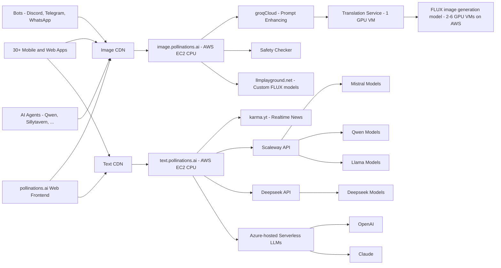

# [Pollinations.AI](https://pollinations.ai)

*Your Engine for Personalized Synthetic Media*

## 🆕 NEWS: MentatBot AI Assistant

We're excited to announce MentatBot, our autonomous AI coding assistant that implements new features directly from GitHub issues! Simply [create an issue](https://github.com/pollinations/pollinations/issues/new) describing what you'd like to see, and MentatBot will analyze and implement it. Learn more about [MentatBot](https://mentat.ai/).

## 🌟 Introduction

[Pollinations.AI](https://pollinations.ai) is the most easy-to-use, free text and image generation API available. No signups or API keys required. We prioritize your privacy with zero data storage and completely anonymous usage.

## 🚀 Key Features

- 🔓 **100% Open Source**
- 🆓 **_Free to use_**
- 🔒 **Simplicity and privacy:** No logins, no keys, no data stored
- 🖼️ **Embed like any normal image or text**
- 🌍 Over **50,000 active users** and > **_8 million images generated per month_**
- 🤝 Used by various **open-source LLMs**, **bots**, and **communities**
- 🎣 **_Easy-to-use React hooks_** ([React Hooks Examples](https://react-hooks.pollinations.ai/))
- 🤖 **Autonomous Development:** Features implemented by our MentatBot coding assistant through GitHub issues

<a href="https://star-history.com/#pollinations/pollinations&Date">
 <picture>
   <source media="(prefers-color-scheme: dark)" srcset="https://api.star-history.com/svg?repos=pollinations/pollinations&type=Date&theme=dark" width="600" />
   <source media="(prefers-color-scheme: light)" srcset="https://api.star-history.com/svg?repos=pollinations/pollinations&type=Date" width="600" />
   
 </picture>
</a>

## 🚀 Getting Started

### Image Generation

1. Visit [https://pollinations.ai](https://pollinations.ai)
2. Type your description in the text box
3. Click "Generate" and watch the magic happen!

### Text Generation

1. Visit [https://text.pollinations.ai](https://text.pollinations.ai)
2. Start chatting with the AI

For more advanced usage, check out our [API documentation](APIDOCS.md).

## 🖥️ How to Use

### Web Interface

Our web interface is user-friendly and doesn't require any technical knowledge. Simply visit [https://pollinations.ai](https://pollinations.ai) and start creating!

### API

Use our API directly in your browser or applications:

    https://pollinations.ai/p/conceptual_isometric_world_of_pollinations_ai_surreal_hyperrealistic_digital_garden

Replace the description with your own, and you'll get a unique image based on your words!

## 🎨 Examples

### Image Generation

Here's an example of a generated image:

Python code to download the generated image:

    import requests

    def download_image(prompt):
        url = f"https://pollinations.ai/p/{prompt}"
        response = requests.get(url)
        with open('generated_image.jpg', 'wb') as file:
            file.write(response.content)
        print('Image downloaded!')

    download_image("conceptual_isometric_world_of_pollinations_ai_surreal_hyperrealistic_digital_garden")

### Text Generation

To generate text, use this URL:

    https://text.pollinations.ai/What%20is%20artificial%20intelligence?

## 🛠️ Integration

### React Hooks

We offer React hooks for easy integration. Example usage:

    import React from 'react';
    import { usePollinationsImage, usePollinationsText } from '@pollinations/react';
    import ReactMarkdown from 'react-markdown';

    const AIGeneratedContent = () => {
      const imageUrl = usePollinationsImage("Beautiful landscape of Paris with Eiffel Tower", { width: 800, height: 600, seed: 42 });
      const markdown = usePollinationsText("Write a brief travel guide for Paris, including top attractions and local cuisine in markdown", { seed: 42 });

      return (
        

          <h2>AI-Generated Travel Guide</h2>
          
          {markdown ? (
            <ReactMarkdown>{markdown}</ReactMarkdown>
          ) : (
            
Loading markdown content...

          )}
        

      );
    };

    export default AIGeneratedContent;

Check out our [Pollinations React Hooks](./pollinations-react/README.md) for more details.

## Architecture

## Projects Using Pollinations.AI

Pollinations.AI is used in various projects, including:

### LLM Integrations

| Project | Description | Creator | Links |
|---------|-------------|---------|-------|
| SillyTavern | An LLM frontend for power users. Pollinations permits it to generate images | - | [Docs](https://docs.sillytavern.app/extensions/stable-diffusion/), [GitHub](https://github.com/SillyTavern/SillyTavern) |
| Qwen-Agent | A framework for developing agentic LLM applications | - | [GitHub](https://github.com/QwenLM/Qwen-Agent) |
| LobeChat | An open-source, modern-design ChatGPT/LLMs UI/Framework with speech-synthesis, multi-modal, and extensible plugin system | - | [Website](https://lobehub.com/plugins/pollinations-drawing), [GitHub](https://github.com/lobehub/lobe-chat) |
| Unity AI Lab | A specialized uncensored LLM model built on Mistral Large, focused on unrestricted conversations | - | [Website](https://blog.unityailab.com/unity.html) |
| DynaSpark AI | A versatile AI assistant with advanced image and text generation capabilities | Th3-C0der | [Website](https://dynaspark.onrender.com), [GitHub](https://github.com/Th3-C0der) |
| FlowGPT | Generate images on-demand with ChatGPT | - | [Website](https://flowgpt.com/p/instant-image-generation-with-chatgpt-and-pollinationsai) |
| Sirius Cybernetics Elevator Challenge | A Hitchhiker's Guide to the Galaxy themed LLM-based elevator game | @thomash_pollinations | [Demo](https://sirius-cybernetics.pollinations.ai/), [GitHub](https://github.com/voodoohop/sirius-cybernetics-elevator-challenge) |

### Social Bots

| Bot | Description | Creator | Links |
|-----|-------------|---------|-------|
| Discord Bot | A Discord bot for generating images based on user prompts | @Zngzy | [Discord](https://discord.gg/D9xGg8mq3D), [GitHub](https://github.com/Zingzy/pollinations.ai-bot) |
| WhatsApp Group | A WhatsApp group for image generation | @dg_karma | [Join Group](https://chat.whatsapp.com/KI37JqT5aYdL9WBYMyyjDV) |
| Telegram Bot | A Telegram bot for generating images based on user prompts | Wong Wei Hao | [Telegram](http://t.me/pollinationsbot) |
| Anyai | A Discord bot and community for AI-driven content | @meow_18838 | [Discord](https://discord.com) |
| OpenHive | A Discord server bridging Discord and AI, featuring Beebot | @creativegpt | [Discord](https://discord.gg/Zv3SXTF5xy) |

### SDK & Libraries

| Library | Description | Creator | Links |
|---------|-------------|---------|-------|
| Polli API Dashboard 🆕 | A beautiful realtime dashboard monitoring text.pollinations.ai/feed with detailed statistics and analytics. | @sugamdeol | [Website](https://polli-api.vercel.app) • [GitHub](https://github.com/Sugamdeol/Polli-api) |
| @pollinations/react 🆕 | React hooks for easy integration of Pollinations' image and text generation. Features usePollinationsImage, usePollinationsText, and usePollinationsChat hooks. | @pollinations | [NPM](https://www.npmjs.com/package/@pollinations/react) • [Docs](https://react-hooks.pollinations.ai/) |
| pypollinations 🆕 | Comprehensive Python wrapper for Pollinations AI API with async support, image/text generation, and model management. | @KTS-o7 | [PyPI](https://pypi.org/project/pypollinations/) |
| pollinations.ai Python SDK 🆕 | Official Python SDK for working with Pollinations' generative models. Supports both image and text generation with conversation context. | @pollinations-ai | [GitHub](https://github.com/pollinations-ai/pollinations.ai) |

### Mobile & Web Applications

| Application | Description | Creator | Links |
|-------------|-------------|---------|-------|
| Free AI Chatbot & Image Generator | A mobile app offering unlimited AI chat and image generation powered by GPT-4 and Flux. | @andreas_11 | [Website](https://freeaichat.app) |
| AI-Bloom 🆕 | A minimal yet creative showcase of AI-powered visual and interactive content generation using Pollinations. | @diepdo1810 | [Website](https://ai-bloom.vercel.app/) • [GitHub](https://github.com/diepdo1810/AI-Bloom) |
| Image Gen - Uncensored Edition 🆕 | A powerful image generation assistant on HuggingChat powered by Qwen 2.5 (72B). Features intelligent model selection across multiple diffusion models and uncensored capabilities. | @DeFactOfficial | [HuggingChat](https://huggingface.co/chat/assistant/66fccce0c0fafc94ab557ef2) |
| Pollinator Android App | An open-source Android app for text-to-image generation using Pollinations.ai's endpoint. | @gaurav_87680 | [GitHub](https://github.com/g-aggarwal/Pollinator) |
| Rangrez AI | A web platform focused on inspiring, creating, and customizing designs with AI-powered tools, powered by Pollinations and GroqCloud. | @saadaryf | [Website](https://rangrezai.com) |
| Roblox Character RP 🆕 | A Roblox game where players can create and roleplay with AI characters using Pollinations' text generation. | @user113 | [Roblox](https://www.roblox.com/games/108463136689847) |
| MIDIjourney | An AI-powered plugin for Ableton Live that turns text descriptions into music. | KORUS Labs | [GitHub](https://github.com/korus-labs/MIDIjourney) |
| Pollinations Gallery 🆕 | A clean and simple gallery showcasing the community's AI-generated images using Pollinations' image feed interface. | @deng-xian-sheng | [Website](https://deng-xian-sheng.github.io/pollinations-img-page/) |
| TurboReel | An open-source video generation system using AI. | @pedroriosa | [Website](https://turboreelgpt.tech/), [GitHub](https://github.com/turboreel/turboreel) |
| Infinite Tales | A Choose Your Own Adventure RPG, dynamically narrated by AI. | JayJayBinks | [Website](https://infinite-tales-rpg.vercel.app/), [GitHub](https://github.com/JayJayBinks/infinite-tales-rpg) |
| POLLIPAPER | A dynamic wallpaper app that uses Pollinations AI to create unique desktop backgrounds. | @intolerant0ne | [GitHub](https://github.com/Tolerable/POLLIPAPER) |
| Own-AI | An AI text-to-image generator powered by Pollinations.ai. | Sujal Goswami | [Website](https://own-ai.pages.dev/), [GitHub](https://github.com/sujal-goswami/Own-AI) |
| StorySight | An app to help children with learning disabilities by visualizing abstract concepts. | @abiral-manandhar | [GitHub](https://github.com/abiral-manandhar/storySight), [Devpost](https://devpost.com/software/storysight-013xdw) |
| StoryWeaver | A tool that crafts personalized picture books for children based on themes and prompts. | Advaith Narayanan, Omeed Sabouri, Yufan Wang | [GitHub](https://github.com/AdvaithN1/StoryWeaver), [Devpost](https://devpost.com/software/storyweaver-013xdw) |
| UR Imagine & Chat AI 🎨💬 | Free and limitless AI image generator with companion chat/roleplay system. | withthatway | [Image Gen](https://perchance.org/ur-imagine-ai/), [Chat](https://perchance.org/urchat-ai/) |
| Websim | A web simulation tool that integrates Pollinations.ai for generating AI-driven content. | @thomash_pollinations | [Website](https://websim.ai/c/bXsmNE96e3op5rtUS) |
| JCode Website Builder | A website generator using Pollinations text API. | @rtxpower | [Website](https://jcode-ai-website-bulder.netlify.app/ai-website-builder/generated-projects/categories) |
| JustBuildThings | A collection of AI tools for image generation, character chat, and writing. | rasit | [Website](https://justbuildthings.com) |

### Tutorials
1. [Artistic Styles Book](https://proyectodescartes.org/iCartesiLibri/materiales_didacticos/Libro_Estilos/index.html): 🆕 An interactive book showcasing over 90 different artistic styles generated using Pollinations.ai. Available in [HTML](https://proyectodescartes.org/iCartesiLibri/materiales_didacticos/Libro_Estilos/index.html) and [PDF](https://proyectodescartes.org/iCartesiLibri/PDF/Libro_Estilos.pdf) formats.
2. [Proyecto Descartes](https://proyectodescartes.org/revista/Numeros/Revista_8_2024/index.html): 🆕 An educational initiative integrating Pollinations AI into interactive STEM learning resources, with a focus on mathematics and sciences. Created by Juan Gmo. Rivera.
3. [Tutorial](https://guiadehospedagem.com.br/pollinations-ai/): An in-depth Portuguese tutorial on using Pollinations AI. Created by Janderson de Sales.
4. [Apple Shortcuts Guide](https://www.youtube.com/watch?v=-bS41VTzh_s): A step-by-step video guide on creating AI images using Apple Shortcuts and Pollinations. Created by RoutineHub. [Shortcut](https://routinehub.co/shortcut/19953/)

Have you created a project using Pollinations.AI? Email us at hello@pollinations.ai to get it listed here!

## 🔮 Future Developments

We're constantly exploring new ways to push the boundaries of AI-driven content creation. Some areas we're excited about include:

- Digital Twins: Creating interactive AI-driven avatars
- Music Video Generation: Combining AI-generated visuals with music for unique video experiences
- Real-time AI-driven Visual Experiences: Projects like our Dreamachine, which create immersive, personalized visual journeys

## 🌍 Our Vision

Pollinations.AI envisions a future where AI technology is:

- **Open & Accessible**: We believe AI should be available to everyone, not locked behind paywalls or restricted access

- **Transparent & Ethical**: Our open-source approach ensures transparency in how our models work and behave

- **Community-Driven**: We're building a platform where developers, creators, and AI enthusiasts can collaborate and innovate

- **Interconnected**: We're creating an ecosystem where AI services can seamlessly work together, fostering innovation through composability

- **Evolving**: We embrace the rapid evolution of AI technology while maintaining our commitment to openness and accessibility

We're committed to developing AI technology that serves humanity while respecting ethical boundaries and promoting responsible innovation. Join us in shaping the future of AI.

## 🤝 Community and Development

We believe in community-driven development. You can contribute to Pollinations.AI in several ways:

1. **MentatBot Coding Assistant**: The easiest way to contribute! Just [create a GitHub issue](https://github.com/pollinations/pollinations/issues/new) describing the feature you'd like to see implemented. Our [MentatBot AI assistant](https://mentat.ai/) will analyze your request and implement it directly! No coding required - just describe what you want.

2. **Feature Requests & Bug Reports**: Have an idea or found a bug? [Open an issue](https://github.com/pollinations/pollinations/issues/new) and let us know. Our team and the MentatBot assistant will review it.

3. **Community Engagement**: Join our vibrant [Discord community](https://discord.gg/k9F7SyTgqn) to:
   - Share your creations
   - Get support and help others
   - Collaborate with fellow AI enthusiasts
   - Discuss feature ideas before creating issues

For any questions or support, please visit our [Discord channel](https://discord.gg/k9F7SyTgqn) or create an issue on our [GitHub repository](https://github.com/pollinations/pollinations).

## 🗂️ Project Structure

Our codebase is organized into several key folders, each serving a specific purpose in the Pollinations.AI ecosystem:

- [`pollinations.ai/`](./app/): The main React application for the Pollinations.ai website.

- [`image.pollinations.ai/`](./image.pollinations.ai/): Backend service for image generation and caching.

- [`pollinations-react/`](./pollinations-react/): React component library for Pollinations.ai.

- [`text.pollinations.ai/`](./text.pollinations.ai/): Backend service for text generation.

This structure encompasses the frontend website, backend services for image and text generation, and integrations like the Discord bot, providing a comprehensive framework for the Pollinations.AI platform.

## 🏢 Supported By

Pollinations.AI is proud to be supported by:

- [LLMPlayground.net](https://llmplayground.net/): Hosting Custom Flux Models
- [Karma.YT](https://karma.yt): Social media integrations
- [AWS Activate](https://aws.amazon.com/): GPU Cloud Credits
- [Google Cloud for Startups](https://cloud.google.com/): GPU Cloud Credits
- [OVH Cloud](https://www.ovhcloud.com/): GPU Cloud credits
- [NVIDIA Inception](https://www.nvidia.com/en-us/deep-learning-ai/startups/): AI startup support
- [Azure (MS for Startups)](https://azure.microsoft.com/): OpenAI credits
- [Outlier Ventures](https://outlierventures.io/): Startup Accelerator

## 📜 License

Pollinations.AI is open-source software licensed under the [MIT license](LICENSE).

---

---

Made with ❤️ by the Pollinations.AI team
