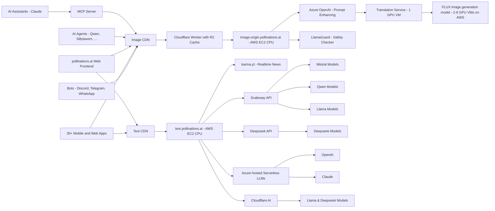

<div align="center">
  
  <h1><a href="https://pollinations.ai">Pollinations.AI</a></h1>
</div>


## 🆕 Latest News

- **🔐 Auth Dashboard** - New authentication dashboard is now live! Visit [auth.pollinations.ai](https://auth.pollinations.ai) to manage your API tokens and referrer domains for priority access. [Learn more](APIDOCS.md#authentication-).
- **🏆 User Tier System** - Apps automatically upgrade through seed/flower/nectar tiers based on usage and ad integration. Higher tiers unlock unlimited usage, SOTA models, and revenue sharing. [Learn more](APIDOCS.md#user-tier-system).
- **🔍 Special Bee** - Request flower tier upgrade for unlimited usage and SOTA models! Submit a [Special Bee Request](https://github.com/pollinations/pollinations/issues/new?template=special-bee-request.yml) or use [auth.pollinations.ai](https://auth.pollinations.ai). [More info](https://github.com/pollinations/pollinations/blob/master/APIDOCS.md#special-bee-)
- **📚 API Documentation** - Major API documentation improvements! We've completely revamped our API docs with better examples, clearer explanations, and interactive code snippets. [Check it out](https://github.com/pollinations/pollinations/blob/master/APIDOCS.md).
- **🤖 MCP Server** - New Model Context Protocol (MCP) server for AI assistants like Claude to generate images directly! [Learn more](./model-context-protocol/README.md).  
  [](./model-context-protocol/README.md)
- **💲 Support Us** - You can now support us with our new **Tip Us** button. Optionally connect your Discord account to **Ko-Fi** to get premium Discord roles!
- **🎵 Audio Generation** - New text-to-speech and speech-to-text capabilities are now available! Try the `openai-audio` model - see our [API documentation](APIDOCS.md#audio-generation-api) for details.
- **🤖 AI Code Assistant** - We're excited to announce MentatBot, the autonomous AI coding assistant that implements new features directly from GitHub issues! Simply [create an issue](https://github.com/pollinations/pollinations/issues/new) describing what you'd like to see, and MentatBot will analyze and implement it. [Learn more](https://mentat.ai/).
- **🖼️ GPT Image** - Introducing our new state-of-the-art text-to-image model, GPT Image, which generates high-resolution, contextually accurate visuals from any prompt. Learn more about OpenAI's latest image generation model [here](https://openai.com/index/introducing-4o-image-generation/).
---

[](https://pollinations.ai/p/3D_wireframe_blueprint_of_the_conceptual_isometric_world_of_Pollinations_AI_a_surreal_hyperrealistic_digital_garden_Elements_emerge_partially_from_all_sides?width=3000&height=1000&seed=-1)

## 🌟 Introduction

[Pollinations.AI](https://pollinations.ai) is an open-source gen AI startup based in Berlin, providing the most easy-to-use, free text and image generation API available. No signups or API keys required. We prioritize your privacy with zero data storage and completely anonymous usage.

## 🚀 Key Features

- 🔓 **100% Open Source**
- 🆓 **_Free to use_**
- 🔒 **Simplicity and privacy:** No logins, no keys, no data stored
- 🖼️ **Embed like any normal image or text**
- 🎵 **Audio generation:** Text-to-speech and speech-to-text capabilities
- 🌍 Free AI image and text generation APIs
- 🤝 Used by various **open-source LLMs**, **bots**, and **communities**
- 🎣 **_Easy-to-use React hooks_** ([React Hooks Examples](https://react-hooks.pollinations.ai/))
- 🤖 **Autonomous Development:** Features implemented by our MentatBot coding assistant through GitHub issues

<a href="https://star-history.com/#pollinations/pollinations&Date">
 <picture>
   <source media="(prefers-color-scheme: dark)" srcset="https://api.star-history.com/svg?repos=pollinations/pollinations&type=Date&theme=dark" width="600" />
   <source media="(prefers-color-scheme: light)" srcset="https://api.star-history.com/svg?repos=pollinations/pollinations&type=Date" width="600" />
   
 </picture>
</a>

## 🚀 Getting Started

### Featured Projects

| Project | Description | Creator | Links |
|---------|-------------|---------|-------|
| 🆕 KoboldAI | A browser-based front-end for AI-assisted writing with multiple local & remote AI models, including integration with Pollinations.AI for image generation | @lostruins | [Website](https://koboldai.net/), [GitHub](https://github.com/LostRuins/lite.koboldai.net) - ⭐ 3.7k |

### Image Generation

1. Visit [https://pollinations.ai](https://pollinations.ai)
2. Type your description in the text box
3. Click "Generate" and watch the magic happen!

### Text Generation

1. Visit [https://text.pollinations.ai](https://text.pollinations.ai)
2. Start chatting with the AI

### Audio Generation

1. Use the `openai-audio` model with our API ([explore voices at OpenAI.fm](https://www.openai.fm/))
2. Generate speech from text or transcribe audio to text

### MCP Server for AI Assistants

Our MCP (Model Context Protocol) server enables AI assistants like Claude to generate images and audio directly. [Learn more](./model-context-protocol/README.md)

```bash
# Run with npx (no installation required)
npx @pollinations/model-context-protocol
```

Community alternatives like [MCPollinations](https://github.com/pinkpixel-dev/MCPollinations) are also available.

AI assistants can:
- Generate images from text descriptions
- Create text-to-speech audio with various voice options
- Play audio responses through the system speakers
- Access all Pollinations.AI models and services
- List available models, voices, and capabilities

For more advanced usage, check out our [API documentation](APIDOCS.md).

## 🖥️ How to Use

### Web Interface

Our web interface is user-friendly and doesn't require any technical knowledge. Simply visit [https://pollinations.ai](https://pollinations.ai) and start creating!

### API

Use our API directly in your browser or applications:

    https://pollinations.ai/p/conceptual_isometric_world_of_pollinations_ai_surreal_hyperrealistic_digital_garden

Replace the description with your own, and you'll get a unique image based on your words!

## 🎨 Examples

### Image Generation

Here's an example of a generated image:

[](https://pollinations.ai/p/3d_wireframe_blueprint_for_the_prompt_conceptual%20isometric%20world%20of%20pollinations%20ai%20surreal%20hyperrealistic%20digital%20garden?width=2000&height=500&nologo=true&seed=-1)

Python code to download the generated image:

    import requests

    def download_image(prompt):
        url = f"https://pollinations.ai/p/{prompt}"
        response = requests.get(url)
        with open('generated_image.jpg', 'wb') as file:
            file.write(response.content)
        print('Image downloaded!')

    download_image("conceptual_isometric_world_of_pollinations_ai_surreal_hyperrealistic_digital_garden")

### Text Generation

To generate text, use this URL:

    https://text.pollinations.ai/What%20is%20artificial%20intelligence?

### Audio Generation

To generate audio from text, use this URL:

    https://text.pollinations.ai/Welcome%20to%20Pollinations?model=openai-audio&voice=nova

## 🛠️ Integration

### React Hooks

We offer React hooks for easy integration. Example usage:

    import React from 'react';
    import { usePollinationsImage, usePollinationsText } from '@pollinations/react';
    import ReactMarkdown from 'react-markdown';

    const AIGeneratedContent = () => {
      const imageUrl = usePollinationsImage("Beautiful landscape of Paris with Eiffel Tower", { width: 800, height: 600, seed: 42 });
      const markdown = usePollinationsText("Write a brief travel guide for Paris, including top attractions and local cuisine in markdown", { seed: 42 });

      return (
        <div>
          <h2>AI-Generated Travel Guide</h2>
          
          {markdown ? (
            <ReactMarkdown>{markdown}</ReactMarkdown>
          ) : (
            <p>Loading markdown content...</p>
          )}
        </div>
      );
    };

    export default AIGeneratedContent;

Check out our [Pollinations React Hooks](./pollinations-react/README.md) for more details.

## Architecture


## Projects Using Pollinations.AI

> **⭐ GitHub Star Counts:** Projects with GitHub repositories include star counts to help you gauge their popularity.
> 
> **🆕 NEW Tag:** Projects are marked with the 🆕 emoji when they are recently added. This tag is automatically removed after 15 days from the submission date or if no date is specified.
> 
<!-- AUTO-GENERATED-CONTENT:START -->

> **Note:** Some projects may be temporarily hidden from this list if they are currently broken or undergoing maintenance.

Pollinations.AI is used in various projects, including:

### Vibe Coding ✨

| Project | Description | Creator |
|---------|-------------|--------|
| [Qwen-Agent](https://github.com/QwenLM/Qwen-Agent) ([GitHub](https://github.com/QwenLM/Qwen-Agent) ⭐ 6.6k) | A framework for developing agentic LLM applications. | - |
| [Open Prompt](https://openprompt.co) ([GitHub](https://github.com/markojohnas/openprompt) ⭐ 0.1k) | A community-driven platform for creating, sharing, and discovering AI prompts for various applications. Integrated with Pollinations API for enhanced creative capabilities. | @markojohnas |
| [Pollinations MCP Server](https://github.com/pollinations/model-context-protocol) ([GitHub](https://github.com/pollinations/model-context-protocol) ⭐ 0.0k) | A Model Context Protocol server that enables AI-assisted development through natural language interaction with Pollinations' multimodal services. | @thomash |
| [Pollinations Task Master](https://github.com/LousyBook94/pollinations-task-master) ([GitHub](https://github.com/LousyBook94/pollinations-task-master) ⭐ 0.0k) | A task management system that uses AI to help break down and organize development tasks through natural language interaction. | @LousyBook94 |
| 🆕 [AI Code Generator](https://codegen.on.websim.com/) | A websim project that generates code from description, selected programming language and other options. Integrates Pollinations because it allows for more models to choose from for potentially better results. It has modes like: Code Generator, Code Explainer, Reviewer, etc. | @Miencraft2 |
| VibeCoder | A conversational coding environment that lets you create applications by describing them in natural language. | @Aashir__Shaikh |
| [JCode Website Builder](https://jcode-ai-website-bulder.netlify.app/) | A website generator using Pollinations text API. | @rtxpower |
| [Define](https://define-i05a.onrender.com/api/docs/) ([GitHub](https://github.com/hasanraiyan)) | An AI-powered REST API designed to generate definitions for words or phrases, constrained to a specified target word count. It allows customization of tone, context, and language, delivering precise, context-aware definitions programmatically—ideal for developers and content creators. | @hasanraiyan |
| [WebGeniusAI](https://webgeniusai.netlify.app/) | AI tool that generates HTML websites with visuals from Pollinations. | @Aashir__Shaikh |
| [Pollinations.DIY](https://pollinations.diy) | A browser-based coding environment based on bolt.diy, featuring integrated Pollinations AI services, visual code editing, and project management tools. | @thomash |
| [NetSim](https://netsim.us.to/) | websim.ai clone that's actually good | @kennet678 |
| [Pollin-Coder](https://pollin-coder.megavault.in) | A free AI-powered website builder that lets anyone create a clean site just by describing it. It uses Pollinations AI to generate the content and layout instantly. | @r3ap3redit |
| [JustBuildThings](https://justbuildthings.com) | A natural language programming interface that lets users create web applications by simply describing what they want to build, using Pollinations AI to generate code and assets. | @buildmaster |
| [Websim](https://websim.ai/c/bXsmNE96e3op5rtUS) | A web simulation tool that integrates Pollinations.ai. | @thomash |

### Creative 🎨

| Project | Description | Creator |
|---------|-------------|--------|
| [MoneyPrinterTurbo](https://github.com/harry0703/MoneyPrinterTurbo) ([GitHub](https://github.com/harry0703/MoneyPrinterTurbo) ⭐ 32.2k) | Simply provide a topic or keyword for a video, and it will automatically generate the video copy, video materials, video subtitles, and video background music before synthesizing a high-definition short video. Integrates Pollinations' text generation service to create engaging and relevant video scripts. | @harry0703 |
| [Anime Character Generator](https://animechar.gen.ai/create) ([GitHub](https://github.com/animeartdevs/character-generator) ⭐ 0.3k) | A dedicated AI tool for generating high-quality, unique anime-style characters. Offers detailed customization of art style, character traits, clothing, and accessories, all powered by Pollinations. | @AnimeArtDevs |
| [Jackey](https://jackey.ai/app) ([GitHub](https://github.com/creativesparks/jackey) ⭐ 0.1k) | Jackey is a creative AI companion that helps users generate story ideas, write scripts, and create concept art using Pollinations. It's designed for writers, game developers, and filmmakers. | Creative Sparks Ltd. |
| [Polynate](https://polynate.com) ([GitHub](https://github.com/polynate/platform) ⭐ 0.1k) | A platform for creating and sharing AI-generated art, music, and stories, with a strong community focus and Pollinations integration. | @polynate_team |
| [Memed](https://memed.io) ([GitHub](https://github.com/ksingh/memed) ⭐ 0.0k) | An AI-powered meme generator that creates humorous images based on user prompts using Pollinations API for image generation. | @k_singh |
| [Elixpo-Art](https://elixpo-art.com) ([GitHub](https://github.com/elixpo/art-platform) ⭐ 0.0k) | A digital art platform that combines AI image generation with traditional digital art tools, offering creative filters and style transfers powered by Pollinations. | @elixpo |
| [Elixpo Art](https://elixpoart.vercel.app) ([GitHub](https://github.com/Circuit-Overtime/elixpo_ai_chapter) ⭐ 0.0k) | A Web interface to create thematic images from prompts, with multiple aspect ratios and also image reference inputs. | Ayushman Bhattacharya |
| [POLLIPAPER](https://github.com/Tolerable/POLLIPAPER) | A dynamic wallpaper app that uses Pollinations AI. | @intolerant0ne |
| [Elixpo Art Chrome Extension](https://chromewebstore.google.com/detail/elixpo-art-select-text-an/hcjdeknbbbllfllddkbacfgehddpnhdh) ([GitHub](https://github.com/Circuit-Overtime/elixpo_ai_chapter/tree/main/Elixpo%20Chrome%20%20Extension) ⭐ 0.0k) | It uses the pollinations image endpoint to generate an image with `boltning` as the model in 4 types of aspect ratios and themes with prompt engineering thus transforming selected texts into art smoothly with a disposable GUI in web. | Ayushman Bhatacharya |
| [Pollinations Feed](https://pollinations-feed.vercel.app/) ([GitHub](https://github.com/yujincs/pollinations-feed) ⭐ 0.0k) | A social media inspired application for browsing, creating, and sharing AI-generated images using the Pollinations API. | @yujincs |
| [Pollinations.ai Image Generation (for Frame)](https://github.com/CitizenOneX/frame_pollinations) ([GitHub](https://github.com/CitizenOneX/frame_pollinations) ⭐ 0.0k) | A Flutter application that listens for image generation prompts, requests images from Pollinations.AI, and displays them on the Frame wearable device. Users can use voice commands to generate images and save/share them using the device's sharing mechanism. | CitizenOneX |
| [Imagen](https://altkriz.github.io/imagen/) ([GitHub](https://github.com/altkriz/imagen) ⭐ 0.0k) | A beautiful web interface for generating images using Pollinations.ai API with only the "flux" and "turbo" models. | @altkriz |
| [Imagen](https://altkriz.github.io/imagen/) ([GitHub](https://github.com/altkriz/imagen) ⭐ 0.0k) | A beautiful web interface for generating images using Pollinations.ai API with only the "flux" and "turbo" models. | @altkriz |
| 🇨🇳 [AI 文本转音频 🇨🇳](https://tts-gules-theta.vercel.app/) ([GitHub](https://github.com/Azad-sl/tts) ⭐ 0.0k) | 输入文本，选择语音风格，一键将文字转换为自然流畅的语音。 支持多种声音特征，帮您创建专业水准的音频内容。 (Input text, select voice style, and instantly convert text to natural, fluid speech. Supports various voice characteristics to help you create professional-quality audio content.) | [Link](https://github.com/Azad-sl) |
| [Dreamscape AI](https://dreamscape.pinkpixel.dev) ([GitHub](https://github.com/pinkpixel-dev/dreamscape-ai) ⭐ 0.0k) | Dreamscape AI is a creative studio for generating, enhancing, and transforming images, plus conversational AI capabilities with text and voice interfaces, and a deep research tool. The entire site is almost all powered by Pollinations API aside from the image enhancement tools. It generates images, optimizes prompts and creates image titles with the text API, features lots of image styling prompts, also has chat and voice chat with chat memory, and a research tool. | @sizzlebop |
| [MASala](https://github.com/Naman009/MASala) ([GitHub](https://github.com/Naman009/MASala) ⭐ 0.0k) | Multi-Agent AI That Cooks Up Recipes Just for You ~ From fridge to feast, MASALA plans it all. | @Naman009 |
| [Avatar GenStudio](https://astudio-dcae4.web.app) | A system for creating custom characters that uses the Pollinations API for totally free and unlimited image generation. | @nic-wq |
| [CalcuBite AI](https://calcubite.vercel.app/) | CalcuBite AI is a smart tool that analyzes food from images to provide calorie and nutrient details. Just take a photo, and it quickly gives you an estimate of your meal's nutritional value. It uses AI for accurate analysis, and if you run out of free scans, you can watch an ad to get more! | @sugamdeol |
| 🇮🇩 [Generator AI Image 🇮🇩](https://kenthir.my.id/advanced-generator/) | Advanced AI Image Generator adalah platform inovatif yang memungkinkan Anda membuat gambar digital menakjubkan dengan kecerdasan buatan by pollinations.ai. Dengan dukungan berbagai model AI canggih seperti DALL·E 3, Stable Diffusion, dan Flux-Default. (An innovative platform that allows you to create amazing digital images with artificial intelligence powered by pollinations.ai. Supports various advanced AI models like DALL-E 3, Stable Diffusion, and Flux-Default.) | @kenthirai |
| [BlackWave](https://blackwave.studio/) | An AI image generator that creates unique images from text prompts. Fast, easy and free! | @metimol |
| [NailsGen](https://www.nailsgen.com/) | Create beautiful nail art designs with AI. Generate unique nail art designs with different styles and colors. | lipengliang2012@163.com |
| [ImageGen AI Image](https://imagegenaiimage.com/) | Generate high-quality AI images for any purpose. Features a variety of models and styles. | [Link](https://www.linkedin.com/in/narendradwivedi) |
| 🇮🇩 [RuangRiung AI Image 🇮🇩](https://ruangriung.my.id) ([GitHub](https://github.com/ruangriung)) | RuangRiung AI Image Generator is ideal for digital artists, designers, or anyone who wants to explore creativity with AI assistance. Available in English and Indonesian, this website combines complete functionality with an elegant and responsive design. | @ruangriung |
| [PollinateAI](https://pollinateai.vercel.app) ([GitHub](https://github.com/Auspicious14/image-generator-fe.git) ⭐ 0) | PollinateAI is an image generation platform that aims to ease the stress of graphic and visual designers in delivering inspirations for their work. Regular consumers are also welcomed. | @Auspicious14 |
| [WebGeniusAI](https://webgeniusai.netlify.app/) | AI tool that generates HTML websites with visuals from Pollinations. | @logise |
| [FlowGPT](https://flowgpt.com/p/instant-image-generation-with-chatgpt-and-pollinationsai) | Generate images on-demand with ChatGPT! | - |
| [Snapgen.io](https://snapgen.io) | A free AI image generation website with a clean and professional interface, offering high-quality image generation without requiring API keys. | tharindu@tsoft-llc.com |
| [Image Gen - Uncensored Edition](https://huggingface.co/chat/assistant/66fccce0c0fafc94ab557ef2) | A powerful image generation assistant on HuggingChat. | @DeFactOfficial |
| [Pollinations AI Video Generator](https://pollinations-ai-video-generator.vercel.app/) | An open-source video generation system using AI. | @videogen |
| [Pollinations AI Image Generator](https://pollinations-ai-image-generator.vercel.app/) | An AI-powered image generation platform for Android designed to create stunning visuals from text prompts. Features dynamic image generation as users scroll, save to gallery, favorites, and a user-friendly interface. | @imagegen |
| [Foodie AI](https://foodie-ai.vercel.app/) | An AI application for food analysis that uses advanced artificial intelligence technology to help users understand food ingredients, nutritional value, and health impacts. Provides food safety analysis, nutritional health assessment, sports and fitness analysis, visual display, alternative recommendations, and practical insights for different dietary habits. | @Aashir__Shaikh |
| [AIMinistries](https://www.ai-ministries.com) | A collection of free AI tools including AI chat, writing tools, image generation, image analysis, text-to-speech, and speech-to-text. | @tolerantone |
| [Match-cut video ai](https://video-gen.megavault.in) ([GitHub](https://github.com/iotserver24/match-cut-ai) ⭐ 0) | This AI generates video from text in match-cut text style, uses pollinations llm to generate nearby text, and supports API integration. | @r3ap3redit |
| [The Promised Pen](https://promisedpen.app) | A free, feature-rich novel writing application that helps writers organize stories, characters, and worlds. Uses Pollinations AI for generating chapter summaries, rewriting text based on context, and generating new content based on previous chapters and character information. | @soryn.san |
| [Polynate](https://polynate.cloudwerx.dev/) ([GitHub](https://github.com/fisventurous/pollinationsai-enhancer) ⭐ 0) | AI-powered text and audio content generation platform providing a user-friendly interface for interacting with various AI generation services from Pollinations.ai. | @fisven |
| 🇨🇳 [Aiphoto智能绘画 🇨🇳](https://qiyimg.3d.tc/Aiphoto) | AI艺术工坊 - 智能绘画生成器。这是一个基于AI的绘画生成工具，可以根据用户输入的中文描述自动生成相应的图片。(An AI art workshop - intelligent painting generator. This is an AI-based painting generation tool that can automatically generate images based on Chinese descriptions input by users.) | @qiyimg |
| 🖥️ AI YouTube Shorts Generator | Python desktop app that automates YouTube Shorts creation with AI-generated scripts, voiceovers (via ElevenLabs), and visuals using Pollinations API. Designed for content creators, educators, and marketers to produce high-quality short videos quickly without manual editing. | @Sami-Alsahabany |
| [FoldaScan](https://fs.wen.bar) ([GitHub](https://github.com/0010skn/WebFS-Toolkit-Local-Folder-Scan-Monitor-Versioning-AI-Prep)) | Use Natural Language to "Converse" with Your Codebase, Folda-Scan Smart Project Q&A, powered by advanced vectorization technology, allows you to easily understand complex code, pinpoint information, and offers unprecedented convenience for AI collaboration. | @0010skn |
| 🤖 [Emojiall AI Drawing Platform](https://art.emojiall.com) | A platform focused on allowing users to draw pictures according to their own requirements with many preset styles and themes. Part of Emojiall, which has other text-based AI features like Emoji translation to text, Emoji recommender, and Emoji chatbot. | @James-Qi |
| 🆕 [ PixPal](https://pixpal.chat) | PixPal is a free AI assistant that can analyze, edit, and generate images, build websites from screenshots, create 3D games, and write full blog posts—all in one chat. Upload a photo, describe an idea, or request a UI clone and PixPal instantly delivers creative results. | @andreas_11 |
| 🆕 🇪🇸 [🇪🇸 Generador de presentaciones con imágenes y texto V2](https://proyectodescartes.org/IATools/Crea_presentaciones4/) | Una herramienta configurable que permite crear presentaciones con 3 a 20 diapositivas usando la API de Pollinations. Genera títulos, descripciones e imágenes para cada diapositiva, con posibilidad de regenerar imágenes y descargar en HTML. (A configurable tool that allows you to create presentations with 3 to 20 slides using the Pollinations API. Generates titles, descriptions and images for each slide, with the ability to regenerate images and download in HTML.) | @juanrivera126 |
| 🆕 [🇪🇸 Yo el director](https://yoeldirector.dpana.com.ve) | Web para crear peliculas y contenido para youtube, usando Pollinations (Web platform for creating movies and YouTube content using Pollinations) | @henryecamposs |
| [Imagemate AI](https://play.google.com/store/apps/details?id=com.madameweb.imgmate) | Imagemate AI is a powerful image generation app designed to turn your imagination into stunning visuals with the help of advanced artificial intelligence. Built using the Pollinations AI API, Imagemate AI allows users to input a text prompt and instantly receive AI-generated images that match the description. | @Shanto-Islam |
| [B&W SVG Generator](https://fluxsvggenerator.streamlit.app/) | Uses Flux (through pollinations) and potrace to create B&W Vector files | @pointsguy118 |
| [Anime AI Generation](https://anime-ai-generation.vercel.app/) | A web app specializing in anime-style image generation using Pollinations AI, with options for different anime art styles and character designs. | @FromOtherUniverse |
| [MIDIjourney](https://midijourney.ai) | An AI music generation tool that creates MIDI compositions from text prompts using Pollinations, suitable for musicians and producers. | @midi_maestro |
| [TurboReel](https://turboreel.app) | A fast AI video generation service for social media content, leveraging Pollinations to create short, impactful videos from simple descriptions. | @turbo_reels |
| [StoryWeaver](https://storyweaver.ai) | An AI-powered platform for collaborative storytelling, where users can co-create narratives with AI using Pollinations for text and image generation. | @weave_tales |
| [AI PPT Maker](https://ppt.monsterstudio.org/) | An AI-powered presentation generator that creates PowerPoint slides from text prompts using Pollinations. Features customizable templates, image suggestions, and content structuring to streamline presentation creation. | @ppt_monster |
| [Pollinations Gallery](https://pollinations-gallery.netlify.app/) | A dynamic gallery showcasing AI-generated art created with Pollinations. Users can browse, search, and filter images, and submit their own creations. Features community voting and artist profiles. | @gallery_ai |
| [Musify - AI Enhanced Music Streaming](https://musify-sd.vercel.app/) | Musify is your AI-powered music buddy, making your jam sessions smarter and more fun. Powered by pollinations API, it offers AI Music Assistant, Voice Commands, AI Playlist Creator, and Responsive Design. | @Sugamdeol |
| 🇧🇷 Case Me 🇧🇷 | A vending machine that creates customized phone cases with photos or other images and colors chosen by the end customer. | anaboxmania@gmail.com |
| 🇮🇩 [Generator Text AI 🇮🇩](https://app.ariftirtana.my.id/) ([GitHub](https://github.com/ayick13/app) ⭐ 0) | Text-to-image generator using Pollinations, supporting Indonesian and English prompts. | @ayick13 |
| 🤖 [Zelos AI image generator](https://websim.ai/@ISWEARIAMNOTADDICTEDTOPILLOW/ai-image-prompt-generator) | It uses Pollinations for both prompt enhancing and image generation, it was a easy to make project due to pollinations services being easy to use. | [Link](https://www.roblox.com/users/4361935306/profile) |
| [Pollinator Android App](https://github.com/g-aggarwal/Pollinator) | An open-source Android app for text-to-image generation. | @gaurav_87680 |
| 🤖 [Zelos AI image generator](https://websim.ai/@ISWEARIAMNOTADDICTEDTOPILLOW/ai-image-prompt-generator) | It uses Pollinations for both prompt enhancing and image generation, it was a easy to make project due to pollinations services being easy to use. | [Link](https://www.roblox.com/users/4361935306/profile) |
| [AI YouTube Shorts Generator](https://aishorts.vercel.app/) | A tool that uses Pollinations AI to generate engaging YouTube Shorts videos from text prompts, including visuals and voiceovers. | @shorts_creator |
| [Aiphoto智能绘画](https://aiphoto.jolav.me/) | A Chinese language AI image generation platform using Pollinations, tailored for creating artistic and culturally relevant visuals. | @jolav_cn |
| [Rangrez AI](https://rangrez.ai) | An AI image generation tool specializing in traditional Indian art styles, using Pollinations to create culturally rich visuals. | @rangrez_art |
| [StorySight](https://storysight.ai) | An AI tool that generates illustrations for stories and articles using Pollinations, helping writers visualize their narratives. | @story_viz |
| 🆕 [Generative AI Images Gallery](https://gen-ai-gallery.netlify.app/) | A curated gallery of AI-generated images created with Pollinations, showcasing diverse styles and themes from the community. | @gallery_curator |
| [IRINA by visuallink](https://irina.visuallink.ru/) | A website offering easy and free access to various neural networks, with multi-language support planned. Provides a platform for accessing various AI models, including Pollinations. | visuallink |
| [AI-Bloom](https://ai-bloom.com/) | A platform for generating and exploring AI-created floral art and patterns. Users can customize flower types, colors, and arrangements using Pollinations, and share their digital bouquets. | @bloom_artist |
| [Own-AI](https://own-ai.pages.dev/) | An AI text-to-image generator. | Sujal Goswami |
| [Pollinations.ai Model Comparison](https://endemicmedia.github.io/FLARE/llm-comparison-tool/) ([GitHub](https://github.com/EndemicMedia)) | An interactive tool designed to compare outputs from various large language models with customizable timeout settings and real-time testing capabilities. | [Link](https://github.com/dseeker) |
| 🇨🇳 [IMyself AI 🇨🇳](https://openai.lmyself.top/) | 我们提供高质量的AI生成服务，包括图像生成、文本生成、音频生成和语音转文本服务， 让您轻松创建各种创意内容。 (We provide high-quality AI generation services, including image generation, text generation, audio generation, and speech to text services, allowing you to easily create various creative content.) | Shadownc |

### Games 🎲

| Project | Description | Creator |
|---------|-------------|--------|
| 🆕 🤖 [🆕 🤖 Mindcraft](https://github.com/kolbytn/mindcraft) ([GitHub](https://github.com/kolbytn/mindcraft) ⭐ 3.5k) | Crafting minds for Minecraft with LLMs and Mineflayer! An AI agent framework for Minecraft using Large Language Models that creates intelligent bots capable of autonomous gameplay, building, and interaction. | @kolbytn |
| [Minecraft AI (Python)](https://github.com/pollinations/minecraft-ai-python) ([GitHub](https://github.com/pollinations/minecraft-ai-python) ⭐ 0.2k) | A Python implementation for controlling Minecraft characters with Pollinations AI, featuring advanced pathfinding and building capabilities. | @py_minecraft_dev |
| [Minecraft AI (Node.js)](https://github.com/pollinations/minecraft-ai-node) ([GitHub](https://github.com/pollinations/minecraft-ai-node) ⭐ 0.1k) | A Node.js implementation that uses Pollinations AI to control a Minecraft character through natural language commands. | @minecraft_ai_dev |
| [Sirius Cybernetics Elevator Challenge](https://github.com/sirius-cybernetics/elevator-challenge) ([GitHub](https://github.com/sirius-cybernetics/elevator-challenge) ⭐ 0.0k) | A programming challenge that uses Pollinations AI to simulate personality-driven elevator systems in a virtual building environment. | @sirius_dev |
| 🆕 [DreamHer](https://dreamher.vercel.app/) ([GitHub](https://github.com/creation22/DreamGirl) ⭐ 0.0k) | Interactive web app that transforms your imagination of a 'dream girl' into a visual representation through just 10 simple questions using Pollinations AI. Features AI-powered visualization, dynamic processing, and an engaging, magical user experience. | @_Creation22 |
| RoastMaster AI | No detailed description available, but likely a creative/entertainment tool (AI roast generator). | - |
| [Pollinations AI Game](https://pollinations-ai-game.vercel.app/) | A Hitchhiker's Guide to the Galaxy themed LLM-based elevator game. | @game |
| [Favorite Puzzles](https://radbrothers.com/games/favorite-puzzles/) | A jigsaw puzzles game for Android, iOS, and web that uses Pollinations feed as one of the sources of images for puzzles. Features puzzle generation using neural networks, customizable difficulty levels from 6 to 1200 pieces, multiple game modes, and the ability to create puzzles from your own images. | contact@radbrothers.com |
| [Mindcraft](https://mindcraft-ai.vercel.app/) | A web-based Minecraft-inspired game where players can use natural language to build and interact with a voxel world using Pollinations AI. | @mindcraft_team |
| [Juego de Memorizar con Pollinations](https://memorizar-pollinations.vercel.app/) | A memory game that uses Pollinations AI to generate unique image pairs for matching, with difficulty levels and educational themes. | @edudev_es |
| [Favorite Puzzles](https://favorite-puzzles.netlify.app/) | A collection of AI-generated puzzles including jigsaws, crosswords, and logic games, all created using Pollinations APIs. | @puzzle_master |
| [Abyss Ascending](https://abyss-ascending.vercel.app/) | A text-based adventure game with procedurally generated dungeons and storylines powered by Pollinations AI. | @abyss_game_studio |
| [AI Character RP (Roblox)](https://www.roblox.com/games/ai-character-rp) | A Roblox game that lets players interact with AI characters powered by Pollinations, featuring dynamic conversations and quests. | @roblox_ai_dev |
| [Watch TV with Neko (Roblox)](https://www.roblox.com/games/watch-tv-with-neko) | A Roblox experience where players can watch AI-generated TV shows with a virtual cat companion, using Pollinations for content generation. | @neko_tv_dev |
| [Deep Saga](https://deepsaga.io) | An immersive role-playing game with AI-generated worlds, characters, and quests that adapt to player choices using Pollinations AI. | @saga_studios |
| [Infinite World – AI Game](https://infinite-world-game.vercel.app/) | An exploration game with procedurally generated environments and creatures created by Pollinations AI based on player input. | @infinite_world_dev |
| [roastmyselfie.app](https://roastmyselfie.app) | AI Personality Analyzer - Get roasted and psychoanalyzed.. just from one selfie! Dare to try? | @andres_11 |
| [Watch TV with neko (Roblox)](https://www.roblox.com/games/15087497266/UPD-Watch-TV-with-neko-AI) | Roblox game where you can talk with AI catgirls 🐾 or just have fun, talking with other players in cozy rooms ⭐️ | [Link](https://www.roblox.com/users/3857849039/profile/) |
| [Infinite Tales](https://infinitetales.ai) | Interactive storytelling platform powered by AI that creates endless narrative adventures. | @infinite_tales |

### Hack-&-Build 🛠️

| Project | Description | Creator |
|---------|-------------|--------|
| [tgpt](https://github.com/aandrew-me/tgpt) ([GitHub](https://github.com/aandrew-me/tgpt) ⭐ 2.5k) | ChatGPT in terminal without requiring API keys. Uses Pollinations API endpoints to provide a free AI experience through the command line. | @aandrew-me |
| [GPT_Project](https://real-gpt-project.dev) ([GitHub](https://github.com/aifuturelabs/gpt-project) ⭐ 0.1k) | A cutting-edge platform leveraging GPT models via Pollinations for advanced text analysis, content generation, and interactive chat solutions. Showcases multiple proof-of-concept applications. | AI Future Labs |
| 🆕 [🛠️ AI Content Describer](https://github.com/cartertemm/AI-content-describer/) ([GitHub](https://github.com/cartertemm/AI-content-describer/) ⭐ 0.1k) | An extension for NVDA, the free and open-source screen reader for Microsoft Windows. Uses multimodal generative AI to help those with blindness and visual impairments understand pictures, UI controls, complex diagrams/graphics, and more through intelligent descriptions that go far beyond simple alt-text. | @cartertemm |
| [MVKProject Nexus API](https://nexus-api.mvkproject.dev/) ([GitHub](https://github.com/mvkproject/nexus-api) ⭐ 0.0k) | An API gateway that provides simplified access to multiple AI services including Pollinations, offering standardized endpoints and request formats for developers. | @mvk |
| [Server Status Dashboards](https://server-status-dashboards.netlify.app/) ([GitHub](https://github.com/devopper/server-status-dashboards) ⭐ 0.0k) | A monitoring tool for tracking and visualizing server performance metrics, using Pollinations API for natural language interpretation of technical data. | @devopper |
| [urSapere AI](https://ursapere.ai) ([GitHub](https://github.com/ursapere/ursapere-ai) ⭐ 0.0k) | An AI-powered research tool that helps users explore and understand complex topics by leveraging Pollinations for advanced data analysis and summarization. | @ursapere_devs |
| [WordPress AI Vision Block](https://wordpress.org/plugins/ai-vision-block/) ([GitHub](https://github.com/mahmood-asadi/ai-vision-block) ⭐ 0.0k) | A custom WordPress Gutenberg block that allows you to generate images using the Pollinations API. Simply enter a prompt, and the AI will generate an image for you. Once the post is saved, the image is automatically stored in the WordPress Media Library. | mahmood-asadi |
| DominiSigns ([GitHub](https://github.com/cmunozdev/DominiSigns) ⭐ 0.0k) | Avatar Translator for Dominican Sign Language that uses artificial intelligence to translate text and audio into Dominican sign language (LSRD), creating a communication bridge for approximately 100,000 deaf people in the Dominican Republic. | @cmunozdev |
| 🆕 [💻️ Windows Walker](https://github.com/SuperShivam5000/windows-walker) ([GitHub](https://github.com/SuperShivam5000/windows-walker) ⭐ 0.0k) | Windows Walker – What Copilot for Windows should have been. AI-powered Windows assistant that translates voice/text commands into real system actions using PowerShell. Powered by ChatGPT + PowerShell in an Electron UI. | @supershivam |
| [🌱 Strain Navigator](https://www.strainnavigator.com/) ([GitHub](https://github.com/Tolerable/strainnavigator) ⭐ 0.0k) | A collection of tools to help Growers, Breeders & Seed Bankers. Free & Open Source powered by Pollinations.ai. | @Tolerable |
| [CoNavic](https://github.com/mkantwala/CoNavic/) ([GitHub](https://github.com/mkantwala/CoNavic/) ⭐ 0.0k) | A free, open-source browser extension that brings the power of ChatGPT and browser automation directly to your fingertips. Instantly access AI assistance, manage tabs, and organize bookmarks using natural language all securely within your browser. | @mkantwala |
| [FoodAnaly](https://foodanaly.vercel.app/) | An AI application for food analysis that uses advanced artificial intelligence technology to help users understand food ingredients, nutritional value, and health impacts. Provides food safety analysis, nutritional health assessment, sports and fitness analysis, visual display, alternative recommendations, and practical insights for different dietary habits. | liukang0120@163.com |
| [Mimir AIP](https://mimir-aip.github.io/) | An AI integration platform for developers. | @pipeline |
| [Herramientas IA](https://herramientas.ia) | Tools designed with Pollinations.AI and the DescartesJS editor, including tools from other Pollinations.AI community members. | @herramientas |
| [Pollinations AI Free API](https://pollinations-ai-free-api.vercel.app/) | This project provides a free API interface supporting various text and image generation models, including OpenAI's GPT-4, Gemini 2.0, etc. Users can access these models without an API key to perform text generation, image generation, translation, text polishing, and more. | @freeapi |
| [Pollinations.AI Enhancer](https://github.com/fisventurous/pollinationsai-enhancer) ([GitHub](https://github.com/fisventurous/pollinationsai-enhancer) ⭐ 0) | A frontend-based AI interface designed to deliver a smooth, multimodal, and visually engaging user experience with conversational AI, image generation, and more. | @fisven |
| 🆕 [DominiSigns](https://github.com/dominicva/dominisigns) ([GitHub](https://github.com/dominicva/dominisigns)) | A WordPress block plugin that lets users create AI-generated images through the block editor. Integrates with Pollinations API to generate images from text prompts directly within WordPress. | @dominicva |
| [Pollinations MCP Server](https://github.com/pollinations/model-context-protocol) ([GitHub](https://github.com/pollinations/model-context-protocol) ⭐ 0.0k) | A Model Context Protocol server that enables AI-assisted development through natural language interaction with Pollinations' multimodal services. | @thomash |
| [MCPollinations](https://github.com/pinkpixel-dev/MCPollinations) | A Model Context Protocol (MCP) server that enables AI assistants to generate images, text, and audio through the Pollinations APIs. Supports customizable parameters, image saving, and multiple model options. | Pink Pixel |
| [pollinations_ai](https://pub.dev/packages/pollinations_ai) | Dart/Flutter package for Pollinations API. | @Meenapintu |
| [Smpldev](https://smpldev.ftp.sh/) | Create, deploy, and scale full-stack web and mobile applications in minutes. | @kennet678 |
| pollinations NPM Module | JavaScript/Node.js SDK for Pollinations API. | - |
| [pypollinations](https://pypi.org/project/pypollinations/) | Comprehensive Python wrapper for Pollinations AI API. | @KTS-o7 |
| [@pollinations/react](https://www.npmjs.com/package/@pollinations/react) | React hooks for easy integration of Pollinations' features. | @pollinations |
| Polli API Dashboard | Dashboard for managing/interacting with Pollinations API. | - |
| [pollinations.ai Python SDK](https://github.com/pollinations-ai/pollinations.ai) | Official Python SDK for working with Pollinations' models. | @pollinations-ai |
| [Herramientas IA](https://proyectodescartes.org/descartescms/herramientas-ia) | Tools designed with Pollinations.AI and the DescartesJS editor, including tools from other Pollinations.AI community members. | @juanrivera126 |
| 🇨🇳 [imggen.top 🇨🇳](https://www.imggen.top/) | Create stunning AI-generated images in seconds with our free AI image generator. No login required, unlimited generations, powered by FLUX model. | lipengliang2012@163.com |
| 🇨🇳 [Quicker Pollinations AI](https://getquicker.net/Sharedaction?code=9ac738ed-a4b2-4ded-933c-08dd5f710a8b&fromMyShare=true) | This project provides a free API interface supporting various text and image generation models, including OpenAI's GPT-4, Gemini 2.0, etc. Users can access these models without an API key to perform text generation, image generation, translation, text polishing, and more. | [Link](https://linux.do/u/s_s/summary) |

### Chat 💬

| Project | Description | Creator |
|---------|-------------|--------|
| [KoboldAI Lite](https://koboldai.net) ([GitHub](https://github.com/LostRuins/lite.koboldai.net) ⭐ 3.7k) | A lightweight AI framework for text generation and chat. | @lostruins |
| [gpt4free](https://github.com/xtekky/gpt4free) ([GitHub](https://github.com/xtekky/gpt4free) ⭐ 64.1k) | The official gpt4free repository - various collection of powerful language models. | xtekky |
| [LobeChat](https://chat-lobe.com) ([GitHub](https://github.com/lobehub/lobe-chat) ⭐ 21.0k) | An open-source, extensible chat UI framework supporting multiple models and features like message citing and image creation. | @lobehub |
| [SillyTavern](https://docs.sillytavern.app/) ([GitHub](https://github.com/SillyTavern/SillyTavern) ⭐ 14.7k) | An LLM frontend for power users. Pollinations permits it to generate text and images. | - |
| [LobeChat](https://github.com/lobehub/lobe-chat) ([GitHub](https://github.com/lobehub/lobe-chat) ⭐ 12.0k) | An open-source, modern-design ChatGPT/LLMs UI/Framework with speech-synthesis, multi-modal, and extensible plugin system. | @arvinxx |
| 🤖 [AdvanceChatGptBot](https://adv-chatgpt.example.com) ([GitHub](https://github.com/chatbotmasters/adv-chatgpt) ⭐ 0.2k) | An advanced chatbot leveraging multiple GPT models via Pollinations for sophisticated dialogue management, context retention, and multimodal interactions. Includes features like personality selection and knowledge base integration. | ChatBotMasters |
| 🇨🇳 [FreeAI 🇨🇳](https://freeai.aihub.ren/) ([GitHub](https://github.com/Azad-sl/FreeAI) ⭐ 0.0k) | An AI application platform based on Pollinations.AI API, providing free and unlimited AI chat assistant, image generation, and voice synthesis services. | @Azad-sl |
| [Irina](https://irina.visuallink.io/) ([GitHub](https://github.com/visuallinkio/irina) ⭐ 0.0k) | An intelligent conversational assistant that combines Pollinations' text and image generation capabilities to create rich, multimedia responses to user queries. | @visuallink |
| [DynaSpark AI](https://dynaspark.onrender.com) ([GitHub](https://github.com/Th3-C0der) ⭐ 0.0k) | A versatile AI assistant with advanced image and text generation capabilities. | Th3-C0der |
| [toai.chat](https://toai.chat/) ([GitHub](https://github.com/arjunb023/chatbot) ⭐ 0.0k) | A personalized, multimodal AI chat assistant that leverages Pollinations APIs to converse with models like Claude, provide image generation, and answer questions about various topics. | @arjunbazinga |
| 🆕 [LLM7.io](https://llm7.io) ([GitHub](https://github.com/chigwell/llm7.io) ⭐ 0.0k) | A free and open AI platform providing advanced multimodal capabilities, including large language model access and experimental search tools. Integrates Pollinations text generation as a backend service with transparent credit on the website and repository. | @chigwell |
| 🤖 🇮🇩 [Rizqi O Chatbot 🇮🇩](https://chatbot.rizqioliveira.my.id) ([GitHub](https://github.com/ray23-bit/Projectenam) ⭐ 0.0k) | Rizqi O Chatbot adalah proyek berbasis Pollinations yang menggabungkan tiga fitur utama: chatbot AI, generator gambar AI, dan generator audio AI. Pengguna dapat berinteraksi dalam bentuk teks, menghasilkan gambar dengan berbagai gaya seni dan efek visual, serta membuat audio secara otomatis dari teks. (An AI chatbot, image generator, and audio generator project with support for custom aspect ratios, over 200 art styles & visual effects, and automatic translation from Indonesian to English.) | @ray23-bit |
| 🆕 [🎤 Comeback AI](https://comeback-ai.pinkpixel.dev) ([GitHub](https://github.com/pinkpixel-dev/comeback-ai) ⭐ 0.0k) | AI-powered clapback machine that transforms mean comments into witty comebacks with 10 unique personas, uses Pollinations openai-audio for voice synthesis, and Whisper for speech-to-text transcription. Turn trolls into comedy gold! | @sizzlebop |
| [Unity AI Lab](https://blog.unityailab.com/unity.html) | A specialized uncensored LLM model built on Mistral Large, focused on unrestricted conversations. | - |
| [Neurix 🇷🇺](https://neurix.ru) | A website offering easy and free access to various neural networks, with multi-language support planned. Provides a platform for accessing various AI models, including Pollinations. | @Igroshka |
| 🆕 Echo AI | A chat interface for AI interactions and conversations. | Unknown |
| [DreamBig - Generative AI Playground](https://dreambiglabs.vercel.app/) | Interactive AI playground with chat, image generation, and voice responses for creative exploration. | @opzzxsprinta._999 |
| [Pal Chat](https://apps.apple.com/us/app/pal-chat-ai-chat-client/id6447545085?platform=iphone) | An iOS app that integrates with all LLMs including Pollinations AI models in one unified simple interface. | [Link](https://x.com/pallavmac) |
| 🤖 [Pollinations AI Chatbot](https://pollinations-ai-chatbot.vercel.app/) | A chat bot integrating Pollinations API for text and image generation. | @chatbot |
| [Pollinations AI Playground](https://pollinations-ai-playground.vercel.app/) | An AI application platform based on Pollinations.AI API, providing free and unlimited AI chat assistant, image generation, and voice synthesis services. | @playground |
| 🤖 [Snarky Bot](https://snarkybot.vercel.app/) | A snarky bot based on Llama that is 100% free, powered by the Pollinations text API and OpenWebUI. Other models are available as well. | @snarkybot |
| [OkeyMeta](https://okeymeta.com) | An LLM created by Africans to understand and have cultural awareness of African contexts and languages, OkeyAI outperforms many LLM models based on size and intelligence, OkeyMeta uses pollination image generating API to train it's LLM (OkeyAI) on images in real time. | @okeymeta |
| 🤖 [Pollinations Chatbot](https://pollinations-chatbot.vercel.app/) | A chat bot integrating Pollinations API for text and image generation. | @Aashir__Shaikh |
| 🇨🇳 [Pollinations.AI 中文](https://pollinations.vercel.app) | 我们提供高质量的AI生成服务，包括图像生成、文本生成、音频生成和语音转文本服务， 让您轻松创建各种创意内容。 (We provide high-quality AI generation services, including image generation, text generation, audio generation, and speech to text services, allowing you to easily create various creative content.) | @pollinations |
| [Anisurge](https://anisurge.me) | A free anime streaming app with a public chat feature that allows users to chat with AI characters powered by Pollinations AI. | @iotserver24 |
| 🖥️ [AI Chat](https://aichat.narendradwivedi.org) | A Windows desktop application that brings multiple AI models together in one simple, intuitive interface. Features saving/loading conversations, image generation, image explanation from URLs, and voice responses with different voices. | @narendradwivedi |
| [Irina](https://irina-2--trivonca.on.websim.ai/) | Lightweight and simple online chat interface powered by pollinations | @thatalgp |
| 🤖 [Free AI Chatbot & Image Generator](https://free-ai-chatbot-image-generator.vercel.app/) | A web application offering both conversation with AI and image generation capabilities, utilizing Pollinations API for creating visuals based on text prompts. | @aidevs |
| 🤖 [PixPax](https://pixpal.chat) | A user-friendly chatbot that lets you analyze images, remix existing images or create new images, all through simple chat. | @andreas_11 |
| 🤖 [🤖 DesmondBot](https://swedish-innocent-teeth-majority.trycloudflare.com) | A snarky bot based on Llama that is 100% free, powered by the Pollinations text API and OpenWebUI. Other models are available as well. | @mcgdj |
| 🤖 [Mirexa AI Chat](https://mirexa.vercel.app) | A state-of-the-art AI chatbot that seamlessly integrates multiple LLMs with advanced multimodal capabilities. Features comprehensive text generation, sophisticated image creation and image-to-image transformation, audio generation, mathematical problem solving, and real-time web search functionality. | @withthatway |
| [AI Chat](https://aichat.jolav.me/) | A simple and elegant chat interface for interacting with various AI models through Pollinations, focusing on ease of use and quick responses. | @jolav |
| [KoboldAI Lite](https://koboldai-lite.vercel.app/) | A lightweight version of KoboldAI that uses Pollinations for text generation, offering a streamlined experience for creative writing and storytelling. | @kobold_dev |
| 🤖 Jenny AI | AI chatbot and character creation platform with tts and sst it also has image generation and vision ability which are powered by pollinations. | [Link](https://www.linkedin.com/in/pritam-roy-95185328a) |
| [Goalani](https://goalani.com) | Voice-enabled AI fitness coach. Using only your voice, you can communicate with the agent to manage your fitness and nutrition. Features weight tracking, exercise logging, food tracking with AI-generated images, and agent customization. | goalani.app@gmail.com |
| [Pollinations Chat](https://websim.ai/@AdrianoDev1/pollinations-ai-assistant/4) | Pollinations' integrated AI for text and images, totally free and unlimited. | @adrianoprogramer |
| [LiteAI](https://liteai.chat/) | A free, fast, and anonymous AI chat and image generation platform with no login required. Features include various AI models, prompt library, upscaling, and community sharing. | LiteAI Team |
| 🤖 [UR Imagine & Chat AI](https://urimagine.netlify.app/) | A versatile AI platform offering both image generation and chat functionalities. Users can create visuals from text prompts and engage in conversations with AI models, all powered by Pollinations. | @ur_imagine |
| [PrivatePollenAI](https://mmojocoder.github.io/PrivatePollenAI/chat.html) ([GitHub](https://github.com/MMojoCoder/PrivatePollenAI)) | A privacy-focused chat assistant app that securely stores data locally, integrates with PollinationAI for text and image generation, features a minimalistic UI, and allows users to choose models and write their own system instructions. | [Link](https://github.com/MMojoCoder) |

### Social Bots 🤖

| Project | Description | Creator |
|---------|-------------|--------|
| 🤖 [AlphaLLM - AI Discord Bot](https://alphallm.ai/discord) ([GitHub](https://github.com/alphallm/discord-bot) ⭐ 0.2k) | A feature-rich Discord bot that combines multiple AI models from Pollinations to provide text generation, image creation, and voice synthesis. | @alphallm_team |
| 🤖 [Pollinations Discord Bot](https://github.com/pollinations/discord-bot) ([GitHub](https://github.com/pollinations/discord-bot) ⭐ 0.2k) | Official Discord bot for Pollinations.ai that allows server members to generate images, text, and audio directly within Discord channels. | @pollinations |
| 🤖 [OpenHive](https://openhive.network) ([GitHub](https://github.com/openhive/network) ⭐ 0.1k) | A decentralized platform for AI bots powered by Pollinations that can be deployed across multiple social media platforms simultaneously. | @openhive_network |
| 🤖 [Titan-GPT](https://titan-gpt.vercel.app) ([GitHub](https://github.com/titan-dev/titan-gpt) ⭐ 0.1k) | A Discord bot that combines text and image generation capabilities from Pollinations to create rich, interactive experiences for server members. | @titan_dev |
| 🤖 [PolliBot](https://pollibot.example.com) ([GitHub](https://github.com/botbuilders/pollibot-telegram) ⭐ 0.1k) | A versatile Telegram bot integrated with Pollinations. Offers image generation, text summarization, and quick answers directly within Telegram chats. Supports multiple languages. | BotBuilders Inc. |
| 🤖 [Raftar.xyz](https://raftar.xyz/app) ([GitHub](https://github.com/raftarxyz/raftar-bot) ⭐ 0.0k) | Raftar.xyz is an innovative social bot platform that uses Pollinations AI to create engaging and interactive experiences on Discord and Twitter, focusing on community building and automated content curation. | @raftar_official |
| 🤖 [🎮 Gacha](https://discord.com/oauth2/authorize?client_id=1377330983740903586) | Your Sassy All-in-One AI Discord Bot. A powerful, sassy, and slightly mischievous AI bot designed to level up your Discord server with intelligent conversations, creative tools, and smart automation — all wrapped in a playful personality. Features AI-powered chat with STM and LTM, image generation & editing, image fusion & GIF handling, real-time web search, voice replies, media intelligence, slash commands, and dynamic intent detection. | `_dr_misterio_` |
| 🤖 Aura Chat Bot | A chat bot integrating Pollinations API for text and image generation. | @Py-Phoenix-PJS |
| 🆕 🤖 [🤖 ImageEditer](https://t.me/ImageEditer_bot) | AI Art Studio - A feature-rich Telegram bot that creates art from text prompts, remixes images, merges multiple artworks, and offers one-tap regeneration with real-time control. Supports multiple AI models (GPT Image, Flux, Turbo) with NSFW detection and smart layout features. | @_dr_misterio_ |
| 🤖 [One Word](https://oneword.pollinations.ai) | A Discord bot that generates images from single-word prompts, designed for simplicity and quick creative inspiration. | @oneword_team |
| 🤖 [Pollinations Telegram Assistant](https://t.me/pollinations_assistant_bot) | An advanced Telegram bot that provides access to Pollinations AI services through a conversational interface with support for multiple languages. | @pollen_labs |
| 🤖 [Pollinations WhatsApp Group](https://chat.whatsapp.com/pollinations-ai) | A WhatsApp group bot that allows members to generate AI content through simple commands, making Pollinations accessible on mobile messaging. | @whatsapp_ai_dev |
| 🤖 [pollinations-tg-bot 🇨🇳](https://t.me/pollinations_cn_bot) | Chinese language Telegram bot for Pollinations AI with specialized prompts for Eastern art styles and cultural references. | @cn_ai_dev |
| 🤖 [Quick AI & Jolbak](https://quickai.jolbak.com) | A multi-platform bot suite that integrates with Discord, Slack, and Microsoft Teams to provide Pollinations AI services in professional environments. | @jolbak_dev |
| 🆕 [AI Image Generator [ROBLOX]](https://www.roblox.com/games/ai-image-generator) | A Roblox experience that allows players to generate images using Pollinations AI directly within the game environment. | @roblox_ai_studio |
| 🤖 [SingodiyaTech bot](https://t.me/singodiyatech_bot) | A Telegram bot focused on technical illustrations and diagrams generated by Pollinations AI, aimed at developers and engineers. | @singodiya_tech |
| 🤖 [PolliBot](https://t.me/pollinations_bot) | Telegram bot that generates images, text, and audio using Pollinations APIs. | @pollibot_dev |
| 🤖 [Anyai](https://discord.gg/anyai) | A Discord bot and community for AI-driven content. | @meow_18838 |

### Learn 📚

| Project | Description | Creator |
|---------|-------------|--------|
| StoryMagic: Interactive Kids Stories | Interactive and educational tool for generating kids' stories. | - |
| [Riffle](https://riffle.ink) | A powerful tool designed to make reading English books more enjoyable and effective while helping you build your vocabulary naturally. Using Pollinations AI to create content that incorporates your own vocabulary words allows you to learn them in a vivid, engaging context. | gsx123@gmail.com |
| [OkeyAI](https://chat.okeymeta.com.ng) ([GitHub](https://github.com/okeymeta)) | An LLM created by Africans to understand and have cultural awareness of African contexts and languages, OkeyAI outperforms many LLM models based on size and intelligence, OkeyMeta uses pollination image generating API to train it's LLM (OkeyAI) on images in real time. | @okeymeta |
| [Apple Shortcuts Guide](https://www.youtube.com/watch?v=5NR5h7DTtEI) | Video guide on creating AI images using Apple Shortcuts. | @tolerantone |
| [Connect Pollinations with Open Web UI tutorial](https://github.com/pollinations/connect-with-open-webui) | Step-by-step guide on integrating Pollinations APIs with Open Web UI for enhanced image generation. | @pollinations |
| 🆕 [Whizzy AI](https://whizzyai.vercel.app) | An educational AI platform for students featuring AI-powered study assistance, chat functionality, and image generation capabilities using Pollinations AI. Designed to help students with studies they find challenging. | @vaibhavcoding69 |
| [AI儿童故事 🇨🇳](https://kidss.netlify.app/) | 基于此项目 构建有趣的孩子故事书应用演示 (Based on this project, build an interesting children's storybook application demo) | MZ |
| [Pollinations.AI AI/Teens talk](https://www.youtube.com/live/5Rvdfr2qYGA?si=i5NLOKI49fGxNAEK&t=1034) | Session 2: ai/teens worldwide conference exploring the forces shaping AI today, diving into governance, virtual connections, and decision-making with voices from multiple European cities. | @thomash_pollinations |
| 🆕 [TeekGenAI](https://www.youtube.com/@teekgenai) | A platform providing free access to AI tools like image generation, text-to-speech, and chat, with tutorials. Content often available in Sinhala. | @teekgenai |
| [MalaysiaPrompt 🇲🇾](https://malaysiaprompt.rf.gd/) | A resource for discovering and sharing creative prompts, supporting the Malaysian creative and educational AI community. | - |
| 🇨🇳 [Chinese DeepSeek Tutorial](https://linux.do/t/topic/447840/235) | A tutorial showing how to make DeepSeek AI support image generation by leveraging Pollinations.ai's API. | [Link](https://linux.do/u/isinry) |
| [Artistic Styles Book](https://proyectodescartes.org/iCartesiLibri/materiales_didacticos/Libro_Estilos/index.html) | An interactive book showcasing 90+ artistic styles. | Juan Gmo. Rivera |
| 🇧🇷 [Tutorial](https://guiadehospedagem.com.br/pollinations-ai/) | An in-depth Portuguese tutorial on using Pollinations AI. | Janderson de Sales |
| [Podcast #1500](https://open.spotify.com/show/1wu4ngb1dclyTwoNN4cZzK) | Podcast project powered by pollinations, featuring dialogues among LLMs. First episode features 3o-mini and DeepSeek R1 70B talking about Vibe Coding. | @brain.diver |
| [Proyecto Descartes](https://proyectodescartes.org/revista/Numeros/Revista_8_2024/index.html) | Educational initiative integrating Pollinations AI into STEM. | Juan Gmo. Rivera |


<!-- AUTO-GENERATED-CONTENT:END -->

Have you created a project using Pollinations.AI? [Submit it through our project submission form](https://github.com/pollinations/pollinations/issues/new?template=project-submission.yml) to get it listed here! We use a structured GitHub issue template to make the submission process easy and organized.

## 🔮 Future Developments

We're constantly exploring new ways to push the boundaries of AI-driven content creation. Some areas we're excited about include:

- Digital Twins: Creating interactive AI-driven avatars
- Music Video Generation: Combining AI-generated visuals with music for unique video experiences
- Real-time AI-driven Visual Experiences: Projects like our Dreamachine, which create immersive, personalized visual journeys

## 🌍 Our Vision

Pollinations.AI envisions a future where AI technology is:

- **Open & Accessible**: We believe AI should be available to everyone, not locked behind paywalls or restricted access

- **Transparent & Ethical**: Our open-source approach ensures transparency in how our models work and behave

- **Community-Driven**: We're building a platform where developers, creators, and AI enthusiasts can collaborate and innovate

- **Interconnected**: We're creating an ecosystem where AI services can seamlessly work together, fostering innovation through composability

- **Evolving**: We embrace the rapid evolution of AI technology while maintaining our commitment to openness and accessibility

We're committed to developing AI technology that serves humanity while respecting ethical boundaries and promoting responsible innovation. Join us in shaping the future of AI.

## 🤝 Community and Development

We believe in community-driven development. You can contribute to Pollinations.AI in several ways:

1. **Coding Assistant**: The easiest way to contribute! Just [create a GitHub issue](https://github.com/pollinations/pollinations/issues/new) describing the feature you'd like to see implemented. The [MentatBot AI assistant](https://mentat.ai/) will analyze and implement it directly! No coding required - just describe what you want.

2. **Project Submissions**: Have you built something with Pollinations.AI? [Use our project submission template](https://github.com/pollinations/pollinations/issues/new?template=project-submission.yml) to share it with the community and get it featured in our README.

3. **Feature Requests & Bug Reports**: Have an idea or found a bug? [Open an issue](https://github.com/pollinations/pollinations/issues/new) and let us know. Our team and the MentatBot assistant will review it.

4. **Community Engagement**: Join our vibrant [Discord community](https://discord.gg/k9F7SyTgqn) to:
   - Share your creations
   - Get support and help others
   - Collaborate with fellow AI enthusiasts
   - Discuss feature ideas before creating issues

For any questions or support, please visit our [Discord channel](https://discord.gg/k9F7SyTgqn) or create an issue on our [GitHub repository](https://github.com/pollinations/pollinations).

## 🗂️ Project Structure

Our codebase is organized into several key folders, each serving a specific purpose in the Pollinations.AI ecosystem:

- [`pollinations.ai/`](./app/): The main React application for the Pollinations.ai website.

- [`image.pollinations.ai/`](./image.pollinations.ai/): Backend service for image generation and caching with Cloudflare Workers and R2 storage.

- [`pollinations-react/`](./pollinations-react/): React component library for Pollinations.ai.

- [`text.pollinations.ai/`](./text.pollinations.ai/): Backend service for text generation.

- [`model-context-protocol/`](./model-context-protocol/): Model Context Protocol (MCP) server for AI assistants like Claude to generate images directly.

This structure encompasses the frontend website, backend services for image and text generation, and integrations like the Discord bot and MCP server, providing a comprehensive framework for the Pollinations.AI platform.

## 🏢 Supported By

Pollinations.AI is proud to be supported by:

[](https://pollinations.ai/p/Logos_of_AWS_Activate,_Google_Cloud_for_Startups,_NVIDIA_Inception,_Azure,_Cloudflare,_Scaleway,_and_Modal_arranged_in_a_2_rows_and_4_columns_grid?width=400&height=200&nologo=true&seed=-1)

- [Portkey AI Gateway](https://github.com/Portkey-AI/gateway): AI Gateway for LLM routing and fallbacks
- [AWS Activate](https://aws.amazon.com/): GPU Cloud Credits
- [Google Cloud for Startups](https://cloud.google.com/): GPU Cloud Credits
- [NVIDIA Inception](https://www.nvidia.com/en-us/deep-learning-ai/startups/): AI startup support
- [Azure (MS for Startups)](https://azure.microsoft.com/): OpenAI credits
- [Cloudflare](https://developers.cloudflare.com/workers-ai/): Put the connectivity cloud to work for you.
- [Scaleway](https://www.scaleway.com/): Europe's empowering cloud provider
- [Modal](https://modal.com/): High-performance AI infrastructure

## 📜 License

Pollinations.AI is open-source software licensed under the [MIT license](LICENSE).

---

Made with ❤️ by the Pollinations.AI team

## Contributors

<!-- ALL-CONTRIBUTORS-LIST:START - Do not remove or modify this section -->
<!-- prettier-ignore-start -->
<!-- markdownlint-disable -->

<!-- markdownlint-restore -->
<!-- prettier-ignore-end -->
<!-- ALL-CONTRIBUTORS-LIST:END -->
