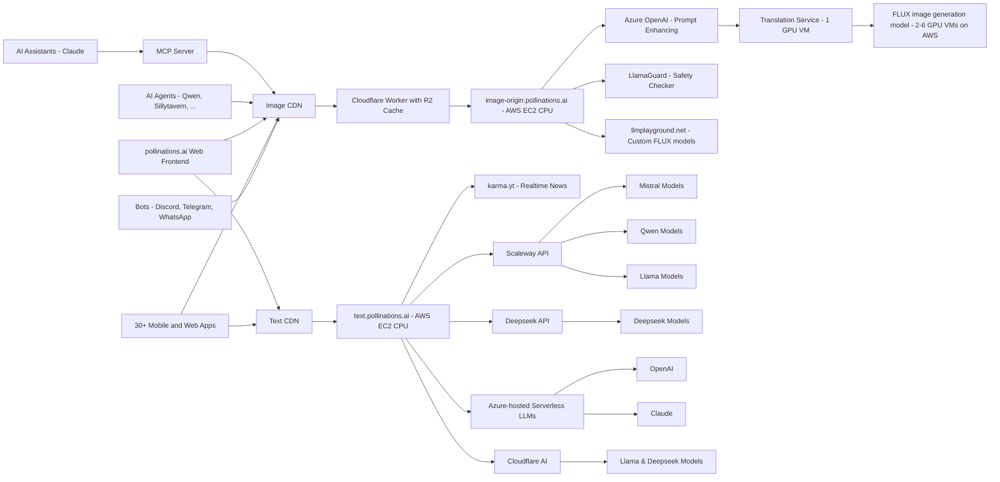

# [Pollinations.AI](https://pollinations.ai)

---

## 🆕 Latest News

- **🔍 Special Bee** - New "Special Bee" issue template! Projects can now request referrer verification by submitting a [Domain Verification Request](https://github.com/pollinations/pollinations/issues/new?template=special-bee-request.yml)[More info](https://github.com/pollinations/pollinations/blob/master/APIDOCS.md#special-bee-)
- **📚 API Documentation** - Major API documentation improvements! We've completely revamped our API docs with better examples, clearer explanations, and interactive code snippets. [Check it out](https://github.com/pollinations/pollinations/blob/master/APIDOCS.md).
- **🤖 MCP Server** - New Model Context Protocol (MCP) server for AI assistants like Claude to generate images directly! [Learn more](./model-context-protocol/README.md).  
  [](./model-context-protocol/README.md)
- **💲 Support Us** - You can now support us with our new **Tip Us** button. Optionally connect your Discord account to **Ko-Fi** to get premium Discord roles!
- **🎵 Audio Generation** - New text-to-speech and speech-to-text capabilities are now available! Try the `openai-audio` model - see our [API documentation](APIDOCS.md#audio-generation-api) for details.
- **🤖 AI Code Assistant** - We're excited to announce MentatBot, the autonomous AI coding assistant that implements new features directly from GitHub issues! Simply [create an issue](https://github.com/pollinations/pollinations/issues/new) describing what you'd like to see, and MentatBot will analyze and implement it. [Learn more](https://mentat.ai/).

---

[](https://pollinations.ai/p/3D_wireframe_blueprint_of_the_conceptual_isometric_world_of_Pollinations_AI_a_surreal_hyperrealistic_digital_garden_Elements_emerge_partially_from_all_sides?width=3000&height=1000&seed=-1)

## 🌟 Introduction

[Pollinations.AI](https://pollinations.ai) is an open-source gen AI startup based in Berlin, providing the most easy-to-use, free text and image generation API available. No signups or API keys required. We prioritize your privacy with zero data storage and completely anonymous usage.

## 🚀 Key Features

- 🔓 **100% Open Source**
- 🆓 **_Free to use_**
- 🔒 **Simplicity and privacy:** No logins, no keys, no data stored
- 🖼️ **Embed like any normal image or text**
- 🎵 **Audio generation:** Text-to-speech and speech-to-text capabilities
- 🌍 Over **50,000 active users** and > **_20 million images generated per month_**
- 🤝 Used by various **open-source LLMs**, **bots**, and **communities**
- 🎣 **_Easy-to-use React hooks_** ([React Hooks Examples](https://react-hooks.pollinations.ai/))
- 🤖 **Autonomous Development:** Features implemented by our MentatBot coding assistant through GitHub issues

<a href="https://star-history.com/#pollinations/pollinations&Date">
 <picture>
   <source media="(prefers-color-scheme: dark)" srcset="https://api.star-history.com/svg?repos=pollinations/pollinations&type=Date&theme=dark" width="600" />
   <source media="(prefers-color-scheme: light)" srcset="https://api.star-history.com/svg?repos=pollinations/pollinations&type=Date" width="600" />
   
 </picture>
</a>

## 🚀 Getting Started

### Image Generation

1. Visit [https://pollinations.ai](https://pollinations.ai)
2. Type your description in the text box
3. Click "Generate" and watch the magic happen!

### Text Generation

1. Visit [https://text.pollinations.ai](https://text.pollinations.ai)
2. Start chatting with the AI

### Audio Generation

1. Use the `openai-audio` model with our API ([explore voices at OpenAI.fm](https://www.openai.fm/))
2. Generate speech from text or transcribe audio to text

### MCP Server for AI Assistants

Our MCP (Model Context Protocol) server enables AI assistants like Claude to generate images and audio directly. [Learn more](./model-context-protocol/README.md)

```bash
# Run with npx (no installation required)
npx @pollinations/model-context-protocol
```

AI assistants can:
- Generate images from text descriptions
- Create text-to-speech audio with various voice options
- Play audio responses through the system speakers
- Access all Pollinations.AI models and services seamlessly
- List available models, voices, and capabilities

For more advanced usage, check out our [API documentation](APIDOCS.md).

## 🖥️ How to Use

### Web Interface

Our web interface is user-friendly and doesn't require any technical knowledge. Simply visit [https://pollinations.ai](https://pollinations.ai) and start creating!

### API

Use our API directly in your browser or applications:

    https://pollinations.ai/p/conceptual_isometric_world_of_pollinations_ai_surreal_hyperrealistic_digital_garden

Replace the description with your own, and you'll get a unique image based on your words!

## 🎨 Examples

### Image Generation

Here's an example of a generated image:

[](https://pollinations.ai/p/3d_wireframe_blueprint_for_the_prompt_conceptual%20isometric%20world%20of%20pollinations%20ai%20surreal%20hyperrealistic%20digital%20garden?width=2000&height=500&nologo=true&seed=-1)

Python code to download the generated image:

    import requests

    def download_image(prompt):
        url = f"https://pollinations.ai/p/{prompt}"
        response = requests.get(url)
        with open('generated_image.jpg', 'wb') as file:
            file.write(response.content)
        print('Image downloaded!')

    download_image("conceptual_isometric_world_of_pollinations_ai_surreal_hyperrealistic_digital_garden")

### Text Generation

To generate text, use this URL:

    https://text.pollinations.ai/What%20is%20artificial%20intelligence?

### Audio Generation

To generate audio from text, use this URL:

    https://text.pollinations.ai/Welcome%20to%20Pollinations?model=openai-audio&voice=nova

## 🛠️ Integration

### React Hooks

We offer React hooks for easy integration. Example usage:

    import React from 'react';
    import { usePollinationsImage, usePollinationsText } from '@pollinations/react';
    import ReactMarkdown from 'react-markdown';

    const AIGeneratedContent = () => {
      const imageUrl = usePollinationsImage("Beautiful landscape of Paris with Eiffel Tower", { width: 800, height: 600, seed: 42 });
      const markdown = usePollinationsText("Write a brief travel guide for Paris, including top attractions and local cuisine in markdown", { seed: 42 });

      return (
        <div>
          <h2>AI-Generated Travel Guide</h2>
          
          {markdown ? (
            <ReactMarkdown>{markdown}</ReactMarkdown>
          ) : (
            <p>Loading markdown content...</p>
          )}
        </div>
      );
    };

    export default AIGeneratedContent;

Check out our [Pollinations React Hooks](./pollinations-react/README.md) for more details.

## Architecture


## Projects Using Pollinations.AI

Pollinations.AI is used in various projects, including:

### LLM Integrations

| Project | Description | Creator | Links |
|---------|-------------|---------|-------|
| 🆕 IMyself AI 🇨🇳 | 我们提供高质量的AI生成服务，包括图像生成、文本生成、音频生成和语音转文本服务， 让您轻松创建各种创意内容。 (We provide high-quality AI generation services, including image generation, text generation, audio generation, and speech to text services, allowing you to easily create various creative content.) | Shadownc | [Website](https://openai.lmyself.top/) |
| 🆕 AI Chat Assistant | A comprehensive AI Chat Assistant designed to provide users with an interactive chat interface that supports both text and image generation. Features multiple AI models (GPT-4o, Claude, Qwen-Coder, Llama, Mistral, etc.), image generation from text prompts, image-to-image processing, and a responsive UI with desktop and mobile support | @_dr_misterio_ | [Website](https://seed-ashy.vercel.app/) |
| 🆕 FreeAI 🇨🇳 | An AI application platform based on Pollinations.AI API, providing free and unlimited AI chat assistant, image generation, and voice synthesis services | @Azad-sl | [Website](https://freeai.aihub.ren/), [GitHub](https://github.com/Azad-sl/FreeAI) |
| 🆕 AI Unlimited Customizable Feature Module 🇨🇳 | This project provides a free API interface supporting various text and image generation models, including OpenAI's GPT-4, Gemini 2.0, etc. Users can access these models without an API key to perform text generation, image generation, translation, text polishing, and more | [S_S](https://linux.do/u/s_s/summary) | [Website](https://getquicker.net/Sharedaction?code=9ac738ed-a4b2-4ded-933c-08dd5f710a8b&fromMyShare=true) |
| 🆕 PrivatePollenAI | A privacy-focused chat assistant app that securely stores data locally, integrates with PollinationAI for text and image generation, features a minimalistic UI, and allows users to choose models and write their own system instructions | [tenacious_humming_bird](https://discordapp.com/users/tenacious_humming_bird) | [Website](https://mmojocoder.github.io/PrivatePollenAI/chat.html), [GitHub](https://github.com/MMojoCoder/PrivatePollenAI) |
| 🆕 Zelos AI image generator | It uses Pollinations for both prompt enhancing and image generation, it was a easy to make project due to pollinations services being easy to use | [Roblox Profile](https://www.roblox.com/users/4361935306/profile) | [Website](https://websim.ai/@ISWEARIAMNOTADDICTEDTOPILLOW/ai-image-prompt-generator) |
| 🆕 MiReXa AI | A state-of-the-art chatbot integrating multiple LLMs with advanced features including audio generation, image generation, mathematical proficiency, and real-time web search | withthatway | [Website](https://mirexa.vercel.app) |
| Pollinations Chat | Pollinations' integrated AI for text and images, totally free and unlimited | @adrianoprogramer | [Website](https://websim.ai/@AdrianoDev1/pollinations-ai-assistant/4), [Instagram](https://www.instagram.com/adrianop_761?igshid=MmxwNnRsajVnZmMy) |
| LobeChat | An open-source, modern-design ChatGPT/LLMs UI/Framework with speech-synthesis, multi-modal, and extensible plugin system | - | [Website](https://lobehub.com/plugins/pollinations-drawing), [GitHub](https://github.com/lobehub/lobe-chat) |
| Qwen-Agent | A framework for developing agentic LLM applications | - | [GitHub](https://github.com/QwenLM/Qwen-Agent) |
| SillyTavern | An LLM frontend for power users. Pollinations permits it to generate images | - | [Docs](https://docs.sillytavern.app/extensions/stable-diffusion/), [GitHub](https://github.com/SillyTavern/SillyTavern) |
| FlowGPT | Generate images on-demand with ChatGPT | - | [Website](https://flowgpt.com/p/instant-image-generation-with-chatgpt-and-pollinationsai) |
| gpt4free | The official gpt4free repository - various collection of powerful language models | xtekky | [GitHub](https://github.com/xtekky/gpt4free) |
| Unity AI Lab | A specialized uncensored LLM model built on Mistral Large, focused on unrestricted conversations | - | [Website](https://blog.unityailab.com/unity.html) |
| DynaSpark AI | A versatile AI assistant with advanced image and text generation capabilities | Th3-C0der | [Website](https://dynaspark.onrender.com), [GitHub](https://github.com/Th3-C0der) |


### Creative & Interactive Applications

| App | Description | Creator | Links |
|-----|-------------|---------|-------|
| 🆕 LAHGen | An advanced AI-driven text-to-image generation platform designed to provide users with high-quality and realistic AI-generated images based on textual prompts | working7816@gmail.com | [Website](https://image.aixboost.com/) |
| 🆕 Elixpo Art | A Web interface to create thematic images from prompts, with multiple aspect ratios and also image reference inputs | Ayushman Bhattacharya | [Website](https://elixpoart.vercel.app), [GitHub](https://github.com/Circuit-Overtime/elixpo_ai_chapter) |
| 🆕 Riffle | A powerful tool designed to make reading English books more enjoyable and effective while helping you build your vocabulary naturally. Using Pollinations AI to create content that incorporates your own vocabulary words allows you to learn them in a vivid, engaging context. | gsx123@gmail.com | [Website](https://riffle.ink) |
| 🆕 VibeCoder | A web app for coding with vibes, created using Pollinations.AI Open Source API without coding syntax. | @Aashir__Shaikh | [Website](https://vibecoderbyaashir.netlify.app/), [Twitter](https://x.com/Aashir__Shaikh) |
| 🆕 AI 文本转音频 🇨🇳 | 输入文本，选择语音风格，一键将文字转换为自然流畅的语音。 支持多种声音特征，帮您创建专业水准的音频内容。 (Input text, select voice style, and instantly convert text to natural, fluid speech. Supports various voice characteristics to help you create professional-grade audio content.) | https://github.com/Azad-sl | [Website](https://tts-gules-theta.vercel.app/), [GitHub](https://github.com/Azad-sl/tts) |
| 🆕 Case Me 🇧🇷 | O projeto consiste em uma vending machine que criará capinhas para celular personalizadas com fotos ou outras imagens e cores de escolha do cliente final. (A vending machine that creates customized phone cases with photos or other images and colors chosen by the end customer.) | anaboxmania@gmail.com | - |
| 🆕 PixPax | A user-friendly chatbot that lets you analyze images, remix existing images or create new images, all through simple chat. | @andreas_11 | [Website](https://pixpal.chat) |
| 🆕 Watch TV with neko (Roblox) | Roblox game where you can talk with AI catgirls 🐾 or just have fun, talking with other players in cozy rooms ⭐️ | @mangofoxplay | [Roblox](https://www.roblox.com/games/15087497266/UPD-Watch-TV-with-neko-AI) |
| 🆕 Jenny AI | An AI chatbot and character creation platform with tts and sst it also has image generation and vision ability which are powered by pollinations. | HiiiiiPritam | [Website](https://jenny-two.vercel.app/) |
| 🆕 CalcuBite AI | A smart tool that analyzes food from images to provide calorie and nutrient details. Just take a photo, and it quickly gives you an estimate of your meal's nutritional value. It uses AI for accurate analysis, and if you run out of free scans, you can watch an ad to get more! | @sugamdeol | [Website](https://calcubite.vercel.app/) |
| 🆕 RoastMaster AI | An AI-powered roast generator that allows users to upload selfies for savage AI-generated roasts, enter text for brutal critiques, or engage in roast battles. Images are processed securely on the device, protecting user privacy | @sugamdeol | [Website](https://roastmaster-ai.vercel.app/) |
| 🆕 roastmyselfie.app | AI Personality Analyzer - Get roasted and psychoanalyzed.. just from one selfie! Dare to try? | @andres_11 | [Website](https://roastmyselfie.app) |
| 🆕 StoryMagic: Interactive Kids Stories | An interactive web application designed to create engaging and customizable stories for children. Features AI-powered story generation, customizable themes, interactive elements, visual customization, web search integration, and a user-friendly interface | @_dr_misterio_ | [Website](https://storyai-wizard.vercel.app) |
| 🆕 PromptPix (Android) | An AI-powered image generation platform for Android designed to create stunning visuals from text prompts. Features dynamic image generation as users scroll, save to gallery, favorites, and a user-friendly interface | @taylorsnupe | [Expo](https://expo.dev/accounts/aminmusah/projects/image-generator/builds/ed32c5d0-83c0-416b-889f-e36b997dd706), [GitHub](https://github.com/AminMusah/ai-image-generator) |
| 🆕 AI儿童故事 🇨🇳 | 基于此项目 构建有趣的孩子故事书应用演示 (Based on this project, build an interesting children's storybook application demo) | MZ | [Website](https://kidss.netlify.app/) |
| 🆕 Herramientas IA | Tools designed with Pollinations.AI and the DescartesJS editor, including tools from other Pollinations.AI community members | @juanrivera126 | [Website](https://proyectodescartes.org/descartescms/herramientas-ia) |
| 🆕 AvatarStudio | A system for creating custom characters that uses the Pollinations API for totally free and unlimited image generation | @nic-wq | [Website](https://astudio-dcae4.web.app) |
| 🆕 Musify - AI Enhanced Music Streaming | Musify is your AI-powered music buddy, making your jam sessions smarter and more fun. It is powered by pollinations api, it offers a slick and intuitive music experience with features like AI Music Assistant, Voice Commands, AI Playlist Creator, and Responsive Design. | @Sugamdeol | [Website](https://musify-sd.vercel.app/) |
| 🆕 image1gen | Website to easily create images via pollinations.ai API | @oopshnik | [Website](https://image1gen.streamlit.app/), [GitHub](https://github.com/oopshnik/image1gen), [HuggingFace](https://huggingface.co/spaces/oopshnik/image_gen) |
| 🆕 AI Image Generator | A web-based AI image generator powered by Pollinations.ai, featuring multi-model support, customizable parameters, and real-time preview | @hrisjeui | [Website](https://fvai.infinityfreeapp.com/my-apps/pollicb09.html), [GitHub](https://github.com/hrisjeui/Multi-text-image-model-pollinations) |
| 🆕 🎵 PolliSonic Generator | An AI-driven tool that transforms text prompts using MidiJourney into MIDI-based melodies through browser oscillators | @brain.diver | [Website](https://interzone.art.br/pollisonic_generator/), [GitHub](https://github.com/rafabez/pollisonic_generator) |
| 🆕 Abyss Ascending | A web-based generative interactive fiction (text adventure) set in a sci-fi underwater world | @brain.diver | [Website](https://interzone.art.br/abyss_ascending/), [GitHub](https://github.com/rafabez/abyss_ascending) |
| 🆕 🎮 Deep Saga | A text based RPG with AI-generated scene images | @jr_7_77 | [Play Store](https://play.google.com/store/apps/details?id=com.cestrian.deepsaga.android&pcampaignid=pollinations) |
| [AI] Character RP (Roblox) | A popular Roblox game for AI character roleplay | @renewed | [Roblox](https://www.roblox.com/games/108463136689847/) |
| MIDIjourney | An AI-powered plugin for Ableton Live that turns text descriptions into music | KORUS Labs | [GitHub](https://github.com/korus-labs/MIDIjourney) |
| TurboReel | An open-source video generation system using AI | @pedroriosa | [Website](https://turboreelgpt.tech/), [GitHub](https://github.com/TurboReel/TurboReel_studio) |
| Rangrez AI | A web platform for inspiring, creating, and customizing designs | @saadaryf | [Website](https://rangrezai.com) |
| Infinite Tales | A Choose Your Own Adventure RPG, dynamically narrated by AI | JayJayBinks | [Website](https://infinite-tales-rpg.vercel.app/), [GitHub](https://github.com/JayJayBinks/infinite-tales-rpg) |
| StorySight | An app to help children with learning disabilities | - | [GitHub](https://github.com/abiral-manandhar/storySight) |
| StoryWeaver | Crafts personalized picture books for children | Multiple Authors | [Devpost](https://devpost.com/software/storyweaver-013xdw) |
| Sirius Cybernetics Elevator Challenge | A Hitchhiker's Guide to the Galaxy themed LLM-based elevator game | @thomash_pollinations | [Demo](https://sirius-cybernetics.pollinations.ai/), [GitHub](https://github.com/voodoohop/sirius-cybernetics-elevator-challenge) |
| POLLIPAPER | A dynamic wallpaper app that uses Pollinations AI | @intolerant0ne | [GitHub](https://github.com/Tolerable/POLLIPAPER) |
| AI PPT Maker | Create AI-powered presentations using Pollinations' API | @k_ush | [Website](https://sites.google.com/view/kushai) |
| UR Imagine & Chat AI | A free and limitless image generator with companion AI chat/roleplay system | withthatway | [Website](https://perchance.org/ur-imagine-ai) |
| Pollinations Gallery | A clean and simple gallery showcasing community's AI-generated images | @deng-xian-sheng | [Website](https://deng-xian-sheng.github.io/pollinations-img-page/) |
| AI-Bloom | A minimal creative showcase of AI-powered content generation | @diepdo1810 | [Website](https://ai-bloom.vercel.app/) |

### Tools & Interfaces

| App | Description | Creator | Links |
|-----|-------------|---------|-------|
| 🆕 WordPress AI Vision Block | A custom WordPress Gutenberg block that allows you to generate images using the Pollinations API | mahmood-asadi | [Website](https://wordpress.org/plugins/ai-vision-block/), [GitHub](https://github.com/mahmood-asadi/ai-vision-block) |
| 🆕 toai.chat | An AI chat service that operates exclusively via Curl commands, specifically designed for users working in terminal environments without the need for a standalone AI client | kevin@kevin1986.com | [Website](https://toai.chat), [GitHub](https://github.com/Veallym0n/toai.chat) |
| Pollinations Feed | A web interface that showcases the realtime feed of pollinations with a bento-grid | Ayushman Bhattacharya | [Website](https://elixpoart.vercel.app/src/feed), [GitHub](https://github.com/Circuit-Overtime/elixpo_ai_chapter) |
| Elixpo Art | A web interface for easy image generation with theme selection | Ayushman Bhattacharya | [Website](https://circuit-overtime.github.io/Elixpo_ai_pollinations), [GitHub](https://github.com/Circuit-Overtime/elixpo_ai_chapter) |
| Elixpo Art Chrome Extension | An Open Source Chrome Extension for easy image generation from selected texts |Ayushman Bhattacharya | [Chrome Extension](https://chromewebstore.google.com/detail/elixpo-art-select-text-an/hcjdeknbbbllfllddkbacfgehddpnhdh), [GitHub](https://github.com/Circuit-Overtime/elixpo_ai_chapter) |
| 🆕 Pollinations.ai Model Comparison | An interactive tool designed to compare outputs from various large language models with customizable timeout settings and real-time testing capabilities. | @dseeker | [Website](https://endemicmedia.github.io/FLARE/llm-comparison-tool/), [GitHub](https://github.com/EndemicMedia) |
| 🆕 Anime AI Generation | Create professional-quality anime characters with powerful AI technology. No artistic skills required. | @shreyas281898 | [Website](https://www.animeaigeneration.com/) |
| 🆕 Pollinations.DIY | A browser-based coding environment based on bolt.diy, featuring integrated Pollinations AI services, visual code editing, and project management tools | @thomash_pollinations | [Website](https://pollinations.diy), [GitHub](https://github.com/pollinations/pollinations.diy) |
| 🆕 Pal Chat | An iOS app that integrates with all LLMs including Pollinations AI models in one unified simple interface | @pallavmac | [App Store](https://apps.apple.com/us/app/pal-chat-ai-chat-client/id6447545085?platform=iphone) |
| Pollinator Android App | An open-source Android app for text-to-image generation | @gaurav_87680 | [GitHub](https://github.com/g-aggarwal/Pollinator) |
| Own-AI | An AI text-to-image generator | Sujal Goswami | [Website](https://own-ai.pages.dev/), [GitHub](https://github.com/sujal-goswami/Own-AI) |
| JustBuildThings | A collection of AI tools for image generation, character chat, and writing | rasit | [Website](https://justbuildthings.com) |
| Image Gen - Uncensored Edition | A powerful image generation assistant on HuggingChat | @DeFactOfficial | [HuggingChat](https://huggingface.co/chat/assistant/66fccce0c0fafc94ab557ef2) |
| Free AI Chatbot & Image Generator | A mobile app for unlimited AI chat and image generation | @andreas_11 | [Website](https://freeaichat.app) |
| JCode Website Builder | A website generator using Pollinations text API | @rtxpower | [Website](https://jcode-ai-website-bulder.netlify.app/) |
| Server Status Dashboards | Real-time monitoring dashboards for Pollinations text and image servers | @tolerantone | [Text Status](https://www.ai-ministries.com/serverstatus.html), [Image Status](https://www.ai-ministries.com/imagestatus.html) |
| Websim | A web simulation tool that integrates Pollinations.ai | @thomash | [Website](https://websim.ai/c/bXsmNE96e3op5rtUS) |

### Social Bots

| Bot | Description | Creator | Links |
|-----|-------------|---------|-------|
| 🆕 AlphaLLM - AI Discord Bot | Discord bot that uses several APIs (Pollinations AI and Cerebras AI), to offer a variety of features, including advanced text generation with a history of your conversations, image and voice generation | @the_yerminator | [Website](https://alphallm.fr.nf), [GitHub](https://github.com/YoannDev90/AlphaLLM) |
| 🆕 🤖 pollinations-tg-bot 🇨🇳 | A Telegram bot deployed on Cloudflare Workers, allowing users to generate images, text-to-speech, transcribe voice messages, chat with AI models, and more through Pollinations API | @Shadownc | [Telegram](https://t.me/AipolBot), [GitHub](https://github.com/Shadownc/pollinations-tg-bot) |
| 🆕 Gacha | A versatile AI chat-bot and image generator powered by Pollinations.AI, featuring web search, image generation with model selection, and character-aware image generation through !webgen command | @_dr_misterio_ | [Website](https://shapes.inc/gacha-gachu/public), [Install](https://shapes.inc/gacha-gachu/install) |
| 🆕 One Word | A Telegram bot for a word-matching game where players try to write the same word simultaneously, featuring image generation from game words using Pollinations.AI | @Dimaq21 | [Telegram](https://t.me/OdnoSlovoBot) |
| 🆕 Titan-GPT | Free Telegram bot providing access to neural networks including image and text generation powered by Pollinations.AI | @titangpt_support | [Telegram](https://t.me/titangpt_channel) |
| Discord Bot | A Discord bot for generating images based on user prompts | @Zngzy | [Discord](https://discord.gg/D9xGg8mq3D), [GitHub](https://github.com/Zingzy/pollinations.ai-bot) |
| Telegram Bot | A Telegram bot for generating images based on user prompts | Wong Wei Hao | [Telegram](http://t.me/pollinationsbot) |
| WhatsApp Group | A WhatsApp group for image generation | @dg_karma | [Join Group](https://chat.whatsapp.com/KI37JqT5aYdL9WBYMyyjDV) |
| OpenHive | A Discord server bridging Discord and AI, featuring Beebot | @creativegpt | [Discord](https://discord.gg/Zv3SXTF5xy) |
| Anyai | A Discord bot and community for AI-driven content | @meow_18838 | [Discord](https://discord.gg/anyai) |

### SDK & Libraries

| Library | Description | Creator | Links |
|---------|-------------|---------|-------|
| 🆕 pollinations_ai | A Flutter/Dart SDK package for accessing all features of pollinations.ai including text generation, image generation, audio, and listing all supported models | @Meenapintu | [pub.dev](https://pub.dev/packages/pollinations_ai), [GitHub](https://github.com/yehigo/pollinations.ai) |
| 🆕 Node.js Client Library | A TypeScript/Node.js client for accessing Pollinations AI services including image generation, text processing, and speech synthesis. Features full TypeScript typings, dual CJS/ESM module support, 100% test coverage and feed/streams support, builder pattern API and axios-based HTTP client implementation | @fqueis | [NPM](https://www.npmjs.com/package/pollinationsai), [GitHub](https://github.com/fqueis/pollinationsai) |
| 🆕 ComfyUI-Pollinations | A custom node for ComfyUI that utilizes the Pollinations API to generate images and text based on user prompts, supporting multiple image and text generation models | 1038lab | [GitHub](https://github.com/1038lab/ComfyUI-Pollinations) |
| pollinations NPM Module | A Node.js package for accessing all Pollinations features | @maxencexz | [NPM](https://www.npmjs.com/package/pollinations) |
| pypollinations | Comprehensive Python wrapper for Pollinations AI API | @KTS-o7 | [PyPI](https://pypi.org/project/pypollinations/) |
| @pollinations/react | React hooks for easy integration of Pollinations' features | @pollinations | [NPM](https://www.npmjs.com/package/@pollinations/react), [Docs](https://react-hooks.pollinations.ai/) |
| Polli API Dashboard | Real-time dashboard monitoring text.pollinations.ai/feed | @Sugamdeol | [Website](https://polli-api.vercel.app), [GitHub](https://github.com/Sugamdeol/Polli-api) |
| pollinations.ai Python SDK | Official Python SDK for working with Pollinations' models | @pollinations-ai | [GitHub](https://github.com/pollinations-ai/pollinations.ai) |

### Tutorials

| Tutorial | Description | Creator | Links |
|----------|-------------|---------|-------|
| 🆕 Connect Pollinations with Open Web UI tutorial | How to add Pollinations AI Text Models to OpenWebUI for free access to top language models like GPT-4o, Mistral, Claude, and Gemini without signups or API keys | @cloph-dsp | [GitHub](https://github.com/cloph-dsp/Pollinations-AI-in-OpenWebUI) |
| 🆕 Chinese DeepSeek Tutorial | A tutorial showing how to make DeepSeek AI support image generation by leveraging Pollinations.ai's API | isinry | [Forum Post](https://linux.do/t/topic/447840/235), [Profile](https://linux.do/u/isinry) |
| Artistic Styles Book | An interactive book showcasing 90+ artistic styles | Juan Gmo. Rivera | [HTML](https://proyectodescartes.org/iCartesiLibri/materiales_didacticos/Libro_Estilos/index.html), [PDF](https://proyectodescartes.org/iCartesiLibri/PDF/Libro_Estilos.pdf) |
| Proyecto Descartes | Educational initiative integrating Pollinations AI into STEM | Juan Gmo. Rivera | [Website](https://proyectodescartes.org/revista/Numeros/Revista_8_2024/index.html) |
| Tutorial | An in-depth Portuguese tutorial on using Pollinations AI | Janderson de Sales | [Website](https://guiadehospedagem.com.br/pollinations-ai/) |
| Apple Shortcuts Guide | Video guide on creating AI images using Apple Shortcuts | RoutineHub | [YouTube](https://www.youtube.com/watch?v=-bS41VTzh_s), [Shortcut](https://routinehub.co/shortcut/19953/) |

Have you created a project using Pollinations.AI? [Submit it through our project submission form](https://github.com/pollinations/pollinations/issues/new?template=project-submission.yml) to get it listed here! We use a structured GitHub issue template to make the submission process easy and organized.

## 🔮 Future Developments

We're constantly exploring new ways to push the boundaries of AI-driven content creation. Some areas we're excited about include:

- Digital Twins: Creating interactive AI-driven avatars
- Music Video Generation: Combining AI-generated visuals with music for unique video experiences
- Real-time AI-driven Visual Experiences: Projects like our Dreamachine, which create immersive, personalized visual journeys

## 🌍 Our Vision

Pollinations.AI envisions a future where AI technology is:

- **Open & Accessible**: We believe AI should be available to everyone, not locked behind paywalls or restricted access

- **Transparent & Ethical**: Our open-source approach ensures transparency in how our models work and behave

- **Community-Driven**: We're building a platform where developers, creators, and AI enthusiasts can collaborate and innovate

- **Interconnected**: We're creating an ecosystem where AI services can seamlessly work together, fostering innovation through composability

- **Evolving**: We embrace the rapid evolution of AI technology while maintaining our commitment to openness and accessibility

We're committed to developing AI technology that serves humanity while respecting ethical boundaries and promoting responsible innovation. Join us in shaping the future of AI.

## 🤝 Community and Development

We believe in community-driven development. You can contribute to Pollinations.AI in several ways:

1. **Coding Assistant**: The easiest way to contribute! Just [create a GitHub issue](https://github.com/pollinations/pollinations/issues/new) describing the feature you'd like to see implemented. The [MentatBot AI assistant](https://mentat.ai/) will analyze and implement it directly! No coding required - just describe what you want.

2. **Project Submissions**: Have you built something with Pollinations.AI? [Use our project submission template](https://github.com/pollinations/pollinations/issues/new?template=project-submission.yml) to share it with the community and get it featured in our README.

3. **Feature Requests & Bug Reports**: Have an idea or found a bug? [Open an issue](https://github.com/pollinations/pollinations/issues/new) and let us know. Our team and the MentatBot assistant will review it.

4. **Community Engagement**: Join our vibrant [Discord community](https://discord.gg/k9F7SyTgqn) to:
   - Share your creations
   - Get support and help others
   - Collaborate with fellow AI enthusiasts
   - Discuss feature ideas before creating issues

For any questions or support, please visit our [Discord channel](https://discord.gg/k9F7SyTgqn) or create an issue on our [GitHub repository](https://github.com/pollinations/pollinations).

## 🗂️ Project Structure

Our codebase is organized into several key folders, each serving a specific purpose in the Pollinations.AI ecosystem:

- [`pollinations.ai/`](./app/): The main React application for the Pollinations.ai website.

- [`image.pollinations.ai/`](./image.pollinations.ai/): Backend service for image generation and caching with Cloudflare Workers and R2 storage.

- [`pollinations-react/`](./pollinations-react/): React component library for Pollinations.ai.

- [`text.pollinations.ai/`](./text.pollinations.ai/): Backend service for text generation.

- [`model-context-protocol/`](./model-context-protocol/): Model Context Protocol (MCP) server for AI assistants like Claude to generate images directly.

This structure encompasses the frontend website, backend services for image and text generation, and integrations like the Discord bot and MCP server, providing a comprehensive framework for the Pollinations.AI platform.

## 🏢 Supported By

Pollinations.AI is proud to be supported by:

[](https://pollinations.ai/p/Logos_of_AWS_Activate,_Google_Cloud_for_Startups,_NVIDIA_Inception,_Azure,_Cloudflare,_Scaleway,_Modal,_and_LLMPlayground.net_arranged_in_a_2_rows_and_4_columns_grid?width=400&height=200&nologo=true&seed=-1)

- [Portkey AI Gateway](https://github.com/Portkey-AI/gateway): AI Gateway for LLM routing and fallbacks
- [LLMPlayground.net](https://llmplayground.net/): Hosting Custom Flux Models
- [AWS Activate](https://aws.amazon.com/): GPU Cloud Credits
- [Google Cloud for Startups](https://cloud.google.com/): GPU Cloud Credits
- [NVIDIA Inception](https://www.nvidia.com/en-us/deep-learning-ai/startups/): AI startup support
- [Azure (MS for Startups)](https://azure.microsoft.com/): OpenAI credits
- [Cloudflare](https://developers.cloudflare.com/workers-ai/): Put the connectivity cloud to work for you.
- [Scaleway](https://www.scaleway.com/): Europe's empowering cloud provider
- [Modal](https://modal.com/): High-performance AI infrastructure

## 📜 License

Pollinations.AI is open-source software licensed under the [MIT license](LICENSE).

---

Made with ❤️ by the Pollinations.AI team

## Contributors

<!-- ALL-CONTRIBUTORS-LIST:START - Do not remove or modify this section -->
<!-- prettier-ignore-start -->
<!-- markdownlint-disable -->

<!-- markdownlint-restore -->
<!-- prettier-ignore-end -->
<!-- ALL-CONTRIBUTORS-LIST:END -->
