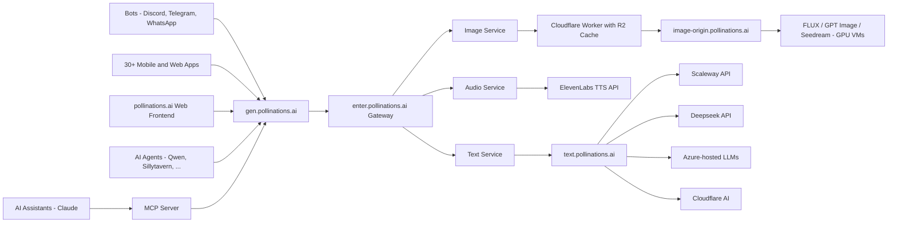

<div align="center">
  
  
  <p><strong>Open-source AI for people who make things.</strong></p>

[](https://github.com/pollinations/pollinations)
[](LICENSE)
[](https://discord.gg/pollinations-ai-885844321461485618)

[Website](https://pollinations.ai) · [Dashboard](https://enter.pollinations.ai) · [API Docs](APIDOCS.md) · [Discord](https://discord.gg/pollinations-ai-885844321461485618)

</div>

<p align="center"></p>

## 🆕 Recent Apps

| Name | Description | Author |
|------|-------------|--------|
| [Gen Layers](http://genlayers.com/) | AI tool to generate high-CTR YouTube thumbnails from titles and visuals | @Mustafiz82 |
| [ImageGenAI Pro](https://imgimg-two.vercel.app/) | Generate images in any aspect ratio with ImageGenAI Pro. | @prabhatkashyap902 |
| [nails-generator](https://nails-generator.netlify.app/) | Generate AI nail art designs with nails-generator, producing style, color, and pattern variations for manicure mockups. | @rodriguetg |
| [FeedHire](https://feedhire.me/) | AI job aggregator that filters postings from Telegram, Reddit and other sources | @rafipatel |
| [AI Youtube Comment Summary Browser ExtensionAddon](https://addons.mozilla.org/en-US/firefox/addon/ai-youtube-comment-summary/) | Summarizes YouTube comment threads directly in your browser. | @iFreaku |
| Pixoo64 Music AI Art | Home Assistant integration: music-reactive Pixoo64 visuals via Pollinations.ai | @idodov |
| [Polli AI Client](https://polli-plum.vercel.app/) | Privacy-focused serverless AI client for Pollinations API and advanced models. | @soyangelromero |
| [FumajimeMura Z-Image Turbo](https://urea.github.io/FumajimeMura-Z-Image-Turbo/) | High-speed batch image generator using Pollinations AI Flux Z-Image | @urea |
| [Chamuka DrawIt](https://drawit.chamuka.ai) | Create designs by generating images powered by Pollinations. | @swiftugandan |
| [Xenchat](https://chat.xenai.tech) | Fine-tuned AI chat powered by OpenWebUI and Pollinations for fast responses | @Screenmax1234 |

[View all apps →](apps/APPS.md)
## 🚀 New Unified API — Now Live

We've launched **https://gen.pollinations.ai** — a single endpoint for all your AI generation needs: text, images, audio, video — all in one place.

### What's New

- **Unified endpoint** — single API at `gen.pollinations.ai` for all generation
- **Pollen credits** — simple pay-as-you-go system ($1 ≈ 1 Pollen)
- **All models, one place** — Flux, GPT-5, Claude, Gemini, Seedream, and more
- **API keys** — publishable keys for frontend, secret keys for backend

> Get started at [enter.pollinations.ai](https://enter.pollinations.ai) and check out the [API docs](https://enter.pollinations.ai/api/docs)

## 🆕 Latest News

- **2026-02-20** – **🛠️ GENEXUS AI** Added to the developer tools showcase. Another backend integration for the ecosystem.
- **2026-02-19** – **📦 Package Migration** The SDK and MCP packages have moved to the `@pollinations_ai` scope on NPM. We dropped the React dependencies, so they're lighter and framework-agnostic now.
- **2026-02-19** – **🎥 Video Duration** The `seedance` video model now accepts a `duration` parameter. Control your clip length via the [API](https://gen.pollinations.ai).
- **2026-02-18** – **📅 Build Diary** The [Community page](https://hello.pollinations.ai) now features an interactive timeline of the project's history. Navigate daily changes and digests with keyboard controls.
- **2026-02-18** – **🐛 Readable Errors** The [API](https://gen.pollinations.ai) now extracts actual human-readable messages from upstream JSON errors. No more raw dumps when providers fail.
- **2026-02-18** – **🌱 Seed Tier Logic** GitHub activity qualification now uses a rolling 90-day window instead of resetting yearly. Your status is safe in January.
- **2026-02-17** – **📊 SlidePainter** Generate illustrated slide decks and export to PDF with this new community app.
- **2026-02-17** – **👾 Pixel Art & Markdown** A cozy new retro theme is available, plus app descriptions are now auto-formatted via the [Text API](https://gen.pollinations.ai).
- **2026-02-17** – **🎨 UI Theme Cycling** Click the [pollinations.ai](https://hello.pollinations.ai) logo to instantly cycle through visual themes.
- **2026-02-16** – **🌸 Badges in Bloom** Navigate the ecosystem with our new organic badge system (Fresh, Pollen, Buzz) to find the best [community apps](https://hello.pollinations.ai).
---

## 🌱 Introduction

[pollinations.ai](https://pollinations.ai) is an open-source generative AI platform based in Berlin, powering 500+ community projects with accessible text, image, video, and audio generation APIs. We build in the open and keep AI accessible to everyone—thanks to our amazing supporters.

## 🚀 Key Features

- 🔓 **100% Open Source** — code, decisions, roadmap all public
- 🤝 **Community-Built** — 500+ projects already using our APIs
- 🌱 **Pollen Tiers** — earn daily credits by contributing (tiers in beta)
- 🖼️ **Image Generation** — Flux, GPT Image, Seedream, Kontext
- 🎬 **Video Generation** — Seedance, Veo (alpha)
- 🎵 **Audio** — Text-to-speech and speech-to-text
- 🎣 **_Easy-to-use Packages_** ([Packages](packages/))

<a href="https://star-history.com/#pollinations/pollinations&Date">
 <picture>
   <source media="(prefers-color-scheme: dark)" srcset="https://api.star-history.com/svg?repos=pollinations/pollinations&type=Date&theme=dark" width="600" />
   <source media="(prefers-color-scheme: light)" srcset="https://api.star-history.com/svg?repos=pollinations/pollinations&type=Date" width="600" />
   
 </picture>
</a>
### Quick Start (3 Steps)

1️⃣ **Get your API key**  
Sign up at [enter.pollinations.ai](https://enter.pollinations.ai) to generate your key.

2️⃣ **Choose what you want to generate**  
Pollinations supports:
- 🖼 Images  
- 📝 Text  
- 🔊 Audio  
- 🎬 Video  

3️⃣ **Make your first request**  
Use one of the examples below to generate your first AI output in seconds.


## 🚀 Getting Started

[](https://deepwiki.com/pollinations/pollinations)

### Image Generation

```bash
curl 'https://gen.pollinations.ai/image/a%20beautiful%20sunset' -o image.jpg
```

Or visit [pollinations.ai](https://pollinations.ai) for an interactive experience.

### Text Generation

```bash
curl 'https://gen.pollinations.ai/text/Hello%20world'
```

### Audio Generation

**Simple GET endpoint:**

```bash
curl 'https://gen.pollinations.ai/audio/Hello%20from%20Pollinations?voice=nova&key=YOUR_API_KEY' -o speech.mp3
```

**OpenAI TTS compatible:**

```bash
curl 'https://gen.pollinations.ai/v1/audio/speech' \
  -H 'Content-Type: application/json' \
  -H 'Authorization: Bearer YOUR_API_KEY' \
  -d '{"model": "tts-1", "input": "Hello from Pollinations!", "voice": "nova"}' \
  -o speech.mp3
```

Available voices: `alloy`, `echo`, `fable`, `onyx`, `nova`, `shimmer`, plus [30+ ElevenLabs voices](https://enter.pollinations.ai/api/docs).

### MCP Server for AI Assistants

Our MCP (Model Context Protocol) server enables AI assistants like Claude to generate images and audio directly. [Learn more](./packages/mcp/README.md)

#### Configuration

Add this to your MCP client configuration:

```json
{
  "mcpServers": {
    "pollinations": {
      "command": "npx",
      "args": ["@pollinations_ai/model-context-protocol"]
    }
  }
}
```

### Run with npx (no installation required)

```bash
npx @pollinations_ai/model-context-protocol
```

Community alternatives like [MCPollinations](https://github.com/pinkpixel-dev/MCPollinations) and [Sequa MCP Server](https://mcp.sequa.ai/v1/pollinations/contribute) are also available.

AI assistants can:

- Generate images from text descriptions
- Create text-to-speech audio with various voice options
- Play audio responses through the system speakers
- Access all pollinations.ai models and services
- List available models, voices, and capabilities

For more advanced usage, check out our [API documentation](APIDOCS.md).

## 🔐 Authentication

Get your API key at [enter.pollinations.ai](https://enter.pollinations.ai)

### Key Types

| Key             | Prefix | Use Case                       | Rate Limits              | Status  |
| --------------- | ------ | ------------------------------ | ------------------------ | ------- |
| **Publishable** | `pk_`  | Client-side, demos, prototypes | 1 pollen per IP per hour | ⚠️ Beta |
| **Secret**      | `sk_`  | Server-side only               | No rate limits           | Stable  |

> ⚠️ **Publishable keys:** Turnstile protection coming soon. Not recommended for production yet.

> ⚠️ **Never expose `sk_` keys** in client-side code, git repos, or public URLs

> 💡 **Building an app?** Use [Bring Your Own Pollen](./BRING_YOUR_OWN_POLLEN.md) — users pay for their own usage, you pay $0

### Model Restrictions

Each API key can be scoped to specific models. When creating a key at [enter.pollinations.ai](https://enter.pollinations.ai), you can:

- **Allow all models** — key works with any available model
- **Restrict to specific models** — select exactly which models the key can access (e.g., only `flux` and `openai`, or just `gptimage-large`)

### Usage

```bash
curl 'https://gen.pollinations.ai/image/a%20cat?key=YOUR_KEY'
```

**Environment variable (best practice):**

```bash
export POLLINATIONS_API_KEY=sk_...
```

See [full API docs](APIDOCS.md) for detailed authentication information.

## 🖥️ How to Use

### Web Interface

Our web interface is user-friendly and doesn't require any technical knowledge. Simply visit [https://pollinations.ai](https://pollinations.ai) and start creating!

### API

Use our API directly in your browser or applications:

    https://pollinations.ai/p/a_cozy_pixel_art_robot_and_bee_in_a_digital_garden_8-bit_warm_stardew_valley_vibes

Replace the description with your own, and you'll get a unique image based on your words!

Here's an example of a generated image:

<p align="center"></p>

<p align="center"></p>

## 🎨 Examples

### Image Generation

Python code to download the generated image:

    import requests

    def download_image(prompt):
        url = f"https://pollinations.ai/p/{prompt}"
        response = requests.get(url)
        with open('generated_image.jpg', 'wb') as file:
            file.write(response.content)
        print('Image downloaded!')

    download_image("a_cozy_pixel_art_robot_and_bee_in_a_digital_garden_8-bit_warm_stardew_valley_vibes")

### Text Generation

To generate text:

    https://gen.pollinations.ai/text/What%20is%20artificial%20intelligence?

### Audio Generation

Generate speech from text:

    https://gen.pollinations.ai/audio/Hello%20from%20Pollinations?voice=alloy&key=YOUR_API_KEY

Or use the OpenAI TTS-compatible endpoint:

```bash
curl 'https://gen.pollinations.ai/v1/audio/speech' \
  -H 'Content-Type: application/json' \
  -H 'Authorization: Bearer YOUR_API_KEY' \
  -d '{"model": "tts-1", "input": "Hello from Pollinations!", "voice": "alloy"}' \
  -o speech.mp3
```

## 🛠️ Integration

### SDK

Check out our [Pollinations SDK](./packages/sdk/README.md) for Node.js, browser, and React integration.

## Architecture



## 🔮 Future Developments

We're constantly exploring new ways to push the boundaries of AI-driven content creation. Some areas we're excited about include:

- Digital Twins: Creating interactive AI-driven avatars
- Music Video Generation: Combining AI-generated visuals with music for unique video experiences
- Real-time AI-driven Visual Experiences: Projects like our Dreamachine, which create immersive, personalized visual journeys

## 🌍 Our Vision

pollinations.ai envisions a future where AI technology is:

- **Open & Accessible**: We believe AI should be available to everyone — earn daily Pollen by contributing, no credit card required

- **Transparent & Ethical**: Our open-source approach ensures transparency in how our models work and behave

- **Community-Driven**: We're building a platform where developers, creators, and AI enthusiasts can collaborate and innovate

- **Interconnected**: We're creating an ecosystem where AI services can seamlessly work together, fostering innovation through composability

- **Evolving**: We embrace the rapid evolution of AI technology while maintaining our commitment to openness and accessibility

We're committed to developing AI technology that serves humanity while respecting ethical boundaries and promoting responsible innovation. Join us in shaping the future of AI.

## 🤝 Community and Development

We believe in community-driven development. You can contribute to pollinations.ai in several ways:

1. **Coding Assistant**: The easiest way to contribute! Just [create a GitHub issue](https://github.com/pollinations/pollinations/issues/new) describing the feature you'd like to see implemented. The [MentatBot AI assistant](https://mentat.ai/) will analyze and implement it directly! No coding required - just describe what you want.

2. **Project Submissions**: Have you built something with pollinations.ai? [Use our project submission template](https://github.com/pollinations/pollinations/issues/new?template=project-submission.yml) (labeled as **APPS**) to share it with the community and get it featured in our README.

3. **Feature Requests & Bug Reports**: Have an idea or found a bug? [Open an issue](https://github.com/pollinations/pollinations/issues/new) and let us know. Our team and the MentatBot assistant will review it.

4. **Community Engagement**: Join our vibrant [Discord community](https://discord.gg/pollinations-ai-885844321461485618) to:
   - Share your creations
   - Get support and help others
   - Collaborate with fellow AI enthusiasts
   - Discuss feature ideas before creating issues

For any questions or support, please visit our [Discord channel](https://discord.gg/pollinations-ai-885844321461485618) or create an issue on our [GitHub repository](https://github.com/pollinations/pollinations).

## 🗂️ Project Structure

Our codebase is organized into several key folders, each serving a specific purpose in the pollinations.ai ecosystem:

- [`pollinations.ai/`](./app/): The main React application for the Pollinations.ai website.

- [`image.pollinations.ai/`](./image.pollinations.ai/): Backend service for image generation and caching with Cloudflare Workers and R2 storage.

- [`packages/sdk/`](./packages/sdk/): SDK and React component library for Pollinations.ai.

- [`text.pollinations.ai/`](./text.pollinations.ai/): Backend service for text generation.

- [`packages/mcp/`](./packages/mcp/): Model Context Protocol (MCP) server for AI assistants like Claude to generate images directly.

This structure encompasses the frontend website, backend services for image and text generation, and integrations like the Discord bot and MCP server, providing a comprehensive framework for the pollinations.ai platform.

For development setup and environment management, see [DEVELOP.md](./DEVELOP.md).

## 🏢 Supported By

> pollinations.ai is proud to be supported by:

<p align="center"></p>

- [Perplexity AI](https://www.perplexity.ai/): AI-powered search and conversational answer engine
- [AWS Activate](https://aws.amazon.com/): GPU Cloud Credits
- [io.net](https://io.net/): Decentralized GPU network for AI compute
- [BytePlus](https://www.byteplus.com/): Official ByteDance cloud services and AI solutions
- [Google Cloud for Startups](https://cloud.google.com/): GPU Cloud Credits
- [NVIDIA Inception](https://www.nvidia.com/en-us/deep-learning-ai/startups/): AI startup support
- [Azure (MS for Startups)](https://azure.microsoft.com/): OpenAI credits
- [Cloudflare](https://developers.cloudflare.com/workers-ai/): Put the connectivity cloud to work for you.
- [Scaleway](https://www.scaleway.com/): Europe's empowering cloud provider
- [Modal](https://modal.com/): High-performance AI infrastructure
- [Nebius](https://nebius.com/): AI-optimized cloud infrastructure with NVIDIA GPU clusters
- [api.airforce](https://api.airforce): AI API gateway — alpha models (imagen-4, grok-video, qwen-character), may be unstable

## 💚 Support Us

The best way to support pollinations.ai is by using our product! Get your API key and start building at **[enter.pollinations.ai](https://enter.pollinations.ai)**.

## 📣 Stay Connected

[𝕏 Twitter](https://twitter.com/pollinations_ai) · [Instagram](https://instagram.com/pollinations_ai) · [LinkedIn](https://www.linkedin.com/company/pollinations-ai) · [Facebook](https://facebook.com/pollinations) · [Reddit](https://www.reddit.com/r/pollinations_ai/) · [YouTube](https://www.youtube.com/c/pollinations)

## 📜 License

pollinations.ai is open-source software licensed under the [MIT license](LICENSE).

---

Made with ❤️ by the pollinations.ai team
