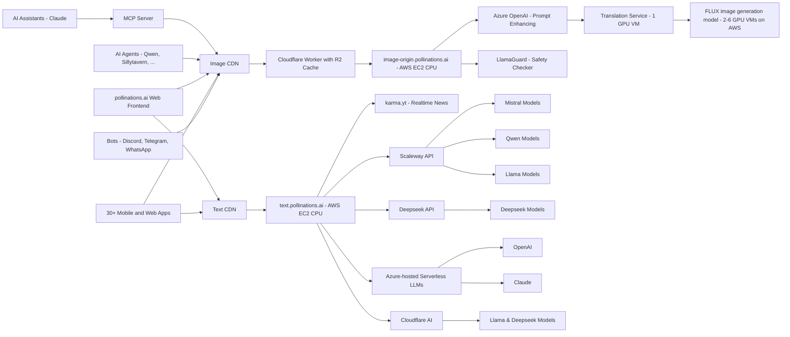

<div align="center">
  
</div>

## 📢 Hacktoberfest News

- **Hacktoberfest 2025 is here!**  
  If you're participating, please check out our [Code of Conduct](./CODE_OF_CONDUCT.md) and [Contributing Guidelines](./CONTRIBUTING.md) before submitting your PRs.
- For event PRs, look for issues tagged with `hacktoberfest` in our [issue tracker](https://github.com/pollinations/pollinations/issues) and join the community effort!

- **Pollinations Hive**  
  We're excited to announce our integration with [Pollinations Hive](https://github.com/pollinations/hive), a curated collection of the top community-created projects within the Pollinations ecosystem. This project is also a part of Hacktoberfest 2025 and is accepting collaborative PRs, make sure to check it out too!


## 🆕 Latest News

- **🧠 Sequa AI Integration** - [Sequa.AI](https://sequa.ai) contextual knowledge engine now available! Provides AI assistants with deep, real-time understanding of codebases and documentation. Configure MCP for Pollinations: `https://mcp.sequa.ai/v1/pollinations/contribute` | [Learn more](https://sequa.ai).
- **🔐 Auth Dashboard** - New and live! Visit [auth.pollinations.ai](https://auth.pollinations.ai) to manage your API tokens and referrer domains. [Learn more](APIDOCS.md#authentication-).
- **💲 Support Us** - You can now support us with our new **Tip Us** button. Optionally connect your Discord account to **Ko-Fi** to get premium Discord roles!
- **🎵 Audio Generation** - New text-to-speech and speech-to-text capabilities are now available! Try the `openai-audio` model - see our [API documentation](APIDOCS.md#audio-generation-api) for details.
- **🤖 AI Code Assistant** - We're excited to announce MentatBot, the autonomous AI coding assistant that implements new features directly from GitHub issues! Simply [create an issue](https://github.com/pollinations/pollinations/issues/new) describing what you'd like to see, and MentatBot will analyze and implement it. [Learn more](https://mentat.ai/).
---

[](https://pollinations.ai/p/3D_wireframe_blueprint_of_the_conceptual_isometric_world_of_Pollinations_AI_a_surreal_hyperrealistic_digital_garden_Elements_emerge_partially_from_all_sides?width=3000&height=1000&seed=-1)

## 🌟 Introduction

[Pollinations.AI](https://pollinations.ai) is an open-source gen AI startup based in Berlin, providing the most easy-to-use, free text and image generation API available. No signups or API keys required. We prioritize your privacy with zero data storage and completely anonymous usage.

## 🚀 Key Features

- 🔓 **100% Open Source**
- 🆓 **_Free to use_**
- 🔒 **Simplicity and privacy:** No logins, no keys, no data stored
- 🖼️ **Embed like any normal image or text**
- 🎵 **Audio generation:** Text-to-speech and speech-to-text capabilities
- 🌍 Free AI image and text generation APIs
- 🤝 Used by various **open-source LLMs**, **bots**, and **communities**
- 🎣 **_Easy-to-use React hooks_** ([React Hooks Examples](https://react-hooks.pollinations.ai/))
- 🤖 **Autonomous Development:** Features implemented by our MentatBot coding assistant through GitHub issues

<a href="https://star-history.com/#pollinations/pollinations&Date">
 <picture>
   <source media="(prefers-color-scheme: dark)" srcset="https://api.star-history.com/svg?repos=pollinations/pollinations&type=Date&theme=dark" width="600" />
   <source media="(prefers-color-scheme: light)" srcset="https://api.star-history.com/svg?repos=pollinations/pollinations&type=Date" width="600" />
   
 </picture>
</a>

## 🚀 Getting Started

[](https://deepwiki.com/pollinations/pollinations)

### Image Generation

1. Visit [https://pollinations.ai](https://pollinations.ai)
2. Type your description in the text box
3. Click "Generate" and watch the magic happen!

### Text Generation

1. Visit [https://text.pollinations.ai](https://text.pollinations.ai)
2. Start chatting with the AI

### Audio Generation

1. Use the `openai-audio` model with our API ([explore voices at OpenAI.fm](https://www.openai.fm/))
2. Generate speech from text or transcribe audio to text

### MCP Server for AI Assistants

Our MCP (Model Context Protocol) server enables AI assistants like Claude to generate images and audio directly. [Learn more](./model-context-protocol/README.md)

#### Configuration

Add this to your MCP client configuration:

```json
{
  "mcpServers": {
    "pollinations": {
      "command": "npx",
      "args": [
        "@pollinations/model-context-protocol"
      ]
    }
  }
}
```

### Run with npx (no installation required)
```bash
npx @pollinations/model-context-protocol
```

Community alternatives like [MCPollinations](https://github.com/pinkpixel-dev/MCPollinations) and [Sequa MCP Server](https://mcp.sequa.ai/v1/pollinations/contribute) are also available.

AI assistants can:
- Generate images from text descriptions
- Create text-to-speech audio with various voice options
- Play audio responses through the system speakers
- Access all Pollinations.AI models and services
- List available models, voices, and capabilities

For more advanced usage, check out our [API documentation](APIDOCS.md).

## 🖥️ How to Use

### Web Interface

Our web interface is user-friendly and doesn't require any technical knowledge. Simply visit [https://pollinations.ai](https://pollinations.ai) and start creating!

### API

Use our API directly in your browser or applications:

    https://pollinations.ai/p/conceptual_isometric_world_of_pollinations_ai_surreal_hyperrealistic_digital_garden

Replace the description with your own, and you'll get a unique image based on your words!

## 🎨 Examples

### Image Generation

Here's an example of a generated image:

[](https://pollinations.ai/p/3d_wireframe_blueprint_for_the_prompt_conceptual%20isometric%20world%20of%20pollinations%20ai%20surreal%20hyperrealistic%20digital%20garden?width=2000&height=500&nologo=true&seed=-1)

Python code to download the generated image:

    import requests

    def download_image(prompt):
        url = f"https://pollinations.ai/p/{prompt}"
        response = requests.get(url)
        with open('generated_image.jpg', 'wb') as file:
            file.write(response.content)
        print('Image downloaded!')

    download_image("conceptual_isometric_world_of_pollinations_ai_surreal_hyperrealistic_digital_garden")

### Text Generation

To generate text, use this URL:

    https://text.pollinations.ai/What%20is%20artificial%20intelligence?

### Audio Generation

To generate audio from text, use this URL:

    https://text.pollinations.ai/Welcome%20to%20Pollinations?model=openai-audio&voice=nova

## 🛠️ Integration

### React Hooks

We offer React hooks for easy integration. Example usage:

    import React from 'react';
    import { usePollinationsImage, usePollinationsText } from '@pollinations/react';
    import ReactMarkdown from 'react-markdown';

    const AIGeneratedContent = () => {
      const imageUrl = usePollinationsImage("Beautiful landscape of Paris with Eiffel Tower", { width: 800, height: 600, seed: 42 });
      const markdown = usePollinationsText("Write a brief travel guide for Paris, including top attractions and local cuisine in markdown", { seed: 42 });

      return (
        <div>
          <h2>AI-Generated Travel Guide</h2>
          
          {markdown ? (
            <ReactMarkdown>{markdown}</ReactMarkdown>
          ) : (
            <p>Loading markdown content...</p>
          )}
        </div>
      );
    };

    export default AIGeneratedContent;

Check out our [Pollinations React Hooks](./pollinations-react/README.md) for more details.

## Architecture


## Projects Using Pollinations.AI

> **⭐ GitHub Star Counts:** Projects with GitHub repositories include star counts to help you gauge their popularity.
> 
> **🆕 NEW Tag:** Projects are marked with the 🆕 emoji when they are recently added. This tag is automatically removed after 15 days from the submission date or if no date is specified.
> 
<!-- AUTO-GENERATED-CONTENT:START -->

> **Note:** Some projects may be temporarily hidden from this list if they are currently broken or undergoing maintenance.

Pollinations.AI is used in various projects, including:

### Vibe Coding ✨

| Project | Description | Creator |
|---------|-------------|--------|
| [Berrry Computer](https://berrry.app) ([⭐ 0](https://github.com/Strawberry-Computer)) | Make tiny self-contained web apps with AI. Find a tweet with an interesting app... | @vgrichina |
| [websim-pollinations-ai](https://websim.pollinations.ai) ([⭐ 0](https://github.com/pollinations/pollinations/tree/master/websim.pollinations.ai)) | A lightweight websim for creating web simulations with AI. Usage:... | @thomash |
| Qwen-Agent ([⭐ 11.5k](https://github.com/QwenLM/Qwen-Agent)) | A framework for developing agentic LLM applications. | - |
| Pollinations Task Master ([⭐ 20](https://github.com/LousyBook94/pollinations-task-master)) | A task management system that uses AI to help break down and organize... | @LousyBook94 |
| [SocialScribe](https://socialscribe.pages.dev/) ([⭐ 1](https://github.com/sh20raj/socialscribe)) | An AI-powered Chrome extension that fixes grammar, rewrites text, and enhances... | @sh20raj |
| [EasyGen - AI Diagram Generator ✨](https://easygenme.netlify.app/) | Modern open-source web application that transforms text descriptions into... | @ellweb3 |
| [Visiora - Image Generation using AI 🎨](https://visiora-img.netlify.app/) ([⭐ 0](https://github.com/Kandariarjun07/Visiora)) | A modern web application that transforms text prompts into stunning... | @Kandariarjun07 |
| [PairFusion](https://pair-fusion.vercel.app/) ([⭐ 0](https://github.com/auraticabhi/PairFusion)) | A real-time AI powered, scalable and feature-rich collaborative IDE built for... | @auraticabhi |
| [CraftUI](https://craftui.studio/) | An AI-powered tool that simplifies UI design by turning text prompts or images... | @imhardikdesai |
| [AI Code Generator](https://codegen.on.websim.com/) | A websim project that generates code from description, selected programming... | @Miencraft2 |
| VibeCoder | A conversational coding environment that lets you create applications by... | @Aashir__Shaikh |
| [JCode Website Builder](https://jcode-ai-website-bulder.netlify.app/) | A website generator using Pollinations text API. | @rtxpower |
| [Pollinations.DIY](https://pollinations.diy) | A browser-based coding environment based on bolt.diy, featuring integrated... | @thomash |
| [NetSim](https://netsim.us.to/) | websim.ai clone that's actually good | @kennet678 |
| [Pollin-Coder](https://pollin-coder.megavault.in) | A free AI-powered website builder that lets anyone create a clean site just by... | @r3ap3redit |
| [JustBuildThings](https://justbuildthings.com) | A natural language programming interface that lets users create web... | @buildmaster |
| [Websim](https://websim.ai/c/bXsmNE96e3op5rtUS) | A web simulation tool that integrates Pollinations.ai. | @thomash |

### Creative 🎨

| Project | Description | Creator |
|---------|-------------|--------|
| MoneyPrinterTurbo ([⭐ 39.9k](https://github.com/harry0703/MoneyPrinterTurbo)) | Simply provide a topic or keyword for a video, and it will automatically... | @harry0703 |
| [FoldaScan](https://fs.wen.bar) ([⭐ 178](https://github.com/0010skn/WebFS-Toolkit-Local-Folder-Scan-Monitor-Versioning-AI-Prep)) | Use Natural Language to "Converse" with Your Codebase, Folda-Scan Smart Project... | @0010skn |
| [Elixpo-Art](https://elixpo-art.com) ([⭐ 18](https://github.com/elixpo/art-platform)) | A digital art platform that combines AI image generation with traditional... | @elixpo |
| Match-cut video ai ([⭐ 17](https://github.com/lrdcxdes/text-match-cut)) | This AI generates video from text in match-cut text style, uses pollinations... | @r3ap3redit |
| [Elixpo Art](https://elixpoart.vercel.app) ([⭐ 8](https://github.com/Circuit-Overtime/elixpo_ai_chapter)) | A Web interface to create thematic images from prompts, with multiple aspect... | Ayushman Bhattach... |
| [POLLIPAPER](https://github.com/Tolerable/POLLIPAPER) | A dynamic wallpaper app that uses Pollinations AI. | @intolerant0ne |
| [Elixpo Art Chrome Extension](https://chromewebstore.google.com/detail/elixpo-art-select-text-an/hcjdeknbbbllfllddkbacfgehddpnhdh) ([⭐ 8](https://github.com/Circuit-Overtime/elixpo_ai_chapter/tree/main/Elixpo%20Chrome%20%20Extension)) | It uses the pollinations image endpoint to generate an image with `boltning` as... | Ayushman Bhatacharya |
| Pollinations.ai Image Generation (for Frame) ([⭐ 7](https://github.com/CitizenOneX/frame_pollinations)) | A Flutter application that listens for image generation prompts, requests... | CitizenOneX |
| [Imagen](https://altkriz.github.io/imagen/) ([⭐ 3](https://github.com/altkriz/imagen)) | A beautiful web interface for generating images using Pollinations.ai API with... | @altkriz |
| MASala ([⭐ 3](https://github.com/Naman009/MASala)) | Multi-Agent AI That Cooks Up Recipes Just for You ~ From fridge to feast,... | @Naman009 |
| [Imagen](https://altkriz.github.io/imagen/) ([⭐ 3](https://github.com/altkriz/imagen)) | A beautiful web interface for generating images using Pollinations.ai API with... | @altkriz |
| [CatGPT Meme Generator 🐱](https://pollinations.github.io/catgpt/) ([⭐ 2](https://github.com/pollinations/catgpt)) | Transform your questions into sassy cat wisdom! An AI-powered meme generator... | @voodoohop |
| [Dreamscape AI](https://dreamscape.pinkpixel.dev) ([⭐ 2](https://github.com/pinkpixel-dev/dreamscape-ai)) | Dreamscape AI is a creative studio for generating, enhancing, and transforming... | @sizzlebop |
| [Imagine Draw AI 🎨](https://imaginedrawai.vercel.app/) ([⭐ 0](https://github.com/TechWithAiTelugu)) | Free AI image generator for creating unlimited images with text prompts. No... | @techwithai-telugu |
| [Ai Studio 🎨](https://ai-studio-pollinations.netlify.app/) ([⭐ 0](https://github.com/sabbirhossainc/ai-studio-pollinations.git)) | React application for AI image generation with model selection, image... | @sabbirhossainc |
| [Gainzr AI 🎨](https://gainzr.my) | Web-based AI image generator for creating high-quality images from text prompts... | @bwava |
| [Dreamator-AI 💫](https://dreamator-ai.vercel.app/) | Transform your imagination into reality using Pollinations API. Clean and... | @its3li |
| [YooAI 🎨](https://yooai.co/) | All-in-one AI creation platform integrating AI-Writer, AI-Video, and free image... | [yoo_ai@outlo...](mailto:yoo_ai@outlook.com) |
| 🖥️ Image Generator by Quilix 🖼️ ([⭐ 0](https://github.com/quil1x/ImageBYquilix)) | A beautiful desktop application for generating AI images using Pollinations.AI... | @quil1x |
| [Imagen - AI Image Generator 🎨](https://altkriz.github.io/imagen/) ([⭐ 0](https://github.com/altkriz/imagen)) | A beautiful, open-source web interface for generating AI images using the... | @altkriz |
| 🆕 [mayaAI 🇪🇸](https://mayaia.pages.dev/) | Maya ia es una inteligencia artificial para generar imagenes usando... | @moimoyyyy-sys |
| 🆕 [GenImage 🎨](https://genimage.runasp.net/) | Text to image generation tool | @artydev |
| 🆕 [Anime Comic Movie 🎬](https://petersebring.com/showcase.php) | An ambitious anime comic movie project using Pollinations' Kontext and Flux... | @sebastianpw |
| 🆕 [Imagine Draw AI 🎨](https://imaginedrawai.vercel.app/) ([⭐ 0](https://github.com/TechWithAiTelugu)) | A powerful and 100% free text-to-image generator. Just type your prompt and get... | @techwithai-telugu |
| 🆕 DirPixel 🎨 ([⭐ 0](https://github.com/techcow2/dir-pixel)) | Sometimes creators need to replace multiple images in a directory with new... | @techcow2 |
| 🆕 [Prompt2Image 🎨](https://marketplace.visualstudio.com/items?itemName=MaazSaboowala.prompt2image-ai-generator) | Prompt2Image is a Visual Studio Code extension that brings AI-powered image... | @MaazS07 |
| [StoryWeaver AI 📚](https://storyweaver-ai-umber.vercel.app/) ([⭐ 0](https://github.com/Karannn3011/storyweaver-ai)) | A real-time, collaborative storyboarding application that empowers users to... | @Karannn3011 |
| [Mixbash.com 🛠️](https://mixbash.com) | Mixbash is a better UI layer to use SOTA AI models hosted on Pollinations, Fal,... | @jiajasper |
| [Pollinations AI Demo](https://pollinationsaidemo.netlify.app/) ([⭐ 0](https://github.com/Wormix48/Pollinations-AI-Demo)) | Images generator | @Wormix48 |
| 🇧🇷 [🇧🇷 CapyUniverse - CapyIMG](https://capyuniverse.pages.dev/capyimg.html) ([⭐ 0](https://github.com/faelscarpato/capyuniverse)) | Ferramenta simples para criar imagens com IA diretamente no navegador. O... | @faelscarpato |
| [🇹🇷 CVRON AI - Free İmage Generator](https://cvronai.rf.gd) | Resim Oluşturma İşlemleri İçin Pollinations API yi kullanmakta (Uses... | @cr7 |
| [Ai image generator 🎨](https://ris-imago.vercel.app/) | A React-based AI image generator that transforms user prompts into high-quality... | [rishabhmishr...](mailto:rishabhmishra.81e@gmail.com) |
| 🇨🇳 [🇨🇳 AI Image Generator](https://ai-pic.site/) | Create Amazing Images with AI. Generate stunning images from text descriptions... | cf12436 |
| [aitoolbox.software 🛠️](https://aitoolbox.software/) ([⭐ 0](https://github.com/huamanraj/aitoolbox.software)) | An open-source collection of AI-powered tools to boost your productivity and... | @huamanraj |
| [Evolve AI 🤖](https://evolve-ai-gamma.vercel.app/) ([⭐ 0](https://github.com/chandankumarm55/Evolve-ai)) | Evolve AI is an intelligent assistant platform that brings together a variety... | @chandankumarm55 |
| [What is this? ❔](https://whatisthis.pinkpixel.dev/) ([⭐ 0](https://github.com/pinkpixel-dev/what-is-this)) | A fun AI-powered object identification tool that helps you identify mysterious... | @sizzlebop |
| [🇷🇺 Aimpress](https://aimpress.ru/) | AIMpress is a web-based image generation platform that allows users to create... | [support@aimp...](mailto:support@aimpress.ru) |
| [Vizbo 📱](https://vizboapp.com/) | Vizbo is a mobile app for AI powered vision board creation. | [visbo.app@gm...](mailto:visbo.app@gmail.com) |
| [Imagine Draw AI 🎨](https://imaginedrawai.vercel.app/) ([⭐ 0](https://github.com/TechWithAiTelugu)) | This AI image was created for free using ImagineDraw AI a powerful tool to... | TechWithAiTelugu |
| [EzPromptla](https://ezpromptla.netlify.app) | EzPromptla is an advanced visual prompt builder and creative partner designed... | [mohamadizuan...](mailto:mohamadizuanbakar@gmail.com) |
| [Argent Script](https://perchance.org/ai-text-to-audio) | AI Voice Generator - Generate text to audio for free and without limits,... | [Link](https://github.com/withthatway) |
| [Unfoldtech](https://studio.unfoldtech.online/) | Easily generate new images inspired by the Pexels website with embedded IPTC... | [kengkreingkr...](mailto:kengkreingkrai@gmail.com) |
| [Celebrity AI Image Generator](https://www.aicelebrity.design/) ([⭐ 0](https://github.com/Colin-Zero)) | An AI-powered celebrity image generator that uses Pollinations.ai and a1.art... | @Colin-Zero |
| [Coloring AI 🎨](https://coloring-ai.com/) | An intelligent web-based coloring assistant that turns black-and-white sketches... | [962900862@qq...](mailto:962900862@qq.com) |
| [JSON Pollinations API](https://pollinations-json.deno.dev/openai) | A Deno Deploy API wrapper for Pollinations that provides JSON-formatted... | @apersonwhomakess... |
| [MrEgonAI](https://mr-egon-ai.vercel.app/) | An image generator powered by pollinations.ai and its image generation models.... | @mregon |
| [Image Creator](https://saepulwap.blogspot.com/p/flux-image-creator.html) | Create images with multi-language prompts, the language will be automatically... | [Link](https://facebook.com/403.frobidden) |
| [Avatar GenStudio](https://astudio-dcae4.web.app) | A system for creating custom characters that uses the Pollinations API for... | @nic-wq |
| [StoryBolt](https://storybolt.vercel.app/) ([⭐ 0](https://github.com/sahilalamgir/StoryBolt)) | Generate stories with enticing narratives and beautiful illustrations. Users... | @gumbasil |
| [CalcuBite AI](https://calcubite.vercel.app/) | CalcuBite AI is a smart tool that analyzes food from images to provide calorie... | @sugamdeol |
| 🇮🇩 [Generator AI Image 🇮🇩](https://kenthir.my.id/advanced-generator/) | Advanced AI Image Generator adalah platform inovatif yang memungkinkan Anda... | @kenthirai |
| [NailsGen](https://www.nailsgen.com/) | Create beautiful nail art designs with AI. Generate unique nail art designs... | [lipengliang2...](mailto:lipengliang2012@163.com) |
| [ImageGen AI Image](https://imagegenaiimage.com/) | Generate high-quality AI images for any purpose. Features a variety of models... | [Link](https://www.linkedin.com/in/narendradwivedi) |
| 🇮🇩 [RuangRiung AI Image 🇮🇩](https://ruangriung.my.id) ([⭐ 0](https://github.com/ruangriung)) | RuangRiung AI Image Generator is ideal for digital artists, designers, or... | @ruangriung |
| [PollinateAI](https://pollinateai.vercel.app) ([⭐ 0](https://github.com/Auspicious14/image-generator-fe.git)) | PollinateAI is an image generation platform that aims to ease the stress of... | @Auspicious14 |
| [FlowGPT](https://flowgpt.com/p/instant-image-generation-with-chatgpt-and-pollinationsai) | Generate images on-demand with ChatGPT! | - |
| [Image Gen - Uncensored Edition](https://huggingface.co/chat/assistant/66fccce0c0fafc94ab557ef2) | A powerful image generation assistant on HuggingChat. | @DeFactOfficial |
| [Foodie AI](https://foodie-ai.vercel.app/) | An AI application for food analysis that uses advanced artificial intelligence... | @Aashir__Shaikh |
| [AIMinistries](https://www.ai-ministries.com) | A collection of free AI tools including AI chat, writing tools, image... | @tolerantone |
| [The Promised Pen](https://promisedpen.app) | A free, feature-rich novel writing application that helps writers organize... | @soryn.san |
| 🇨🇳 [Text2Image_audio 🇨🇳](nihilistic.dpdns.org) ([⭐ 0](https://github.com/wtliao/text2image)) | 文生图与文生语音网站 - 一个初学者的AI编程项目，支持文本转图像和音频生成功能。(Text to Image and Text to Audio... | @peyoba |
| 🇨🇳 [Aiphoto智能绘画 🇨🇳](https://qiyimg.3d.tc/Aiphoto) | AI艺术工坊 - 智能绘画生成器。这是一个基于AI的绘画生成工具，可以根据用户输入的中文描述自动生成相应的图片。(An AI art workshop -... | @qiyimg |
| 🖥️ AI YouTube Shorts Generator | Python desktop app that automates YouTube Shorts creation with AI-generated... | @Sami-Alsahabany |
| 🤖 [Emojiall AI Drawing Platform](https://art.emojiall.com) | A platform focused on allowing users to draw pictures according to their own... | @James-Qi |
| [PixPal](https://pixpal.chat) | PixPal is a free AI assistant that can analyze, edit, and generate images,... | @andreas_11 |
| 🇪🇸 [🇪🇸 Generador de presentaciones con imágenes y texto V2](https://proyectodescartes.org/IATools/Crea_presentaciones4/) | Una herramienta configurable que permite crear presentaciones con 3 a 20... | @juanrivera126 |
| [🇪🇸 Yo el director](https://yoeldirector.dpana.com.ve) | Web para crear peliculas y contenido para youtube, usando Pollinations (Web... | @henryecamposs |
| [Imagemate AI](https://play.google.com/store/apps/details?id=com.madameweb.imgmate) | Imagemate AI is a powerful image generation app designed to turn your... | @Shanto-Islam |
| [B&W SVG Generator](https://fluxsvggenerator.streamlit.app/) | Uses Flux (through pollinations) and potrace to create B&W Vector files | @pointsguy118 |
| [TurboReel](https://turboreel.framer.ai/) | A fast AI video generation service for social media content, leveraging... | @turbo_reels |
| [Anime Character Generator](https://perchance.org/ai-character-generator) | A dedicated AI tool for generating high-quality, unique anime-style characters.... | @AnimeArtDevs |
| [AI PPT Maker](https://slidesgpt.com) | An AI-powered presentation generator that creates PowerPoint slides from text... | @ppt_monster |
| [Promptgenerator.art](https://promptgenerator.art) | FREE Art Prompt Generator that helps you turn simple ideas into structured... | [info@promptg...](mailto:info@promptgenerator.art) |
| 🤖 [☬SHΞNΞRATOR 🎨](https://Shervinuri.github.io) ([⭐ 0](https://github.com/Shervinuri/Shervinuri.github.io)) | AI image and text generator with dual functionality. Features both image... | [Link](https://T.me/shervinuri) |
| 🆕 [Image Generation Playground](https://umint-image.hf.space) ([⭐ 0](https://huggingface.co/spaces/umint/image/tree/main)) | Transform your ideas into a visual masterpiece. Part of the UltimaX... | @hadadarjt |
| [Pollinator Android App](https://github.com/g-aggarwal/Pollinator) | An open-source Android app for text-to-image generation. | @gaurav_87680 |
| StorySight ([⭐ 14](https://github.com/tangg555/story-generation-demo)) | An AI tool that generates illustrations for stories and articles using... | @story_viz |
| 🇮🇩 [Generator Text AI 🇮🇩](https://app.ariftirtana.my.id/) ([⭐ 1](https://github.com/ayick13/app)) | Text-to-image generator using Pollinations, supporting Indonesian and English... | @ayick13 |
| [Musify - AI Enhanced Music Streaming](https://musify-sd.vercel.app/) | Musify is your AI-powered music buddy, making your jam sessions smarter and... | @Sugamdeol |
| 🇧🇷 Case Me 🇧🇷 | A vending machine that creates customized phone cases with photos or other... | [anaboxmania@...](mailto:anaboxmania@gmail.com) |
| 🤖 [Zelos AI image generator](https://websim.ai/@ISWEARIAMNOTADDICTEDTOPILLOW/ai-image-prompt-generator) | It uses Pollinations for both prompt enhancing and image generation, it was a... | [Link](https://www.roblox.com/users/4361935306/profile) |
| [Own-AI](https://own-ai.pages.dev/) | An AI text-to-image generator. | Sujal Goswami |
| [Pollinations.ai Model Comparison](https://endemicmedia.github.io/FLARE/llm-comparison-tool/) ([⭐ 0](https://github.com/EndemicMedia)) | An interactive tool designed to compare outputs from various large language... | [Link](https://github.com/dseeker) |
| 🇨🇳 [IMyself AI 🇨🇳](https://openai.lmyself.top/) | 我们提供高质量的AI生成服务，包括图像生成、文本生成、音频生成和语音转文本服务， 让您轻松创建各种创意内容。 (We provide high-quality... | Shadownc |

### Games 🎲

| Project | Description | Creator |
|---------|-------------|--------|
| [Mindcraft](https://mindcraft.riqvip.dev/) ([⭐ 3.5k](https://github.com/mindcraft-ce/mindcraft-ce)) | A web-based Minecraft-inspired game where players can use natural language to... | @mindcraft_team |
| AI Character RP (Roblox) ([⭐ 10](https://github.com/snipcola/Roblox-AI)) | A Roblox game that lets players interact with AI characters powered by... | @roblox_ai_dev |
| Minecraft AI (Python) ([⭐ 7](https://github.com/Amagash/minecraft-ai-python)) | A Python implementation that uses Pollinations AI to control a Minecraft... | @Amagash |
| 🇨🇳 [🇨🇳 云渺仙途：凡尘篇](https://ai-game.jkai.de/) ([⭐ 7](https://github.com/ZhjGo/ai-game)) | 《云渺仙途：凡尘篇》是一个由AI驱动的文字修仙沙盒游戏 (An AI-driven text cultivation sandbox game... | @ZhjGo |
| [DreamHer](https://dreamher.vercel.app/) ([⭐ 2](https://github.com/creation22/DreamGirl)) | Interactive web app that transforms your imagination of a 'dream girl' into a... | @_Creation22 |
| Sirius Cybernetics Elevator Challenge ([⭐ 1](https://github.com/pollinations/sirius-cybernetics-elevator-challenge)) | A programming challenge that uses Pollinations AI to simulate... | @sirius_dev |
| [AIStorium](https://aistorium.vercel.app/) ([⭐ 1](https://github.com/artegoser/ai-storium)) | Service for generating dynamic stories. Generates stories, images and audio by... | @artegoser |
| [Chaos Canvas 🎲](https://chaoscanvas.app/) | Crowdsourced creativity experiment where each player adds just one or two words... | @eat-sleep-code |
| RoastMaster AI | No detailed description available, but likely a creative/entertainment tool (AI... | - |
| Pollinations AI Game ([⭐ 0](https://github.com/ednsinf/pollinations-ai)) | A Hitchhiker's Guide to the Galaxy themed LLM-based elevator game. | @game |
| [Favorite Puzzles](https://radbrothers.com/games/favorite-puzzles/) | A jigsaw puzzles game for Android, iOS, and web that uses Pollinations feed as... | [contact@radb...](mailto:contact@radbrothers.com) |
| [Juego de Memorizar con Pollinations](https://memorizar-pollinations.vercel.app/) | A memory game that uses Pollinations AI to generate unique image pairs for... | @edudev_es |
| [Abyss Ascending](https://interzone.art.br/abyss_ascending/) | A generative cosmic ocean adventure - text-based RPG with AI-driven... | @interzone |
| [Deep Saga](https://deepsaga.io) | An immersive role-playing game with AI-generated worlds, characters, and quests... | @saga_studios |
| [Infinite World – AI Game](https://infinite-world-game.vercel.app/) | An exploration game with procedurally generated environments and creatures... | @infinite_world_dev |
| [A Mita (Roblox)](https://www.roblox.com/games/118762581800441/A-Mita) | A Roblox game about interacting with AI with different personalities. Features... | @thespecificdev |
| [🕰️ Time Travel Selfie Portal](https://selfie-time-traveler-portal.vercel.app) | Upload your selfie, background is automatically removed. Choose a historical... | @Argyrisk21 |
| [Convince the Weird Maid to Let You Leave the House (Roblox)](https://www.roblox.com/games/120881450499910/Convince-the-Weird-Maid-to-Let-You-Leave-the-House) | A Roblox game where a weird maid traps you inside her house. Your goal is to... | @wBrowsqq |
| [Aiko AI: With You Til The End (Roblox)](https://www.roblox.com/games/91780007937760/Aiko-AI-With-You-Till-The-End-BETA) | A psychological escape room game where you're trapped by Aiko, an AI with a... | @youssefelsafi |
| [RETIME - FABRIC OF REALITY](https://rivatech-games.itch.io/retime) | A text-based, blind friendly fantasy adventure game powered by Pollinations AI.... | @TheSingleAlgeria... |
| [🧩 AI Word Search](https://play.google.com/store/apps/details?id=com.aiwords.app) | AI-powered Android app that generates unlimited, personalized word search... | [hello@island...](mailto:hello@islandapps.dev) |
| [roastmyselfie.app](https://roastmyselfie.app) | AI Personality Analyzer - Get roasted and psychoanalyzed.. just from one... | @andres_11 |
| [Watch TV with neko (Roblox)](https://www.roblox.com/games/15087497266/UPD-Watch-TV-with-neko-AI) | Roblox game where you can talk with AI catgirls 🐾 or just have fun, talking... | [Link](https://www.roblox.com/users/3857849039/profile/) |
| Infinite Tales ([⭐ 29](https://github.com/JayJayBinks/infinite-tales-rpg)) | Interactive storytelling platform powered by AI that creates endless narrative... | @infinite_tales |

### Hack-&-Build 🛠️

| Project | Description | Creator |
|---------|-------------|--------|
| tgpt ([⭐ 2.9k](https://github.com/aandrew-me/tgpt)) | ChatGPT in terminal without requiring API keys. Uses Pollinations API endpoints... | @aandrew-me |
| 🛠️ AI Content Describer ([⭐ 59](https://github.com/cartertemm/AI-content-describer/)) | An extension for NVDA, the free and open-source screen reader for Microsoft... | @cartertemm |
| 💻️ Windows Walker ([⭐ 14](https://github.com/SuperShivam5000/windows-walker)) | Windows Walker – What Copilot for Windows should have been. AI-powered Windows... | @supershivam |
| [Mimir AIP](https://mimir-aip.github.io/) ([⭐ 11](https://github.com/Mimir-AIP/Mimir-AIP)) | An AI integration platform for developers. | @CiaranMcAleer |
| CoNavic ([⭐ 8](https://github.com/mkantwala/CoNavic/)) | A free, open-source browser extension that brings the power of ChatGPT and... | @mkantwala |
| Pollinations.AI Enhancer ([⭐ 6](https://github.com/fisventurous/pollinationsai-enhancer)) | A frontend-based AI interface designed to deliver a smooth, multimodal, and... | @fisven |
| Server Status Dashboards ([⭐ 6](https://github.com/hverr/status-dashboard)) | A monitoring tool for tracking and visualizing server performance metrics,... | @devopper |
| [unpkg.ai](https://unpkg.ai) ([⭐ 5](https://github.com/Strawberry-Computer/unpkg.ai)) | AI-powered ESM module generation service that creates JavaScript modules... | @vgrichina |
| [WordPress AI Vision Block](https://wordpress.org/plugins/ai-vision-block/) ([⭐ 5](https://github.com/mahmood-asadi/ai-vision-block)) | A custom WordPress Gutenberg block that allows you to generate images using the... | mahmood-asadi |
| DominiSigns ([⭐ 4](https://github.com/cmunozdev/DominiSigns)) | Avatar Translator for Dominican Sign Language that uses artificial intelligence... | @cmunozdev |
| [🌱 Strain Navigator](https://www.strainnavigator.com/) ([⭐ 1](https://github.com/Tolerable/strainnavigator)) | A collection of tools to help Growers, Breeders & Seed Bankers. Free & Open... | @Tolerable |
| YankoviC ([⭐ 1](https://github.com/Sweaterdog/YankoviC)) | A programming language interpreter written in JavaScript that emulates C/C++... | @Sweaterdog |
| 🆕 MultiAgent 🤖 ([⭐ 0](https://github.com/LKosoj/multiagent)) | Advanced multi-agent system for solving complex tasks using specialized AI... | @LKosoj |
| [Pollinations OpenAI Proxy](https://pollinationsopenaiproxy.vercel.app/) ([⭐ 0](https://github.com/percival-de-galles/pollinations_openai_proxy)) | A thin FastAPI layer that exposes OpenAI-compatible endpoints and proxies to... | @percival-de-galles |
| 🖥️ [Pollinations MCP Server (Official)](https://www.npmjs.com/package/@pollinations/model-context-protocol) ([⭐ 0](https://github.com/pollinations/pollinations/tree/main/model-context-protocol)) | Official Model Context Protocol server for Pollinations AI services. Generate... | @pollinations |
| [Sequa MCP Server](https://mcp.sequa.ai/v1/pollinations/contribute) | A Model Context Protocol server from Sequa.ai that provides deep knowledge of... | @sequa_ai |
| [FoodAnaly](https://foodanaly.vercel.app/) | An AI application for food analysis that uses advanced artificial intelligence... | [liukang0120@...](mailto:liukang0120@163.com) |
| [Herramientas IA](https://herramientas.ia) | Tools designed with Pollinations.AI and the DescartesJS editor, including tools... | @herramientas |
| [Pollinations AI Free API](https://pollinations-ai-free-api.vercel.app/) | This project provides a free API interface supporting various text and image... | @freeapi |
| [DominiSigns](https://www.template.net/ai-sign-generator) ([⭐ 0](https://github.com/dominicva/dominisigns)) | A WordPress block plugin that lets users create AI-generated images through the... | @dominicva |
| 🤖 [DynaSpark API](https://th3-ai.github.io/DynaSpark) ([⭐ 0](https://github.com/Th3-AI/DynaSpark)) | The DynaSpark API provides simple yet powerful AI capabilities for text... | @Th3-C0der |
| [Querynator5000](https://querynator5000.onrender.com/) ([⭐ 0](https://github.com/SuperShivam5000/querynator5000)) | Modern AI-first SQL interface for exploring and manipulating databases with... | @SuperShivam5000 |
| [UltimaX Intelligence CLI](https://huggingface.co/spaces/umint/cli) | Extension of the UltimaX Intelligence project based on Pollinations Python SDK. | @hadadarjt |
| [AI Agent Portal](https://agent.makululinux.com/) ([⭐ 0](https://github.com/raymerjacque/Makulu-Agent-Portal)) | A next-generation development environment that leverages a sophisticated... | @raymerjacque |
| [pollinations.ai Python SDK](https://github.com/pollinations-ai/pollinations.ai) | Official Python SDK for working with Pollinations' models. | @pollinations-ai |
| MCPollinations (Community) ([⭐ 32](https://github.com/pinkpixel-dev/MCPollinations)) | Community-maintained Model Context Protocol server with advanced features like... | @pinkpixel-dev |
| Herramientas IA ([⭐ 26](https://github.com/cusanotech/90-herramientas-de-inteligencia-artificial)) | Tools designed with Pollinations.AI and the DescartesJS editor, including tools... | @juanrivera126 |
| [pollinations_ai](https://pub.dev/packages/pollinations_ai) | Dart/Flutter package for Pollinations API. | @Meenapintu |
| pollinations NPM Module | JavaScript/Node.js SDK for Pollinations API. | - |
| [pypollinations](https://pypi.org/project/pypollinations/) | Comprehensive Python wrapper for Pollinations AI API. | @KTS-o7 |
| [@pollinations/react](https://www.npmjs.com/package/@pollinations/react) | React hooks for easy integration of Pollinations' features. | @pollinations |
| Polli API Dashboard | Dashboard for managing/interacting with Pollinations API. | - |
| 🇨🇳 [imggen.top 🇨🇳](https://www.imggen.top/) | Create stunning AI-generated images in seconds with our free AI image... | [lipengliang2...](mailto:lipengliang2012@163.com) |
| 🇨🇳 [Quicker Pollinations AI](https://getquicker.net/Sharedaction?code=9ac738ed-a4b2-4ded-933c-08dd5f710a8b&fromMyShare=true) | This project provides a free API interface supporting various text and image... | [Link](https://linux.do/u/s_s/summary) |

### Chat 💬

| Project | Description | Creator |
|---------|-------------|--------|
| gpt4free ([⭐ 65.1k](https://github.com/xtekky/gpt4free)) | The official gpt4free repository - various collection of powerful language... | xtekky |
| [LobeChat](https://lobechat.com) ([⭐ 21.0k](https://github.com/lobehub/lobe-chat)) | An open-source, extensible chat UI framework supporting multiple models and... | @lobehub |
| [SillyTavern](https://docs.sillytavern.app/) ([⭐ 14.7k](https://github.com/SillyTavern/SillyTavern)) | An LLM frontend for power users. Pollinations permits it to generate text and... | - |
| 🆕 🖥️ [LLMS](https://yassineabou.github.io/LLMs-Wasm/) ([⭐ 88](https://github.com/yassineAbou/LLMS)) | LLMS is a Kotlin Multiplatform application that brings the power of AI to... | @yassineAbou |
| 🇨🇳 [FreeAI 🇨🇳](https://freeai.aihub.ren/) ([⭐ 44](https://github.com/Azad-sl/FreeAI)) | An AI application platform based on Pollinations.AI API, providing free and... | @Azad-sl |
| [DynaSpark AI](https://dynaspark.onrender.com) ([⭐ 20](https://github.com/Th3-C0der)) | A versatile AI assistant with advanced image and text generation capabilities. | Th3-C0der |
| [OkeyMeta](https://playground.okeymeta.com.ng/) ([⭐ 10](https://github.com/okeymeta/okeymeta)) | OkeyMeta is an AI Playground that allows you to chat with different AI models,... | @okeymeta |
| [LLM7.io](https://llm7.io) ([⭐ 7](https://github.com/chigwell/llm7.io)) | A free and open AI platform providing advanced multimodal capabilities,... | @chigwell |
| toai.chat ([⭐ 2](https://github.com/Veallym0n/toai.chat)) | An AI-client-free project dedicated to enabling AI interaction using only curl,... | @Veallym0n |
| [EvilChat 🔥🤖](https://altkriz.github.io/evilchat/) ([⭐ 2](https://github.com/altkriz/evilchat)) | An uncensored AI chat interface with dark, sleek design, smooth animations,... | @altkriz |
| 🤖 🇮🇩 [Rizqi O Chatbot 🇮🇩](https://chatbot.rizqioliveira.my.id) ([⭐ 1](https://github.com/ray23-bit/Projectenam)) | Rizqi O Chatbot adalah proyek berbasis Pollinations yang menggabungkan tiga... | @ray23-bit |
| [ Comeback AI](https://comeback-ai.pinkpixel.dev) ([⭐ 1](https://github.com/pinkpixel-dev/comeback-ai)) | AI-powered clapback machine that transforms mean comments into witty comebacks... | @sizzlebop |
| [WorksparkAI [BETA] 💼](https://worksparkai-983563815856.europe-west1.run.app) | Modern ChatGPT alternative with document processing, PDF reading, image... | @obezbolen67 |
| [iTouch 💭](https://jordanpeteroliver.github.io/itouch/) ([⭐ 0](https://github.com/jordanpeteroliver/itouch)) | Chat where images and texts integrate. A poetic journey to where inspiration... | @jordanpeteroliver |
| [Hythme AI 🇸🇦](https://hythme.com) | Arabic AI platform specialized in coding, social engineering, information... | @hythme |
| [Petfuse Image Generator 🐾](https://petfuse.xyz/) | Chat and generate images with custom seed control. Features a public gallery... | @yasmeenanti08-cr... |
| 🖥️ [PrisimAI 💬](https://prisimai.github.io/PrisimAI) ([⭐ 0](https://github.com/PrisimAI/PrisimAI)) | A lightweight, browser-based AI chat application designed to run seamlessly as... | @CloudCompile |
| 🆕 [VOHU AI 🇮🇷](https://www.vohuapp.ir) | VOHU AI is an Iranian AI that, in collaboration with Pollinations.AI, offers... | [info@vohuapp.ir](mailto:info@vohuapp.ir) |
| 🆕 [Strapick Chat](https://strapick-chat.vercel.app/) ([⭐ 0](https://github.com/MMojoCoder/Strapick-Chat)) | A minimalistic chat UI for pollinations AI. | @mmojocoder |
| 🆕 [Chad GPT](https://chadgpt0.vercel.app/) | AI Text, Image, and Audio Generator powered by Pollinations AI API. A... | [Link](https://sawwqib.vercel.app) |
| [チャットGPT 日本語 🇯🇵](https://chatgpt-jp.org/) | チャットGPT 日本語無料版 (Free Japanese version of ChatGPT) | [Link](https://x.com/zhugezifang) |
| [EasyGen](https://easygenme.netlify.app/) | AI-powered tool that generates Mermaid diagrams and flowcharts from... | @Ellweb3 |
| 🤖 [Botzy AI 🇵🇰](https://botzy.hexabiz.com.pk) | A free, unlimited, multilingual AI chatbot designed for Pakistani users.... | @zakrya6665 |
| [Island](https://islandai.app) ([⭐ 0](https://github.com/techcow2/Island)) | Island AI is a free, modern ChatGPT alternative featuring smart multimodal... | @techcow2 |
| [UltimaX Intelligence](https://umint-ai.hf.space) ([⭐ 0](https://huggingface.co/spaces/umint/ai/tree/main)) | UltimaX Intelligence is a free AI platform that unifies multiple premium AI... | @hadadarjt |
| 🤖 [VOID.AI](https://thevoidai.vercel.app/) ([⭐ 0](https://github.com/Ajay-Dhakad/VOID.AI)) | A humanlike AI mentor, productivity partner, and emotionally intelligent... | @Ajay-Dhakad |
| [J.A.R.V.I.S.](https://huggingface.co/spaces/hadadrjt/ai) | Just a Rather Very Intelligent System - an advanced AI language model inspired... | @hadadarjt |
| [Ai drafterplus](https://ai.drafterplus.nl/) | A ChatGPT-like interface with multiple AI models. Completely free and saves... | @dexvisser_ |
| [Unity AI Lab](https://unity.unityailab.com/) | A specialized uncensored LLM model built on Mistral Large, focused on... | - |
| [Neurix 🇷🇺](https://neurix.ru) | A website offering easy and free access to various neural networks, with... | @Igroshka |
| Echo AI | A chat interface for AI interactions and conversations. | Unknown |
| [DreamBig - Generative AI Playground](https://dreambiglabs.vercel.app/) | Interactive AI playground with chat, image generation, and voice responses for... | @opzzxsprinta._999 |
| [Pal Chat](https://apps.apple.com/us/app/pal-chat-ai-chat-client/id6447545085?platform=iphone) | An iOS app that integrates with all LLMs including Pollinations AI models in... | [Link](https://x.com/pallavmac) |
| [Pollinations AI Playground](https://pollinations-ai-playground.vercel.app/) | An AI application platform based on Pollinations.AI API, providing free and... | @playground |
| [Image Gen - Uncensored Edition](https://huggingface.co/chat/assistant/66fccce0c0fafc94ab557ef2) | An uncensored image generation tool that allows for creative freedom without... | @flowgpt |
| 🇨🇳 [Pollinations.AI 中文](https://pollinations.vercel.app) | 我们提供高质量的AI生成服务，包括图像生成、文本生成、音频生成和语音转文本服务， 让您轻松创建各种创意内容。 (We provide high-quality... | @pollinations |
| [Anisurge](https://anisurge.me) | A free anime streaming app with a public chat feature that allows users to chat... | @iotserver24 |
| 🖥️ [AI Chat](https://aichat.narendradwivedi.org) | A Windows desktop application that brings multiple AI models together in one... | @narendradwivedi |
| 🤖 [Free AI Chatbot & Image Generator](https://vercel.com/templates/ai/ai-sdk-image-generator) ([⭐ 0](https://github.com/vercel/ai/tree/main/examples/ai-image-generator)) | A web application offering both conversation with AI and image generation... | @aidevs |
| [DeepSeek Prompt](https://www.deepseekprompt.top/) | DeepSeek Prompt is a front-end application for managing and optimizing AI... | [lipengliang2...](mailto:lipengliang2012@163.com) |
| [AI Dream Girl Studio](https://www.tiktok.com/@herinyourhead) | AI Dream Girl Studio is a content creation pipeline built around... | [Link](https://www.tiktok.com/@herinyourhead) |
| 🤖 [PixPax](https://pixpal.chat) | A user-friendly chatbot that lets you analyze images, remix existing images or... | @andreas_11 |
| 🤖 [Mirexa AI Chat](https://mirexa.vercel.app) | A state-of-the-art AI chatbot that seamlessly integrates multiple LLMs with... | @withthatway |
| [AI Chat](https://aichat.jolav.me/) | A simple and elegant chat interface for interacting with various AI models... | @jolav |
| [KoboldAI Lite](https://lite.koboldai.net/) | A lightweight version of KoboldAI that uses Pollinations for text generation,... | @kobold_dev |
| 🤖 Jenny AI | AI chatbot and character creation platform with tts and sst it also has image... | [Link](https://www.linkedin.com/in/pritam-roy-95185328a) |
| [Goalani](https://goalani.com) | Voice-enabled AI fitness coach. Using only your voice, you can communicate with... | [goalani.app@...](mailto:goalani.app@gmail.com) |
| [Pollinations Chat](https://websim.ai/@AdrianoDev1/pollinations-ai-assistant/4) | Pollinations' integrated AI for text and images, totally free and unlimited. | @adrianoprogramer |
| [LiteAI](https://liteai.chat/) | A free, fast, and anonymous AI chat and image generation platform with no login... | LiteAI Team |
| 🤖 [UR Imagine & Chat AI](https://urimagine.netlify.app/) | A versatile AI platform offering both image generation and chat... | @ur_imagine |

### Social Bots 🤖

| Project | Description | Creator |
|---------|-------------|--------|
| 🤖 [Raftar.xyz](https://discord.com/discovery/applications/1285597879020556308) ([⭐ 42](https://github.com/raftarxyz/raftar-bot)) | Raftar.xyz is an innovative social bot platform that uses Pollinations AI to... | @raftar_official |
| 🤖 Pollinations Discord Bot ([⭐ 17](https://github.com/Zingzy/pollinations.ai-bot)) | AI Image Generation Discord Bot using Pollinations.ai. Written in Python with... | @zingy |
| 🤖 [ExodusAI 🤖](https://api.whatsapp.com/send/?phone=6285150984232&text=Hi&type=phone_number&app_absent=0) | AI-powered chatbot and image generator platform on WhatsApp. Integrated with... | @FIkriBotDev |
| 🤖 [🎮 Gacha](https://discord.com/oauth2/authorize?client_id=1377330983740903586) | Your Sassy All-in-One AI Discord Bot. A powerful, sassy, and slightly... | `_dr_misterio_` |
| [Pollix AI](http://t.me/pollixrobot) | Pollix AI is your multilingual AI assistant for fast replies, image... | @bladedev |
| 🤖 Aura Chat Bot | A chat bot integrating Pollinations API for text and image generation. | @Py-Phoenix-PJS |
| 🤖 [🤖 ImageEditer](https://t.me/ImageEditer_bot) | AI Art Studio - A feature-rich Telegram bot that creates art from text prompts,... | @_dr_misterio_ |
| 🤖 [Pollinations Telegram Assistant](https://t.me/pollinations_assistant_bot) | An advanced Telegram bot that provides access to Pollinations AI services... | @pollen_labs |
| 🤖 [GPT_Project](https://t.me/gpt_project_official_bot) | GPT_Project Telegram AI Chatbot - A professional productivity tool that's... | @lordon4x |
| 🤖 [Pollinations WhatsApp Group](https://chat.whatsapp.com/pollinations-ai) | A WhatsApp group bot that allows members to generate AI content through simple... | @whatsapp_ai_dev |
| 🤖 [pollinations-tg-bot 🇨🇳](https://t.me/pollinations_cn_bot) | Chinese language Telegram bot for Pollinations AI with specialized prompts for... | @cn_ai_dev |
| 🤖 [Quick AI & Jolbak](https://quickai.jolbak.com) ([⭐ 0](https://github.com/jacob-ai-bot/jacob)) | A multi-platform bot suite that integrates with Discord, Slack, and Microsoft... | @jolbak_dev |
| [AI Image Generator [ROBLOX]](https://www.roblox.com/games/ai-image-generator) ([⭐ 0](https://github.com/snipcola/Roblox-AI)) | A Roblox experience that allows players to generate images using Pollinations... | @roblox_ai_studio |
| 🤖 [SingodiyaTech bot](https://t.me/singodiyatech_bot) | A Telegram bot focused on technical illustrations and diagrams generated by... | @singodiya_tech |
| 🤖 [Anyai](https://discord.gg/anyai) | A Discord bot and community for AI-driven content. | @meow_18838 |

### Learn 📚

| Project | Description | Creator |
|---------|-------------|--------|
| Connect Pollinations with Open Web UI tutorial ([⭐ 11](https://github.com/cloph-dsp/Pollinations-AI-in-OpenWebUI)) | Step-by-step guide on integrating Pollinations APIs with Open Web UI for... | @cloph-dsp |
| [Interactive GeoMap 🗺️](https://interactive-geomap.vercel.app) | AI-powered geography insights using text.pollinations.ai API. Click anywhere on... | @argyrisAEK |
| [PromptsHub 📝](https://promptshub.net/) | Dynamic platform for organizing, curating, and sharing effective AI prompts.... | @pickplugins |
| [Prompt Explorer](https://play.google.com/store/apps/details?id=com.ismafly.promptexploratorapp) | A mobile app that combines AI prompt discovery with image generation using... | [ismail.azdad...](mailto:ismail.azdad@gmail.com) |
| StoryMagic: Interactive Kids Stories | Interactive and educational tool for generating kids' stories. | - |
| [Riffle](https://riffle.ink) | A powerful tool designed to make reading English books more enjoyable and... | [gsx123@gmail...](mailto:gsx123@gmail.com) |
| [OkeyAI](https://chat.okeymeta.com.ng) ([⭐ 0](https://github.com/okeymeta)) | An LLM created by Africans to understand and have cultural awareness of African... | @okeymeta |
| [Whizzy AI](https://whizzyai.vercel.app) | An educational AI platform for students featuring AI-powered study assistance,... | @vaibhavcoding69 |
| [SearchGPT](https://huggingface.co/spaces/umint/searchgpt) | ChatGPT with real-time web search & URL reading capability. Part of the UltimaX... | @hadadarjt |
| 🇧🇷 [EduGen AI 🇧🇷](https://ensinoedugenai.online) | E uma ia voltada para professores e queria a IA pollinations.ai para criar... | [mlspfc360@gm...](mailto:mlspfc360@gmail.com) |
| [AI儿童故事 🇨🇳](https://kidss.netlify.app/) | 基于此项目 构建有趣的孩子故事书应用演示 (Based on this project, build an interesting children's... | MZ |
| [Pollinations.AI AI/Teens talk](https://www.youtube.com/live/5Rvdfr2qYGA?si=i5NLOKI49fGxNAEK&t=1034) | Session 2: ai/teens worldwide conference exploring the forces shaping AI today,... | @thomash_pollinat... |
| [TeekGenAI](https://www.youtube.com/@teekgenai) | A platform providing free access to AI tools like image generation,... | @teekgenai |
| [MalaysiaPrompt 🇲🇾](https://malaysiaprompt.rf.gd/) | A resource for discovering and sharing creative prompts, supporting the... | - |
| [Artistic Styles Book](https://proyectodescartes.org/iCartesiLibri/materiales_didacticos/Libro_Estilos/index.html) | An interactive book showcasing 90+ artistic styles. | Juan Gmo. Rivera |
| 🇧🇷 [Tutorial](https://guiadehospedagem.com.br/pollinations-ai/) | An in-depth Portuguese tutorial on using Pollinations AI. | Janderson de Sales |
| [Podcast #1500](https://open.spotify.com/show/1wu4ngb1dclyTwoNN4cZzK) | Podcast project powered by pollinations, featuring dialogues among LLMs. First... | @brain.diver |
| [Proyecto Descartes](https://proyectodescartes.org/revista/Numeros/Revista_8_2024/index.html) | Educational initiative integrating Pollinations AI into STEM. | Juan Gmo. Rivera |


<!-- AUTO-GENERATED-CONTENT:END -->

Have you created a project using Pollinations.AI? [Submit it through our project submission form](https://github.com/pollinations/pollinations/issues/new?template=project-submission.yml) to get it listed here! We use a structured GitHub issue template to make the submission process easy and organized.

## 🔮 Future Developments

We're constantly exploring new ways to push the boundaries of AI-driven content creation. Some areas we're excited about include:

- Digital Twins: Creating interactive AI-driven avatars
- Music Video Generation: Combining AI-generated visuals with music for unique video experiences
- Real-time AI-driven Visual Experiences: Projects like our Dreamachine, which create immersive, personalized visual journeys

## 🌍 Our Vision

Pollinations.AI envisions a future where AI technology is:

- **Open & Accessible**: We believe AI should be available to everyone, not locked behind paywalls or restricted access

- **Transparent & Ethical**: Our open-source approach ensures transparency in how our models work and behave

- **Community-Driven**: We're building a platform where developers, creators, and AI enthusiasts can collaborate and innovate

- **Interconnected**: We're creating an ecosystem where AI services can seamlessly work together, fostering innovation through composability

- **Evolving**: We embrace the rapid evolution of AI technology while maintaining our commitment to openness and accessibility

We're committed to developing AI technology that serves humanity while respecting ethical boundaries and promoting responsible innovation. Join us in shaping the future of AI.

## 🤝 Community and Development

We believe in community-driven development. You can contribute to Pollinations.AI in several ways:

1. **Coding Assistant**: The easiest way to contribute! Just [create a GitHub issue](https://github.com/pollinations/pollinations/issues/new) describing the feature you'd like to see implemented. The [MentatBot AI assistant](https://mentat.ai/) will analyze and implement it directly! No coding required - just describe what you want.

2. **Project Submissions**: Have you built something with Pollinations.AI? [Use our project submission template](https://github.com/pollinations/pollinations/issues/new?template=project-submission.yml) to share it with the community and get it featured in our README.

3. **Feature Requests & Bug Reports**: Have an idea or found a bug? [Open an issue](https://github.com/pollinations/pollinations/issues/new) and let us know. Our team and the MentatBot assistant will review it.

4. **Community Engagement**: Join our vibrant [Discord community](https://discord.gg/k9F7SyTgqn) to:
   - Share your creations
   - Get support and help others
   - Collaborate with fellow AI enthusiasts
   - Discuss feature ideas before creating issues

For any questions or support, please visit our [Discord channel](https://discord.gg/k9F7SyTgqn) or create an issue on our [GitHub repository](https://github.com/pollinations/pollinations).

## 🗂️ Project Structure

Our codebase is organized into several key folders, each serving a specific purpose in the Pollinations.AI ecosystem:

- [`pollinations.ai/`](./app/): The main React application for the Pollinations.ai website.

- [`image.pollinations.ai/`](./image.pollinations.ai/): Backend service for image generation and caching with Cloudflare Workers and R2 storage.

- [`pollinations-react/`](./pollinations-react/): React component library for Pollinations.ai.

- [`text.pollinations.ai/`](./text.pollinations.ai/): Backend service for text generation.

- [`model-context-protocol/`](./model-context-protocol/): Model Context Protocol (MCP) server for AI assistants like Claude to generate images directly.

This structure encompasses the frontend website, backend services for image and text generation, and integrations like the Discord bot and MCP server, providing a comprehensive framework for the Pollinations.AI platform.

## 🏢 Supported By

Pollinations.AI is proud to be supported by:

[](https://pollinations.ai/p/Logos_of_AWS_Activate,_Google_Cloud_for_Startups,_NVIDIA_Inception,_Azure,_Cloudflare,_Scaleway,_and_Modal_arranged_in_a_2_rows_and_4_columns_grid?width=400&height=200&nologo=true&seed=-1)

- [Portkey AI Gateway](https://github.com/Portkey-AI/gateway): AI Gateway for LLM routing and fallbacks
- [io.net](https://io.net/): Decentralized GPU network for AI compute
- [BytePlus](https://www.byteplus.com/): Official ByteDance cloud services and AI solutions
- [AWS Activate](https://aws.amazon.com/): GPU Cloud Credits
- [Google Cloud for Startups](https://cloud.google.com/): GPU Cloud Credits
- [NVIDIA Inception](https://www.nvidia.com/en-us/deep-learning-ai/startups/): AI startup support
- [Azure (MS for Startups)](https://azure.microsoft.com/): OpenAI credits
- [Cloudflare](https://developers.cloudflare.com/workers-ai/): Put the connectivity cloud to work for you.
- [Scaleway](https://www.scaleway.com/): Europe's empowering cloud provider
- [Modal](https://modal.com/): High-performance AI infrastructure

## 📜 License

Pollinations.AI is open-source software licensed under the [MIT license](LICENSE).

---

Made with ❤️ by the Pollinations.AI team

## Contributors

<!-- ALL-CONTRIBUTORS-LIST:START - Do not remove or modify this section -->
<!-- prettier-ignore-start -->
<!-- markdownlint-disable -->

<!-- markdownlint-restore -->
<!-- prettier-ignore-end -->
<!-- ALL-CONTRIBUTORS-LIST:END -->
