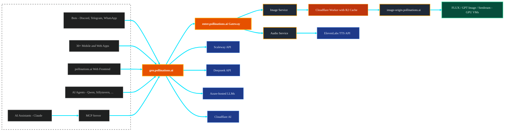

<div align="center">
  <picture>
    <source media="(prefers-color-scheme: dark)" srcset="packages/ui/src/brand/lockup-horizontal-white.svg" />
    
  </picture>
  
  <p><strong>Open-source AI for people who make things.</strong></p>

[](https://github.com/pollinations/pollinations/stargazers)
[](LICENSE)
[](https://discord.gg/pollinations-ai-885844321461485618)

[Website](https://pollinations.ai) · [Dashboard](https://enter.pollinations.ai) · [API Docs](APIDOCS.md) · [Discord](https://discord.gg/pollinations-ai-885844321461485618)

</div>

<p align="center"></p>

## 🆕 Recent Apps

| Name | Description | Author |
|------|-------------|--------|
| [🖼️ Silenos Visual Production & Illustration Studio](https://www.silenos.es/ilustrador/) | Centraliza literatura, contenido creativo y desarrollo técnico en la plataforma silenos.es con un enfoque minimalista y preciso, priorizando el contenido puro y arquitecturas lógicas. | [@todoh](https://github.com/todoh) |
| [📚 studybuddy](https://studybuddy-deploy2026.streamlit.app/) | studybuddy is an AI-powered learner assistant that helps students study using their own notes. | [@jmwdpk](https://github.com/jmwdpk) |
| [🧑‍💻 Code Canvas Complete](https://code-canvas-complete-production.up.railway.app/) | Code Canvas is an all-in-one browser-based IDE with a built-in AI assistant for code generation, debugging, and explanation. It integrates Pollinations.ai as a Bring-Your-Own-Key (BYOK) AI provider, a | [@TopProjectsCreator](https://github.com/TopProjectsCreator) |
| [🧠 Blaze Prep](https://blazeprep.net) | Manage FDNY Prep learning content in Blaze Prep, with AI-generated materials from Pollinations AI. | [@beedieeyez](https://github.com/beedieeyez) |
| [🧩 ScrollStop UGC Ad Studio](https://scrollstop-ugc-studio.vercel.app/) | ScrollStop UGC Studio is a web app that helps creators and marketers generate short-form UGC ad ideas for TikTok, Reels, and Shorts. Users enter product details, target audience, offer, and creative a | [@dreamm160-ops](https://github.com/dreamm160-ops) |
| [🎉 Aventi](https://aventi-web.vercel.app/) | Aventi is a swipe-first discovery app for local events, nightlife, and experiences. It helps users find what to do nearby. | [@Erics1337](https://github.com/Erics1337) |
| [📹 Affiliate Video Maker](https://github.com/falconafk31/affiliate-video-maker) | Generate AI-Powered affiliate videos with Affiliate Video Maker. | [@falconafk31](https://github.com/falconafk31) |
| [🧠 AINewsForge](Not public) | AINewsForge is an agentic system built with LangGraph that fetches news, generates LinkedIn posts, verifies claims, creates cover images, reviews quality, and publishes to LinkedIn. | [@Ravnoor17](https://github.com/Ravnoor17) |
| [📝 Subtitle Studio (SubCap)](https://subtitle-studio-eta.vercel.app/) | Subtitle Studio (SubCap) is a browser-based video captioning tool that uses AI transcription to generate styled subtitles from speech without manual typing. | [@somjaina142](https://github.com/somjaina142) |
| [🎬 Thumbsnare](https://thumbsnare.vercel.app/) | Thumbsnare generates YouTube thumbnail concepts from a video idea, using title, creative angle, target audience, and visual direction to create structured options for review and export. | [@sompongna141](https://github.com/sompongna141) |

[Browse all apps →](apps/GREENHOUSE.md)
## 🚀 New Unified API — Now Live

We've launched **https://gen.pollinations.ai** — a single endpoint for all your AI generation needs: text, images, audio, video, 3D, embeddings — all in one place.

### What's New

- **Unified endpoint** — single API at `gen.pollinations.ai` for all generation
- **Pollen credits** — simple pay-as-you-go system ($1 ≈ 1 Pollen)
- **All models, one place** — Flux, GPT, Claude, Gemini, Seedream, and more
- **API keys** — secret keys for model usage, app keys for tracking BYOP apps.
- **CLI** — `npx @pollinations/cli` for humans and AI agents ([source](packages/polli-cli))

> Get started at [enter.pollinations.ai](https://enter.pollinations.ai) and check out the [API docs](https://gen.pollinations.ai/docs)

## 🆕 Latest News

- **2026-07-15** – **🚀 Private community models** Register a model, test it with your own key, then publish it when it is ready to meet the outdoors. Public models can be free or priced by their owner.
- **2026-07-15** – **✨ 3D generation, now easier to find** 3D-capable models have joined the [Model Monitor](https://model-monitor.pollinations.ai), with quick-start requests and model details in the [API docs](https://gen.pollinations.ai/docs).
- **2026-07-15** – **📱 Shareable dashboard routes** Links to Models, Activity, Keys, Pollen, Quests, and News now open exactly where they should, retaining useful view state instead of dumping everyone at the lobby.
- **2026-07-15** – **🎨 Veo in 720p or 1080p** Video generation now has dedicated Veo 3.1 Fast tiers for 720p and 1080p output, so resolution is explicit rather than a small upstream mystery.
- **2026-07-14** – **✨ Public media galleries** Tag an upload to publish it in a shareable, newest-first gallery at `GET /media?tag=`; leave it untagged and it stays private. [API Docs](https://gen.pollinations.ai/docs)
- **2026-07-14** – **🚀 GPT Image models rerouted** `gptimage`, `gptimage-large`, and `gpt-image-2` now use dedicated Azure routes with regional failover, so image generations and edits have somewhere else to go when one garden closes.
- **2026-07-14** – **🌟 Model speed, measured properly** Model Monitor now sorts models by streamed completion throughput in tokens per second. Less folklore, more `tok/s`. [Check the monitor](https://model-monitor.pollinations.ai)
- **2026-07-14** – **💡 Seeds reach the SDK API** `@pollinations/sdk` now forwards seeds to Gen, giving SDK users reproducible generations without client-side retry roulette. [View package](https://www.npmjs.com/package/@pollinations/sdk)
- **2026-07-13** – **🎯 New Pollen quests** Use an app through BYOP to earn `0.25` Pollen, or keep your app active to earn `7` Pollen. The garden now pays rent.
- **2026-07-13** – **🎵 Talkti: live voice translation** Speak across languages in real time with a new community-built voice translation app. [Try it](https://talktiweb.web.app) <!-- app -->
---

## 🌱 Introduction

[pollinations.ai](https://pollinations.ai) is an open-source generative AI platform based in Berlin, powering 500+ community projects with accessible text, image, video, audio, 3D and embeddings generation APIs. We build in the open and keep AI accessible to everyone—thanks to our amazing supporters.

## 🚀 Key Features

- 🔓 **100% Open Source** — code, decisions, roadmap all public
- 🤝 **Community-Built** — 500+ projects already using our APIs
- 🌱 **Pollen Quests** — earn Pollen by completing Quests (in alpha)
- 🖼️ **Image Generation** — Text-to-image and image editing
- 📝 **Text Generation** — Chat, reasoning, vision, function calling, structured outputs 
- 🎬 **Video Generation** — Text-to-video and image-to-video
- 🎵 **Audio** — Text-to-speech and speech-to-text
- 🧊 **3D Generation** — Text-to-3D and image-to-3D
- 🔢 **Embeddings Creation** — Semantic search, retrieval, similarity matching
- 🎣 **_Easy-to-use Packages_** ([Packages](packages/))

<a href="https://star-history.com/#pollinations/pollinations&Date">
 <picture>
   <source media="(prefers-color-scheme: dark)" srcset="https://api.star-history.com/svg?repos=pollinations/pollinations&type=Date&theme=dark" width="600" />
   <source media="(prefers-color-scheme: light)" srcset="https://api.star-history.com/svg?repos=pollinations/pollinations&type=Date" width="600" />
   
 </picture>
</a>

### Quick Start (3 Steps)

1️⃣ **Get your API key**  
Sign up at [enter.pollinations.ai](https://enter.pollinations.ai/keys) to generate your key.

2️⃣ **Choose what you want to generate**  
Pollinations supports:
- 🖼 Images  
- 📝 Text  
- 🔊 Audio  
- 🎬 Video
- 🧊 3D
- 🔢 Embeddings

3️⃣ **Make your first request**  
Use one of the examples below to generate your first AI output in seconds.


## 🚀 Getting Started

[](https://deepwiki.com/pollinations/pollinations)

### Image Generation

```bash
curl 'https://gen.pollinations.ai/image/a%20beautiful%20sunset' -o image.jpg
```

Or visit [pollinations.ai](https://pollinations.ai) for an interactive experience.

### Text Generation

```bash
curl 'https://gen.pollinations.ai/text/Hello%20world'
```

### Audio Generation

**Simple GET endpoint:**

```bash
curl 'https://gen.pollinations.ai/audio/Hello%20from%20Pollinations?voice=nova&key=YOUR_API_KEY' -o speech.mp3
```

**OpenAI TTS compatible:**

```bash
curl 'https://gen.pollinations.ai/v1/audio/speech' \
  -H 'Content-Type: application/json' \
  -H 'Authorization: Bearer YOUR_API_KEY' \
  -d '{"model": "tts-1", "input": "Hello from Pollinations!", "voice": "nova"}' \
  -o speech.mp3
```

Available voices: `alloy`, `echo`, `fable`, `onyx`, `nova`, `shimmer`, plus [30+ ElevenLabs voices](https://gen.pollinations.ai/docs).

### MCP Server for AI Assistants

Our MCP (Model Context Protocol) server enables AI assistants like Claude to generate images and audio directly. [Learn more](./packages/mcp/README.md)

#### Configuration

Add this to your MCP client configuration:

```json
{
  "mcpServers": {
    "pollinations": {
      "command": "npx",
      "args": ["@pollinations/mcp"]
    }
  }
}
```

### Run with npx (no installation required)

```bash
npx @pollinations/mcp
```

Community alternatives like [MCPollinations](https://github.com/pinkpixel-dev/MCPollinations) and [Sequa MCP Server](https://mcp.sequa.ai/v1/pollinations/contribute) are also available.

AI assistants can:

- Generate images from text descriptions
- Create text-to-speech audio with various voice options
- Play audio responses through the system speakers
- Access all pollinations.ai models and services
- List available models, voices, and capabilities

**For more advanced usage, check out our [API documentation](APIDOCS.md).**

## 🔐 Authentication

Get your API key at [enter.pollinations.ai](https://enter.pollinations.ai/keys)

### Key Types

| Key             | Prefix | Use Case                       | Rate Limits              | Status  |
| --------------- | ------ | ------------------------------ | ------------------------ | ------- |
| **App Key** | `pk_`  | Browsers, mobile apps, public clients | Budget & permissions set at creation | Stable |
| **Secret**      | `sk_`  | Server-side only               | No rate limits           | Stable  |

> ⚠️ **Never expose `sk_` keys** in client-side code, git repos, or public URLs

> 💡 **Building an app?** Use [Bring Your Own Pollen](./BRING_YOUR_OWN_POLLEN.md) — users pay for their own usage, you pay $0

### Model Restrictions

Each API key can be scoped to specific models. When creating a key at [enter.pollinations.ai](https://enter.pollinations.ai/keys), you can:

- **Allow all models** — key works with any available model
- **Restrict to specific models** — select exactly which models the key can access (e.g., only `flux` and `openai`, or just `gptimage-large`)

### Usage

```bash
curl 'https://gen.pollinations.ai/image/a%20cat?key=YOUR_KEY'
```

**Environment variable (best practice):**

```bash
export POLLINATIONS_API_KEY=sk_...
```

See [full API docs](APIDOCS.md) for detailed authentication information.

## 🖥️ How to Use

### Web Interface

Our web interface is user-friendly and doesn't require any technical knowledge. Simply visit [https://pollinations.ai](https://pollinations.ai) and start creating!

### API

Use our API directly in your browser or applications:

    https://pollinations.ai/p/a_cozy_pixel_art_robot_and_bee_in_a_digital_garden_8-bit_warm_stardew_valley_vibes

Replace the description with your own, and you'll get a unique image based on your words!

Here's an example of a generated image:

<p align="center"></p>

<p align="center"></p>

## 🎨 Examples

### Image Generation

Python code to download the generated image:

    import requests

    def download_image(prompt):
        url = f"https://pollinations.ai/p/{prompt}"
        response = requests.get(url)
        with open('generated_image.jpg', 'wb') as file:
            file.write(response.content)
        print('Image downloaded!')

    download_image("a_cozy_pixel_art_robot_and_bee_in_a_digital_garden_8-bit_warm_stardew_valley_vibes")

### Text Generation

To generate text:

    https://gen.pollinations.ai/text/What%20is%20artificial%20intelligence?

### Audio Generation

Generate speech from text:

    https://gen.pollinations.ai/audio/Hello%20from%20Pollinations?voice=alloy&key=YOUR_API_KEY

Or use the OpenAI TTS-compatible endpoint:

```bash
curl 'https://gen.pollinations.ai/v1/audio/speech' \
  -H 'Content-Type: application/json' \
  -H 'Authorization: Bearer YOUR_API_KEY' \
  -d '{"model": "tts-1", "input": "Hello from Pollinations!", "voice": "alloy"}' \
  -o speech.mp3
```

## 🛠️ Integration

### SDK

Check out our [Pollinations SDK](./packages/sdk/README.md) for Node.js, browser, and React integration.

## Architecture


```mermaid
%%{init: {'theme': 'dark', 'themeVariables': { 'background': '#1a1a1a', 'primaryColor': '#2a2a2a', 'primaryBorderColor': '#555555', 'primaryTextColor': '#eeeeee', 'lineColor': '#00e5ff', 'clusterBkg': 'transparent', 'clusterBorder': '#888888', 'fontSize': '13px', 'fontFamily': 'Inter, system-ui, sans-serif'}}}%%

graph LR
    subgraph CLIENTS["Clients / Apps"]
        Q[Bots - Discord, Telegram, WhatsApp]
        N[30+ Mobile and Web Apps]
        A[pollinations.ai Web Frontend]
        R[AI Agents - Qwen, Sillytavern, ...]
        AI[AI Assistants - Claude]
        MCP[MCP Server]
    end

    AI --> MCP
    Q --> GEN
    N --> GEN
    A --> GEN
    R --> GEN
    MCP --> GEN

    GEN["gen.pollinations.ai"]:::cfWorker --> ENTER["enter.pollinations.ai Gateway"]:::cfWorker

    ENTER --> IMG["Image Service"]:::ec2
    ENTER --> AUD["Audio Service"]:::ec2

    IMG --> CF["Cloudflare Worker with R2 Cache"]:::cfWorkerLight
    CF --> B["image-origin.pollinations.ai"]:::ec2
    B --> D["FLUX / GPT Image / Seedream - GPU VMs"]:::gpuNode

    AUD --> EL["ElevenLabs TTS API"]:::provider

    GEN --> SC["Scaleway API"]:::provider
    GEN --> DS["Deepseek API"]:::provider
    GEN --> G["Azure-hosted LLMs"]:::provider
    GEN --> CFM["Cloudflare AI"]:::provider

    style CLIENTS fill:none,stroke:#888,stroke-width:2px,stroke-dasharray: 5 5

    linkStyle default stroke-width:3px,stroke:#00E5FF

    classDef cfWorker fill:#E65100,color:#fff,stroke:#FFB300,stroke-width:2px,font-weight:bold
    classDef cfWorkerLight fill:#BF360C,color:#fff,stroke:#FFB300,stroke-width:1px
    classDef ec2 fill:#1F2937,color:#fff,stroke:#F59E0B,stroke-width:2px
    classDef gpuNode fill:#064E3B,stroke:#34D399,color:#ECFDF5,stroke-width:2px
    classDef provider fill:#1E3A8A,stroke:#60A5FA,color:#EFF6FF,stroke-width:1px
```

## 🔮 Future Developments

We're constantly exploring new ways to push the boundaries of AI-driven content creation. Some areas we're excited about include:

- Digital Twins: Creating interactive AI-driven avatars
- Music Video Generation: Combining AI-generated visuals with music for unique video experiences
- Real-time AI-driven Visual Experiences: Projects like our Dreamachine, which create immersive, personalized visual journeys

## 🌍 Our Vision

pollinations.ai envisions a future where AI technology is:

- **Open & Accessible**: We believe AI should be available to everyone — earn Pollen by contributing, no credit card required

- **Transparent & Ethical**: Our open-source approach ensures transparency in how our models work and behave

- **Community-Driven**: We're building a platform where developers, creators, and AI enthusiasts can collaborate and innovate

- **Interconnected**: We're creating an ecosystem where AI services can seamlessly work together, fostering innovation through composability

- **Evolving**: We embrace the rapid evolution of AI technology while maintaining our commitment to openness and accessibility

We're committed to developing AI technology that serves humanity while respecting ethical boundaries and promoting responsible innovation. Join us in shaping the future of AI.

## 🤝 Community and Development

We believe in community-driven development. You can contribute to pollinations.ai in several ways:

1. **Coding Assistant**: The easiest way to contribute! Just [create a GitHub issue](https://github.com/pollinations/pollinations/issues/new) describing the feature you'd like to see implemented. The [MentatBot AI assistant](https://mentat.ai/) will analyze and implement it directly! No coding required - just describe what you want.

2. **Project Submissions**: Have you built something with pollinations.ai? [Use our project submission template](https://github.com/pollinations/pollinations/issues/new?template=tier-app-submission.yml) (labeled as **APPS**) to share it with the community and get it featured in our README.

3. **Feature Requests & Bug Reports**: Have an idea or found a bug? [Open an issue](https://github.com/pollinations/pollinations/issues/new) and let us know. Our team and the MentatBot assistant will review it.

4. **Community Engagement**: Join our vibrant [Discord community](https://discord.gg/pollinations-ai-885844321461485618) to:
   - Share your creations
   - Get support and help others
   - Collaborate with fellow AI enthusiasts
   - Discuss feature ideas before creating issues

For any questions or support, please visit our [Discord channel](https://discord.gg/pollinations-ai-885844321461485618) or create an issue on our [GitHub repository](https://github.com/pollinations/pollinations).

## 🗂️ Project Structure

Our codebase is organized into several key folders, each serving a specific purpose in the pollinations.ai ecosystem:

- [`pollinations.ai/`](./app/): The main React application for the Pollinations.ai website.

- [`image.pollinations.ai/`](./image.pollinations.ai/): Backend service for image generation and caching with Cloudflare Workers and R2 storage.

- [`gen.pollinations.ai/`](./gen.pollinations.ai/): Cloudflare Worker for API routing, auth handoff, text generation, and caching.

- [`packages/polli-cli/`](./packages/polli-cli/): The Pollinations CLI — for humans, AI agents, and everything in between.

- [`packages/sdk/`](./packages/sdk/): SDK NPM library with pollinations ready functions for Pollinations.ai.

- [`packages/mcp/`](./packages/mcp/): Model Context Protocol (MCP) server for AI assistants like Claude to generate images directly.

- [`opencode-pollinations-plugin`](https://github.com/fkom13/opencode-pollinations-plugin): This is `open-code-pollinations-plugin`, a plugin for OpenCode that integrates Pollinations.ai's inference capabilities directly into the OpenCode environment, built by our community member [@fkom13](https://github.com/fkom13).


This structure encompasses the frontend website, backend services for image and text generation, and integrations like the Discord bot and MCP server, providing a comprehensive framework for the pollinations.ai platform.

For development setup and environment management, see [DEVELOP.md](./DEVELOP.md).

## 🏢 Supported By

> pollinations.ai is proud to be supported by:

<p align="center"></p>

- [Perplexity AI](https://www.perplexity.ai/): AI-powered search and conversational answer engine
- [AWS Activate](https://aws.amazon.com/): GPU Cloud Credits
- [io.net](https://io.net/): Decentralized GPU network for AI compute
- [BytePlus](https://www.byteplus.com/): Official ByteDance cloud services and AI solutions
- [Google Cloud for Startups](https://cloud.google.com/): GPU Cloud Credits
- [NVIDIA Inception](https://www.nvidia.com/en-us/deep-learning-ai/startups/): AI startup support
- [Azure (MS for Startups)](https://azure.microsoft.com/): OpenAI credits
- [Cloudflare](https://developers.cloudflare.com/workers-ai/): Put the connectivity cloud to work for you.
- [Scaleway](https://www.scaleway.com/): Europe's empowering cloud provider
- [Modal](https://modal.com/): High-performance AI infrastructure
- [Nebius](https://nebius.com/): AI-optimized cloud infrastructure with NVIDIA GPU clusters

## 💚 Support Us

The best way to support pollinations.ai is by using our product! Get your API key and start building at **[enter.pollinations.ai](https://enter.pollinations.ai/keys)**.

## 📣 Stay Connected
[News & FAQ](https://enter.pollinations.ai/news) ·
[𝕏 Twitter](https://twitter.com/pollinations_ai) · [Instagram](https://instagram.com/pollinations_ai) · [LinkedIn](https://www.linkedin.com/company/pollinations-ai) · [Facebook](https://facebook.com/pollinations) · [Reddit](https://www.reddit.com/r/pollinations_ai/) · [YouTube](https://www.youtube.com/c/pollinations)

## 📜 License

pollinations.ai is open-source software licensed under the [MIT license](LICENSE).

---

Made with ❤️ by the pollinations.ai team
