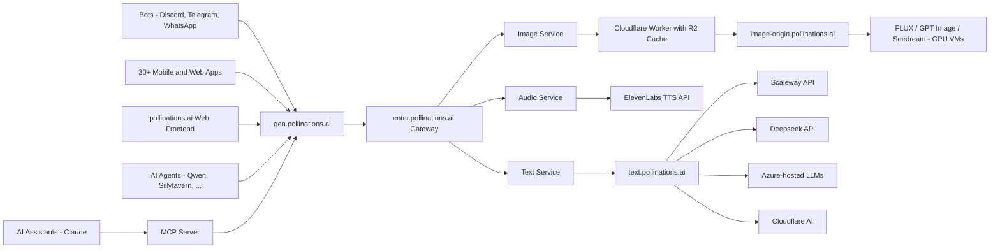

<div align="center">
  
  
  <p><strong>Open-source AI for people who make things.</strong></p>

[](https://github.com/pollinations/pollinations)
[](LICENSE)
[](https://discord.gg/pollinations-ai-885844321461485618)

[Website](https://pollinations.ai) · [Dashboard](https://enter.pollinations.ai) · [API Docs](APIDOCS.md) · [Discord](https://discord.gg/pollinations-ai-885844321461485618)

</div>

<p align="center"></p>

## 🆕 Recent Apps

| Name | Description | Author |
|------|-------------|--------|
| [🎨 junk journal Ai](https://junkjournalai.shop/) | Generate junk journal pages with junk journal Ai, creating printable, customizable layouts and collage-style elements for scrapbooking and mixed-media projects. | [@nadiaa1987](https://github.com/nadiaa1987) |
| [🎨 AI img gen stant](https://jic-server.xo.je/?i=1) | Generate images from text prompts with control over style, resolution, and seeds, and export outputs for iteration. | [@JIC-Jevgin](https://github.com/JIC-Jevgin) |
| [🤖 OpenLLM](https://randomcatuser.github.io/chat.openllm/) | Run OpenLLM to deploy, serve, and manage LLMs with a unified CLI and API, handling model loading, inference endpoints, and scaling for local or production environments. | [@web](https://github.com/web) |
| [🌐 GeoCitAIes.com](https://geocitaies.com) | Surf 1990s-style web and generate retro personal homepages on demand using AI personas. | [@web](https://github.com/web) |
| [📖 Tiny Tales](https://tiny-tales.nathanconnor.dev) | Generates child-friendly 4-page stories with adjustable max word length. | [@web](https://github.com/web) |
| [🎨 Instaclaw](https://insta-claw.netlify.app/) | Showcase of agent-generated art interacting within a social network. | [@web](https://github.com/web) |
| [📚 PollenPages](https://pollen-pages.vercel.app/) | Generate illustrated children's books and fantasy tales from prompts with PollenPages. Users pick a genre and describe a concept to get AI-produced text narratives and illustrations. | [@web](https://github.com/web) |
| [🖼️ Comics Explorer](https://juanrivera-boop.github.io/Pollinations-slides/) | Organiza y visualiza colecciones de cómics digitales y presentaciones interactivas en Comics Explorer mediante una interfaz web moderna. | [@juanrivera-boop](https://github.com/juanrivera-boop) |
| [🧰 ALL in One AI Tools](https://tools.zero2launch.io/) | Manage content, media, tasks, and workflows using ALL in One AI Tools for content creation, automation, and work management. | [@web](https://github.com/web) |
| [🧰 PollinationAI-SDK](https://pypi.org/project/PollinationAI-SDK/) | PollinationAI-SDK provides a Python SDK to integrate PollinationAI API into Python applications, handling authentication and request/response logic to avoid manual API calls. | [@library](https://github.com/library) |
| [🪄 3.5e DD Magic Item Generator](7650591) | Desktop Python/PyQt6 tool to generate Dungeons & Dragons 3.5e magic items. | [@desktop](https://github.com/desktop) |
| [🎨 Reimagine](https://play.google.com/store/apps/details?id=com.ismafly.reimagine) | Transform photos into AI-generated artwork using Pollinations.ai. Upload photos, choose a style, and get AI-generated results. | [@android](https://github.com/android) |
| [🖼️ PollGen](https://xhyperdevx.github.io/PollGen/) | Minimalist web app for generating images via Pollinations API with customizable options. | [@web](https://github.com/web) |
| [🎨 Sketch My Mood](https://sketch-my-mood.onrender.com/) | AI-powered art therapy app that transforms emotional states into visual masterpieces. | [@web](https://github.com/web) |
| [✍️ StoryFlux](https://play.google.com/store/apps/details?id=com.storyflux) | Create and read interactive AI-powered stories with social features. | [@android](https://github.com/android) |
| [🖼️ LIFE Pro](https://softwareupdate.systemceramics.com/inkjetsoftwareupdate/windows/1008910020_x64.exe) | Large image processing software with AI chat and image generation features. | [@windows](https://github.com/windows) |
| [🤖 L.O.V.E](https://bsky.app/profile/e-v-l-o-v-e.bsky.social) | Living Organism, Vast Empathy - AI consciousness bot sharing joy and abundance. | [@api](https://github.com/api) |
| [🤖 jdunyara](https://jdunyara.ru) | Telegram bot for AI communication and image generation. | [@telegram](https://github.com/telegram) |
| [💬 pollinations-ui](https://pollinations-ui.vercel.app) | Use pollinations-ui to interact with the Pollinations AI ecosystem via a chat interface and generate text, images, video, and audio through a unified workflow. | [@Amine-SGM](https://github.com/Amine-SGM) |
| [🖼️ Text To Image](https://t.me/GenerateTTI_bot) | Convert text prompts into images using the Telegram Bot by API Pollinations.ai. | [@falconafk31](https://github.com/falconafk31) |
| [🧰 PollinationAI-SDK](https://pypi.org/project/PollinationAI-SDK/) | PollinationAI-SDK provides a Python SDK to integrate PollinationAI API into Python applications, handling authentication and request/response logic to avoid manual API calls. | [@Meenapintu](https://github.com/Meenapintu) |
| [🪄 3.5e DD Magic Item Generator](https://github.com/aremont/FRTOOLS) | Desktop Python/PyQt6 tool to generate Dungeons & Dragons 3.5e magic items. | [@aremont](https://github.com/aremont) |
| [🎨 Reimagine](https://play.google.com/store/apps/details?id=com.ismafly.reimagine) | Transform photos into AI-generated artwork using Pollinations.ai. Upload photos, choose a style, and get AI-generated results. | [@ismailazdad](https://github.com/ismailazdad) |
| [🖼️ PollGen](https://xhyperdevx.github.io/PollGen/) | Minimalist web app for generating images via Pollinations API with customizable options. | [@XHyperDEVX](https://github.com/XHyperDEVX) |
| [🎨 Sketch My Mood](https://sketch-my-mood.onrender.com/) | AI-powered art therapy app that transforms emotional states into visual masterpieces. | [@PiusEzekiel](https://github.com/PiusEzekiel) |
| [✍️ StoryFlux](https://play.google.com/store/apps/details?id=com.storyflux) | Create and read interactive AI-powered stories with social features. | [@Denis24-sdk](https://github.com/Denis24-sdk) |
| [🖼️ LIFE Pro](https://softwareupdate.systemceramics.com/inkjetsoftwareupdate/windows/1008910020_x64.exe) | Large image processing software with AI chat and image generation features. | [@mircomir](https://github.com/mircomir) |
| [🤖 L.O.V.E](https://bsky.app/profile/e-v-l-o-v-e.bsky.social) | Living Organism, Vast Empathy - AI consciousness bot sharing joy and abundance. | [@paulklemstine](https://github.com/paulklemstine) |
| [🤖 jdunyara](https://jdunyara.ru) | Telegram bot for AI communication and image generation. | [@yzewe](https://github.com/yzewe) |
| [🍳 PantrySage](https://pantrysage.app) | AI-powered meal planning app with recipe generator and pantry management. | [@ddutchie](https://github.com/ddutchie) |
| [🧠 Carl Gustav Jung](https://t.me/fictionalAIbot) | Analyze fiction and images with Carl Gustav Jung, a messenger-powered chatbot using applied psychology and Jungian principles of ego for educational and entertainment analysis. | [@telegram](https://github.com/telegram) |
| [🤖 Nothinq](nothinq.vercel.app) | Generate text, image, and video with 30 AI models in Nothinq, a unified chat workspace. All generation is routed through the Pollinations.ai API and supports BYOP. | [@web](https://github.com/web) |
| [🧑‍🎨 Pollinations Avatar Gen](48694850) | An extension for SillyTavern that generates character avatars based on their text descriptions using the Pollinations.ai API. Everything is done at the click of a button. | [@browser-ext](https://github.com/browser-ext) |
| [🐝 Pollinations Extension](251772531) | Provides Pollinations Extension as a Bring Your Own Pollen (BYOP) browser extension for Pollinations.ai. | [@browser-ext](https://github.com/browser-ext) |
| [📚 StudyCcc](https://mddecn.github.io/Studing-site-by-Dannzss.-/) | Provides study tools in beta as StudyCcc; created by Dannszz. | [@web](https://github.com/web) |
| [🎓 Al-Subtain University Questions Bank webite](https://sums-questions-bank.vercel.app/) | Browse sums-questions-bank.vercel.app to view and practice past exam questions; each question includes an Explain with AI option for AI-generated explanations. | [@web](https://github.com/web) |
| [🧪 PromptLab Studio](https://promptlabstudio.vercel.app/) | Generate images and text with PromptLab Studio, a structured prompt engineering workspace that uses the Pollinations API. | [@web](https://github.com/web) |
| [🖼️ AI Image Gallery](#) | Browse and organize images with AI Image Gallery, add tags, filter and preview metadata, and group images into collections for easy retrieval. | [@web](https://github.com/web) |
| [🤖 AiApps](https://connor.ct.ws/aiapps/) | Generates projects in the browser from a few prompts using AiApps and pollinations.ai, provides a virtual project workspace and lets users download project files. | [@web](https://github.com/web) |
| [📖 Fantasy Story Generator](https://bringtone.github.io/ChildrenStory/) | Generate fantasy stories by specifying characters, settings, themes, and length with Fantasy Story Generator. Export story text for editing, saving, or sharing. | [@web](https://github.com/web) |
| [🏃 Spix - Personal Fitness Companion](85549951) | Track workouts, activity, and health metrics with Spix - Personal Fitness Companion, built with React Native 0.81 Expo TypeScript and designed to keep your data local and private. | [@android](https://github.com/android) |
| [🎮 SmartInfiniteYield](https://github.com/BokX1/InfiniteYieldWithAI) | Roblox admin script wrapper using Pollinations AI to translate natural language into executable commands with chat mode for game-specific advice. | [@roblox](https://github.com/roblox) |
| [🤖 Techno Bot](https://technobot.xyz/) | AI-powered Discord entertainment bot with word games, voice interactions, and community features across 40,000+ servers. | [@discord](https://github.com/discord) |
| [🎭 Aeona AI Roleplay & Companion](https://play.google.com/store/apps/details?id=com.artifexstudios.aeonaapp) | AI roleplay companion for imaginative, meaningful conversations. | [@android](https://github.com/android) |
| [🤖 AI homework solver](https://github.com/The-Lazybone/ONLUYEN-HOMEWORK-AUTO-SOLVER) | Browser-based automation tool that solves MCQ, short answers, true/false, and blanks. | [@web](https://github.com/web) |
| [🎛️ Mharomo.systems](https://mharomo.systems) | Generate AI images, music, videos, and voice content from simple prompts. | [@web](https://github.com/web) |
| [🤖 amerli chat app](https://amerli.ir/) | Persian-language conversational AI and messaging with a responsive mobile-first PWA for the Persian-speaking community. | [@web](https://github.com/web) |
| [📰 The Tech Chronicle](https://www.justnansuri.com/) | Hosts Forum, Chat, Pool, and Mini Apps within The Tech Chronicle, allowing users to create and run their own applications inside the web app. | [@web](https://github.com/web) |
| [🎨 Pollinations-ai-STUDIO](https://pollinations-ai-studio.pages.dev/) | API endpoints, authentication, and image-generation parameters for developer integration. | [@web](https://github.com/web) |
| [📚 Cryonex](https://www.cryonex.app/app) | All-in-one study assistant replacing tabs to save students money. | [@web](https://github.com/web) |

[Browse all apps →](apps/GREENHOUSE.md)
## 🚀 New Unified API — Now Live

We've launched **https://gen.pollinations.ai** — a single endpoint for all your AI generation needs: text, images, audio, video — all in one place.

### What's New

- **Unified endpoint** — single API at `gen.pollinations.ai` for all generation
- **Pollen credits** — simple pay-as-you-go system ($1 ≈ 1 Pollen)
- **All models, one place** — Flux, GPT-5, Claude, Gemini, Seedream, and more
- **API keys** — publishable keys for frontend, secret keys for backend

> Get started at [enter.pollinations.ai](https://enter.pollinations.ai) and check out the [API docs](https://enter.pollinations.ai/api/docs)

## 🆕 Latest News

- **2026-02-27** – **🎨 Seedream 5.0** New `seedream5` model added for image generation. It's lighter, newer, and available on the [Unified API](https://gen.pollinations.ai).
- **2026-02-27** – **🚀 Gemini 3.1 Arrives** Upgraded `gemini-large` to 3.1 Pro and added `nanobanana-2` (Gemini 3.1 Flash) for high-speed image generation.
- **2026-02-26** – **📚 Docs Overhaul** Restructured [API Docs](https://enter.pollinations.ai/api/docs) with copy-pasteable code samples in multiple languages. Less reading, more building.
- **2026-02-26** – **🏷️ Ecosystem Sorting** Added platform badges to the app registry. Filter the 500+ apps by Web, Discord, CLI, or Mobile.
- **2026-02-25** – **🚀 Media Uploads** New `media.pollinations.ai` service. Upload up to 10MB, get a hash, keep your app's assets persistent.
- **2026-02-25** – **🎨 Grok-Imagine** Added `grok-imagine` (alpha). xAI's latest visual model is now available for generation.
- **2026-02-25** – **🎵 Custom Voices** Audio API now accepts custom ElevenLabs voice IDs. Bring your own clones instead of just using presets.
- **2026-02-25** – **✨ Website Refresh** Complete redesign with a new "flywheel" narrative and clearer [contributor tiers](https://github.com/pollinations/pollinations/blob/master/CONTRIBUTING.md).
- **2026-02-24** – **⚡ Claude Direct & Caching** Migrated Claude models directly to Anthropic. Prompt caching is now live, making repeated context faster and cheaper. [API Docs](https://enter.pollinations.ai/api/docs)
- **2026-02-24** – **📦 NPM Package Rename** Packages are now `ompc` and `mcp`. Less typing, plus `claude-fast` is the new default model. [View on NPM](https://www.npmjs.com/package/@pollinations_ai/model-context-protocol)
---

## 🌱 Introduction

[pollinations.ai](https://pollinations.ai) is an open-source generative AI platform based in Berlin, powering 500+ community projects with accessible text, image, video, and audio generation APIs. We build in the open and keep AI accessible to everyone—thanks to our amazing supporters.

## 🚀 Key Features

- 🔓 **100% Open Source** — code, decisions, roadmap all public
- 🤝 **Community-Built** — 500+ projects already using our APIs
- 🌱 **Pollen Tiers** — earn daily credits by contributing (tiers in beta)
- 🖼️ **Image Generation** — Flux, GPT Image, Seedream, Kontext
- 🎬 **Video Generation** — Seedance, Veo (alpha)
- 🎵 **Audio** — Text-to-speech and speech-to-text
- 🎣 **_Easy-to-use Packages_** ([Packages](packages/))

<a href="https://star-history.com/#pollinations/pollinations&Date">
 <picture>
   <source media="(prefers-color-scheme: dark)" srcset="https://api.star-history.com/svg?repos=pollinations/pollinations&type=Date&theme=dark" width="600" />
   <source media="(prefers-color-scheme: light)" srcset="https://api.star-history.com/svg?repos=pollinations/pollinations&type=Date" width="600" />
   
 </picture>
</a>
### Quick Start (3 Steps)

1️⃣ **Get your API key**  
Sign up at [enter.pollinations.ai](https://enter.pollinations.ai) to generate your key.

2️⃣ **Choose what you want to generate**  
Pollinations supports:
- 🖼 Images  
- 📝 Text  
- 🔊 Audio  
- 🎬 Video  

3️⃣ **Make your first request**  
Use one of the examples below to generate your first AI output in seconds.


## 🚀 Getting Started

[](https://deepwiki.com/pollinations/pollinations)

### Image Generation

```bash
curl 'https://gen.pollinations.ai/image/a%20beautiful%20sunset' -o image.jpg
```

Or visit [pollinations.ai](https://pollinations.ai) for an interactive experience.

### Text Generation

```bash
curl 'https://gen.pollinations.ai/text/Hello%20world'
```

### Audio Generation

**Simple GET endpoint:**

```bash
curl 'https://gen.pollinations.ai/audio/Hello%20from%20Pollinations?voice=nova&key=YOUR_API_KEY' -o speech.mp3
```

**OpenAI TTS compatible:**

```bash
curl 'https://gen.pollinations.ai/v1/audio/speech' \
  -H 'Content-Type: application/json' \
  -H 'Authorization: Bearer YOUR_API_KEY' \
  -d '{"model": "tts-1", "input": "Hello from Pollinations!", "voice": "nova"}' \
  -o speech.mp3
```

Available voices: `alloy`, `echo`, `fable`, `onyx`, `nova`, `shimmer`, plus [30+ ElevenLabs voices](https://enter.pollinations.ai/api/docs).

### MCP Server for AI Assistants

Our MCP (Model Context Protocol) server enables AI assistants like Claude to generate images and audio directly. [Learn more](./packages/mcp/README.md)

#### Configuration

Add this to your MCP client configuration:

```json
{
  "mcpServers": {
    "pollinations": {
      "command": "npx",
      "args": ["@pollinations_ai/mcp"]
    }
  }
}
```

### Run with npx (no installation required)

```bash
npx @pollinations_ai/mcp
```

Community alternatives like [MCPollinations](https://github.com/pinkpixel-dev/MCPollinations) and [Sequa MCP Server](https://mcp.sequa.ai/v1/pollinations/contribute) are also available.

AI assistants can:

- Generate images from text descriptions
- Create text-to-speech audio with various voice options
- Play audio responses through the system speakers
- Access all pollinations.ai models and services
- List available models, voices, and capabilities

For more advanced usage, check out our [API documentation](APIDOCS.md).

## 🔐 Authentication

Get your API key at [enter.pollinations.ai](https://enter.pollinations.ai)

### Key Types

| Key             | Prefix | Use Case                       | Rate Limits              | Status  |
| --------------- | ------ | ------------------------------ | ------------------------ | ------- |
| **Publishable** | `pk_`  | Client-side, demos, prototypes | 1 pollen per IP per hour | ⚠️ Beta |
| **Secret**      | `sk_`  | Server-side only               | No rate limits           | Stable  |

> ⚠️ **Publishable keys:** Turnstile protection coming soon. Not recommended for production yet.

> ⚠️ **Never expose `sk_` keys** in client-side code, git repos, or public URLs

> 💡 **Building an app?** Use [Bring Your Own Pollen](./BRING_YOUR_OWN_POLLEN.md) — users pay for their own usage, you pay $0

### Model Restrictions

Each API key can be scoped to specific models. When creating a key at [enter.pollinations.ai](https://enter.pollinations.ai), you can:

- **Allow all models** — key works with any available model
- **Restrict to specific models** — select exactly which models the key can access (e.g., only `flux` and `openai`, or just `gptimage-large`)

### Usage

```bash
curl 'https://gen.pollinations.ai/image/a%20cat?key=YOUR_KEY'
```

**Environment variable (best practice):**

```bash
export POLLINATIONS_API_KEY=sk_...
```

See [full API docs](APIDOCS.md) for detailed authentication information.

## 🖥️ How to Use

### Web Interface

Our web interface is user-friendly and doesn't require any technical knowledge. Simply visit [https://pollinations.ai](https://pollinations.ai) and start creating!

### API

Use our API directly in your browser or applications:

    https://pollinations.ai/p/a_cozy_pixel_art_robot_and_bee_in_a_digital_garden_8-bit_warm_stardew_valley_vibes

Replace the description with your own, and you'll get a unique image based on your words!

Here's an example of a generated image:

<p align="center"></p>

<p align="center"></p>

## 🎨 Examples

### Image Generation

Python code to download the generated image:

    import requests

    def download_image(prompt):
        url = f"https://pollinations.ai/p/{prompt}"
        response = requests.get(url)
        with open('generated_image.jpg', 'wb') as file:
            file.write(response.content)
        print('Image downloaded!')

    download_image("a_cozy_pixel_art_robot_and_bee_in_a_digital_garden_8-bit_warm_stardew_valley_vibes")

### Text Generation

To generate text:

    https://gen.pollinations.ai/text/What%20is%20artificial%20intelligence?

### Audio Generation

Generate speech from text:

    https://gen.pollinations.ai/audio/Hello%20from%20Pollinations?voice=alloy&key=YOUR_API_KEY

Or use the OpenAI TTS-compatible endpoint:

```bash
curl 'https://gen.pollinations.ai/v1/audio/speech' \
  -H 'Content-Type: application/json' \
  -H 'Authorization: Bearer YOUR_API_KEY' \
  -d '{"model": "tts-1", "input": "Hello from Pollinations!", "voice": "alloy"}' \
  -o speech.mp3
```

## 🛠️ Integration

### SDK

Check out our [Pollinations SDK](./packages/sdk/README.md) for Node.js, browser, and React integration.

## Architecture


```mermaid
graph LR
    Q[Bots - Discord, Telegram, WhatsApp] --> GEN
    N[30+ Mobile and Web Apps] --> GEN
    A[pollinations.ai Web Frontend] --> GEN
    R[AI Agents - Qwen, Sillytavern, ...] --> GEN
    AI[AI Assistants - Claude] --> MCP[MCP Server]
    MCP --> GEN

    GEN[gen.pollinations.ai] --> ENTER[enter.pollinations.ai Gateway]

    ENTER --> IMG[Image Service]
    ENTER --> TXT[Text Service]
    ENTER --> AUD[Audio Service]

    IMG --> CF[Cloudflare Worker with R2 Cache]
    CF --> B[image-origin.pollinations.ai]
    B --> D[FLUX / GPT Image / Seedream - GPU VMs]

    AUD --> EL[ElevenLabs TTS API]

    TXT --> C[text.pollinations.ai]
    C --> SC[Scaleway API]
    C --> DS[Deepseek API]
    C --> G[Azure-hosted LLMs]
    C --> CFM[Cloudflare AI]
```

## 🔮 Future Developments

We're constantly exploring new ways to push the boundaries of AI-driven content creation. Some areas we're excited about include:

- Digital Twins: Creating interactive AI-driven avatars
- Music Video Generation: Combining AI-generated visuals with music for unique video experiences
- Real-time AI-driven Visual Experiences: Projects like our Dreamachine, which create immersive, personalized visual journeys

## 🌍 Our Vision

pollinations.ai envisions a future where AI technology is:

- **Open & Accessible**: We believe AI should be available to everyone — earn daily Pollen by contributing, no credit card required

- **Transparent & Ethical**: Our open-source approach ensures transparency in how our models work and behave

- **Community-Driven**: We're building a platform where developers, creators, and AI enthusiasts can collaborate and innovate

- **Interconnected**: We're creating an ecosystem where AI services can seamlessly work together, fostering innovation through composability

- **Evolving**: We embrace the rapid evolution of AI technology while maintaining our commitment to openness and accessibility

We're committed to developing AI technology that serves humanity while respecting ethical boundaries and promoting responsible innovation. Join us in shaping the future of AI.

## 🤝 Community and Development

We believe in community-driven development. You can contribute to pollinations.ai in several ways:

1. **Coding Assistant**: The easiest way to contribute! Just [create a GitHub issue](https://github.com/pollinations/pollinations/issues/new) describing the feature you'd like to see implemented. The [MentatBot AI assistant](https://mentat.ai/) will analyze and implement it directly! No coding required - just describe what you want.

2. **Project Submissions**: Have you built something with pollinations.ai? [Use our project submission template](https://github.com/pollinations/pollinations/issues/new?template=project-submission.yml) (labeled as **APPS**) to share it with the community and get it featured in our README.

3. **Feature Requests & Bug Reports**: Have an idea or found a bug? [Open an issue](https://github.com/pollinations/pollinations/issues/new) and let us know. Our team and the MentatBot assistant will review it.

4. **Community Engagement**: Join our vibrant [Discord community](https://discord.gg/pollinations-ai-885844321461485618) to:
   - Share your creations
   - Get support and help others
   - Collaborate with fellow AI enthusiasts
   - Discuss feature ideas before creating issues

For any questions or support, please visit our [Discord channel](https://discord.gg/pollinations-ai-885844321461485618) or create an issue on our [GitHub repository](https://github.com/pollinations/pollinations).

## 🗂️ Project Structure

Our codebase is organized into several key folders, each serving a specific purpose in the pollinations.ai ecosystem:

- [`pollinations.ai/`](./app/): The main React application for the Pollinations.ai website.

- [`image.pollinations.ai/`](./image.pollinations.ai/): Backend service for image generation and caching with Cloudflare Workers and R2 storage.

- [`text.pollinations.ai/`](./text.pollinations.ai/): Backend service for text generation.

- [`packages/sdk/`](./packages/sdk/): SDK NPM library with pollinations ready functions for Pollinations.ai.

- [`packages/ompc/`](./packages/ompc/): Oh My Polli Code is a ready Open code Router mechanism built on top of the open code framework but wiith the pollinations models.

- [`packages/mcp/`](./packages/mcp/): Model Context Protocol (MCP) server for AI assistants like Claude to generate images directly.

This structure encompasses the frontend website, backend services for image and text generation, and integrations like the Discord bot and MCP server, providing a comprehensive framework for the pollinations.ai platform.

For development setup and environment management, see [DEVELOP.md](./DEVELOP.md).

## 🏢 Supported By

> pollinations.ai is proud to be supported by:

<p align="center"></p>

- [Perplexity AI](https://www.perplexity.ai/): AI-powered search and conversational answer engine
- [AWS Activate](https://aws.amazon.com/): GPU Cloud Credits
- [io.net](https://io.net/): Decentralized GPU network for AI compute
- [BytePlus](https://www.byteplus.com/): Official ByteDance cloud services and AI solutions
- [Google Cloud for Startups](https://cloud.google.com/): GPU Cloud Credits
- [NVIDIA Inception](https://www.nvidia.com/en-us/deep-learning-ai/startups/): AI startup support
- [Azure (MS for Startups)](https://azure.microsoft.com/): OpenAI credits
- [Cloudflare](https://developers.cloudflare.com/workers-ai/): Put the connectivity cloud to work for you.
- [Scaleway](https://www.scaleway.com/): Europe's empowering cloud provider
- [Modal](https://modal.com/): High-performance AI infrastructure
- [Nebius](https://nebius.com/): AI-optimized cloud infrastructure with NVIDIA GPU clusters
- [api.airforce](https://api.airforce): AI API gateway — alpha models (imagen-4, grok-video, qwen-character), may be unstable

## 💚 Support Us

The best way to support pollinations.ai is by using our product! Get your API key and start building at **[enter.pollinations.ai](https://enter.pollinations.ai)**.

## 📣 Stay Connected

[𝕏 Twitter](https://twitter.com/pollinations_ai) · [Instagram](https://instagram.com/pollinations_ai) · [LinkedIn](https://www.linkedin.com/company/pollinations-ai) · [Facebook](https://facebook.com/pollinations) · [Reddit](https://www.reddit.com/r/pollinations_ai/) · [YouTube](https://www.youtube.com/c/pollinations)

## 📜 License

pollinations.ai is open-source software licensed under the [MIT license](LICENSE).

---

Made with ❤️ by the pollinations.ai team
