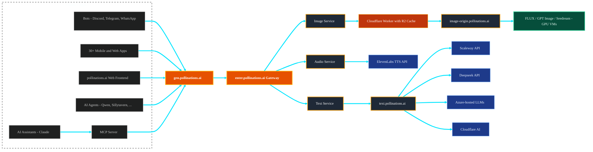

<div align="center">
  <picture>
    <source media="(prefers-color-scheme: dark)" srcset="assets/logo-text-white.svg" />
    
  </picture>
  
  <p><strong>Open-source AI for people who make things.</strong></p>

[](https://github.com/pollinations/pollinations)
[](LICENSE)
[](https://discord.gg/pollinations-ai-885844321461485618)

[Website](https://pollinations.ai) · [Dashboard](https://enter.pollinations.ai) · [API Docs](APIDOCS.md) · [Discord](https://discord.gg/pollinations-ai-885844321461485618)

</div>

<p align="center"></p>

## 🆕 Recent Apps

| Name | Description | Author |
|------|-------------|--------|
| 🖼️ Frieze | Generate and display AI-generated banner images and slogans in your terminal using Frieze, a mostly silly shell tool. | [@peterjaric](https://github.com/peterjaric) |
| [📚 StoryForge](http://pollen-story-forge.vercel.app/) | StoryForge is a client-side web app that turns ideas into chapter-based short stories with AI cover art, using the Pollinations API and BYOP model. Built with Vanilla JS and CSS. | [@Giyuu7777](https://github.com/Giyuu7777) |
| [⏳ TimeMachine Chat](https://timemachinechat.com/) | TimeMachine Chat provides a chat interface for tech essentials, with safety and security features. It consolidates those essentials into one app experience. | [@timemachine-studio](https://github.com/timemachine-studio) |
| [🧠 Scene2Text](https://scene2text.static.jp/) | Scene2Text describes what it is. | [@tatn](https://github.com/tatn) |
| [🧪 AI Models Laboratory](https://iamge-lab-website.vercel.app/) | AI Models Laboratory is a Next.js 15 and Three.js web app for real-time generative creation and archiving of high resolution digital artifacts. | [@OSK0020](https://github.com/OSK0020) |
| [🧠 Reporay](https://repo-ray.vercel.app) | Reporay is an AI-powered GitHub repository analyzer. Paste a GitHub URL to get insights into the technology stack, project architecture, and smart summaries. | [@Jadu07](https://github.com/Jadu07) |
| [🧠 Insight Engine](https://erbharatmalhotra.github.io/Insight_Engine/) | Requests re-approval for Insight Engine after temporary removal during endpoint migration and update to current gen.pollinations.ai endpoints; previously approved as Flower tier. | [@ErBharatMalhotra](https://github.com/ErBharatMalhotra) |
| [🧠 Deals King & Radar Ai](https://deal.pm/en/extension) | Deals King & Radar Ai supports viewing deals and running radar AI functions. | [@MrAhmedElkady](https://github.com/MrAhmedElkady) |
| [📚 ManhwaGen](https://manhwagen.vercel.app/) | ManhwaGen provides a way to work with Manhwa content. | [@AmanAutomates](https://github.com/AmanAutomates) |
| [🖼️ Aureon](https://aureon.gold) | Use Pollinations API in Aureon to generate images via gen.pollinations.ai/image/ (Flux model) in generateMediaForAgent, and integrate video via gen.pollinations.ai/video/ (LTX-2.3, Seedance). | [@quantumquantara-arch](https://github.com/quantumquantara-arch) |

[View all apps →](apps/APPS.md)
## 🚀 New Unified API — Now Live

We've launched **https://gen.pollinations.ai** — a single endpoint for all your AI generation needs: text, images, audio, video — all in one place.

### What's New

- **Unified endpoint** — single API at `gen.pollinations.ai` for all generation
- **Pollen credits** — simple pay-as-you-go system ($1 ≈ 1 Pollen)
- **All models, one place** — Flux, GPT-5, Claude, Gemini, Seedream, and more
- **API keys** — publishable keys for frontend, secret keys for backend
- **CLI** — `npx @pollinations_ai/cli` for humans and AI agents ([source](packages/polli-cli))

> Get started at [enter.pollinations.ai](https://enter.pollinations.ai) and check out the [API docs](https://enter.pollinations.ai/api/docs)

## 🆕 Latest News

- **2026-04-27** – **📖 StoryForge** A new community app that generates illustrated, chapter-based short stories using the [Unified API](https://gen.pollinations.ai). [Try it](http://pollen-story-forge.vercel.app/) <!-- app -->
- **2026-04-27** – **🖥️ Frieze** Because your terminal needs art too. A community-built shell tool for generating AI banners and slogans right in your CLI. [View repo](https://github.com/peterjaric/frieze) <!-- app -->
- **2026-04-24** – **🎨 Thinking in three speeds** Image generation reasoning is no longer just on or off. You can now pass `fast`, `balanced`, or `pro` modes to the [Image API](https://gen.pollinations.ai/image/{prompt}) to dial in exactly how hard you want the models to think.
- **2026-04-24** – **🧠 DeepSeek V4 arrives** DeepSeek V4 Flash and Pro are now live on the [Text API](https://gen.pollinations.ai/v1/chat/completions). Point your requests at the new models for heavy-duty reasoning and coding tasks.
- **2026-04-24** – **🎵 Planting audio seeds** The [Audio API](https://gen.pollinations.ai/audio/{text}) now accepts a `seed` parameter. Lock in that perfect voice inflection or music track instead of rolling the dice on every request.
- **2026-04-24** – **📊 Precise usage tracking** The [Dashboard](https://enter.pollinations.ai) now features a proper calendar picker. Filter your API usage and export CSVs by exact days, weeks, or months instead of vague rolling windows.
- **2026-04-24** – **🌟 Time travel in the Greenhouse** TimeMachine Chat just landed in the community showcase, bringing a unified and secure chat interface for your tech essentials. [Try it](https://timemachinechat.com/) <!-- app -->
- **2026-04-23** – **🤖 MCP Server v2.1.0** Your agents just got an upgrade. The [MCP package](https://www.npmjs.com/package/@pollinations_ai/mcp) now supports dynamic registries, unlocking 9 video models, 35+ voices, and direct Pollen balance checks.
- **2026-04-22** – **🎨 gptimage-2 is Live** OpenAI's new `gptimage-2` model is now available on the [image generation API](https://gen.pollinations.ai/image/models). Generate fresh pixels with zero price markup.
- **2026-04-21** – **🎵 Qwen3-TTS Audio Models** The hive learns to speak Qwen. Hit the [Audio API](https://gen.pollinations.ai/audio/{text}) with the new instruct variant to control emotion and style parameters.
---

## 🌱 Introduction

[pollinations.ai](https://pollinations.ai) is an open-source generative AI platform based in Berlin, powering 500+ community projects with accessible text, image, video, and audio generation APIs. We build in the open and keep AI accessible to everyone—thanks to our amazing supporters.

## 🚀 Key Features

- 🔓 **100% Open Source** — code, decisions, roadmap all public
- 🤝 **Community-Built** — 500+ projects already using our APIs
- 🌱 **Pollen Tiers** — earn credits by contributing (tiers in beta)
- 🖼️ **Image Generation** — Flux, GPT Image, Seedream, Kontext
- 🎬 **Video Generation** — Seedance, Veo (alpha)
- 🎵 **Audio** — Text-to-speech and speech-to-text
- 🎣 **_Easy-to-use Packages_** ([Packages](packages/))

<a href="https://star-history.com/#pollinations/pollinations&Date">
 <picture>
   <source media="(prefers-color-scheme: dark)" srcset="https://api.star-history.com/svg?repos=pollinations/pollinations&type=Date&theme=dark" width="600" />
   <source media="(prefers-color-scheme: light)" srcset="https://api.star-history.com/svg?repos=pollinations/pollinations&type=Date" width="600" />
   
 </picture>
</a>

### Quick Start (3 Steps)

1️⃣ **Get your API key**  
Sign up at [enter.pollinations.ai](https://enter.pollinations.ai) to generate your key.

2️⃣ **Choose what you want to generate**  
Pollinations supports:
- 🖼 Images  
- 📝 Text  
- 🔊 Audio  
- 🎬 Video  

3️⃣ **Make your first request**  
Use one of the examples below to generate your first AI output in seconds.


## 🚀 Getting Started

[](https://deepwiki.com/pollinations/pollinations)

### Image Generation

```bash
curl 'https://gen.pollinations.ai/image/a%20beautiful%20sunset' -o image.jpg
```

Or visit [pollinations.ai](https://pollinations.ai) for an interactive experience.

### Text Generation

```bash
curl 'https://gen.pollinations.ai/text/Hello%20world'
```

### Audio Generation

**Simple GET endpoint:**

```bash
curl 'https://gen.pollinations.ai/audio/Hello%20from%20Pollinations?voice=nova&key=YOUR_API_KEY' -o speech.mp3
```

**OpenAI TTS compatible:**

```bash
curl 'https://gen.pollinations.ai/v1/audio/speech' \
  -H 'Content-Type: application/json' \
  -H 'Authorization: Bearer YOUR_API_KEY' \
  -d '{"model": "tts-1", "input": "Hello from Pollinations!", "voice": "nova"}' \
  -o speech.mp3
```

Available voices: `alloy`, `echo`, `fable`, `onyx`, `nova`, `shimmer`, plus [30+ ElevenLabs voices](https://enter.pollinations.ai/api/docs).

### MCP Server for AI Assistants

Our MCP (Model Context Protocol) server enables AI assistants like Claude to generate images and audio directly. [Learn more](./packages/mcp/README.md)

#### Configuration

Add this to your MCP client configuration:

```json
{
  "mcpServers": {
    "pollinations": {
      "command": "npx",
      "args": ["@pollinations_ai/mcp"]
    }
  }
}
```

### Run with npx (no installation required)

```bash
npx @pollinations_ai/mcp
```

Community alternatives like [MCPollinations](https://github.com/pinkpixel-dev/MCPollinations) and [Sequa MCP Server](https://mcp.sequa.ai/v1/pollinations/contribute) are also available.

AI assistants can:

- Generate images from text descriptions
- Create text-to-speech audio with various voice options
- Play audio responses through the system speakers
- Access all pollinations.ai models and services
- List available models, voices, and capabilities

For more advanced usage, check out our [API documentation](APIDOCS.md).

## 🔐 Authentication

Get your API key at [enter.pollinations.ai](https://enter.pollinations.ai)

### Key Types

| Key             | Prefix | Use Case                       | Rate Limits              | Status  |
| --------------- | ------ | ------------------------------ | ------------------------ | ------- |
| **Publishable** | `pk_`  | Client-side, demos, prototypes | 1 pollen per IP per hour | ⚠️ Beta |
| **Secret**      | `sk_`  | Server-side only               | No rate limits           | Stable  |

> ⚠️ **Publishable keys:** Turnstile protection coming soon. Not recommended for production yet.

> ⚠️ **Never expose `sk_` keys** in client-side code, git repos, or public URLs

> 💡 **Building an app?** Use [Bring Your Own Pollen](./BRING_YOUR_OWN_POLLEN.md) — users pay for their own usage, you pay $0

### Model Restrictions

Each API key can be scoped to specific models. When creating a key at [enter.pollinations.ai](https://enter.pollinations.ai), you can:

- **Allow all models** — key works with any available model
- **Restrict to specific models** — select exactly which models the key can access (e.g., only `flux` and `openai`, or just `gptimage-large`)

### Usage

```bash
curl 'https://gen.pollinations.ai/image/a%20cat?key=YOUR_KEY'
```

**Environment variable (best practice):**

```bash
export POLLINATIONS_API_KEY=sk_...
```

See [full API docs](APIDOCS.md) for detailed authentication information.

## 🖥️ How to Use

### Web Interface

Our web interface is user-friendly and doesn't require any technical knowledge. Simply visit [https://pollinations.ai](https://pollinations.ai) and start creating!

### API

Use our API directly in your browser or applications:

    https://pollinations.ai/p/a_cozy_pixel_art_robot_and_bee_in_a_digital_garden_8-bit_warm_stardew_valley_vibes

Replace the description with your own, and you'll get a unique image based on your words!

Here's an example of a generated image:

<p align="center"></p>

<p align="center"></p>

## 🎨 Examples

### Image Generation

Python code to download the generated image:

    import requests

    def download_image(prompt):
        url = f"https://pollinations.ai/p/{prompt}"
        response = requests.get(url)
        with open('generated_image.jpg', 'wb') as file:
            file.write(response.content)
        print('Image downloaded!')

    download_image("a_cozy_pixel_art_robot_and_bee_in_a_digital_garden_8-bit_warm_stardew_valley_vibes")

### Text Generation

To generate text:

    https://gen.pollinations.ai/text/What%20is%20artificial%20intelligence?

### Audio Generation

Generate speech from text:

    https://gen.pollinations.ai/audio/Hello%20from%20Pollinations?voice=alloy&key=YOUR_API_KEY

Or use the OpenAI TTS-compatible endpoint:

```bash
curl 'https://gen.pollinations.ai/v1/audio/speech' \
  -H 'Content-Type: application/json' \
  -H 'Authorization: Bearer YOUR_API_KEY' \
  -d '{"model": "tts-1", "input": "Hello from Pollinations!", "voice": "alloy"}' \
  -o speech.mp3
```

## 🛠️ Integration

### SDK

Check out our [Pollinations SDK](./packages/sdk/README.md) for Node.js, browser, and React integration.

## Architecture


```mermaid
%%{init: {'theme': 'dark', 'themeVariables': { 'background': '#1a1a1a', 'primaryColor': '#2a2a2a', 'primaryBorderColor': '#555555', 'primaryTextColor': '#eeeeee', 'lineColor': '#00e5ff', 'clusterBkg': 'transparent', 'clusterBorder': '#888888', 'fontSize': '13px', 'fontFamily': 'Inter, system-ui, sans-serif'}}}%%

graph LR
    subgraph CLIENTS["Clients / Apps"]
        Q[Bots - Discord, Telegram, WhatsApp]
        N[30+ Mobile and Web Apps]
        A[pollinations.ai Web Frontend]
        R[AI Agents - Qwen, Sillytavern, ...]
        AI[AI Assistants - Claude]
        MCP[MCP Server]
    end

    AI --> MCP
    Q --> GEN
    N --> GEN
    A --> GEN
    R --> GEN
    MCP --> GEN

    GEN["gen.pollinations.ai"]:::cfWorker --> ENTER["enter.pollinations.ai Gateway"]:::cfWorker

    ENTER --> IMG["Image Service"]:::ec2
    ENTER --> TXT["Text Service"]:::ec2
    ENTER --> AUD["Audio Service"]:::ec2

    IMG --> CF["Cloudflare Worker with R2 Cache"]:::cfWorkerLight
    CF --> B["image-origin.pollinations.ai"]:::ec2
    B --> D["FLUX / GPT Image / Seedream - GPU VMs"]:::gpuNode

    AUD --> EL["ElevenLabs TTS API"]:::provider

    TXT --> C["text.pollinations.ai"]:::ec2
    C --> SC["Scaleway API"]:::provider
    C --> DS["Deepseek API"]:::provider
    C --> G["Azure-hosted LLMs"]:::provider
    C --> CFM["Cloudflare AI"]:::provider

    style CLIENTS fill:none,stroke:#888,stroke-width:2px,stroke-dasharray: 5 5

    linkStyle default stroke-width:3px,stroke:#00E5FF

    classDef cfWorker fill:#E65100,color:#fff,stroke:#FFB300,stroke-width:2px,font-weight:bold
    classDef cfWorkerLight fill:#BF360C,color:#fff,stroke:#FFB300,stroke-width:1px
    classDef ec2 fill:#1F2937,color:#fff,stroke:#F59E0B,stroke-width:2px
    classDef gpuNode fill:#064E3B,stroke:#34D399,color:#ECFDF5,stroke-width:2px
    classDef provider fill:#1E3A8A,stroke:#60A5FA,color:#EFF6FF,stroke-width:1px
```

## 🔮 Future Developments

We're constantly exploring new ways to push the boundaries of AI-driven content creation. Some areas we're excited about include:

- Digital Twins: Creating interactive AI-driven avatars
- Music Video Generation: Combining AI-generated visuals with music for unique video experiences
- Real-time AI-driven Visual Experiences: Projects like our Dreamachine, which create immersive, personalized visual journeys

## 🌍 Our Vision

pollinations.ai envisions a future where AI technology is:

- **Open & Accessible**: We believe AI should be available to everyone — earn Pollen by contributing, no credit card required

- **Transparent & Ethical**: Our open-source approach ensures transparency in how our models work and behave

- **Community-Driven**: We're building a platform where developers, creators, and AI enthusiasts can collaborate and innovate

- **Interconnected**: We're creating an ecosystem where AI services can seamlessly work together, fostering innovation through composability

- **Evolving**: We embrace the rapid evolution of AI technology while maintaining our commitment to openness and accessibility

We're committed to developing AI technology that serves humanity while respecting ethical boundaries and promoting responsible innovation. Join us in shaping the future of AI.

## 🤝 Community and Development

We believe in community-driven development. You can contribute to pollinations.ai in several ways:

1. **Coding Assistant**: The easiest way to contribute! Just [create a GitHub issue](https://github.com/pollinations/pollinations/issues/new) describing the feature you'd like to see implemented. The [MentatBot AI assistant](https://mentat.ai/) will analyze and implement it directly! No coding required - just describe what you want.

2. **Project Submissions**: Have you built something with pollinations.ai? [Use our project submission template](https://github.com/pollinations/pollinations/issues/new?template=project-submission.yml) (labeled as **APPS**) to share it with the community and get it featured in our README.

3. **Feature Requests & Bug Reports**: Have an idea or found a bug? [Open an issue](https://github.com/pollinations/pollinations/issues/new) and let us know. Our team and the MentatBot assistant will review it.

4. **Community Engagement**: Join our vibrant [Discord community](https://discord.gg/pollinations-ai-885844321461485618) to:
   - Share your creations
   - Get support and help others
   - Collaborate with fellow AI enthusiasts
   - Discuss feature ideas before creating issues

For any questions or support, please visit our [Discord channel](https://discord.gg/pollinations-ai-885844321461485618) or create an issue on our [GitHub repository](https://github.com/pollinations/pollinations).

## 🗂️ Project Structure

Our codebase is organized into several key folders, each serving a specific purpose in the pollinations.ai ecosystem:

- [`pollinations.ai/`](./app/): The main React application for the Pollinations.ai website.

- [`image.pollinations.ai/`](./image.pollinations.ai/): Backend service for image generation and caching with Cloudflare Workers and R2 storage.

- [`text.pollinations.ai/`](./text.pollinations.ai/): Backend service for text generation.

- [`packages/polli-cli/`](./packages/polli-cli/): The Pollinations CLI — for humans, AI agents, and everything in between.

- [`packages/sdk/`](./packages/sdk/): SDK NPM library with pollinations ready functions for Pollinations.ai.

- [`packages/mcp/`](./packages/mcp/): Model Context Protocol (MCP) server for AI assistants like Claude to generate images directly.

- [`opencode-pollinations-plugin`](https://github.com/fkom13/opencode-pollinations-plugin): This is `open-code-pollinations-plugin`, a plugin for OpenCode that integrates Pollinations.ai's inference capabilities directly into the OpenCode environment, built by our community member [@fkom13](https://github.com/fkom13).


This structure encompasses the frontend website, backend services for image and text generation, and integrations like the Discord bot and MCP server, providing a comprehensive framework for the pollinations.ai platform.

For development setup and environment management, see [DEVELOP.md](./DEVELOP.md).

## 🏢 Supported By

> pollinations.ai is proud to be supported by:

<p align="center"></p>

- [Perplexity AI](https://www.perplexity.ai/): AI-powered search and conversational answer engine
- [AWS Activate](https://aws.amazon.com/): GPU Cloud Credits
- [io.net](https://io.net/): Decentralized GPU network for AI compute
- [BytePlus](https://www.byteplus.com/): Official ByteDance cloud services and AI solutions
- [Google Cloud for Startups](https://cloud.google.com/): GPU Cloud Credits
- [NVIDIA Inception](https://www.nvidia.com/en-us/deep-learning-ai/startups/): AI startup support
- [Azure (MS for Startups)](https://azure.microsoft.com/): OpenAI credits
- [Cloudflare](https://developers.cloudflare.com/workers-ai/): Put the connectivity cloud to work for you.
- [Scaleway](https://www.scaleway.com/): Europe's empowering cloud provider
- [Modal](https://modal.com/): High-performance AI infrastructure
- [Nebius](https://nebius.com/): AI-optimized cloud infrastructure with NVIDIA GPU clusters

## 💚 Support Us

The best way to support pollinations.ai is by using our product! Get your API key and start building at **[enter.pollinations.ai](https://enter.pollinations.ai)**.

## 📣 Stay Connected

[𝕏 Twitter](https://twitter.com/pollinations_ai) · [Instagram](https://instagram.com/pollinations_ai) · [LinkedIn](https://www.linkedin.com/company/pollinations-ai) · [Facebook](https://facebook.com/pollinations) · [Reddit](https://www.reddit.com/r/pollinations_ai/) · [YouTube](https://www.youtube.com/c/pollinations)

## 📜 License

pollinations.ai is open-source software licensed under the [MIT license](LICENSE).

---

Made with ❤️ by the pollinations.ai team
