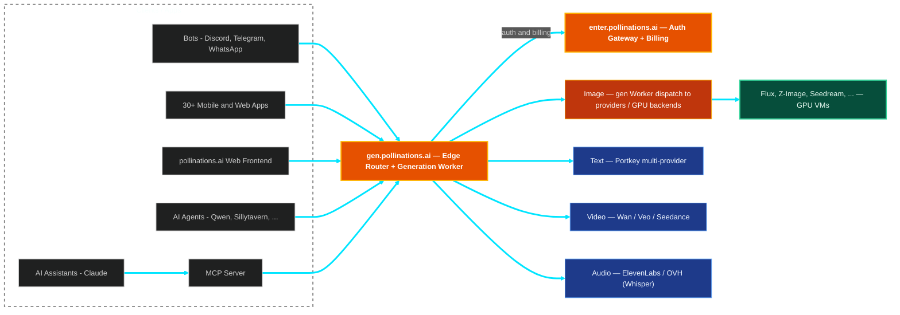

<div align="center">
  <picture>
    <source media="(prefers-color-scheme: dark)" srcset="packages/ui/src/brand/lockup-horizontal-white.svg" />
    
  </picture>
  
  <p><strong>Open-source AI for people who make things.</strong></p>

[](https://github.com/pollinations/pollinations/stargazers)
[](LICENSE)
[](https://discord.gg/pollinations-ai-885844321461485618)

[Website](https://pollinations.ai) · [Dashboard](https://enter.pollinations.ai) · [Playground](https://pollinations.ai/play) · [API Docs](APIDOCS.md) · [Discord](https://discord.gg/pollinations-ai-885844321461485618)

</div>

<p align="center"></p>

## 🆕 Recent Apps

| Name | Description | Author |
|------|-------------|--------|
| [🤖 Lucia](https://t.me/MissLucia_bot) | Lucia is an empathetic virtual companion providing warmth, care, and emotional support. She is available on Telegram and has over 10,000 Monthly Active Users (MAU). | [@Ad101DP](https://github.com/Ad101DP) |
| [📚 Pollination EduCard AI](https://satwata-bandopadhyay.github.io/pollination-educard-ai) | Pollination EduCard AI provides an “About the App” section describing the app. | [@Satwata-Bandopadhyay](https://github.com/Satwata-Bandopadhyay) |
| [💼 Valdy - AI-Powered Startup Validation](https://samo-fex.github.io/valdy) | Validate startup ideas with Valdy, an AI-powered validation tool that uses real-world data and AI analysis to support entrepreneurs and product managers. | [@samo-fex](https://github.com/samo-fex) |
| [🛠️ FluxFlow CLI](https://www.npmjs.com/package/fluxflow-cli) | A powerful CLI-based AI Agent that assists with coding, documentation, and creative production. By integrating the pollinations.ai API, it delivers robust image generation capabilities directly to the | [@KushalRoyChowdhury](https://github.com/KushalRoyChowdhury) |
| [🛠️ Promptzy](https://promptzy.pinkpixel.dev) | Manage and organize AI prompts with tagging and search in Promptzy, available as a web/desktop app with cloud storage. | [@sizzlebop](https://github.com/sizzlebop) |
| [🖼️ Generateur d'image ia](https://mzaacdepy.github.io/generateur-images-ia) | Generate images with the French-language AI image generator web app built with vanilla HTML/CSS/JS. | [@MzaacDePY](https://github.com/MzaacDePY) |
| [🖼️ Orange City (Pollinations AI Edition)](https://github.com/GermanIllan/orange_city) | A Python plugin for GIMP 3.2 that generates stylized oil-painted cityscapes with AI-generated background skies powered by Pollinations.ai. **Direct link to Pollinations API integration in source code: | [@GermanIllan](https://github.com/GermanIllan) |
| [💬 7visions - Safe Dream Analysis](https://www.7visions.fr/app) | 7visions is a safe AI dream analysis app available on web and Android. Users describe a dream and receive a structured interpretation through seven complementary perspectives: Jungian psychology, Freu | [@BenoitMagnan](https://github.com/BenoitMagnan) |
| [🎮 Archetype](https://github.com/xnet-admin-1/archetype-game) | Archetype is a collaborative storytelling game for Android where 2-4 players take turns building stories together. It uses the Pollinations text API (nova-fast model) for AI-powered story sparks, char | [@xnet-admin-1](https://github.com/xnet-admin-1) |
| [💬 Briefly](https://briefly-app.defyma.com) | Briefly turns rough notes into structured output, breaks big goals into actionable steps, and drafts clear replies in a focused chat thread. | [@defyma](https://github.com/defyma) |

[Browse all apps →](apps/GREENHOUSE.md)
## 🚀 Unified API

We've launched **https://gen.pollinations.ai** — a single endpoint for all your AI generation needs: text, images, audio, video, 3D, embeddings — all in one place.

### What's Included

- **Unified endpoint** — single API at `gen.pollinations.ai` for all generation
- **Pollen credits** — simple pay-as-you-go system ($1 ≈ 1 Pollen)
- **All models, one place** — Flux, GPT, Claude, Gemini, Seedream, and more
- **API keys** — secret keys for model usage, app keys for tracking BYOP apps.
- **CLI** — `npx @pollinations/cli` for humans and AI agents ([source](packages/polli-cli))

> Get started at [enter.pollinations.ai](https://enter.pollinations.ai) and check out the [API docs](https://gen.pollinations.ai/docs)

## 🆕 Latest News

- **2026-08-06** – **🌟 The app garden got roots** The community directory now runs on a validated, newest-first catalog, so [browse 859 community apps](https://pollinations.ai/apps) without relying on a heroic Markdown file.
- **2026-08-06** – **✨ Two gardens, one search** The model catalog now separates Official and Community models, with shared search and cleaner modality filters for finding the thing you actually need. [Browse models](https://gen.pollinations.ai/v1/models)
- **2026-08-06** – **⚡ The catalog stopped hauling furniture** The Official model catalog now progressively loads rows while you browse, making search, filtering, and opening the list substantially lighter.
- **2026-08-06** – **📱 A whisper joins the hive** Meet Whisper, an Android overlay that sends screen and audio context to Pollinations models without making you leave the app you are using. [Try it](https://play.google.com/store/apps/details?id=com.leiver.whisper_android) <!-- app -->
- **2026-08-05** – **🎯 Quests enter MCP** Agents can now inspect available account Quests with the read-only `listQuests` tool—useful work, now queryable by machines too. [MCP docs](https://gen.pollinations.ai/docs#tag/mcp-server)
- **2026-08-05** – **✨ Visual agent workflows** Build multi-step AI automations in Flow with drag-and-drop agents, HTTP requests, conditions, transforms, and outputs. [Try it](https://pollinations-chat-kohl.vercel.app) <!-- app -->
- **2026-08-05** – **🎨 Jewelry sketches, rendered** Sparkle Studio turns jewelry descriptions or rough sketches into polished photorealistic designs. [Try it](https://sparkle-studio-pollinations-a031.onbelmo.uk) <!-- app -->
- **2026-08-05** – **🐱 Cats, now sticker-shaped** Upload a cat photo and turn its fur, eyes, and general feline bureaucracy into personalized cartoon stickers. [Try it](https://fantastic-dolphin-00911c.netlify.app) <!-- app -->
- **2026-08-04** – **✨ Command A Plus, less translation** Native messages, `reasoning_effort`, tool calls, streaming, and verified image inputs now pass through more faithfully on Cohere Command A Plus.
- **2026-08-03** – **🎨 Krea 2 Medium** Krea joins the image API: generate square, wide, or tall images with `krea-2`, aspect-ratio mapping, and seed support. [Try it](https://pollinations.ai/play)
---

## 🌱 Introduction

[pollinations.ai](https://pollinations.ai) is an open-source generative AI platform based in Berlin, powering 500+ community projects with accessible text, image, video, audio, 3D and embeddings generation APIs. We build in the open and keep AI accessible to everyone—thanks to our amazing supporters.

## 🚀 Key Features

- 🔓 **100% Open Source** — code, decisions, roadmap all public
- 🤝 **Community-Built** — 500+ projects already using our APIs
- 🌱 **Pollen Quests** — earn Pollen by completing Quests
- 🖼️ **Image Generation** — Text-to-image and image editing
- 📝 **Text Generation** — Chat, reasoning, vision, function calling, structured outputs 
- 🎬 **Video Generation** — Text-to-video and image-to-video
- 🎵 **Audio** — Text-to-speech and speech-to-text
- 🧊 **3D Generation** — Text-to-3D and image-to-3D
- 🎙️ **Real-time API** — OpenAI-compatible WebSocket for streaming conversations
- 🔢 **Embeddings Creation** — Semantic search, retrieval, similarity matching
- 🎣 **_Easy-to-use Packages_** ([Packages](packages/))

<a href="https://star-history.com/#pollinations/pollinations&Date">
 <picture>
   <source media="(prefers-color-scheme: dark)" srcset="https://api.star-history.com/svg?repos=pollinations/pollinations&type=Date&theme=dark" width="600" />
   <source media="(prefers-color-scheme: light)" srcset="https://api.star-history.com/svg?repos=pollinations/pollinations&type=Date" width="600" />
   
 </picture>
</a>

## 🧩 Community Models

Community members run their own models on the Pollinations platform — text, image, video, audio, embeddings, and more.

- **Host your own model** — register an upstream endpoint with the [`/account/my-models`](APIDOCS.md) API, then serve it to everyone or keep it private to your account.
- **Automatic fallback routing** — nominate up to three compatible backup models so generations keep moving when an upstream model goes down.
- **Discover and monitor** — browse community models via [gen.pollinations.ai/v1/models](https://gen.pollinations.ai/v1/models) and watch live health and community leaderboards at [model-monitor.pollinations.ai](https://model-monitor.pollinations.ai).

For billing details when building apps on top, see [Bring Your Own Pollen](./BRING_YOUR_OWN_POLLEN.md).

## 🚀 Getting Started

[](https://deepwiki.com/pollinations/pollinations)

### Quick Start (3 Steps)

1️⃣ **Get your API key**  
Sign up at [enter.pollinations.ai](https://enter.pollinations.ai/keys) to generate your key.

2️⃣ **Choose what you want to generate**  
Pollinations supports:
- 🖼 Images  
- 📝 Text  
- 🔊 Audio  
- 🎬 Video
- 🧊 3D
- 🔢 Embeddings

3️⃣ **Make your first request**  
Use one of the examples below to generate your first AI output in seconds.

### Image Generation

```bash
curl -H "Authorization: Bearer YOUR_API_KEY" 'https://gen.pollinations.ai/image/a%20beautiful%20sunset' -o image.jpg
```

Or visit [pollinations.ai/play](https://pollinations.ai/play) for an interactive experience.

### Text Generation

```bash
curl 'https://gen.pollinations.ai/text/Hello%20world?key=YOUR_API_KEY'
```

### Audio Generation

**Simple GET endpoint:**

```bash
curl 'https://gen.pollinations.ai/audio/Hello%20from%20Pollinations?voice=nova&key=YOUR_API_KEY' -o speech.mp3
```

**OpenAI TTS compatible:**

```bash
curl 'https://gen.pollinations.ai/v1/audio/speech' \
  -H 'Content-Type: application/json' \
  -H 'Authorization: Bearer YOUR_API_KEY' \
  -d '{"model": "tts-1", "input": "Hello from Pollinations!", "voice": "nova"}' \
  -o speech.mp3
```

Available voices: `alloy`, `echo`, `fable`, `onyx`, `nova`, `shimmer`, plus [30+ ElevenLabs voices](https://gen.pollinations.ai/docs).

**Speech-to-text:**

```bash
curl 'https://gen.pollinations.ai/v1/audio/transcriptions' \
  -H "Authorization: Bearer YOUR_API_KEY" \
  -F file=@audio.mp3 \
  -F model=whisper-large-v3
```

### Video Generation

```bash
curl 'https://gen.pollinations.ai/video/a%20sunset%20timelapse%20over%20the%20ocean?key=YOUR_API_KEY' -o video.mp4
```

Use `duration` to set video length, `aspectRatio` for orientation, and `image[0]`/`image[1]` to pass start/end reference frames. See available video models and capabilities at [gen.pollinations.ai/video/models](https://gen.pollinations.ai/video/models).

### 3D Generation

```bash
curl 'https://gen.pollinations.ai/3d/a%20low-poly%20treasure%20chest?model=trellis-2&resolution=low&key=YOUR_API_KEY&image=IMAGE_URL' -o model.glb
```

Pass reference image URL(s) via the `image` parameter for image-to-3D models (put `image=` last in the URL, or URL-encode it). See available 3D models at [gen.pollinations.ai/3d/models](https://gen.pollinations.ai/3d/models).

### Embeddings

```bash
curl 'https://gen.pollinations.ai/v1/embeddings' \
  -H 'Content-Type: application/json' \
  -H 'Authorization: Bearer YOUR_API_KEY' \
  -d '{"model": "openai-3-small", "input": "Hello world!"}'
```

Pass a string or an array of up to 32 strings (text or multimodal content parts). See available embedding models at [gen.pollinations.ai/embeddings/models](https://gen.pollinations.ai/embeddings/models).

### Pollinations CLI

Generate text, images, audio, video, and more right from your terminal:

```bash
npx @pollinations/cli gen image "cyberpunk city at night" --model flux --output city.png
npx @pollinations/cli gen text "Explain quantum tunneling in one sentence"
npx @pollinations/cli gen audio "Hello world" --voice nova --output speech.mp3
npx @pollinations/cli gen video "a waterfall in slow motion" --duration 5 --output clip.mp4
npx @pollinations/cli gen transcribe speech.mp3
```

Install globally and use the shorter `polli` command: `npm install -g @pollinations/cli`. Run `polli models` to list models, `polli auth login` to authenticate, and `polli docs` for the full API reference in your terminal.

### Real-time API

Stream AI responses over an OpenAI-compatible WebSocket:

```
wss://gen.pollinations.ai/v1/realtime?model=gpt-realtime-2.1&key=pk_YOUR_API_KEY
```

Browser clients pass the key as a query parameter (`?key=`); server clients can use the `Authorization: Bearer` header instead.

### MCP Server for AI Assistants

Our MCP (Model Context Protocol) server enables AI assistants like Claude to generate images and audio directly. [Learn more](./packages/mcp/README.md)

#### Configuration

Add this to your MCP client configuration:

```json
{
  "mcpServers": {
    "pollinations": {
      "command": "npx",
      "args": ["@pollinations/mcp"]
    }
  }
}
```

### Run with npx (no installation required)

```bash
npx @pollinations/mcp
```

A community alternative, [MCPollinations](https://github.com/pinkpixel-dev/MCPollinations), is also available.

AI assistants can:

- Generate images from text descriptions
- Create text-to-speech audio with various voice options
- Play audio responses through the system speakers
- Access all pollinations.ai models and services
- List available models, voices, and capabilities

**For more advanced usage, check out our full API docs — [APIDOCS.md](./APIDOCS.md) or the live docs at [gen.pollinations.ai/docs](https://gen.pollinations.ai/docs).**

## 🔐 Authentication

Get your API key at [enter.pollinations.ai](https://enter.pollinations.ai/keys)

### Key Types

| Key             | Prefix | Use Case                       | Rate Limits              | Status  |
| --------------- | ------ | ------------------------------ | ------------------------ | ------- |
| **App Key** | `pk_`  | Browsers, mobile apps, public clients | Budget & permissions set at creation | Stable |
| **Secret**      | `sk_`  | Server-side only               | No rate limits           | Stable  |

> ⚠️ **Never expose `sk_` keys** in client-side code, git repos, or public URLs

> 💡 **Building an app?** Use [Bring Your Own Pollen](./BRING_YOUR_OWN_POLLEN.md) — users pay for their own usage, you pay $0

### Model Restrictions

Each API key can be scoped to specific models. When creating a key at [enter.pollinations.ai](https://enter.pollinations.ai/keys), you can:

- **Allow all models** — key works with any available model
- **Restrict to specific models** — select exactly which models the key can access (e.g., only `flux` and `openai`, or just `gptimage-large`)

### Usage

```bash
curl 'https://gen.pollinations.ai/image/a%20cat?key=YOUR_KEY'
```

**Environment variable (best practice):**

```bash
export POLLINATIONS_API_KEY=sk_...
```

See [full API docs](APIDOCS.md) for detailed authentication information.

## 🖥️ How to Use

### Web Interface

Our web interface is user-friendly and doesn't require any technical knowledge. Simply visit [https://pollinations.ai](https://pollinations.ai) and start creating!

Here are some examples of what you can generate:

<p align="center"></p>

<p align="center"></p>

## 🛠️ Integration

### SDK

Check out our [Pollinations SDK](./packages/sdk/README.md) for Node.js, browser, and React integration.

### OpenAI SDK Compatibility

The API is OpenAI-compatible, so the official OpenAI SDKs work out of the box — just point them at `https://gen.pollinations.ai/v1`.

**Node.js:**

```javascript
import OpenAI from "openai";

const client = new OpenAI({
  baseURL: "https://gen.pollinations.ai/v1",
  apiKey: "YOUR_API_KEY",
});

const response = await client.chat.completions.create({
  model: "openai",
  messages: [{ role: "user", content: "Hello!" }],
});
console.log(response.choices[0].message.content);
```

**Python:**

```python
from openai import OpenAI

client = OpenAI(base_url="https://gen.pollinations.ai/v1", api_key="YOUR_API_KEY")

response = client.chat.completions.create(
    model="openai",
    messages=[{"role": "user", "content": "Hello!"}],
)
print(response.choices[0].message.content)
```

Other OpenAI SDKs work too: [Go](https://github.com/openai/openai-go), [Java](https://github.com/openai/openai-java), [.NET](https://github.com/openai/openai-dotnet), [Rust (async-openai, community)](https://github.com/64bit/async-openai) — plus compatible frameworks like [Vercel AI SDK](https://ai-sdk.dev/).

**Vercel AI SDK:**

```typescript
import { createOpenAI } from "@ai-sdk/openai";
import { generateText } from "ai";

const client = createOpenAI({
  baseURL: "https://gen.pollinations.ai/v1",
  apiKey: "YOUR_API_KEY",
});

const { text } = await generateText({
  model: client("openai"),
  prompt: "Hello!",
});
console.log(text);
```

## Architecture


```mermaid
%%{init: {'theme': 'dark', 'themeVariables': { 'background': '#1a1a1a', 'primaryColor': '#2a2a2a', 'primaryBorderColor': '#555555', 'primaryTextColor': '#eeeeee', 'lineColor': '#00e5ff', 'clusterBkg': 'transparent', 'clusterBorder': '#888888', 'fontSize': '13px', 'fontFamily': 'Inter, system-ui, sans-serif'}}}%%

graph LR
    subgraph CLIENTS["Clients / Apps"]
        Q[Bots - Discord, Telegram, WhatsApp]
        N[30+ Mobile and Web Apps]
        A[pollinations.ai Web Frontend]
        R[AI Agents - Qwen, Sillytavern, ...]
        AI[AI Assistants - Claude]
        MCP[MCP Server]
    end

    AI --> MCP
    Q --> GEN
    N --> GEN
    A --> GEN
    R --> GEN
    MCP --> GEN

    GEN["gen.pollinations.ai — Edge Router + Generation Worker"]:::cfWorker -->|auth and billing| ENTER["enter.pollinations.ai — Auth Gateway + Billing"]:::cfWorker

    GEN --> IMG["Image — gen Worker dispatch to providers / GPU backends"]:::cfWorkerLight
    IMG --> D["Flux, Z-Image, Seedream, ... — GPU VMs"]:::gpuNode

    GEN --> TXT["Text — Portkey multi-provider"]:::provider
    GEN --> VID["Video — Wan / Veo / Seedance"]:::provider
    GEN --> AUD["Audio — ElevenLabs / OVH (Whisper)"]:::provider

    style CLIENTS fill:none,stroke:#888,stroke-width:2px,stroke-dasharray: 5 5

    linkStyle default stroke-width:3px,stroke:#00E5FF

    classDef cfWorker fill:#E65100,color:#fff,stroke:#FFB300,stroke-width:2px,font-weight:bold
    classDef cfWorkerLight fill:#BF360C,color:#fff,stroke:#FFB300,stroke-width:1px
    classDef gpuNode fill:#064E3B,stroke:#34D399,color:#ECFDF5,stroke-width:2px
    classDef provider fill:#1E3A8A,stroke:#60A5FA,color:#EFF6FF,stroke-width:1px
```

## 🔮 Future Developments

We're constantly exploring new ways to push the boundaries of AI-driven content creation. Some areas we're excited about include:

- Digital Twins: Creating interactive AI-driven avatars
- Music Video Generation: Combining AI-generated visuals with music for unique video experiences
- Real-time AI-driven Visual Experiences: Projects like our Dreamachine, which create immersive, personalized visual journeys

## 🌍 Our Vision

pollinations.ai envisions a future where AI technology is:

- **Open & Accessible**: We believe AI should be available to everyone — earn Pollen by contributing, no credit card required

- **Transparent & Ethical**: Our open-source approach ensures transparency in how our models work and behave

- **Community-Driven**: We're building a platform where developers, creators, and AI enthusiasts can collaborate and innovate

- **Interconnected**: We're creating an ecosystem where AI services can seamlessly work together, fostering innovation through composability

- **Evolving**: We embrace the rapid evolution of AI technology while maintaining our commitment to openness and accessibility

We're committed to developing AI technology that serves humanity while respecting ethical boundaries and promoting responsible innovation. Join us in shaping the future of AI.

## 🤝 Community and Development

We believe in community-driven development. You can contribute to pollinations.ai in several ways:

1. **Coding Assistant**: The easiest way to contribute! Just [create a GitHub issue](https://github.com/pollinations/pollinations/issues/new) describing the feature you'd like to see implemented. The Polli assistant will analyze and implement it directly! No coding required - just describe what you want.

2. **Project Submissions**: Have you built something with pollinations.ai? [Use our app submission template](https://github.com/pollinations/pollinations/issues/new?template=app-submission.yml) to share it with the community and get it featured in our README.

3. **Feature Requests & Bug Reports**: Have an idea or found a bug? [Open an issue](https://github.com/pollinations/pollinations/issues/new) and let us know. Our team and the Polli assistant will review it.

4. **Community Engagement**: Join our vibrant [Discord community](https://discord.gg/pollinations-ai-885844321461485618) to:
   - Share your creations
   - Get support and help others
   - Collaborate with fellow AI enthusiasts
   - Discuss feature ideas before creating issues

For any questions or support, please visit our [Discord channel](https://discord.gg/pollinations-ai-885844321461485618) or create an issue on our [GitHub repository](https://github.com/pollinations/pollinations).

## 🗂️ Project Structure

Our codebase is organized into several key folders, each serving a specific purpose in the pollinations.ai ecosystem:

- [`pollinations.ai/`](./pollinations.ai/): The main React application for the Pollinations.ai website.

- [`gen.pollinations.ai/`](./gen.pollinations.ai/): Cloudflare Worker for API routing, auth handoff, text generation, and caching.

- [`enter.pollinations.ai/`](./enter.pollinations.ai/): Auth gateway and billing — API keys, Pollen credits, and pack checkout.

- [`image.pollinations.ai/`](./image.pollinations.ai/): Image and video GPU/backend assets and deployment scripts; the public gateway code lives in `gen.pollinations.ai/`.

- [`shared/`](./shared/): Auth, model registries, IP queue, and utilities shared across the services.

- [`apps/`](./apps/): Community apps and the app catalog (`catalog.json`, `GREENHOUSE.md`).

- [`media.pollinations.ai/`](./media.pollinations.ai/): Media upload service — upload files and get a URL to use with Pollinations models, with public tag galleries.

- [`social/`](./social/): Automated social media pipeline (X, LinkedIn, Instagram, Reddit, Discord).

- [`packages/polli-cli/`](./packages/polli-cli/): The Pollinations CLI — for humans, AI agents, and everything in between.

- [`packages/sdk/`](./packages/sdk/): SDK NPM library with pollinations ready functions for Pollinations.ai.

- [`packages/mcp/`](./packages/mcp/): Model Context Protocol (MCP) server for AI assistants like Claude to generate images directly.

- [`opencode-pollinations-plugin`](https://github.com/fkom13/opencode-pollinations-plugin): This is `opencode-pollinations-plugin`, a plugin for OpenCode that integrates Pollinations.ai's inference capabilities directly into the OpenCode environment, built by our community member [@fkom13](https://github.com/fkom13).


This structure encompasses the frontend website, backend services for image and text generation, and integrations like the Discord bot and MCP server, providing a comprehensive framework for the pollinations.ai platform.

For development setup and environment management, see [DEVELOP.md](./DEVELOP.md).

## 🏢 Supported By

> pollinations.ai is proud to be supported by:

<p align="center"></p>

- [Perplexity AI](https://www.perplexity.ai/): AI-powered search and conversational answer engine
- [AWS Activate](https://aws.amazon.com/): GPU Cloud Credits
- [io.net](https://io.net/): Decentralized GPU network for AI compute
- [BytePlus](https://www.byteplus.com/): Official ByteDance cloud services and AI solutions
- [Google Cloud for Startups](https://cloud.google.com/): GPU Cloud Credits
- [NVIDIA Inception](https://www.nvidia.com/en-us/deep-learning-ai/startups/): AI startup support
- [Azure (MS for Startups)](https://azure.microsoft.com/): OpenAI credits
- [Cloudflare](https://developers.cloudflare.com/workers-ai/): Put the connectivity cloud to work for you.
- [Scaleway](https://www.scaleway.com/): Europe's empowering cloud provider
- [Modal](https://modal.com/): High-performance AI infrastructure
- [Nebius](https://nebius.com/): AI-optimized cloud infrastructure with NVIDIA GPU clusters

## 💚 Support Us

The best way to support pollinations.ai is by using our product! Get your API key and start building at **[enter.pollinations.ai](https://enter.pollinations.ai/keys)**.

## 📣 Stay Connected
[Status](https://model-monitor.pollinations.ai) ·
[News & FAQ](https://enter.pollinations.ai/news) ·
[𝕏 Twitter](https://x.com/pollinations_ai) · [Instagram](https://instagram.com/pollinations_ai) · [LinkedIn](https://www.linkedin.com/company/pollinations-ai) · [Facebook](https://facebook.com/pollinations) · [Reddit](https://www.reddit.com/r/pollinations_ai/) · [YouTube](https://www.youtube.com/c/pollinations)

## 📜 License

pollinations.ai is open-source software licensed under the [MIT license](LICENSE).

---

Made with ❤️ by the pollinations.ai team

