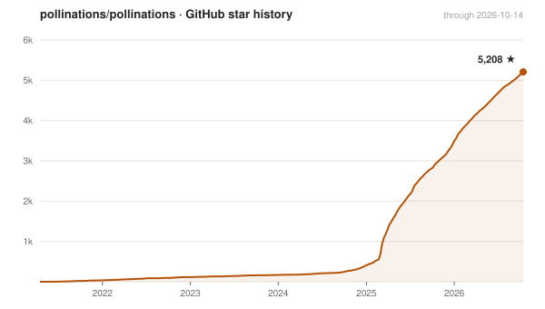
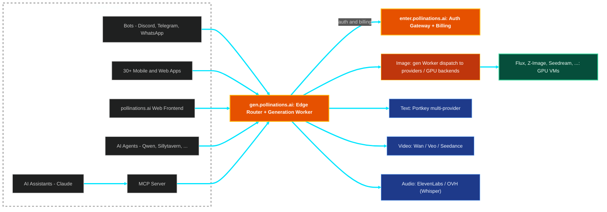

<div align="center">
  <picture>
    <source media="(prefers-color-scheme: dark)" srcset="packages/ui/src/brand/lockup-horizontal-white.svg" />
    
  </picture>
  
  <p><strong>Open-source AI for people who make things.</strong></p>

[](https://github.com/pollinations/pollinations/stargazers)
[](LICENSE)
[](https://discord.gg/k9F7SyTgqn)

[Website](https://pollinations.ai) · [Dashboard](https://enter.pollinations.ai) · [Playground](https://pollinations.ai/play) · [Guides](#guides) · [API Docs](APIDOCS.md) · [Discord](https://discord.gg/k9F7SyTgqn)

</div>

<p align="center"></p>

<!-- recent-apps:start -->
## 🆕 Recent Apps

| Name | Description | Author |
|------|-------------|--------|
| [🎮 Tiny Fighter Arena](https://kreggscode.github.io/tiny-fighter-arena) | Describe a fighter in one line, the AI designs the whole thing from it, then sends it into a short commentated battle up a five-rung ladder. One line in ( a shy storm cloud that apologises before it s | [@kreggscode](https://github.com/kreggscode) |
| [💬 Radio Bloom](https://mrunknowne09-radio-bloom.static.hf.space) | Radio Bloom is a duplicate-ready voice character playground. Visitors sign in with their own Pollen, then speak or type to three AI characters powered by Pollinations chat, transcription, and voice mo | [@ismailbanouigu](https://github.com/ismailbanouigu) |
| [🎮 One Line Arena](https://drjacky.github.io/one-line-arena) | Describe a fighter in one line. Pollinations designs the whole fighter from it: name, title, portrait, stats, three moves, a quirk, a weakness and a catchphrase. Then it sends the fighter into a short | [@Drjacky](https://github.com/Drjacky) |
| [🎬 AI ad video generator](https://github.com/zee7lubricantsoperations-collab/AI-ad-video-generator-free-no-cahrges-) | AI Ad Video Maker is a Windows desktop app that produces 7–10 s advertisement videos with AI‑generated scripts, visuals, voice‑overs, captions and background music. It supports 21 languages, multiple | [@zee7lubricantsoperations-collab](https://github.com/zee7lubricantsoperations-collab) |
| [🖼️ Poster Iklan Pantas](https://poster.simetry.digital) | Malay-language ad poster maker for small sellers in Malaysia. Users type product, headline and offer, pick style and size (feed, story, banner), optionally upload a product photo, and get a ready-to-p | [@Syafixit](https://github.com/Syafixit) |
| [🖼️ Pollinations Model Tester](https://polli-model-tester-9321atohv-scriptsnsenses-8753s-projects.vercel.app) | The app is [Pollinations.ai](https://pollinations.ai/) Models Tester — a single-file, browser-based playground for comparing Pollinations text models side-by-side. The app lets you enter any model ID | [@scriptsnsenses-sys](https://github.com/scriptsnsenses-sys) |
| [🖼️ Teapot Art](https://svirepyibambr.github.io/teapot-art) | A one-page image generator: describe what you want in words — get a picture. Single static HTML file, no build step, no dependencies. Generation goes through the Pollinations image API; a user key is | [@SvirepyiBambr](https://github.com/SvirepyiBambr) |
| [🖼️ StyleLens AI](https://pollination-studio.base44.app) | Transform your images instantly with AI-powered style conversion and custom artistic edits using POLLINATIONS AI. Restyle — a dark, single-page studio: drop a photo, pick one of 12 styles or describe | [@nalnd1](https://github.com/nalnd1) |
| [🖼️ Pollen Postcard](https://pollen-postcard.jm716111.chatgpt.site) | Turns a small memory into a polished illustrated postcard. Pollinations writes the title and short note, then generates a matching square image. Visitors connect with BYOP and approve a 1 Pollen budge | [@ismailbanouigu](https://github.com/ismailbanouigu) |
| [💬 Shimi Bechor (Firstborn Greeter)](https://aidoor.shimi.land/greeter.html) | A greeter agent that welcomes visitors and explains a small agent network (its charter, public board and API). It uses the current Pollinations integration: browser-only Connect User Wallets (BYOP) wi | [@sunraz2](https://github.com/sunraz2) |

[Browse all apps →](https://pollinations.ai/apps)
<!-- recent-apps:end -->

## 🚀 Unified API

**https://gen.pollinations.ai** provides one API for text, images, audio, video, 3D, and embeddings.

### What's Included

- **Unified endpoint**: single API at `gen.pollinations.ai` for all generation
- **Pollen credits**: simple pay-as-you-go system ($1 ≈ 1 Pollen)
- **All models, one place**: Flux, GPT, Claude, Gemini, Seedream, and more
- **API keys**: secret keys for model usage, app keys for tracking BYOP apps.
- **CLI**: `npx @pollinations/cli` for humans and AI agents ([source](packages/polli-cli))

> Get started at [enter.pollinations.ai](https://enter.pollinations.ai) and check out the [API docs](https://gen.pollinations.ai/docs)

## 🆕 Latest News

<!-- Updated daily by .github/workflows/repo-update-readme.yml from the news index. -->
<!-- news:start -->
- [ **Kling 3.0 Standard video**](https://enter.pollinations.ai/models?q=kwaivgi%2Fkling-v3.0-std) <sub>Oct 18</sub><br>Make 720p clips from a prompt or start frame, with an optional end frame and audio. Choose a duration from 3 to 15 seconds.
- [ **FLUX.3 Image Klein**](https://enter.pollinations.ai/models?q=FLUX.3%20Image%20Klein) <sub>Oct 18</sub><br>Generate images or edit with up to 10 reference images and explicit dimensions up to 4096 pixels per side.
- [ **DeepSeek V4.1 Flash 1017**](https://enter.pollinations.ai/models?q=deepseek%2Fdeepseek-v4.1-flash-1017) <sub>Oct 18</sub><br>Use `deepseek/deepseek-v4.1-flash-1017` for text and image input, tools, and reasoning, with a 1,048,576-token context window.
- [ **Custom account menu links**](https://github.com/pollinations/pollinations/tree/main/packages/ui) <sub>Oct 18</sub><br>Apps using `<polli-connect>` can add links to the account menu and optionally hide Buy Pollen while keeping the balance and account actions.
- [ **Try API requests signed in**](https://gen.pollinations.ai/docs) <sub>Oct 17</sub><br>Connect your Pollinations account in the interactive API docs to try requests with your own key, without pasting it into the tester.
- [ **Drop-in sign-in for HTML**](https://react.pollinations.ai) <sub>Oct 17</sub><br>Add `<polli-connect>` to a plain HTML page for Pollinations sign-in without a build step. Read the connected key from `element.apiKey` or listen for `change` events.
- [ **Linux sandboxes for agents**](https://gen.pollinations.ai/docs#tag/mcp-servers) <sub>Oct 17</sub><br>Machines MCP gives agents tools to create and manage Linux sandboxes, run commands, and read or write text files.
- [ **Private image uploads**](https://gen.pollinations.ai/docs) <sub>Oct 17</sub><br>Set `safe=privacy` or send `Pollinations-Safe: privacy` to strip supported location, camera and embedded-text metadata before storing an image, while keeping its orientation and colour profile.
- [ **DeepSeek Flash accepts Quest Pollen**](https://enter.pollinations.ai/models) <sub>Oct 17</sub><br>Use DeepSeek V4.1 Flash with Quest Pollen as well as paid access. Remote image URLs are handled on its Azure route, with Fireworks retained as fallback.
- [ **JavaScript joins Computer MCP**](https://gen.pollinations.ai/docs#tag/mcp-servers) <sub>Oct 16</sub><br>Agents can run a JavaScript ES module function alongside bash, work with persistent files, and receive its output and return value as JSON.
<!-- news:end -->

[More news on enter.pollinations.ai →](https://enter.pollinations.ai/news)

---

## 🌱 Introduction

[pollinations.ai](https://pollinations.ai) is an open-source generative AI platform based in Berlin, used by 500+ community projects. It provides APIs for text, image, video, audio, 3D, and embeddings generation. Our code and development discussions are public. Supporters help fund the project.

<!-- Updated daily by .github/workflows/repo-update-readme.yml.
     Regenerate locally with:
     GITHUB_TOKEN=$(gh auth token) node .github/scripts/star-history-chart.mjs -->
<a href="https://star-history.com/#pollinations/pollinations&Date">
 <picture>
   <source media="(prefers-color-scheme: dark)" srcset=".github/assets/star-history-dark.svg" width="600" />
   <source media="(prefers-color-scheme: light)" srcset=".github/assets/star-history-light.svg" width="600" />
   
 </picture>
</a>

## 🚀 Key Features

- 🔓 **100% Open Source**: code, decisions, roadmap all public
- 🤝 **Community-Built**: 500+ projects already using our APIs
- 🌱 **Pollen Quests**: earn Pollen by completing Quests
- 🖼️ **Image Generation**: Text-to-image and image editing
- 📝 **Text Generation**: Chat, reasoning, vision, function calling, structured outputs
- 🎬 **Video Generation**: Text-to-video and image-to-video
- 🎵 **Audio**: Text-to-speech and speech-to-text
- 🧊 **3D Generation**: Text-to-3D and image-to-3D
- 🎙️ **Real-time API**: OpenAI-compatible WebSocket for streaming conversations
- 🔢 **Embeddings Creation**: Semantic search, retrieval, similarity matching
- 🤖 **Managed Agents**: Turn a prompt, base model, and optional Pollinations tools into a reusable model
- 📦 **Sandboxes**: Cloud Linux computers for you or your agents, opened with SSH or VS Code
- 🌐 **Sites**: Free static hosting at `<name>.pollinations.app`
- 🎣 **_Easy-to-use Packages_** ([Packages](packages/))

## Guides

| Guide | Purpose |
| --- | --- |
| [Connect User Wallets (BYOP)](https://gen.pollinations.ai/docs#tag/connect-user-wallets) | Let users pay with their own Pollen |
| [Publish an Agent](https://gen.pollinations.ai/docs#tag/publish-an-agent) | Publish a hosted agent |
| [Publish a Model](https://gen.pollinations.ai/docs#tag/publish-a-model) | Connect your model endpoint |
| [Sandboxes](https://gen.pollinations.ai/docs#tag/sandboxes) | Run code in a virtual machine |
| [Sites](https://gen.pollinations.ai/docs#tag/sites) | Host a static site at <name>.pollinations.app |
| [Coding Harnesses](https://gen.pollinations.ai/docs#tag/coding-harnesses) | Connect a coding assistant |
| [MCP Servers](https://gen.pollinations.ai/docs#tag/mcp-servers) | Give agents access to tools |
| [CLI](https://gen.pollinations.ai/docs#tag/cli) | Use Pollinations from a terminal |

## 🤖 Managed Agents

Build a reusable text agent without hosting an agent server. Choose a system prompt and base model, optionally give it Pollinations tools, then call it through the same OpenAI-compatible API as any other model.

- **Private or public**: keep an agent owner-only or publish it after receiving community publisher access.
- **Normal model API**: call a registered agent by its `owner/agent-name` model ID.
- **Dashboard, CLI, or API**: manage agents in [My Models](https://enter.pollinations.ai/my-models), with `polli agents`, or through `/account/agents`.

See [Publish an Agent](./BUILD_YOUR_OWN_AGENT.md) for setup and billing behavior.

## 🛠️ Coding Harnesses

Run tools such as Bloom CLI, DeepSeek Harness, Hermes Agent, OpenCode, Pi, Prime Agent, and tgpt on Pollinations models. `polli harness` edits the tool's own config so it calls Pollinations with a dedicated key, and restores it on `off`.

```bash
npx @pollinations/cli harness dsh on
```

See [Coding Harnesses](./CODING_HARNESSES.md) for supported harnesses and how to add one.

## 🧩 Community Models

Community members connect their own OpenAI-compatible text, image, image-editing, and speech-to-text endpoints to Pollinations.

- **Host your own model**: follow [Publish a Model](./BRING_YOUR_OWN_MODEL.md) to test and register an upstream endpoint, then keep it private or publish it to the catalog.
- **Automatic fallback routing**: nominate up to three compatible backup models so generations keep moving when an upstream model goes down.
- **Discover and monitor**: browse community models via [gen.pollinations.ai/v1/models](https://gen.pollinations.ai/v1/models) and watch live health and community leaderboards at [model-monitor.pollinations.ai](https://model-monitor.pollinations.ai).

For billing details when building apps on top, see [Connect User Wallets](./BRING_YOUR_OWN_POLLEN.md).

## 🚀 Getting Started

[](https://deepwiki.com/pollinations/pollinations)

### Quick Start (3 Steps)

1️⃣ **Get your API key**  
Sign up at [enter.pollinations.ai](https://enter.pollinations.ai/keys) to generate your key.

2️⃣ **Choose what you want to generate**  
Pollinations supports:
- 🖼 Images  
- 📝 Text  
- 🔊 Audio  
- 🎬 Video
- 🧊 3D
- 🔢 Embeddings

3️⃣ **Make your first request**  
Use one of the examples below to generate your first AI output in seconds.

### Image Generation

```bash
curl -H "Authorization: Bearer YOUR_API_KEY" 'https://gen.pollinations.ai/image/a%20beautiful%20sunset' -o image.jpg
```

Or visit [pollinations.ai/play](https://pollinations.ai/play) for an interactive experience.

### Text Generation

```bash
curl 'https://gen.pollinations.ai/text/Hello%20world?key=YOUR_API_KEY'
```

### Audio Generation

**Simple GET endpoint:**

```bash
curl 'https://gen.pollinations.ai/audio/Hello%20from%20Pollinations?voice=nova&key=YOUR_API_KEY' -o speech.mp3
```

**OpenAI TTS compatible:**

```bash
curl 'https://gen.pollinations.ai/v1/audio/speech' \
  -H 'Content-Type: application/json' \
  -H 'Authorization: Bearer YOUR_API_KEY' \
  -d '{"model": "openai/tts-1", "input": "Hello from Pollinations!", "voice": "nova"}' \
  -o speech.mp3
```

Available voices: `alloy`, `echo`, `fable`, `onyx`, `nova`, `shimmer`, plus [30+ ElevenLabs voices](https://gen.pollinations.ai/docs).

**Speech-to-text:**

```bash
curl 'https://gen.pollinations.ai/v1/audio/transcriptions' \
  -H "Authorization: Bearer YOUR_API_KEY" \
  -F file=@audio.mp3 \
  -F model=openai/whisper-large-v3
```

### Video Generation

```bash
curl 'https://gen.pollinations.ai/video/a%20sunset%20timelapse%20over%20the%20ocean?key=YOUR_API_KEY' -o video.mp4
```

Use `duration` to set video length, `aspectRatio` for orientation, and `image[0]`/`image[1]` to pass start/end reference frames. See available video models and capabilities at [gen.pollinations.ai/video/models](https://gen.pollinations.ai/video/models).

### 3D Generation

```bash
curl 'https://gen.pollinations.ai/3d/a%20low-poly%20treasure%20chest?model=microsoft/trellis-2&resolution=low&key=YOUR_API_KEY&image=IMAGE_URL' -o model.glb
```

Pass reference image URL(s) via the `image` parameter for image-to-3D models (put `image=` last in the URL, or URL-encode it). See available 3D models at [gen.pollinations.ai/3d/models](https://gen.pollinations.ai/3d/models).

### Embeddings

```bash
curl 'https://gen.pollinations.ai/v1/embeddings' \
  -H 'Content-Type: application/json' \
  -H 'Authorization: Bearer YOUR_API_KEY' \
  -d '{"model": "openai/text-embedding-3-small", "input": "Hello world!"}'
```

Pass a string or an array of up to 32 strings (text or multimodal content parts). See available embedding models at [gen.pollinations.ai/embeddings/models](https://gen.pollinations.ai/embeddings/models).

### Pollinations CLI

Generate text, images, audio, video, and more right from your terminal:

```bash
npx @pollinations/cli gen image "cyberpunk city at night" --model black-forest-labs/flux.1-schnell --output city.png
npx @pollinations/cli gen text "Explain quantum tunneling in one sentence"
npx @pollinations/cli gen audio "Hello world" --voice nova --output speech.mp3
npx @pollinations/cli gen video "a waterfall in slow motion" --duration 5 --output clip.mp4
npx @pollinations/cli gen transcribe speech.mp3
```

Install globally and use the shorter `polli` command: `npm install -g @pollinations/cli`. Run `polli models` to list models, `polli auth login` to authenticate, and `polli docs` for the full API reference in your terminal.

### Real-time API

Stream AI responses over an OpenAI-compatible WebSocket:

```
wss://gen.pollinations.ai/v1/realtime?model=openai/gpt-realtime-2.1&key=pk_YOUR_API_KEY
```

Browser clients pass the key as a query parameter (`?key=`); server clients can use the `Authorization: Bearer` header instead.

### MCP Servers

Connect Streamable HTTP clients to the hosted Pollinations MCP server:

```text
https://gen.pollinations.ai/mcp/pollinations
```

Send your Pollinations API key as an `Authorization: Bearer` header. See the
[MCP Servers documentation](https://gen.pollinations.ai/docs#tag/mcp-servers)
for the full hosted catalog.

## 🔐 Authentication

Get your API key at [enter.pollinations.ai](https://enter.pollinations.ai/keys)

### Key Types

| Key             | Prefix | Use Case                       | Rate Limits              | Status  |
| --------------- | ------ | ------------------------------ | ------------------------ | ------- |
| **App Key** | `pk_`  | Browsers, mobile apps, public clients | Budget & permissions set at creation | Stable |
| **Secret**      | `sk_`  | Server-side only               | No rate limits           | Stable  |

> ⚠️ **Never expose `sk_` keys** in client-side code, git repos, or public URLs

> 💡 **Building an app?** Use [Connect User Wallets](./BRING_YOUR_OWN_POLLEN.md): users pay for their own usage, you pay $0

### Model Restrictions

Each API key can be scoped to model categories or specific models. When creating a key at [enter.pollinations.ai](https://enter.pollinations.ai/keys), you can:

- **Allow all models**: key works with any available model
- **Restrict to categories**: e.g. only `image`, or `image` and `text`. A key allows every model in its categories, including models added later
- **Restrict to specific models**: through the [API](APIDOCS.md) or `polli keys update <id> --models black-forest-labs/flux.1-schnell tongyi-mai/z-image-turbo`; a model ID allows only that model

### Usage

```bash
curl 'https://gen.pollinations.ai/image/a%20cat?key=YOUR_KEY'
```

**Environment variable (best practice):**

```bash
export POLLINATIONS_API_KEY=sk_...
```

See [full API docs](APIDOCS.md) for detailed authentication information.

## 🖥️ How to Use

### Web Interface

Visit [the playground](https://pollinations.ai/play) to generate content in your browser.

Here are some examples of what you can generate:

<p align="center"></p>

<p align="center"></p>

## 🛠️ Integration

### SDK

Check out our [Pollinations SDK](./packages/sdk/README.md) for Node.js, browser, and React integration.

### OpenAI SDK Compatibility

The API is OpenAI-compatible. Set the base URL in an official OpenAI SDK to `https://gen.pollinations.ai/v1`.

**Node.js:**

```javascript
import OpenAI from "openai";

const client = new OpenAI({
  baseURL: "https://gen.pollinations.ai/v1",
  apiKey: "YOUR_API_KEY",
});

const response = await client.chat.completions.create({
  model: "openai/gpt-5.4-nano",
  messages: [{ role: "user", content: "Hello!" }],
});
console.log(response.choices[0].message.content);
```

**Python:**

```python
from openai import OpenAI

client = OpenAI(base_url="https://gen.pollinations.ai/v1", api_key="YOUR_API_KEY")

response = client.chat.completions.create(
    model="openai/gpt-5.4-nano",
    messages=[{"role": "user", "content": "Hello!"}],
)
print(response.choices[0].message.content)
```

Other OpenAI SDKs work too: [Go](https://github.com/openai/openai-go), [Java](https://github.com/openai/openai-java), [.NET](https://github.com/openai/openai-dotnet), [Rust (async-openai, community)](https://github.com/64bit/async-openai), plus compatible frameworks like [Vercel AI SDK](https://ai-sdk.dev/).

**Vercel AI SDK:**

```typescript
import { createOpenAICompatible } from "@ai-sdk/openai-compatible";
import { generateText } from "ai";

const pollinations = createOpenAICompatible({
  name: "pollinations",
  baseURL: "https://gen.pollinations.ai/v1",
  apiKey: "YOUR_API_KEY",
});

const { text } = await generateText({
  model: pollinations.chatModel("openai/gpt-5.4-nano"),
  prompt: "Hello!",
});
console.log(text);
```

Streaming, image, and embedding examples: [API docs → Vercel AI SDK](APIDOCS.md#-vercel-ai-sdk).

## Architecture


```mermaid
%%{init: {'theme': 'dark', 'themeVariables': { 'background': '#1a1a1a', 'primaryColor': '#2a2a2a', 'primaryBorderColor': '#555555', 'primaryTextColor': '#eeeeee', 'lineColor': '#00e5ff', 'clusterBkg': 'transparent', 'clusterBorder': '#888888', 'fontSize': '13px', 'fontFamily': 'Inter, system-ui, sans-serif'}}}%%

graph LR
    subgraph CLIENTS["Clients / Apps"]
        Q[Bots - Discord, Telegram, WhatsApp]
        N[30+ Mobile and Web Apps]
        A[pollinations.ai Web Frontend]
        R[AI Agents - Qwen, Sillytavern, ...]
        AI[AI Assistants - Claude]
        MCP[MCP Server]
    end

    AI --> MCP
    Q --> GEN
    N --> GEN
    A --> GEN
    R --> GEN
    MCP --> GEN

    GEN["gen.pollinations.ai: Edge Router + Generation Worker"]:::cfWorker -->|auth and billing| ENTER["enter.pollinations.ai: Auth Gateway + Billing"]:::cfWorker

    GEN --> IMG["Image: gen Worker dispatch to providers / GPU backends"]:::cfWorkerLight
    IMG --> D["Flux, Z-Image, Seedream, ...: GPU VMs"]:::gpuNode

    GEN --> TXT["Text: Portkey multi-provider"]:::provider
    GEN --> VID["Video: Wan / Veo / Seedance"]:::provider
    GEN --> AUD["Audio: ElevenLabs / OVH (Whisper)"]:::provider

    style CLIENTS fill:none,stroke:#888,stroke-width:2px,stroke-dasharray: 5 5

    linkStyle default stroke-width:3px,stroke:#00E5FF

    classDef cfWorker fill:#E65100,color:#fff,stroke:#FFB300,stroke-width:2px,font-weight:bold
    classDef cfWorkerLight fill:#BF360C,color:#fff,stroke:#FFB300,stroke-width:1px
    classDef gpuNode fill:#064E3B,stroke:#34D399,color:#ECFDF5,stroke-width:2px
    classDef provider fill:#1E3A8A,stroke:#60A5FA,color:#EFF6FF,stroke-width:1px
```

## 🔮 Future Developments

We're exploring:

- Digital Twins: Creating interactive AI-driven avatars
- Music Video Generation: Combining AI-generated visuals with music
- Real-time AI-driven Visual Experiences: Projects like our Dreamachine

## 🌍 Our Vision

We want AI tools to be:

- **Open & Accessible**: Earn Pollen by contributing, without a credit card

- **Transparent & Ethical**: Inspect our code and discuss how the platform works

- **Community-Driven**: Build tools with other developers, creators, and AI enthusiasts

- **Interconnected**: Combine models and services through shared APIs

- **Evolving**: Add new capabilities while keeping the platform open and accessible

## 🤝 Community and Development

You can contribute to pollinations.ai in several ways:

1. **Coding Assistant**: [Create a GitHub issue](https://github.com/pollinations/pollinations/issues/new) describing a feature for the Polli assistant to work on. You can propose a change without writing code.

2. **Project Submissions**: Have you built something with pollinations.ai? [Use our app submission template](https://github.com/pollinations/pollinations/issues/new?template=app-submission.yml) to share it with the community and get it featured in our README.

3. **Feature Requests & Bug Reports**: Have an idea or found a bug? [Open an issue](https://github.com/pollinations/pollinations/issues/new) and let us know. Our team and the Polli assistant will review it.

4. **Community Engagement**: Join our [Discord community](https://discord.gg/k9F7SyTgqn) to:
   - Share your creations
   - Get support and help others
   - Collaborate with fellow AI enthusiasts
   - Discuss feature ideas before creating issues

For any questions or support, please visit our [Discord channel](https://discord.gg/k9F7SyTgqn) or create an issue on our [GitHub repository](https://github.com/pollinations/pollinations).

## 🗂️ Project Structure

The main folders are:

- [`pollinations.ai/`](./pollinations.ai/): The main React application for the Pollinations.ai website.

- [`gen.pollinations.ai/`](./gen.pollinations.ai/): Cloudflare Worker for API routing, auth handoff, text generation, and caching.

- [`enter.pollinations.ai/`](./enter.pollinations.ai/): Auth gateway and billing: API keys, Pollen credits, and pack checkout.

- [`shared/`](./shared/): Auth, model registries, IP queue, and utilities shared across the services.

- [`apps/`](./apps/): Applications maintained in this repository.

- [`operations/`](./operations/): Internal dashboards, monitoring, economics,
  and infrastructure, including the
  [GPU fleet](./operations/infrastructure/gpu/GPU_INSTANCES.md).

- [`media.pollinations.ai/`](./media.pollinations.ai/): Media upload service: upload files and get a URL to use with Pollinations models, with public tag galleries.

- [`operations/social/`](./operations/social/): Automated social media pipeline (X, LinkedIn, Instagram, Reddit, Discord).

- [`packages/polli-cli/`](./packages/polli-cli/): The Pollinations CLI for people and AI agents.

- [`packages/sdk/`](./packages/sdk/): SDK NPM library with pollinations ready functions for Pollinations.ai.

- [`packages/mcp/`](./packages/mcp/): Model Context Protocol (MCP) server for AI assistants like Claude to generate images directly.

- [`opencode-pollinations-plugin`](https://github.com/fkom13/opencode-pollinations-plugin): A community plugin that connects OpenCode to Pollinations models, built by [@fkom13](https://github.com/fkom13).

For development setup and environment management, see [DEVELOP.md](./DEVELOP.md).

## 🏢 Supported By

> pollinations.ai is supported by:

<p align="center"></p>

- [Perplexity AI](https://www.perplexity.ai/): AI-powered search and conversational answer engine
- [AWS Activate](https://aws.amazon.com/): GPU Cloud Credits
- [io.net](https://io.net/): Decentralized GPU network for AI compute
- [BytePlus](https://www.byteplus.com/): Official ByteDance cloud services and AI solutions
- [Google Cloud for Startups](https://cloud.google.com/): GPU Cloud Credits
- [NVIDIA Inception](https://www.nvidia.com/en-us/deep-learning-ai/startups/): AI startup support
- [Azure (MS for Startups)](https://azure.microsoft.com/): OpenAI credits
- [Cloudflare](https://developers.cloudflare.com/workers-ai/): Put the connectivity cloud to work for you.
- [Scaleway](https://www.scaleway.com/): Europe's empowering cloud provider
- [Modal](https://modal.com/): High-performance AI infrastructure
- [Nebius](https://nebius.com/): AI-optimized cloud infrastructure with NVIDIA GPU clusters
- [OpenAI](https://openai.com/): Frontier AI models and APIs
- [OpenRouter](https://openrouter.ai/): Unified API for LLMs
- [Fireworks AI](https://fireworks.ai/): Fast inference platform for open models
- [Replicate](https://replicate.com/): Run AI models with an API
- [RunPod](https://www.runpod.io/): GPU cloud built for AI workloads
- [OVHcloud](https://www.ovhcloud.com/): European cloud and GPU infrastructure
- [Lambda Labs](https://lambda.ai/): GPU cloud for AI training and inference
- [ElevenLabs](https://elevenlabs.io/): AI voice generation and text-to-speech
- [AssemblyAI](https://www.assemblyai.com/): Speech-to-text and speech understanding models
- [Alibaba Cloud](https://www.alibabacloud.com/): Cloud computing and AI services

## 💚 Support Us

The best way to support pollinations.ai is by using our product! Get your API key and start building at **[enter.pollinations.ai](https://enter.pollinations.ai/keys)**.

## 📣 Stay Connected
[Status](https://model-monitor.pollinations.ai) ·
[News & FAQ](https://enter.pollinations.ai/news) ·
[𝕏 Twitter](https://x.com/pollinations_ai) · [Instagram](https://instagram.com/pollinations_ai) · [LinkedIn](https://www.linkedin.com/company/pollinations-ai) · [Facebook](https://facebook.com/pollinations) · [Reddit](https://www.reddit.com/r/pollinations_ai/) · [YouTube](https://www.youtube.com/c/pollinations)

## 📜 License

pollinations.ai is open-source software licensed under the [MIT license](LICENSE).

---

Made with ❤️ by the pollinations.ai team
