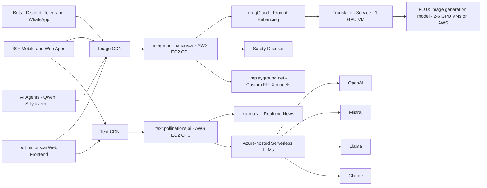

# [Pollinations.AI](https://pollinations.ai)

*Your Engine for Personalized Synthetic Media*

## 🌟 Introduction

[Pollinations.AI](https://pollinations.ai) is the most easy-to-use, free text and image generation API available. No signups or API keys required.

## 🚀 Key Features

- 🔓 **100% Open Source**
- 🆓 **_Free to use_**
- 🔑 No signup or API keys
- 🖼️ **Embed like any normal image or text**
- 🌍 Over **50,000 active users** and > **_8 million images generated per month_**
- 🤝 Used by various **open-source LLMs**, **bots**, and **communities**
- 🎣 **_Easy-to-use React hooks_** ([React Hooks Examples](https://react-hooks.pollinations.ai/))

<a href="https://star-history.com/#pollinations/pollinations&Date">
 <picture>
   <source media="(prefers-color-scheme: dark)" srcset="https://api.star-history.com/svg?repos=pollinations/pollinations&type=Date&theme=dark" width="600" />
   <source media="(prefers-color-scheme: light)" srcset="https://api.star-history.com/svg?repos=pollinations/pollinations&type=Date" width="600" />
   
 </picture>
</a>

## 🚀 Getting Started

### Image Generation

1. Visit [https://pollinations.ai](https://pollinations.ai)
2. Type your description in the text box
3. Click "Generate" and watch the magic happen!

### Text Generation

1. Visit [https://text.pollinations.ai](https://text.pollinations.ai)
2. Start chatting with the AI

For more advanced usage, check out our [API documentation](APIDOCS.md).

## 🖥️ How to Use

### Web Interface

Our web interface is user-friendly and doesn't require any technical knowledge. Simply visit [https://pollinations.ai](https://pollinations.ai) and start creating!

### API

Use our API directly in your browser or applications:

    https://pollinations.ai/p/conceptual_isometric_world_of_pollinations_ai_surreal_hyperrealistic_digital_garden

Replace the description with your own, and you'll get a unique image based on your words!

## 🎨 Examples

### Image Generation

Here's an example of a generated image:

Python code to download the generated image:

    import requests

    def download_image(prompt):
        url = f"https://pollinations.ai/p/{prompt}"
        response = requests.get(url)
        with open('generated_image.jpg', 'wb') as file:
            file.write(response.content)
        print('Image downloaded!')

    download_image("conceptual_isometric_world_of_pollinations_ai_surreal_hyperrealistic_digital_garden")

### Text Generation

To generate text, use this URL:

    https://text.pollinations.ai/What%20is%20artificial%20intelligence?

## 🛠️ Integration

### React Hooks

We offer React hooks for easy integration. Example usage:

    import React from 'react';
    import { usePollinationsImage, usePollinationsText } from '@pollinations/react';
    import ReactMarkdown from 'react-markdown';

    const AIGeneratedContent = () => {
      const imageUrl = usePollinationsImage("Beautiful landscape of Paris with Eiffel Tower", { width: 800, height: 600, seed: 42 });
      const markdown = usePollinationsText("Write a brief travel guide for Paris, including top attractions and local cuisine in markdown", { seed: 42 });

      return (
        

          <h2>AI-Generated Travel Guide</h2>
          
          {markdown ? (
            <ReactMarkdown>{markdown}</ReactMarkdown>
          ) : (
            
Loading markdown content...

          )}
        

      );
    };

    export default AIGeneratedContent;

Check out our [Pollinations React Hooks](./pollinations-react/README.md) for more details.

## Architecture

## Projects Using Pollinations.AI

Pollinations.AI is used in various projects, including:

### LLM Integrations
1. [TurboReel](https://turboreel.com): An open-source video generation system using AI to create engaging content from scripts. Created by @pedroriosa. [GitHub Repo](https://github.com/turboreel/turboreel)
2. [SillyTavern](https://docs.sillytavern.app/extensions/stable-diffusion/): An LLM frontend for power users. Pollinations permits it to generate images. [GitHub Repo](https://github.com/SillyTavern/SillyTavern)
3. [Qwen-Agent](https://github.com/QwenLM/Qwen-Agent): A framework for developing agentic LLM applications.
4. [LobeChat](https://lobehub.com/plugins/pollinations-drawing): An open-source, modern-design ChatGPT/LLMs UI/Framework. Supports speech-synthesis, multi-modal, and extensible (function call) plugin system. [GitHub Repo](https://github.com/lobehub/lobe-chat)
5. [Unity AI Lab](https://blog.unityailab.com/unity.html): A specialized uncensored LLM model built on Mistral Large, focused on unrestricted conversations.
6. [DynaSpark AI](https://dynaspark.onrender.com): A versatile AI assistant with advanced image and text generation capabilities, integrating Pollinations.ai for image generation. Created by [Th3-C0der](https://github.com/Th3-C0der).
7. [FlowGPT](https://flowgpt.com/p/instant-image-generation-with-chatgpt-and-pollinationsai): Generate images on-demand with ChatGPT.
8. [Sirius Cybernetics Elevator Challenge](https://sirius-cybernetics.pollinations.ai/): A Hitchhiker's Guide to the Galaxy themed LLM-based elevator game. Created by @thomash_pollinations. [GitHub Repo](https://github.com/voodoohop/sirius-cybernetics-elevator-challenge)

### Social Bots
1. [Discord Bot](https://discord.gg/D9xGg8mq3D): A Discord bot that uses Pollinations.ai for generating images based on user prompts. Created by @Zngzy. [GitHub Repo](https://github.com/Zingzy/pollinations.ai-bot)
2. [WhatsApp Group](https://chat.whatsapp.com/KI37JqT5aYdL9WBYMyyjDV): A WhatsApp group that allows you to generate images using Pollinations.ai. Created by @dg_karma.
3. [Telegram Bot](http://t.me/pollinationsbot): A Telegram bot that uses Pollinations.ai for generating images based on user prompts. Created by Wong Wei Hao.
4. [Anyai](https://discord.com): A Discord bot and community that leverages Pollinations.ai for generating AI-driven content. Created by @meow_18838.
5. [OpenHive](https://discord.gg/Zv3SXTF5xy): A Discord server that bridges the gap between Discord and AI. With Beebot, access dozens of ChatGPT prompts and generate images using Pollinations.ai! Created by @creativegpt.

### Mobile & Web Applications
1. [Pollinator Android App](https://github.com/g-aggarwal/Pollinator): An open-source Android app for text-to-image generation using Pollinations.ai's endpoint. Created by @gaurav_87680.
2. [TurboReel](https://turboreel.com): An open-source video generation system using AI to create engaging content from scripts. Created by @pedroriosa. [GitHub Repo](https://github.com/turboreel/turboreel)
3. [MIDIjourney](https://github.com/korus-labs/MIDIjourney): An AI-powered plugin for Ableton Live that turns text descriptions into music. Created by KORUS Labs. [GitHub Repo](https://github.com/korus-labs/MIDIjourney)
4. [Own-AI](https://own-ai.pages.dev/): An AI text-to-image generator powered by Pollinations.ai. Users can describe the images they want, generate them, and share them. Created by Sujal Goswami. [GitHub Repo](https://github.com/sujal-goswami/Own-AI)
5. [Infinite Tales](https://infinite-tales-rpg.vercel.app/): A Choose Your Own Adventure RPG, dynamically narrated by AI. Customize your adventure, build your hero, and explore vast lands. Each journey is uniquely generated by AI. Created by JayJayBinks. [GitHub Repo](https://github.com/JayJayBinks/infinite-tales-rpg)
6. [POLLIPAPER](https://github.com/Tolerable/POLLIPAPER): A dynamic wallpaper app that uses Pollinations AI to create unique desktop backgrounds. It offers weather-based prompts and customizable settings. Created by @intolerant0ne. [GitHub Repo](https://github.com/Tolerable/)
7. [StorySight](https://github.com/abiral-manandhar/storySight): An app to help children with learning disabilities by visualizing abstract concepts. Made using Django and Pollinations.ai. Submitted to: [Devpost](https://devpost.com/software/storysight)
8. [StoryWeaver](https://devpost.com/software/storyweaver-013xdw): StoryWeaver crafts personalized picture books for children based on themes and prompts you choose, bringing your unique story ideas to life with AI! Created by Advaith Narayanan, Omeed Sabouri, Yufan Wang. [GitHub Repo](https://github.com/AdvaithN1/StoryWeaver)
9. [Websim](https://websim.ai/c/bXsmNE96e3op5rtUS): A web simulation tool that integrates Pollinations.ai for generating AI-driven content. Remix the app with your own prompts. Created by @thomash_pollinations.
10. [JCode Website Builder](https://jcode-ai-website-bulder.netlify.app/ai-website-builder/generated-projects/categories): A website generator using Pollinations text API. Created by @rtxpower.
11. [JustBuildThings](https://justbuildthings.com): A collection of AI tools for image generation, character chat, and writing powered by Pollinations. Created by rasit.

### Tutorials
1. [Tutorial](https://guiadehospedagem.com.br/pollinations-ai/): An in-depth Portuguese tutorial on using Pollinations AI. Created by Janderson de Sales.
2. [Apple Shortcuts Guide](https://www.youtube.com/watch?v=-bS41VTzh_s): A step-by-step video guide on creating AI images using Apple Shortcuts and Pollinations. Created by RoutineHub. [Shortcut](https://routinehub.co/shortcut/19953/)

Have you created a project using Pollinations.AI? Email us at hello@pollinations.ai to get it listed here!

## 🔮 Future Developments

We're constantly exploring new ways to push the boundaries of AI-driven content creation. Some areas we're excited about include:

- Digital Twins: Creating interactive AI-driven avatars
- Music Video Generation: Combining AI-generated visuals with music for unique video experiences
- Real-time AI-driven Visual Experiences: Projects like our Dreamachine, which create immersive, personalized visual journeys

## 🌍 Our Vision

Pollinations.AI envisions a future where AI technology is:

- **Open & Accessible**: We believe AI should be available to everyone, not locked behind paywalls or restricted access

- **Transparent & Ethical**: Our open-source approach ensures transparency in how our models work and behave

- **Community-Driven**: We're building a platform where developers, creators, and AI enthusiasts can collaborate and innovate

- **Interconnected**: We're creating an ecosystem where AI services can seamlessly work together, fostering innovation through composability

- **Evolving**: We embrace the rapid evolution of AI technology while maintaining our commitment to openness and accessibility

We're committed to developing AI technology that serves humanity while respecting ethical boundaries and promoting responsible innovation. Join us in shaping the future of AI.

## 🤝 Community and Support

Join our vibrant community on Discord to share your creations, get support, and collaborate with fellow AI enthusiasts. 

For any questions or support, please visit our [Discord channel](https://discord.gg/k9F7SyTgqn) or create an issue on our [GitHub repository](https://github.com/pollinations/pollinations).

## 🗂️ Project Structure

Our codebase is organized into several key folders, each serving a specific purpose in the Pollinations.AI ecosystem:

- [`pollinations.ai/`](./app/): The main React application for the Pollinations.ai website.

- [`image.pollinations.ai/`](./image.pollinations.ai/): Backend service for image generation and caching.

- [`pollinations-react/`](./pollinations-react/): React component library for Pollinations.ai.

- [`text.pollinations.ai/`](./text.pollinations.ai/): Backend service for text generation.

This structure encompasses the frontend website, backend services for image and text generation, and integrations like the Discord bot, providing a comprehensive framework for the Pollinations.AI platform.

## 🏢 Supported By

Pollinations.AI is proud to be supported by:

- [LLMPlayground.net](https://llmplayground.net/): Hosting Custom Flux Models
- [Karma.YT](https://karma.yt): Social media integrations
- [AWS Activate](https://aws.amazon.com/): GPU Cloud Credits
- [Google Cloud for Startups](https://cloud.google.com/): GPU Cloud Credits
- [OVH Cloud](https://www.ovhcloud.com/): GPU Cloud credits
- [NVIDIA Inception](https://www.nvidia.com/en-us/deep-learning-ai/startups/): AI startup support
- [Azure (MS for Startups)](https://azure.microsoft.com/): OpenAI credits
- [Outlier Ventures](https://outlierventures.io/): Startup Accelerator

## 📜 License

Pollinations.AI is open-source software licensed under the [MIT license](LICENSE).

---

---

Made with ❤️ by the Pollinations.AI team
