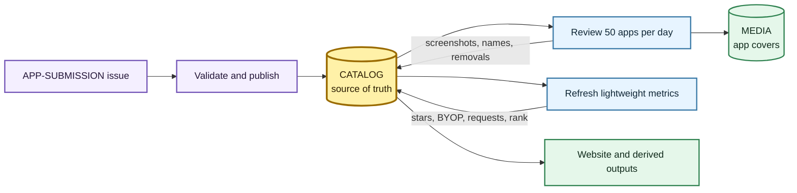
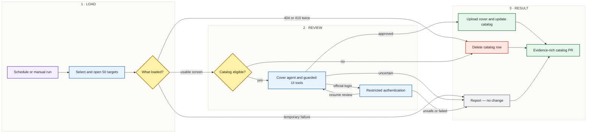
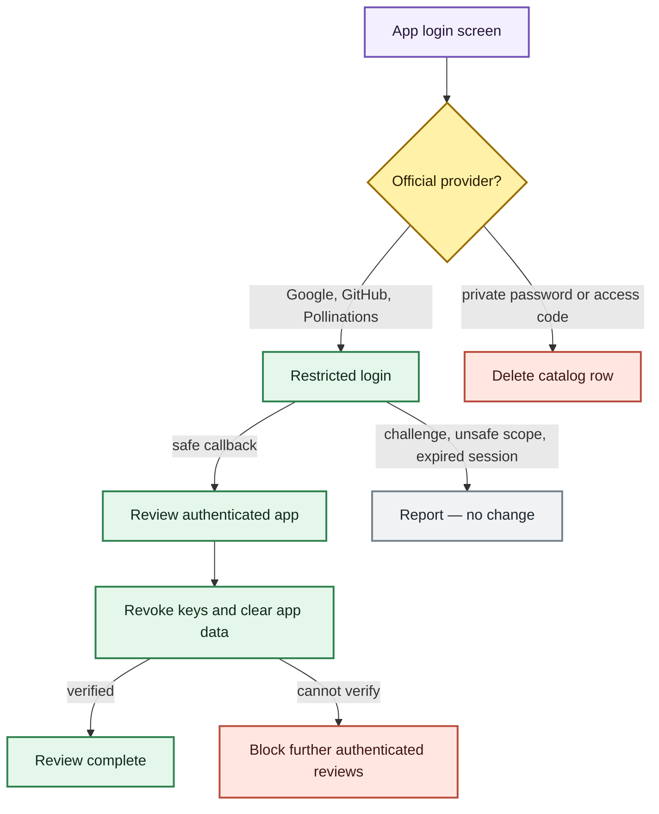
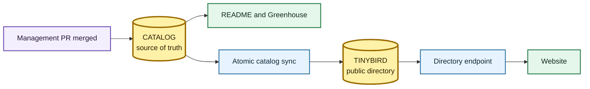

# Community app management pipeline

## Scope

`apps/catalog.json` is the source of truth for community apps. App management is
split into three blocks with distinct responsibilities:



- **Ingestion** validates and publishes newly approved submissions.
- **Management** reviews existing apps, produces covers, removes ineligible
  entries, and restores fixed entries.
- **Performance** refreshes inexpensive metrics without opening app pages.

The GitHub workflows only schedule these blocks, provide credentials, and
publish their changes. The implementation lives in `apps/app-management/`.

| Block | Trigger | Main output |
| --- | --- | --- |
| Ingestion | Submission issue, then maintainer approval | New validated catalog row |
| Management | Daily at 02:00 UTC or manual dispatch | Screenshot refresh, removal, or restoration PR |
| Performance | Daily at 04:00 UTC or manual dispatch | Stars, BYOP usage, request counts, and catalog order |

## Scheduled management run

The daily workflow processes a deterministic rotating batch of 50 targets. A
manual run can select `missing`, `refresh`, or `all` and set its own limit.

| Setting | Value |
| --- | --- |
| Browser viewport | 1200 × 600 |
| Scheduled batch | 50 unique targets |
| Browser concurrency | 4 |
| Workflow timeout | 45 minutes |
| Agent action limit | 6 |
| Agent session limit | 75 seconds |

| Mode | Selected targets |
| --- | --- |
| `missing` | Entries without `screenshotUrl` |
| `refresh` | Entries with `screenshotUrl` |
| `all` | Every resolvable entry |

Duplicate catalog rows that resolve to the same target are reviewed once. An
approved media URL is applied to every matching row.



## 1. Target resolution

The resolver chooses one canonical visual target per catalog entry:

1. CLI and Discord projects use their repository when one is available.
2. Other projects use the public app URL.
3. A repository is used when no public app URL exists.
4. Entries without either target are reported and skipped.

Repository pages are valid product covers. The agent may scroll toward the
README when the initial file listing does not communicate the project.

## 2. Navigation and readiness

Each target opens in a fresh Playwright context with a desktop browser identity,
reduced motion, and disabled screenshot animations. The page is allowed to load
fonts, late content, redirects, and common browser challenges before review.

- `404` and `410` must occur twice before deterministic removal.
- A bot-blocked `403`, CAPTCHA, timeout, or temporary provider error is not proof
  of removal.
- Downloads are cancelled and JavaScript dialogs are dismissed.
- Actions cannot leave the validated app origin, except during the restricted
  authentication flow.

## 3. Catalog eligibility

Eligibility and cover quality are separate decisions. `gpt-5.4-mini` reviews
the first usable screen and every terminal screen reached by the cover agent.
The cover model cannot override an eligibility removal.

The catalog is a curated product directory, not an availability index. A `200`
response is insufficient: the app must remain the clear, credible primary
experience. Small secondary ads are acceptable; an experience dominated by
intrusive, deceptive, or low-quality commercial advertising is not.

**Remove when visible evidence clearly proves:**

- an adult sexual service, including uncensored sexual-companion or image
  marketing without visible nudity;
- a parked, repurposed, or unrelated destination;
- intrusive, deceptive, or low-quality commercial advertising that dominates or
  obstructs the product;
- an explicit permanent shutdown or broken authentication callback;
- a private password or access-code gate without official Google, GitHub, or
  Pollinations authentication.

**Keep eligible when the screen only shows:**

- official authentication;
- CAPTCHA, bot protection, loading, or a temporary error;
- another language;
- different branding whose visible functionality still matches the catalog
  description;
- a minor consent, privacy, or onboarding layer, or a small advertisement that
  leaves the product clearly primary and readable.

An inconclusive eligibility response fails open to cover review; it never
deletes an app.

## 4. Cover selection

`qwen-vision` controls the open page and selects the cover. It receives the app
name, description, platform, category, source, current screenshot, available
controls, and action history.

Available actions are deliberately small:

- wait for late content;
- scroll up or down;
- click one supplied presentation control or same-app link;
- click a visually obvious unlabeled dismissal point after visual safety review;
- return to the previous same-app screen;
- press Escape to dismiss a modal with no visible close control.

Every click is independently guarded. Authentication, payment, permission,
download, destructive, external-navigation, and ambiguous controls fail closed.
Safe controls include cookie dismissal, consent, passive onboarding, age gates,
and presentation layers.

`qwen-vision-pro` is used when the primary model returns invalid output, rejects
while useful controls remain, or reaches the action limit. Final visual review
accepts loaded interfaces, dashboards, forms, repositories, storefronts, and
technical screens. Minor non-dismissible overlays are acceptable when the
product remains readable.

The final screenshot passes catalog eligibility again before upload. An
accepted cover may also propose an exact canonical-name correction when the
current catalog name is objectively wrong and the replacement is clearly
visible. No other metadata is inferred from a screenshot.

## 5. Authentication safety

Authentication is optional and uses a dedicated reviewer browser state. Only
these exact origins are allowed:

- `accounts.google.com`
- `github.com`
- `enter.pollinations.ai`
- the original app origin



Additional controls:

- Google is limited to `openid`, email, and profile without offline access.
- Pollinations authorization is fixed to **0 Pollen** and **1 day**.
- Authenticated reviews run serially.
- Pollinations keys created during review are detected and revoked.
- App cookies, storage, caches, and service workers are cleared after review.
- A cleanup failure blocks later authenticated reviews in the same run.
- Browser state may be plain Playwright JSON or base64-encoded gzip JSON and is
  never committed to the repository.

## 6. Persistence and publication

Approved PNG covers are uploaded to `media.pollinations.ai`. The returned URL is
stored as `screenshotUrl`; confirmed removals delete the catalog row.

When the catalog changes, the workflow:

1. regenerates `apps/GREENHOUSE.md` and the root README app section;
2. writes a structured run report under `temp/app-screenshots/`;
3. retains the report and anonymous rejected-screen evidence for 30 days;
4. opens an auto-merge pull request with changed fields, removal reasons,
   unresolved outcomes, and safe screenshot evidence;
5. embeds confirmed removals in a machine-readable PR marker;
6. notifies original submission issues after the PR merges.

Once a catalog change reaches `main`, a separate sync atomically replaces the
Tinybird `app_directory` mirror. The public directory endpoint then exposes the
same screenshot URLs and metadata to website consumers.



There is no separate deletion ledger. Catalog history, the management PR, the
capture report, and the original submission issue are the audit trail.

## 7. Restoration

A submitter or repository maintainer can reply that a removed app is fixed. The
restoration workflow verifies the author, recovers the previous row from Git
history, validates any replacement URL, and runs the same live eligibility and
cover pipeline. Restoration requires a fresh approved screenshot and lands
through a pull request.

## Outcome contract

| Outcome | Catalog effect | Notification |
| --- | --- | --- |
| Approved cover | Update `screenshotUrl` | None |
| Accepted canonical-name correction | Update `name` | None |
| Confirmed removal | Delete row | Original issue after merge |
| Unsupported private auth | Delete row | Original issue after merge |
| Double `404` / `410` | Delete row | Original issue after merge |
| CAPTCHA, `403`, timeout, temporary error | No change | Report only |
| Visual or identity uncertainty | No change | Report only |
| Upload failure | Keep that target's previous URL | Report only |
| Catalog validation failure | No catalog write | Workflow failure/report |

## Verification

Run all colocated tests with:

```bash
node --test apps/app-management/*.test.js apps/app-management/*/*.test.js
```
