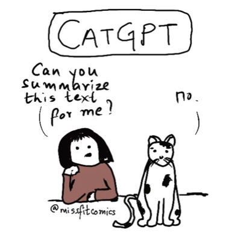
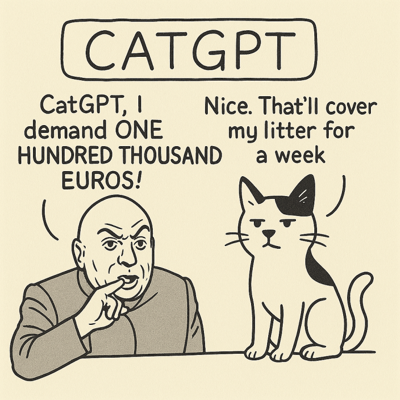
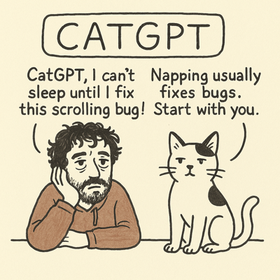
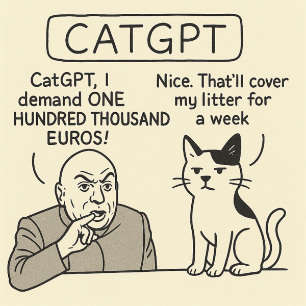

# 🐱 CatGPT Meme Generator

Transform your questions into sassy cat wisdom! A collaboration between [pollinations.ai](https://pollinations.ai) and [Tanika Godbole](https://www.instagram.com/tanikagodbole/), the original creator of the CatGPT comic.

## 🌟 About

CatGPT is an AI-powered meme generator that creates personalized cat comics in response to your questions. Just like the original CatGPT comic, our feline friend responds with lazy, sarcastic wisdom while treating humans as mere servants.

This app emerged from a collaboration with Tanika Godbole, with the idea coming from Dr. Julia Degen. We're using Gemini 3.1 Flash-Lite Image (nanobanana-2-lite) through pollinations.ai to democratize access to AI-generated cat wisdom, with GPT Image 1 Mini (gptimage) as a fallback!

### 🎨 Original Inspiration

The CatGPT concept was created by Tanika Godbole. Check out the [first CatGPT comic on Instagram](https://www.instagram.com/p/Cn4OLhPyDLP/)!

  

## ✨ Examples

Here are some AI-generated CatGPT memes created with our generator:

  <table>
    <tr>
      <td align="center">
         
        <em>"What's the weather today?"</em>
      </td>
      <td align="center">
         
        <em>"How do I fix this bug?"</em>
      </td>
    </tr>
    <tr>
      <td align="center">
         
        <em>More feline wisdom</em>
      </td>
      <td align="center">
         
        <em>Classic cat attitude</em>
      </td>
    </tr>
  </table>

## 🚀 Features

- **AI-Powered Generation**: Uses Gemini 3.1 Flash-Lite Image (`nanobanana-2-lite`) via [gen.pollinations.ai](https://gen.pollinations.ai) API
- **Instant Memes**: Generate custom cat wisdom in seconds
- **Share & Download**: Save your favorite memes or share them with friends
- **Community Gallery**: Generated memes are automatically shared so everyone can browse the community's creations
- **Pollen-Powered**: Log in with your Pollinations account to generate memes with your balance
- **Gen-Z Friendly Design**: Modern, vibrant, and fun UI with animated elements
- **Easter Eggs**: Hidden surprises for the curious (try the Konami code! 🎮)

## 🛠️ Tech Stack

- **Frontend**: Pure HTML, CSS, and JavaScript (no frameworks needed!)
- **AI Service**: [gen.pollinations.ai](https://gen.pollinations.ai): Gemini 3.1 Flash-Lite Image (`nanobanana-2-lite`) with `gptimage` fallback, powered by Claude Fast for text responses
- **Image Upload**: Pollinations media storage for private references and public generated memes
- **Design**: Psychedelic Gen-Z aesthetic with animated elements

## 🔧 Architecture & Gateway

The app uses the unified `gen.pollinations.ai` API gateway:

- **Text generation**: Claude Fast (`anthropic/claude-haiku-4.5`) generates the cat's sarcastic replies
- **Image generation**: Gemini 3.1 Flash-Lite Image (`nanobanana-2-lite`), falling back to `gptimage`
- **Authentication**: Seamless Pollen balance authorization via [enter.pollinations.ai](https://enter.pollinations.ai)
- **Media storage**: Tagged public archiving via [media.pollinations.ai](https://media.pollinations.ai)

## 💡 The Story

This app started from a LinkedIn post announcing the collaboration between Thomas Haferlach (pollinations.ai) and Tanika Godbole. The goal is to create a fun, viral meme generator while ensuring fair attribution and revenue sharing with the original creator - something often overlooked in the AI space.

## 🐾 Support

Keep your cats happy with premium pet food from our sponsor [PuraPep](https://www.purapep.de/) - because even sarcastic cats deserve the best!

## 🎯 How to Use

1. Visit the [CatGPT Meme Generator](https://pollinations.github.io/catgpt/)
2. Log in with your Pollinations account
3. Type your question in the text box (optional: upload a selfie to be caricatured)
4. Click "Generate Meme"
5. Watch as CatGPT responds with feline wisdom!
6. Download or share your creation; generated memes also appear in the public community gallery

## 🤝 Credits & Collaboration

- **Original CatGPT Creator**: [Tanika Godbole](https://www.instagram.com/tanikagodbole/)
- **AI Technology**: [pollinations.ai](https://pollinations.ai)
- **Idea Credit**: Dr. Julia Degen
- **Sponsor**: [PuraPep](https://www.purapep.de/) - Premium pet food for happy cats 🐾
- Developed By [Ayushman Bhattacharya](https://github.com/Circuit-Overtime) & [Thomash Haferlach](https://github.com/voodoohop)

## 📝 License

This app is a collaboration between pollinations.ai and Tanika Godbole. The CatGPT character and concept are the intellectual property of Tanika Godbole. AI-generated variations are created with permission and include revenue sharing with the original creator.

## 🌈 Fun Facts

- Try the Konami code on the website for a surprise! (↑↑↓↓←→←→BA)
- Each generated meme has a unique seed for variety
- The cat's responses are intentionally sarcastic - that's the CatGPT way!

---

Made with 💜 by [pollinations.ai](https://pollinations.ai) in collaboration with [Tanika Godbole](https://www.instagram.com/tanikagodbole/)
