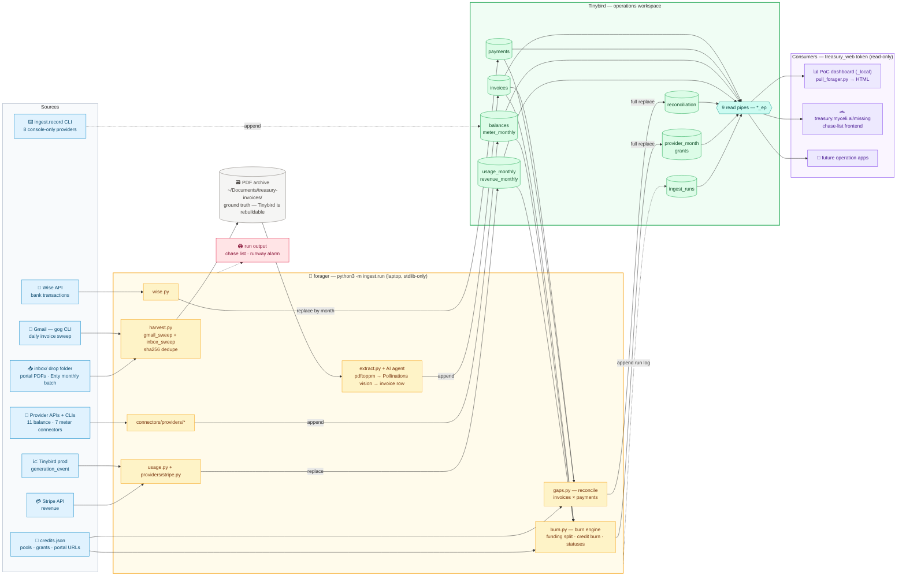

# Forager — invoice ingest runbook

Forager is the data app for the operations workspace. It harvests provider invoices, pulls Wise payments, and writes reconciliation verdicts to Tinybird. The treasury frontend reads those pipes; forager owns all writes.

Schema/token contract: [`tinybird/README.md`](tinybird/README.md)

---

## Architecture



Tokens: appends use `treasury_ingest`, every replace uses `treasury_replace`, consumers read pipes with `treasury_web`. Admin token lives only in the local `.tinyb` (never SOPS).

---

## The flow

```
each run  (manual — cron deferred)
  1 GATHER   gmail sweep (gog, newer_than:3d)  ─┐
             inbox/ drop folder sweep           ├─► archive ~/Documents/treasury-invoices/YYYY-MM/…  (sha256-dedup vs TB)
  2 READ     pdftoppm page images → Pollinations vision agent → {provider, period, amount, currency, number}
  3 PUSH     invoices rows (append) · payments rows (Wise, replace by month)
  4 BALANCE  11 REST/CLI balance connectors → balances (append)
  5 METER    7 meter connectors → meter_monthly (dedupe + full replace)
  6 BURN     burn engine (burn.py) → provider_month (full replace) · grants (full replace)
  7 FLAG     credits.json active windows × payments × invoices
             → reconciliation verdicts (full replace) → gaps_ep pipe
frontend     treasury.myceli.ai/missing — provider × month grid; red cell → portal URL
             (DEFERRED — query chase list via gaps_ep in the meantime)
```

**Outputs written per run:**

| Datasource | Mode | Written by |
|---|---|---|
| `invoices` | append (sha256-dedup) | invoice catcher |
| `payments` | replace by month | Wise connector |
| `balances` | append | balance connectors (B3/B4) |
| `meter_monthly` | full replace — one row per (provider, month, funding); api/cli/bq beat manual, latest wins | meter connectors (B5) |
| `grants` | full replace | burn engine |
| `provider_month` | full replace | burn engine |
| `reconciliation` | full replace | reconcile engine |
| `ingest_runs` | append | orchestrator |

---

## Manual refresh

Run from `apps/operation/forager/`:

```bash
python3 -m ingest.doctor && python3 -m ingest.run
```

- `doctor` exits 0 only when all hard checks pass (sops, tinybird-ops, wise, gog, pdftoppm, Pollinations key). Soft warnings (archive writable, freshness) print but don't block.
- `run` harvests Gmail (last 3 days), drains the inbox, pulls Wise payments for the last 2 months, updates reconciliation, logs the run, and prints the chase list.

Backfill (fresh rebuild since `config.months_start`):

```bash
python3 -m ingest.run --backfill
```

Backfill refreshes the local PDF archive, runs the invoice agent over every archived
PDF in parallel (`config.json` `invoice_ai_parallelism`), replaces the `invoices`
datasource with one row per unique file, then rebuilds payments, burn/provider-month,
grants, reconciliation, and the chase list.

---

## Inbox workflow

For providers that never email a PDF (see dashboard-only list below):

1. Download the PDF from the provider portal.
2. Drop it into `~/Documents/treasury-invoices/inbox/`.
3. Run `python3 -m ingest.run`.

The inbox is drained on every run: each PDF is sha256-deduped against Tinybird, classified from the filename prefix, extracted, moved to `YYYY-MM/<provider>_<date>_<sha8>_<origname>.pdf`, and pushed. An empty inbox after the run is the goal state.

---

## Label CLI

When a PDF needs manual review, it lands in `invoices` with `status='needs_review'` and shows up amber in the chase list. Fix it with:

```bash
python3 -m ingest.invoices.label <sha256> \
    --provider <slug> \
    --month YYYY-MM \
    --amount <N> \
    --currency USD|EUR \
    [--number INV-123] [--date YYYY-MM-DD]
```

Pass `--date` (real charge/issue date) for prepaid top-ups — reconciliation
matches top-ups to payments by date ±10d, and the default is `<month>-01`.

The command appends a corrected row with `status='parsed'`; downstream always takes the latest row per sha256. Provider slug must exist in `credits.json` pools — an unknown slug exits with the known-provider list. EUR amounts are converted to USD using `config.json` `fx_eur_usd`.

---

## Dashboard-only providers

These providers never send a PDF by email. Their invoices must be downloaded manually from the portal and dropped into the inbox. The reconciliation engine knows they are expected to show up red until the inbox is fed.

| Provider | Why email can't catch it |
|---|---|
| **aws (direct)** | Budget/alert emails only — actual AWS cost covered by Automat-IT PDFs (captured under `aws`). |
| cloudflare | Startup-plan invoices are dashboard-only. |
| modal | Payment receipts are link-only. |
| openrouter | Billing-update emails only, no PDF attachment. |
| perplexity | Dashboard credits only. |
| alibaba | Console (BSS) only — free-quota notices in email, no invoice PDF. |
| openai | Dashboard billing only. |
| assemblyai | Startup program, dashboard. |
| vercel | Dashboard only. |
| runpod | Dashboard / GraphQL only. |
| inception | No billing email at all. |

Portal URLs for each provider live in `apps/operation/forager/secrets/credits.json` under each pool's `portal` field and are rendered in the `/missing` frontend (once deployed).

---

## Chase list (current approach)

Until `treasury.myceli.ai/missing` is live, query the chase list directly:

```bash
# all open items
curl "https://api.europe-west2.gcp.tinybird.co/v0/pipes/gaps_ep.json" \
  -H "Authorization: Bearer $TINYBIRD_OPS_READ_TOKEN"
```

Or read it from the run output — every `python3 -m ingest.run` prints the CHASE LIST at the end.

---

## Monthly manual routine

Eight providers have no programmatic API surface — their billing figures must be read from the provider console and entered manually once per month. See [`CONNECTORS.md`](CONNECTORS.md) for the full checklist with exact commands.

Quick reference — run from `apps/operation/forager/`:

```bash
# Meter reading (most common form)
python3 -m ingest.record meter <provider> <YYYY-MM> <cost_usd> --funding credit

# Balance snapshot (use when you have a grant balance to record)
python3 -m ingest.record balance <provider> --left <usd> [--granted <usd>] [--note TEXT]
```

Providers requiring monthly manual entry: `io.net`, `perplexity`, `nebius`, `lambda`, `bytedance`, `modal`, `elevenlabs`, `daytona` (fallback when wallet OIDC-gated).

Provider slug must be in `registry.CANONICAL`; month must match `YYYY-MM`. Each command appends one row with `source="manual"` to `balances` or `meter_monthly`. The next run folds meter entries into the deduped table (one row per provider-month-funding); a manual value holds only until a programmatic connector covers that same month.

---

## Doctor soft checks

`python3 -m ingest.doctor` runs soft checks in addition to the hard checks (sops, tinybird-ops, wise, gog, pdftoppm, Pollinations key). Soft checks print a warning but do not block the run:

| Soft check | What it verifies |
|---|---|
| `clis` | `vastai`, `firectl`, `aws`, `bq` all on PATH (needed by CLI-based connectors) |
| `tb-prod` | `TINYBIRD_PROD_READ_TOKEN` can query `generation_event` today (usage pull working) |
| `balances-fresh` | Latest `balances` row is < 26 h old (balance connectors ran recently); "no rows yet" is soft-ok on fresh install |

The existing soft checks `archive` (writable) and `freshness` (last ingest_run < 26 h) remain unchanged.

---

## Definition of Done — invoice phase

- [x] `pytest tests/ -q` green including `test_no_leaks`
- [x] `python3 -m ingest.doctor` exits 0
- [ ] `invoices` ≥ 230 rows, `payments` ≥ 6 months, `reconciliation` verdicts for every pool-month since 2026-01
- [ ] Two consecutive green manual runs on different days
- [ ] Chase list either shrinking or entries consciously added to `config.json` `recon_accepted`
- [ ] **[blocked: frontend deferred]** `treasury.myceli.ai/missing` live behind password
- [ ] **[blocked: frontend deferred]** Red cells match known dashboard-only providers

---

## Secrets provenance — refresh map

All keys live in SOPS `apps/operation/forager/secrets/env.json` (operations age key, Elliot-only). They are **independent copies**: when a key rotates at its source, re-copy it here (the leak-guard forbids forager *code* from reading other apps' secret paths — refreshing is an operator/agent action, not a runtime one).

| Keys | Source of truth | Refresh by |
|---|---|---|
| `TINYBIRD_OPS_*` (3) | minted in `operations` workspace (datafile tokens + API) | redeploy `tinybird/` / tokens API |
| `TINYBIRD_PROD_READ_TOKEN` | `enter.pollinations.ai/secrets/prod.vars.json` | sops-copy |
| `WISE_*` (3), `RUNPOD_API_KEY`, `LAMBDA_LABS_API_KEY`, `ALIBABA_CLOUD_*` (3), `AZURE_*` (6, billing-reader SP), `UMBRELLA_*` (3), `STRIPE_API_KEY`, `OPENROUTER_MANAGEMENT_API_KEY` | env A `apps/operation/finance/secrets/.env` | sops-copy |
| `OPENROUTER_API_KEY`, `DEEPINFRA_API_KEY`, `FIREWORKS_API_KEY`, `ELEVENLABS_API_KEY`, `REPLICATE_API_TOKEN`, `FAL_KEY`, `PERPLEXITY_API_KEY` | `gen.pollinations.ai/secrets/prod.vars.json` | sops-copy |
| `POLLINATIONS_KEY` | Pollinations admin key, copied directly into forager secrets | sops-copy |
| `CLOUDFLARE_*` (4), `DAYTONA_API_KEY`, `SCW_*` (4), `OPENAI_ADMIN_KEY`, `DIGITALOCEAN_TOKEN`, `OVH_*` (4) | `_local/2026-07-01-spend-audit/secrets.local.json` (minted for forager) | sops-copy |
| `VAST_API_KEY` | `~/.config/vastai/vast_api_key` (vastai CLI) | sops-copy |

Known-stale (2026-07-03): `RUNPOD_API_KEY` rotated upstream (403) — mint a fresh read-only key. Empty: `STRIPE_API_KEY` (restricted key pending), `FIREWORKS_API_KEY_NEW` (purpose unclear — candidate for deletion).
