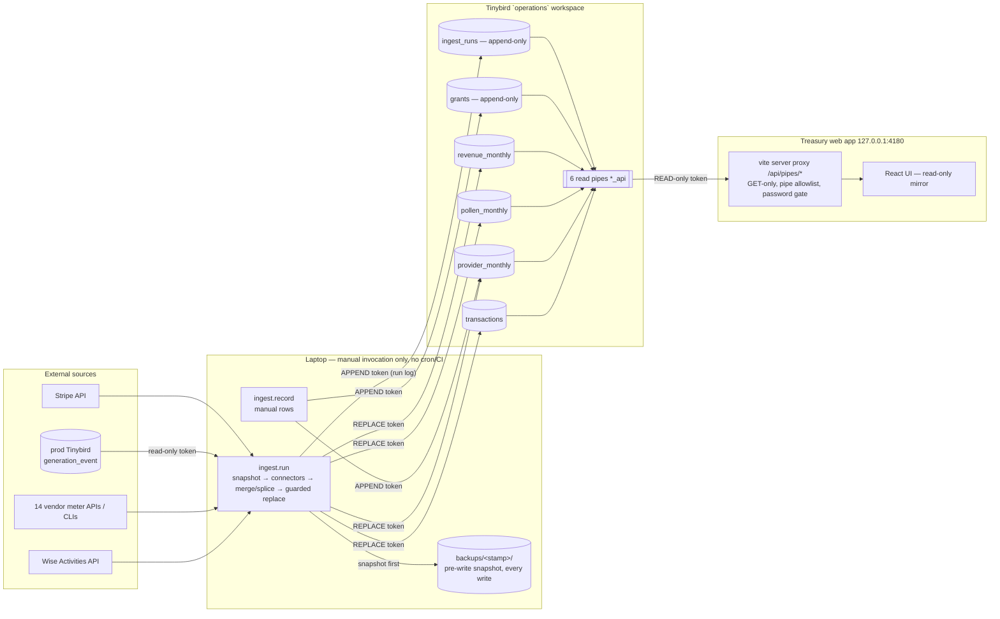

# Forager

Forager is the ONLY writer to the Operations Tinybird workspace read by the
Treasury app (which is a read-only mirror). For the full correction playbook
— scoped runs, manual rows, aliases, backups, restore — see
[`AGENTS.md`](./AGENTS.md).

## Architecture



## Write Safety — why a rewrite-all cannot happen

Four tables (`transactions`, `provider_monthly`, `pollen_monthly`,
`revenue_monthly`) are rebuilt by `mode=replace`; `grants` and `ingest_runs`
are append-only. The entire write surface is two methods in
[`ingest/tb.py`](./ingest/tb.py) — `append()` and `replace()` — and there is
exactly ONE `replace()` call site in the codebase:
`guarded_replace()` in [`ingest/run.py`](./ingest/run.py). No truncate,
delete, or drop exists anywhere.

Every replace passes this guard chain, in order:

1. **Snapshot before anything** — every Tinybird write snapshots the affected
   datasource into `backups/<UTC stamp>/<table>.ndjson` before writing.
   `ingest.run` snapshots every datasource it may read or write at the start
   of `main()`, before any connector runs. Restore = re-replace with the file.
2. **Connector failure aborts** — any meter-connector exception raises before
   the write; a broken pull never reaches Tinybird.
3. **Zero rows refused, twice** — the run raises on 0 fresh rows per table,
   and `tb.replace()` independently refuses an empty payload. A failed pull
   can never wipe a table.
4. **Scoped runs splice, never sweep** — `--month` / `--vendor` runs keep all
   out-of-scope existing rows (`splice_rows`) and `assert_fresh_in_scope`
   refuses any fresh row outside the requested scope.
5. **Manual rows survive** — manual `provider_monthly` rows are re-merged into
   every rebuild; a write that would lose one aborts unless `--yes` is given.
6. **Visible diff** — every replace prints `+added/-removed` and logs it to
   `ingest_runs`; `--dry-run` runs the whole chain without writing.

Token separation backs this up: the everyday `TINYBIRD_OPS_INGEST_TOKEN`
carries only APPEND+READ scopes and physically cannot replace a table. The
`TINYBIRD_OPS_REPLACE_TOKEN` is used at that single call site (and the
runbook restore heredocs). The web app's token is PIPES:READ only. Schema
deploys (`tb --cloud deploy` from [`tinybird/`](./tinybird/)) are manual,
human-approved, and destructive plans additionally require
`--allow-destructive-operations`.

Re-derivability invariant: everything in a replaced table is re-derivable
from its upstream source (Wise, vendor APIs, prod Tinybird, Stripe) — except
manual `provider_monthly` rows, which is exactly what the `--yes` gate
protects. Operator truth that cannot be re-derived (`grants`, manual rows)
only ever lands via append.

Nothing schedules `ingest.run`: no cron, launchd, or CI touches this app.
Every write starts with a human (or an agent a human is driving) at a
terminal.

## Main Flow

Run from this directory:

```bash
python3 -m ingest.run
```

The daily run refreshes:

| Table | Source |
|---|---|
| `transactions` | Wise Activities API (outgoing bank movements) |
| `provider_monthly` | Vendor APIs/CLIs plus manual rows |
| `pollen_monthly` | Production `generation_event` usage |
| `revenue_monthly` | Stripe balance transactions |
| `ingest_runs` | Forager run log |

The legacy refresh remains in place while the Treasury app is being migrated.
Do not add new provider-specific business logic to `provider_monthly` or
`gpu_runs` unless it is needed to reconcile the old UI during the transition.
New reviewed cloud facts should land in `op_cloud`.

Manual corrections are entered here, not in the app: append a `provider_monthly`
row with `ingest.record`, or run a scoped `ingest.run`. See
[`AGENTS.md`](./AGENTS.md).

New cloud rows use the additive Operations model:

```bash
python3 -m ingest.record op-cloud runpod gpu \
  --start "2026-06-01" --end "2026-07-01" \
  --currency USD --paid -123.45 \
  --resource-id pod-1 --resource-name flux-worker --sku "RTX 4090" \
  --model flux --evidence "manual dashboard export 2026-06"
```

`op-cloud` writes only `op_cloud`. It does not touch legacy tables.

Reconcile the new raw tables against their source transforms without writing:

```bash
python3 -m ingest.op_reconcile
python3 -m ingest.op_reconcile --month 2026-07
```

This compares expected grouped totals from the migration inputs with the live
`op_cloud`, `op_transactions`, and `op_pollen` tables.

Refresh the open product-usage month without touching old tables:

```bash
python3 -m ingest.op_refresh pollen --month 2026-07
python3 -m ingest.op_refresh pollen --month 2026-07 --write
```

The write path snapshots `op_pollen` and replaces only rows matching that
month.

## Local Invoice Fetcher

GOG/Gmail invoice attachment fetching is intentionally not part of Forager.
Use the local helper instead:

```bash
python3 _local/invoice_fetcher/fetch_gog_invoices.py --month 2026-07
```

That helper only downloads invoice-like PDFs into the local invoice inbox. It
does not call AI and does not write Tinybird.

## Useful Commands

```bash
python3 -m ingest.run --dry-run                      # snapshot + diff, no writes
python3 -m ingest.run --only provider                   # one table: provider|pollen|revenue|transactions
python3 -m ingest.run --only provider --vendor fireworks   # one provider connector
python3 -m ingest.run --month 2026-07                # one month, spliced into every table
python3 -m ingest.run --month 2026-07 --only transactions   # one month of Wise movements
python3 -m ingest.run --yes                          # allow writes that lose a manual meter row's data
python3 -m ingest.inspect provider_monthly --month 2026-07   # read-only row dump
python3 -m ingest.doctor                             # preflight/health checks
python3 -m pytest tests/test_wise.py -q
```

See [`AGENTS.md`](./AGENTS.md) for the full correction workflows (manual rows,
aliases, backups, restore).
