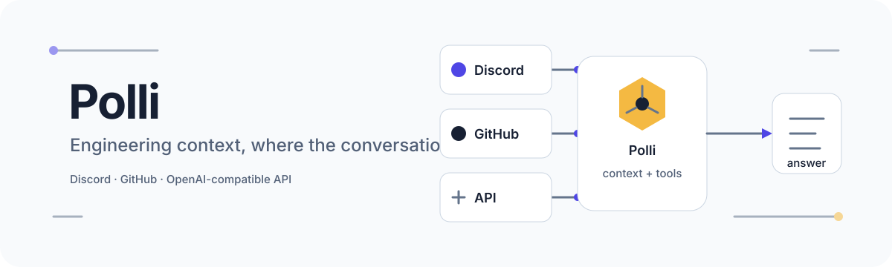
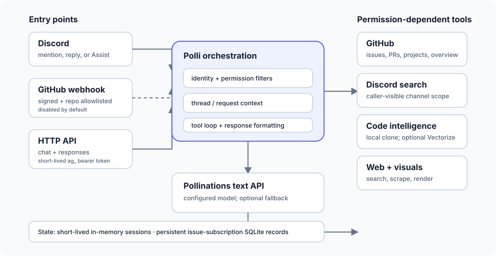

<p align="center">
  
</p>

<p align="center">
  
</p>

<p align="center">
  <a href="#what-polli-does">What Polli does</a> ·
  <a href="#interfaces">Interfaces</a> ·
  <a href="#tools-and-access">Tools and access</a> ·
  <a href="#local-setup">Local setup</a> ·
  <a href="#privacy-and-data">Privacy and data</a>
</p>

# Polli

Polli is the Pollinations.ai engineering assistant for Discord and GitHub. It brings repository, issue, pull-request, web, and community context into a tool-calling conversation while applying access rules at each entry point.

The service also exposes a local OpenAI-compatible HTTP interface for authorized agent clients. That interface is distinct from the Discord bot: it accepts only pre-issued, short-lived `ag_` bearer tokens and deliberately exposes a narrower tool set.

## What Polli does

- Starts a focused Discord thread from an `@Polli` mention, a reply, or the **Apps → Assist** context action.
- Answers repository questions with exact file reads, text search, an optional semantic index, and optional symbol-graph traversal.
- Reads and manages GitHub issues, pull requests, and Projects V2 according to the caller's role and the configured repository allowlist.
- Searches caller-visible Discord context, searches or reads the web, and renders tables, charts, diagrams, code, and mathematical notation for Discord.
- Tracks opt-in GitHub issue notifications and sends updates by DM when possible.
- Can respond to authorized GitHub mentions through an optional, signature-verified webhook.
- Provides `/v1/chat/completions` and `/v1/responses`, including streaming responses and client-defined tool calls.

Polli is an assistant, not an authority: tool results can be incomplete, generated answers can be wrong, and consequential changes still require human judgment.

## Interfaces

| Interface | Trigger and scope | Notes |
| --- | --- | --- |
| Discord | Mention Polli in a server channel, reply to it in a thread, or use **Assist** | Opens or continues a thread; available tools depend on Discord roles and channel visibility. |
| Direct message | Subscription commands and privacy help | `subscribe #123`, `unsubscribe #123`, `unsubscribe all`, `list subscriptions`, or `privacy`. |
| GitHub webhook | Mention the configured bot account in an issue or pull-request event | Disabled by default. Requests must have a valid webhook signature, come from an allowlisted repository, and currently come from a configured GitHub admin account. |
| HTTP API | OpenAI-compatible request to the embedded server | Binds to `127.0.0.1:55288` by default. Requires `Authorization: Bearer ag_…`; persistent `sk_` and `pk_` keys are rejected. |

### HTTP example

The API is for clients that have already received a short-lived agent token from the surrounding trusted system. Polli does not mint these tokens, and this README intentionally does not describe an issuance flow.

```bash
curl http://127.0.0.1:55288/v1/chat/completions \
  -H "Authorization: Bearer $POLLI_AGENT_TOKEN" \
  -H "Content-Type: application/json" \
  -d '{
    "model": "polli",
    "messages": [{"role": "user", "content": "Summarize the open image API issues"}]
  }'
```

`model: "polli"` is an alias for the service's configured default upstream model and may use its configured fallback. A non-empty explicit upstream model name is forwarded as requested and does not use that fallback. `/v1/models` advertises only the stable `polli` alias; an explicit upstream model therefore need not appear in that list.

The embedded API is not a universal pass into Polli. It uses non-admin context, removes mutation and subscription operations, excludes custom GitHub requests and visual rendering, blocks Discord member/role lookup, and restricts Discord results to public HTTP scope.

## Architecture

<p align="center">
  
</p>

The Discord bot, embedded API server, and optional webhook server run in one Python process. Conversation sessions are held in memory and refreshed from Discord thread history. Tool handlers then call GitHub, Discord, Pollinations, web, local repository, Vectorize, and rendering services as configured.

## Tools and access

Tool availability is both **configuration-dependent** and **caller-dependent**. The model sees a filtered schema, and handlers receive request-specific identity and role context.

| Capability | Discord member | Discord collaborator | Discord admin | HTTP API |
| --- | --- | --- | --- | --- |
| GitHub overview and reads | Available | Available | Available | Read subset |
| Issue creation and comments | Available | Available | Available | Not available |
| Close/reopen, labels, assignees | Not available | Available | Available | Not available |
| Other issue, PR, and Project mutations | Not available | Not available | Available | Not available |
| Read-only custom GitHub API request | Available | Available | Available | Not available |
| Code search and repository exploration | When a backend is enabled | When a backend is enabled | When a backend is enabled | When a backend is enabled |
| Discord search | Caller-visible channels | Caller-visible channels | Caller-visible channels | Public scope; no member/role lookup or private threads |
| Web search and scraping | Available | Available | Available | Available |
| Visual rendering | Available | Available | Available | Not available |
| Issue subscriptions | Available | Available | Available | Not available |

High-impact actions may require confirmation even when the caller has access. GitHub permissions and installation scope can further limit an operation.

### Code intelligence

`code_search` combines whichever backends are configured:

- **Local clone:** exact grep, file reads, file lists, and directory trees.
- **Cloudflare Vectorize:** semantic search using the configured embedding index and model.
- **Symbol graph:** symbol discovery, callers, callees, and impact traversal through the locally pinned CodeGraph package when its index is available. Use returned stable symbol IDs for traversal; ambiguous names are rejected.

No ChromaDB or OpenAI embeddings service is used by the current implementation.

## Local setup

### Requirements

- Python **3.11** (the container image and `version.cfg` use 3.11)
- Git
- Node.js **22** and npm for the pinned symbol-graph runtime
- A Discord application with **Message Content** and **Server Members** privileged intents enabled
- GitHub authentication: a GitHub App installation, or a personal access token
- A Pollinations API token for the bot's own upstream requests
- Chromium installed through Playwright for browser-backed scraping

Optional features need their own configuration: a GitHub Project token for Projects V2, a webhook secret for GitHub ingress, and Cloudflare credentials for Vectorize. Graph traversal uses the local npm dependency rather than a global `codegraph` installation.

### Install

```bash
git clone https://github.com/pollinations/pollinations.git
cd pollinations/apps/polli
python -m venv .venv
source .venv/bin/activate
pip install -r requirements.txt
npm ci --workspaces=false
playwright install chromium
```

On Windows, activate with `.venv\Scripts\activate`.

### Configure

Copy the environment template and keep the resulting file private:

```bash
cp .env.example .env
```

Required runtime secrets are:

```dotenv
DISCORD_TOKEN=...
POLLINATIONS_TOKEN=...

# Choose GitHub App authentication…
GITHUB_APP_ID=...
GITHUB_INSTALLATION_ID=...
GITHUB_PRIVATE_KEY=./polly.pem

# …or a personal access token.
POLLI_PAT=...
```

`GITHUB_PROJECT_PAT`, `GITHUB_WEBHOOK_SECRET`, `CLOUDFLARE_ACCOUNT_ID`, and `VECTORIZE_API_TOKEN` are optional and only enable their corresponding features. Non-secret behavior—repository scope, role IDs, ports, models, limits, and feature switches—lives in [`config.json`](config.json). Never commit `.env`, private keys, or tokens.

The Discord bot's `POLLINATIONS_TOKEN` is a service credential configured by the operator. It is not the same credential contract as the embedded HTTP API's request-scoped `ag_` token.

### Run

```bash
python main.py
```

The default configuration starts the Discord bot and local HTTP API, keeps the GitHub webhook disabled, and follows `pollinations/pollinations` on `main` for local code search.

### Container

```bash
docker build -t polli .
docker run --rm --env-file .env polli
```

The checked-in [`deploy.json`](deploy.json) identifies the repository's deployment target, but deployment credentials and production procedures are intentionally outside this README.

## Testing

Tests use Python's standard `unittest` runner:

```bash
python -m unittest discover -s tests -p "test_*.py"
```

Run one module while iterating:

```bash
python -m unittest tests.test_openai_api
```

Some integration paths depend on external credentials, network access, local binaries, or a live Discord guild. A passing isolated module does not certify those external systems.

## Configuration map

```text
apps/polli/
├── main.py                       process entry point
├── config.json                   non-secret runtime configuration
├── .env.example                  secret-variable template
├── Dockerfile                    Python 3.11 container
├── src/
│   ├── ai/                       model client, prompts, schemas, tool filters
│   ├── api/                      OpenAI-compatible HTTP routes
│   ├── context/                  in-memory conversation sessions
│   ├── core/                     configuration, auth context, logging
│   ├── discord/                  Discord search and media handling
│   ├── integrations/             GitHub, web, subscriptions, visuals, webhook
│   └── search/                   local, semantic, and graph code search
├── polli-core/                   optional native helpers
└── tests/                        unittest suites
```

## Privacy and data

Polli processes content supplied through Discord, GitHub webhooks, HTTP requests, linked pages, and attachments. Relevant prompts, context, and tool results can be sent to configured external services such as Pollinations, GitHub, Discord, and web-content providers. Do not send passwords, API keys, private keys, or other secrets to the bot.

Current storage behavior:

- Conversation sessions are in process memory, capped at 500 sessions, and expire after 300 seconds of inactivity by default. Discord messages and GitHub content remain governed by those platforms and are not deleted when an in-memory session expires.
- Issue subscriptions persist in `data/subscriptions.db` with Discord user/channel identifiers, issue number, delivery state, and timestamps. They remain until unsubscribed or otherwise removed; no automatic retention deadline is implemented.
- Code search may keep an operator-managed local repository clone and may query a configured external Vectorize index. The optional graph is derived from that clone.
- Runtime logs go to standard output. Retention is controlled by the deployment environment; Polli does not define an application-level log retention period.
- Provider-held request data follows each provider's own terms and retention controls.

DM `privacy` or `delete data` for the privacy link and instructions. DM `unsubscribe all` to remove issue subscriptions immediately. That command does **not** erase Discord messages, GitHub content, deployment logs, or provider-held data. For access, correction, deletion, privacy, or general support requests, email [hello@pollinations.ai](mailto:hello@pollinations.ai) with your Discord user ID and relevant message or issue links; never include credentials.

See the [Pollinations.ai privacy policy](https://pollinations.ai/privacy).

## Creator and support

**Creator**

- GitHub: [Itachi-1824](https://github.com/Itachi-1824)
- Discord: `_dr_misterio_`
- Email: [Itachi@pollinations.ai](mailto:Itachi@pollinations.ai)

Creator contact is separate from product support and privacy handling. Use [hello@pollinations.ai](mailto:hello@pollinations.ai) for Pollinations.ai support, legal, and privacy requests.

## License and attribution

Polli is part of the Pollinations.ai repository and is provided under the repository's [MIT License](../../LICENSE). Copyright © 2026 pollinations.ai. Pollinations.ai is the product brand; Myceli.AI OÜ remains the registered legal entity and data controller.
