# Polly Bot - Architecture

```mermaid
%%{init: {'theme': 'dark', 'themeVariables': { 'primaryColor': '#bb86fc', 'primaryTextColor': '#ffffff', 'primaryBorderColor': '#bb86fc', 'lineColor': '#03dac6', 'secondaryColor': '#3700b3', 'tertiaryColor': '#1e1e1e', 'background': '#121212', 'mainBkg': '#1e1e1e', 'nodeBorder': '#bb86fc', 'clusterBkg': '#2d2d2d', 'clusterBorder': '#bb86fc', 'titleColor': '#ffffff', 'edgeLabelBackground': '#1e1e1e'}}}%%

flowchart TB
    subgraph ENTRY["**ENTRY POINTS**"]
        direction TB
        MAIN["main.py<br/>Entry Point"]
        DISCORD_EVENT["Discord Events<br/>@mention / reply / context menu"]
        WEBHOOK_IN["GitHub Webhook<br/>@mention in issues/PRs"]
        HTTP_API["HTTP API<br/>polly_api.py"]
    end

    subgraph DISCORD_LAYER["**DISCORD LAYER** - src/bot.py"]
        direction TB
        POLLYBOT["PollyBot<br/>(commands.Bot)"]

        subgraph EVENTS["Event Handlers"]
            ON_READY["on_ready()"]
            ON_MESSAGE["on_message()"]
            ASSIST_CTX["@assist_context_menu"]
        end

        subgraph MSG_FLOW["Message Processing"]
            START_CONV["start_conversation()<br/>Create thread"]
            HANDLE_THREAD["handle_thread_message()<br/>Thread responses"]
            PROCESS_MSG["process_message()<br/>Main processing"]
            FETCH_HISTORY["fetch_thread_history()<br/>Discord memory"]
        end

        subgraph ADMIN["Admin System"]
            IS_ADMIN["is_admin()<br/>Role-based check"]
            ADMIN_ROLES["admin_role_ids<br/>from config"]
        end

        subgraph TASKS["Background Tasks"]
            CLEANUP_SESSIONS["cleanup_sessions<br/>1 min loop"]
            UPDATE_DOCS["update_doc_embeddings<br/>6 hour loop"]
        end
    end

    subgraph CONFIG_LAYER["**CONFIGURATION** - src/config.py + src/constants.py"]
        direction TB
        CONFIG["Config class<br/>config.json + .env"]

        subgraph CONFIG_VALS["Config Values"]
            DISCORD_TOKEN["discord_token"]
            GITHUB_APP["github_app_id<br/>github_private_key<br/>installation_id"]
            WEBHOOKS["webhook_port<br/>webhook_secret"]
            AI_CFG["pollinations_model<br/>pollinations_token"]
            FEATURES["local_embeddings_enabled<br/>doc_embeddings_enabled"]
        end

        subgraph CONSTANTS["Constants - Tool Definitions"]
            GITHUB_TOOLS["GITHUB_TOOLS<br/>github_issue, github_pr<br/>github_project, github_custom<br/>github_overview"]
            CODE_SEARCH["CODE_SEARCH_TOOL"]
            DOC_SEARCH["DOC_SEARCH_TOOL"]
            WEB_SEARCH["WEB_SEARCH_TOOL"]
            WEB_SCRAPE["WEB_SCRAPE_TOOL"]
            DISCORD_SEARCH_TOOL["DISCORD_SEARCH_TOOL"]
            WEB_TOOL["WEB_TOOL (nomnom)"]
        end

        subgraph SECURITY["Security Filters"]
            ADMIN_ACTIONS["ADMIN_ACTIONS<br/>per-tool admin sets"]
            FILTER_ADMIN["filter_admin_actions_from_tools()"]
            FILTER_INTENT["filter_tools_by_intent()<br/>Regex matching"]
            TOOL_KEYWORDS["TOOL_KEYWORDS<br/>Compiled patterns"]
        end

        SYSTEM_PROMPT["TOOL_SYSTEM_PROMPT<br/>AGENTS.md pattern<br/>Embedded knowledge"]
    end

    subgraph AI_LAYER["**AI LAYER** - src/services/pollinations.py"]
        direction TB
        POLL_CLIENT["PollinationsClient"]

        subgraph AI_METHODS["Core Methods"]
            PROCESS_TOOLS["process_with_tools()<br/>Main entry"]
            CALL_WITH_TOOLS["_call_with_tools()<br/>Tool loop (max 20)"]
            CALL_API["_call_api_with_tools()<br/>HTTP to API"]
            EXEC_PARALLEL["_execute_tools_parallel()<br/>Parallel execution"]
        end

        subgraph AI_FEATURES["Features"]
            RESPONSE_CACHE["ResponseCache<br/>60s TTL"]
            RETRY_LOGIC["Retry Logic<br/>3 attempts, 5s delay"]
            RANDOM_SEED["Random seed<br/>per request"]
        end

        WEB_SEARCH_HANDLER["web_search_handler()<br/>Web search models"]
    end

    subgraph GITHUB_LAYER["**GITHUB LAYER**"]
        direction TB

        subgraph AUTH["Authentication - github_auth.py"]
            GH_APP_AUTH["GitHubAppAuth<br/>JWT generation"]
            INSTALL_TOKEN["Installation token<br/>1 hour TTL"]
        end

        subgraph REST["REST API - github.py"]
            GH_MANAGER["GitHubManager<br/>REST operations"]
            ISSUE_OPS["create/update/close<br/>label/assign<br/>comment"]
            TOOL_HANDLERS["TOOL_HANDLERS<br/>github_issue handler"]
        end

        subgraph GRAPHQL["GraphQL - github_graphql.py"]
            GH_GRAPHQL["GitHubGraphQL<br/>Fast queries"]
            BATCH_ISSUES["get_issues_batch()<br/>One call, N issues"]
            SEARCH_FULL["search_issues_full()<br/>With metadata"]
            PROJECT_OPS["ProjectV2 ops<br/>add/remove/set_status"]
            REPO_OVERVIEW["get_repo_overview()<br/>Combined query"]
            SUB_ISSUES["sub-issue management"]
        end

        subgraph PR["PR Operations - github_pr.py"]
            GH_PR["GitHubPRManager"]
            PR_REVIEW["post_review()"]
            PR_MERGE["merge_pr()"]
            PR_INLINE["inline_comment()"]
            PR_FILES["get_pr_files()<br/>get_pr_diff()"]
        end
    end

    subgraph WEBHOOK_SERVER["**WEBHOOK SERVER** - webhook_server.py"]
        direction TB
        WH_SERVER["GitHubWebhookServer<br/>aiohttp web.Application"]

        subgraph WH_ROUTES["Routes"]
            WH_HEALTH["/health"]
            WH_WEBHOOK["/webhook POST"]
        end

        subgraph WH_HANDLERS["Event Handlers"]
            ISSUE_COMMENT["handle_issue_comment()"]
            ISSUE_EVENT["handle_issue_event()"]
            PR_EVENT["handle_pr_event()"]
            PR_REVIEW_COMMENT["handle_pr_review_comment()"]
        end

        VERIFY_SIG["verify_signature()<br/>HMAC SHA256"]
        PROCESS_MENTION["process_mention()<br/>AI + respond"]
    end

    subgraph SUBSCRIPTION_LAYER["**SUBSCRIPTIONS** - subscriptions.py"]
        direction TB
        SUB_MANAGER["SubscriptionManager<br/>aiosqlite"]

        subgraph SUB_DB["SQLite Database"]
            SUB_TABLE["subscriptions table<br/>user_id, issue_number<br/>channel_id, last_state"]
        end

        ISSUE_NOTIFIER["IssueNotifier<br/>Background poller"]
        POLL_LOOP["_poll_loop()<br/>2 min interval"]
        SEND_NOTIF["_send_notification()<br/>DM or channel fallback"]
    end

    subgraph EMBEDDINGS["**EMBEDDINGS**"]
        direction TB

        subgraph CODE_EMB["Code - embeddings.py"]
            EMB_MODEL["OpenAI text-embedding-3-small"]
            CHROMADB["ChromaDB<br/>PersistentClient"]
            SEARCH_CODE_FN["search_code()<br/>Semantic search"]
            CLONE_PULL["clone_or_pull_repo()"]
        end

        subgraph DOC_EMB["Docs - doc_embeddings.py"]
            DOC_CRAWL["_crawl_site()<br/>Multi-page crawler"]
            DOC_EMBED["embed_site()<br/>Hash-based dedup"]
            DOC_SEARCH_FN["search_docs()<br/>Semantic search"]
        end

        SCHEDULE_UPDATE["schedule_update()<br/>30s debounce"]
    end

    subgraph SCRAPER["**WEB SCRAPER** - web_scraper.py"]
        direction TB
        CRAWL4AI["Crawl4AI<br/>AsyncWebCrawler"]

        subgraph SCRAPE_OPS["Operations"]
            SCRAPE_URL["scrape_url()"]
            SCRAPE_MULTI["scrape_multiple()<br/>Concurrent"]
            LLM_EXTRACT["_llm_extract()<br/>Smart extraction"]
        end

        SCRAPE_CACHE["_scrape_cache<br/>5 min TTL"]
    end

    subgraph CONTEXT["**SESSION CONTEXT** - src/context/"]
        direction TB
        SESSION_MGR["SessionManager<br/>LRU cache"]
        CONV_SESSION["ConversationSession<br/>Dataclass"]

        subgraph SESSION_DATA["Session Data"]
            THREAD_ID["thread_id"]
            USER_INFO["user_id, user_name"]
            MESSAGES["messages list"]
            TOPIC["topic_summary"]
            IMAGES["image_urls"]
        end

        LRU_EVICT["LRU Eviction<br/>max 1000 sessions"]
        TIMEOUT_CLEAN["Timeout cleanup<br/>1 hour"]
    end

    %% ============== CONNECTIONS ==============

    %% Entry flow
    MAIN --> POLLYBOT
    DISCORD_EVENT --> ON_MESSAGE
    WEBHOOK_IN --> WH_SERVER
    HTTP_API --> POLL_CLIENT

    %% Discord flow
    POLLYBOT --> ON_READY
    POLLYBOT --> ON_MESSAGE
    POLLYBOT --> ASSIST_CTX
    ON_READY --> SYNC_CMD["Sync slash commands"]
    ON_MESSAGE --> IS_ADMIN
    ON_MESSAGE --> START_CONV
    ON_MESSAGE --> HANDLE_THREAD
    START_CONV --> PROCESS_MSG
    HANDLE_THREAD --> FETCH_HISTORY
    HANDLE_THREAD --> PROCESS_MSG
    PROCESS_MSG --> POLL_CLIENT

    %% Admin checks
    IS_ADMIN --> ADMIN_ROLES
    ADMIN_ROLES --> CONFIG

    %% AI Layer
    POLL_CLIENT --> PROCESS_TOOLS
    PROCESS_TOOLS --> CALL_WITH_TOOLS
    CALL_WITH_TOOLS --> CALL_API
    CALL_WITH_TOOLS --> EXEC_PARALLEL
    EXEC_PARALLEL --> TOOL_HANDLERS
    EXEC_PARALLEL --> WEB_SEARCH_HANDLER

    %% Tool filtering
    PROCESS_TOOLS --> FILTER_ADMIN
    PROCESS_TOOLS --> FILTER_INTENT
    FILTER_ADMIN --> ADMIN_ACTIONS
    FILTER_INTENT --> TOOL_KEYWORDS

    %% GitHub connections
    TOOL_HANDLERS --> GH_MANAGER
    TOOL_HANDLERS --> GH_GRAPHQL
    TOOL_HANDLERS --> GH_PR
    GH_MANAGER --> GH_APP_AUTH
    GH_GRAPHQL --> GH_APP_AUTH
    GH_PR --> GH_APP_AUTH

    %% Webhook flow
    WH_SERVER --> WH_WEBHOOK
    WH_WEBHOOK --> VERIFY_SIG
    WH_WEBHOOK --> ISSUE_COMMENT
    WH_WEBHOOK --> PR_EVENT
    ISSUE_COMMENT --> PROCESS_MENTION
    PROCESS_MENTION --> POLL_CLIENT
    PROCESS_MENTION --> GH_MANAGER

    %% Subscriptions
    POLL_LOOP --> GH_GRAPHQL
    POLL_LOOP --> SEND_NOTIF
    SEND_NOTIF --> POLLYBOT

    %% Embeddings
    SEARCH_CODE_FN --> EMB_MODEL
    SEARCH_CODE_FN --> CHROMADB
    SCHEDULE_UPDATE --> CLONE_PULL

    %% Web scraper
    SCRAPE_URL --> CRAWL4AI
    LLM_EXTRACT --> POLL_CLIENT

    %% Session management
    PROCESS_MSG --> SESSION_MGR
    CLEANUP_SESSIONS --> SESSION_MGR
    SESSION_MGR --> CONV_SESSION

    %% Background tasks
    POLLYBOT --> TASKS
    UPDATE_DOCS --> DOC_CRAWL

    %% Config connections
    CONFIG --> CONFIG_VALS
    CONFIG --> FEATURES

    classDef entry fill:#ff7043,stroke:#ff5722,color:#000
    classDef discord fill:#5865f2,stroke:#4752c4,color:#fff
    classDef ai fill:#bb86fc,stroke:#9965f4,color:#000
    classDef github fill:#238636,stroke:#1a7f37,color:#fff
    classDef storage fill:#f9a825,stroke:#f57f17,color:#000
    classDef config fill:#78909c,stroke:#546e7a,color:#fff

    class MAIN,DISCORD_EVENT,WEBHOOK_IN,HTTP_API entry
    class POLLYBOT,EVENTS,MSG_FLOW,ADMIN,TASKS discord
    class POLL_CLIENT,AI_METHODS,AI_FEATURES ai
    class AUTH,REST,GRAPHQL,PR,WH_SERVER github
    class SUB_MANAGER,CHROMADB,SCRAPE_CACHE,SESSION_MGR storage
    class CONFIG,CONSTANTS,SECURITY,SYSTEM_PROMPT config
```

## Architecture Overview

### Entry Points
- **main.py** - Bot startup, logging config, Discord client run
- **Discord Events** - @mentions, replies, context menu actions
- **GitHub Webhooks** - @mentions in issues, PRs, comments
- **HTTP API** - OpenAI-compatible REST API (polly_api.py)

### Core Components

#### Discord Layer (src/bot.py)
- `PollyBot` extends `commands.Bot`
- Handles message events, thread creation, admin checks
- Background tasks: session cleanup (1 min), doc embeddings update (6 hrs)

#### AI Layer (src/services/pollinations.py)
- `PollinationsClient` - HTTP client with connection pooling
- Native tool calling with max 20 iterations
- Parallel tool execution, response caching (60s TTL)
- 3 retry attempts with random seed per request
- System prompt uses AGENTS.md pattern (embedded knowledge, tools for dynamic data only)

#### GitHub Layer
- **github_auth.py** - GitHub App JWT authentication
- **github.py** - REST API for mutations (create, update, comment)
- **github_graphql.py** - GraphQL for fast reads (batch, search, projects)
- **github_pr.py** - PR operations (review, merge, inline comments)

#### Supporting Services
- **embeddings.py** - OpenAI text-embedding-3-small + ChromaDB for semantic code search
- **doc_embeddings.py** - Documentation crawler + embeddings (OpenAPI schema)
- **subscriptions.py** - SQLite-backed issue subscriptions with polling
- **webhook_server.py** - aiohttp server for GitHub webhooks
- **web_scraper.py** - Crawl4AI for web content extraction
- **discord_search.py** - Discord guild search (messages, members, channels, threads, roles)

### Security Model
- Role-based admin check via `admin_role_ids` from config.json
- Per-tool admin actions filtered from non-admin users
- Webhook signature verification (HMAC SHA256)

### Data Flow
1. User @mentions bot in Discord
2. Bot creates thread, fetches history
3. Admin status checked against roles
4. AI called with filtered tools + embedded Pollinations knowledge
5. Tools executed in parallel (for dynamic data only)
6. Response formatted and sent
7. Session updated

### Key Design Decisions
- **AGENTS.md Pattern** - Static knowledge embedded in prompt, tools reserved for dynamic data
- **Native Tool Calling** - AI natively calls tools, no regex parsing
- **GraphQL First** - Batch queries save 50%+ API calls
- **LRU Session Cache** - Max 1000 sessions with 1 hour timeout
