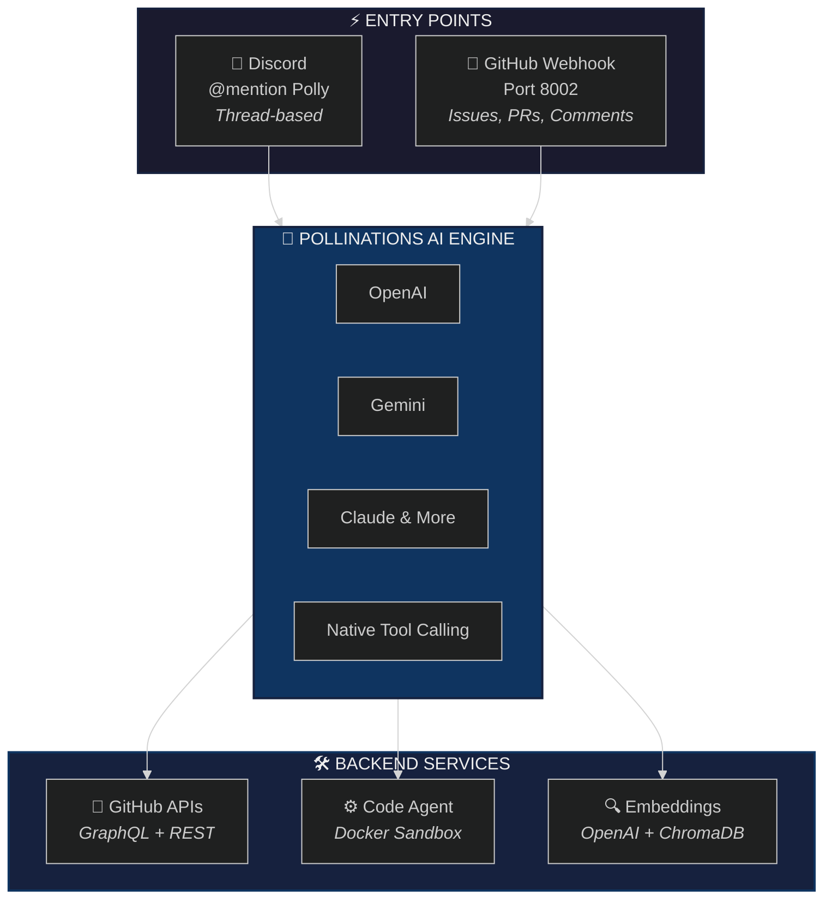

<p align="center">
  
</p>

<h1 align="center">🦜 Polly</h1>

<p align="center">
  <strong>Pollinations.AI Discord Bot - Your GitHub & Development Assistant</strong>
</p>

<p align="center">
  <a href="#features">Features</a> •
  <a href="#how-it-works">How It Works</a> •
  <a href="#setup">Setup</a> •
  <a href="#tools">Tools</a> •
  <a href="#architecture">Architecture</a>
</p>

<p align="center">
  
  
  
  
</p>

---

## ✨ Features

### 🔄 Bidirectional Communication
| Platform | Trigger | Response |
|----------|---------|----------|
| **Discord** | @mention Polly | Replies in thread |
| **GitHub** | @mention in issues/PRs/comments | Replies on GitHub |

### 🎯 Full GitHub Integration

<table>
<tr>
<td width="50%">

**📋 Issues**
- Search, create, comment
- Close, reopen, edit (admin)
- Labels, assignees, milestones
- Sub-issues & linking
- Subscriptions & notifications

</td>
<td width="50%">

**🔀 Pull Requests**
- List, review, approve, merge
- Inline comments & suggestions
- Request reviewers
- AI-powered code review
- Auto-merge support

</td>
</tr>
<tr>
<td>

**📊 Projects V2**
- View project boards
- Add/remove items
- Update status & fields
- Track progress

</td>
<td>

**🤖 Code Agent**
- Autonomous coding tasks
- Create branches & PRs
- Edit files directly
- Run tests & fix issues

</td>
</tr>
</table>

### 🔍 Smart Search
- **`code_search`** - Semantic search across codebase (powered by OpenAI embeddings)
- **`doc_search`** - Search documentation from pollinations.ai sites
- **`web_search`** - Real-time web search for up-to-date information

### 🧠 AI-Powered
- Multiple AI models via Pollinations API (Gemini, GPT, Claude, etc.)
- Native tool calling for intelligent task handling
- Parallel tool execution for efficient workflows
- Context-aware responses with conversation memory

---

## 🚀 How It Works

### Discord → GitHub
```
User: @Polly find 502 errors

   [Thread Created: "Issue: 502 errors"]

Polly: Found 3 open issues:
       • #156 - 502 errors on Flux model
       • #142 - Intermittent 502 on image gen
       • #98 - API returning 502 under load

User: review PR #200

Polly: 🔍 Reviewing PR #200...

       ✅ Overall: LGTM with minor suggestions

       📝 src/api.py:42 - Consider adding error handling
       📝 src/utils.py:15 - This could be simplified
```

### GitHub → Discord
```markdown
<!-- In a GitHub issue comment -->
@pollinations-ci can you explain what this error means?

<!-- Polly replies directly on GitHub -->
This error occurs when... [detailed explanation]
```

---

## 📦 Setup

### Prerequisites
- Python 3.10+
- Discord Bot Token ([create one](https://discord.com/developers/applications))
- GitHub App (recommended) or Personal Access Token
- Pollinations API Token ([get one](https://enter.pollinations.ai))

### 1️⃣ Clone & Install

```bash
git clone https://github.com/pollinations/pollinations.git
cd pollinations/apps/polly
python -m venv venv
source venv/bin/activate  # or `venv\Scripts\activate` on Windows
pip install -r requirements.txt
```

### 2️⃣ Configure Environment

```bash
cp .env.example .env
```

Edit `.env` with your credentials:

```env
# Required
DISCORD_TOKEN=your_discord_bot_token
GITHUB_APP_ID=your_app_id
GITHUB_PRIVATE_KEY_PATH=./polly.pem
GITHUB_INSTALLATION_ID=your_installation_id

# Optional
WEBHOOK_PORT=8002
GITHUB_BOT_USERNAME=pollinations-ci
LOCAL_EMBEDDINGS_ENABLED=true
```

### 3️⃣ Run

```bash
python main.py
```

---

## 🛠️ Tools

| Tool | Description | Access |
|------|-------------|--------|
| `github_overview` | Quick repo summary (issues, labels, milestones, projects) | Everyone |
| `github_issue` | All issue operations | Read: Everyone, Write: Admin |
| `github_pr` | All PR operations | Read: Everyone, Write: Admin |
| `github_project` | Project board operations | Read: Everyone, Write: Admin |
| `github_code` | Code agent (branches, edits, PRs) | Admin only |
| `code_search` | Semantic code search across repository | Everyone |
| `doc_search` | Search pollinations.ai documentation | Everyone |
| `web_search` | Real-time web search | Everyone |

---

## 🏗️ Architecture



---

## 📁 Project Structure

```
apps/polly/
├── 📄 main.py                    # Entry point
├── 📄 requirements.txt           # Dependencies
├── 📄 .env.example               # Environment template
├── 📄 config.json                # Bot configuration
├── 📁 src/
│   ├── 📄 bot.py                 # Discord bot + webhook server
│   ├── 📄 config.py              # Configuration loader
│   ├── 📄 constants.py           # Tools, prompts, schemas
│   ├── 📁 context/               # Session management
│   └── 📁 services/
│       ├── 📄 github.py          # GitHub REST API
│       ├── 📄 github_graphql.py  # GitHub GraphQL API
│       ├── 📄 github_pr.py       # PR operations
│       ├── 📄 pollinations.py    # Pollinations AI client
│       ├── 📄 embeddings.py      # Code & doc search
│       ├── 📄 webhook_server.py  # GitHub webhooks
│       └── 📁 code_agent/        # Autonomous coding
└── 📁 docs/                      # Additional documentation
```

---

## ⚡ Performance

| Optimization | Benefit |
|--------------|---------|
| GraphQL batching | 40-90% fewer API calls |
| Parallel tool execution | Multiple ops simultaneously |
| Connection pooling | Reused HTTP connections |
| Local embeddings | Instant code search |
| Stateless design | No database overhead |

---

## 🔐 Permissions

| Role | Capabilities |
|------|--------------|
| **Everyone** | Search, read issues/PRs, code search, web search |
| **Admin** | + Close, edit, label, assign, merge, code agent |

Admin = Users with configured Discord role(s)

---

## 🤝 Contributing

Polly is the official Discord bot for [Pollinations.AI](https://pollinations.ai). Contributions are welcome!

- Report issues or suggest features via [GitHub Issues](https://github.com/pollinations/pollinations/issues)
- Join our [Discord community](https://discord.gg/pollinations-ai-885844321461485618) for discussions
- Submit pull requests following the project's contribution guidelines

---

## 👤 Author

Created by [Itachi-1824](https://github.com/Itachi-1824) (itachi@myceli.ai)

---

<p align="center">
  Made with 💜 for <a href="https://pollinations.ai">Pollinations.AI</a>
</p>
