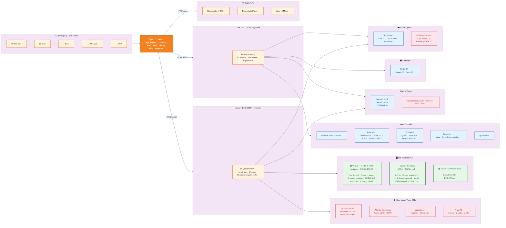

# Architecture Overview

Current-state architecture diagrams for pollinations.ai infrastructure and model routing.

## Models & Providers

```mermaid
%%{init: {'theme': 'base', 'themeVariables': { 'primaryColor': '#fff3e0', 'primaryBorderColor': '#e65100', 'primaryTextColor': '#1a1a1a', 'lineColor': '#666', 'secondaryColor': '#e3f2fd', 'tertiaryColor': '#f3e5f5', 'fontSize': '13px', 'fontFamily': 'Inter, system-ui, sans-serif'}}}%%

graph LR
    subgraph CLIENTS["👥 ~2.2M req/day · 40K+ users"]
        direction TB
        WEB["🌐 Web App"]
        SDK["📦 SDK"]
        BOTS["🤖 Bots"]
        APPS["📱 500+ Apps"]
        MCP_C["🔌 MCP"]
    end

    ENTER["⚡ gen → 🔐 enter\nEdge Router → Gateway\nAuth · Tiers · Billing\n280M req/month"]:::cfWorker

    CLIENTS --> ENTER

    ENTER -->|"~1,340 RPM"| TEXT_SVC
    ENTER -->|"~441 img/min"| IMG_SVC
    ENTER -->|"TTS/music"| AUD

    subgraph TEXT_SVC["📝 Text · EC2 :16385 · systemd"]
        PORTKEY["🔀 Portkey Gateway\nCF Worker · 25+ models\n10+ providers"]
    end

    subgraph IMG_SVC["🎨 Image · EC2 :16384 · systemd"]
        LB["⚖️ Queue Router\nLeast-busy · 2/server\nHeartbeat /register (30s)"]
    end

    subgraph AUD["🔊 Audio APIs"]
        ELEVEN["ElevenLabs v3 TTS"]
        ELEVEN_M["ElevenLabs Music"]
        SUNO_A["Suno v4 Music"]
    end

    subgraph AZURE["☁️ Azure OpenAI"]
        GPT5["GPT-5-mini\nGPT-5.2 · GPT-5-nano\nGrok-4 Fast"]:::textModel
        GPTI["GPT Image 1 Mini\nGPT Image 1.5\nKontext (FLUX.1)"]:::imgModel
    end

    subgraph ANTHRO["🟤 Anthropic"]
        CLAUDE["Haiku 4.5\nSonnet 4.6 · Opus 4.6"]:::textModel
    end

    subgraph GOOGLE["🔵 Google Vertex"]
        GEM["Gemini 3 Flash\nGemini 3.1 Pro\n2.5 Flash Lite"]:::textModel
        NANO["Nanobanana (Gemini 2.5/3/3.1)\nVeo 3.1 Fast"]:::imgModel
    end

    subgraph MORE_TEXT["📡 More Text APIs"]
        NOVA["Bedrock Nova Micro v1"]:::textModel
        FIRE_M["Fireworks\nDeepSeek V3.2 · Kimi K2.5\nGLM-5 · MiniMax M2.5"]:::textModel
        OVH_T["OVHcloud\nQwen3 Coder 30B\nMistral Small 3.2"]:::textModel
        PERP["Perplexity\nSonar · Sonar Reasoning Pro"]:::textModel
        AIR_T["api.airforce"]:::textModel
    end

    subgraph GPU_SELF["🖥️ Self-Hosted GPUs"]
        direction TB
        VAST["🟢 Vast.ai · ~11× RTX 5090\n4 instances · QC/NC/TW/CZ\n─────────────\nFlux Schnell · Docker + screen\nZ-Image · systemd + CUDA 12.8\nSana 0.6B · Scaleway tunnel"]:::gpuNode
        IONET["🔵 io.net · 8 workers\n5 VMs · 2 GPUs each\n─────────────\n4× Flux (Docker containers)\n4× Z-Image (systemd + venv)\nSSH-managed · CUDA 12.4"]:::gpuNode
        MODAL["🟣 Modal · Serverless H200\n─────────────\nKlein (Flux 4B)\nLTX-2 Video"]:::gpuNode
    end

    subgraph MORE_IMG["🎬 More Image/Video APIs"]
        ARK["ByteDance ARK\nSeedream 5.0 Lite\nSeedance Lite/Pro"]:::imgModel
        DASH["Alibaba DashScope\nWan 2.6 (720-1080P)"]:::imgModel
        AIR_I["api.airforce\nImagen 4 · Flux 2 Dev"]:::imgModel
        PRUNA["Pruna AI\np-image · p-video · p-edit"]:::imgModel
    end

    PORTKEY --> AZURE
    PORTKEY --> ANTHRO
    PORTKEY --> GOOGLE
    PORTKEY --> MORE_TEXT

    LB --> GPU_SELF
    LB --> AZURE
    LB --> GOOGLE
    LB --> MORE_IMG

    classDef cfWorker fill:#F48120,color:#fff,stroke:#c66000,stroke-width:2px,font-weight:bold
    classDef textModel fill:#e3f2fd,stroke:#1565c0,color:#0d47a1
    classDef imgModel fill:#fce4ec,stroke:#c62828,color:#b71c1c
    classDef gpuNode fill:#e8f5e9,stroke:#2e7d32,color:#1b5e20,stroke-width:2px
```

## Infrastructure & Services

```mermaid
%%{init: {'theme': 'base', 'themeVariables': { 'primaryColor': '#fff3e0', 'primaryBorderColor': '#e65100', 'primaryTextColor': '#1a1a1a', 'lineColor': '#555', 'secondaryColor': '#e3f2fd', 'tertiaryColor': '#f3e5f5', 'fontSize': '14px', 'fontFamily': 'Inter, system-ui, sans-serif'}}}%%

graph TD
    CDN["🌍 Cloudflare CDN\nDNS · WAF · DDoS\n~280M req/month"]:::cfEdge

    CDN --> GEN

    GEN["⚡ gen.pollinations.ai\nEdge Router"]:::cfWorker

    GEN -->|"service binding\n(zero latency)"| ENTER

    subgraph CF["☁️ Cloudflare Workers"]
        ENTER["🔐 enter.pollinations.ai · API Gateway\n─────────────────\n🔑 OAuth + API Keys (pk_ / sk_)\n🏷️ 6 Tiers: microbe → router\n💰 Pollen balance (tier + packs + crypto)\n⏱️ Rate Limiting (Durable Objects)\n📊 Usage → TinyBird\n🔄 Response dedup"]:::cfWorker
        PORTKEY_W["🔀 portkey.pollinations.ai\nText routing worker"]:::cfWorkerLight
        MEDIA["📁 media.pollinations.ai\nSHA-256 uploads · 10MB"]:::cfWorkerLight
        FRONT["🌐 pollinations.ai\nReact + Vite SPA"]:::cfWorkerLight
    end

    subgraph STORAGE["💾 Cloudflare Storage"]
        D1["🗃️ D1 SQLite\n40K users · auth\nkeys · tiers · balance"]:::cfStorage
        KV_S["⚡ KV Store\nstats · refills · dedup"]:::cfStorage
        R2["📦 R2 · 48 TB\n4 buckets · images\ntext · media · cache"]:::cfStorage
        DO["🔒 Durable Objects\nPollenRateLimiter\n10K req/10s per IP"]:::cfStorage
    end

    ENTER --> D1
    ENTER --> KV_S
    ENTER --> R2
    ENTER --> DO

    subgraph COMPUTE["🖥️ AWS EC2 · us-east-1 · g6e"]
        TEXT["📝 text :16385\nNode.js · Hono · systemd\nOpenAI-compat API"]:::ec2
        IMAGE["🎨 image :16384\nNode.js · Hono · systemd\nQueue router + heartbeat\nSharp · ImageMagick"]:::ec2
    end

    ENTER -->|"text / chat"| TEXT
    ENTER -->|"image / video"| IMAGE
    ENTER -->|"audio"| AUD_API

    TEXT --> PORTKEY_W

    subgraph PROVIDERS["🔌 AI Provider APIs"]
        PROV_TEXT["☁️ Text Providers\nAzure · Anthropic · Vertex\nBedrock · Fireworks · OVH\nPerplexity · airforce"]:::provider
        IMG_API["🖼️ Image/Video\nAzure · Vertex · ByteDance\nAlibaba · Pruna · airforce"]:::provider
        AUD_API["🔊 Audio\nElevenLabs · Suno"]:::provider
    end

    PORTKEY_W --> PROV_TEXT
    IMAGE --> IMG_API

    subgraph GPU["⚡ Self-Hosted GPUs"]
        VAST["🟢 Vast.ai · ~11 RTX 5090\n4 inst · QC/NC/TW/CZ\nFlux · Z-Image · Sana"]:::gpu
        IONET["🔵 io.net · 8 workers\n5 VMs · Flux + Z-Image"]:::gpu
        MODAL["🟣 Modal · H200\nKlein · LTX-2 Video"]:::gpu
    end

    IMAGE -->|"heartbeat /register"| VAST
    IMAGE --> IONET
    IMAGE --> MODAL

    subgraph OBS["📊 TinyBird · ClickHouse"]
        TB_S["📈 Analytics\n10 tables · 18 API pipes\nusage · payments · health\nKPIs · retention · revenue"]:::tinybird
    end

    ENTER -.->|"async NDJSON"| TB_S

    subgraph PAY["💳 Payments"]
        STRIPE["Stripe · packs"]:::payment
        POLAR["Polar · subs"]:::payment
        NOWPAY["NOWPay · crypto"]:::payment
    end

    STRIPE -.->|"webhooks"| ENTER
    POLAR -.->|"webhooks"| ENTER
    NOWPAY -.->|"IPN"| ENTER

    subgraph SOCIAL["📢 Social Automation"]
        BUFFER["Buffer\nX · LinkedIn · IG"]:::social
        REDDIT["Reddit VPS\nSSH deploy"]:::social
        DISCORD_W["Discord\nWebhooks"]:::social
    end

    subgraph CICD["🔧 GitHub Actions · CI/CD"]
        GH["29 workflows\n5 deploys · 7 crons\nPolly bot · app review\nBiome · CodeQL · tests"]:::cicd
        SOPS_S["🔒 SOPS + AGE\n28 secrets"]:::cicd
    end

    GH -.->|"wrangler deploy"| CF
    GH -.->|"SSH + systemd"| COMPUTE
    SOPS_S -.->|"decrypt .env"| COMPUTE

    ENTER -.->|"cron: refills\nabuse · D1 sync"| D1

    classDef cfEdge fill:#F48120,color:#fff,stroke:#c66000,stroke-width:2px,font-weight:bold
    classDef cfWorker fill:#F48120,color:#fff,stroke:#c66000,stroke-width:2px,font-weight:bold
    classDef cfWorkerLight fill:#FFE0B2,color:#1a1a1a,stroke:#F48120,stroke-width:1px
    classDef cfStorage fill:#FFF3E0,color:#1a1a1a,stroke:#E65100,stroke-width:1px
    classDef ec2 fill:#232F3E,color:#fff,stroke:#FF9900,stroke-width:2px
    classDef gpu fill:#e8f5e9,color:#1b5e20,stroke:#2e7d32,stroke-width:2px
    classDef provider fill:#e3f2fd,color:#0d47a1,stroke:#1565c0,stroke-width:1px
    classDef tinybird fill:#E0F7FA,color:#006064,stroke:#00838F,stroke-width:1px
    classDef payment fill:#EDE7F6,color:#311B92,stroke:#4527A0,stroke-width:1px
    classDef social fill:#FFF9C4,color:#333,stroke:#F9A825,stroke-width:1px
    classDef cicd fill:#F5F5F5,color:#333,stroke:#999,stroke-width:1px
```
