# Abuse Detection Pipeline Architecture

This document provides a detailed walkthrough of the abuse detection system, including Mermaid diagrams that illustrate every step of the process.

---

## High-Level Pipeline Overview

```mermaid
flowchart TB
    subgraph "Step 1: Data Collection"
        D1[(D1 Database)] --> |"Fetch all users<br/>id, email, github_username,<br/>github_id, tier, created_at"| USERS[User Records]
        TB[(Tinybird)] --> |"Fetch behavioral metrics<br/>via user_behavior_summary pipe"| BEHAVIOR[Behavioral Data]
    end
    
    subgraph "Step 2: Cluster Pre-computation"
        USERS --> BURST[Burst Registration<br/>Clusters]
        USERS --> GHID[GitHub ID<br/>Clusters]
    end
    
    subgraph "Step 3: Per-User Analysis"
        USERS --> SIGNALS[Identity Signal<br/>Detection]
        BEHAVIOR --> BSCORE[Behavior Score<br/>Calculation]
        BURST --> SIGNALS
        GHID --> SIGNALS
    end
    
    subgraph "Step 4: Scoring & Classification"
        SIGNALS --> ISCORE[Identity Score<br/>0-100]
        BSCORE --> COMBINED[Combined Score<br/>0-100]
        ISCORE --> COMBINED
        COMBINED --> RISKBAND{Risk Band<br/>Classification}
    end
    
    subgraph "Step 5: Output"
        RISKBAND --> |enforce| ENFORCE[🔴 Enforce<br/>Auto-action]
        RISKBAND --> |review| REVIEW[🟡 Review<br/>Manual check]
        RISKBAND --> |watch| WATCH[🟢 Watch<br/>Monitor only]
        ENFORCE --> CSV[flagged-users.csv]
        REVIEW --> CSV
        WATCH --> CSV
        CSV --> SUMMARY[flagged-users-summary.md]
    end
```



---

## Step 1: Data Collection (Detailed)

### D1 Database Query


**Fields retrieved per user:**
| Field | Type | Purpose |
|-------|------|---------|
| `id` | string | Unique user identifier |
| `email` | string | For disposable/duplicate detection |
| `github_username` | string | For username pattern detection |
| `github_id` | number | For GitHub ID cluster detection |
| `tier` | string | Current tier assignment |
| `created_at` | timestamp | For burst registration detection |

### Tinybird Behavioral Data Query

```mermaid
flowchart LR
    subgraph "Tinybird Fetch"
        IDS[User IDs] --> BATCH["Batch 100 users"]
        BATCH --> |"GET user_behavior_summary.json<br/>?user_ids=id1,id2,..."| TB[(Tinybird API)]
        TB --> MERGE[Merge into Map<br/>userId → metrics]
        MERGE --> CHECK{More batches?}
        CHECK --> |Yes| BATCH
        CHECK --> |No| DONE([Behavior Data Ready])
    end
```



**Behavioral metrics from Tinybird:**
| Metric | Description |
|--------|-------------|
| `requests_total_30d` | Total API requests in 30 days |
| `error_rate_30d` | Server error rate (5xx) |
| `client_error_rate_30d` | Client error rate (4xx) |
| `rate_limited_rate_30d` | Rate of 429 responses |
| `unique_models_requested_30d` | Model diversity |
| `cache_hit_rate_30d` | Repetitive request indicator |
| `moderation_flags_count_30d` | Policy violation count |
| `moderation_flag_rate_30d` | Policy violation rate |

---

## Step 2: Cluster Pre-computation

### Burst Registration Detection


**Burst cluster parameters:**
- **Window size:** 5 minutes (300 seconds)
- **Minimum cluster size:** 15 users
- **Key formula:** `floor(windowStart / windowSeconds)`

### GitHub ID Cluster Detection

```mermaid
flowchart TB
    subgraph "GitHub ID Clustering"
        USERS[Users with GitHub IDs] --> SORT["Sort by github_id<br/>(ascending)"]
        SORT --> WALK["Walk sorted list"]
        
        WALK --> GAP{Gap to next ID<br/>> 1000?}
        GAP --> |No| CONTINUE[Continue accumulating]
        CONTINUE --> WALK
        
        GAP --> |Yes| SIZE{Cluster size<br/>≥ 5 users?}
        SIZE --> |No| RESET[Start new cluster]
        RESET --> WALK
        
        SIZE --> |Yes| SUBCLUSTER["Sub-cluster by time<br/>(60-min window)"]
        SUBCLUSTER --> DENSITY["Calculate density<br/>= users / (maxId - minId + 1)"]
        DENSITY --> CLAMP["Clamp density to [0, 1]"]
        CLAMP --> RECORD[Record GitHub ID Cluster]
        RECORD --> WALK
    end
```



**GitHub ID cluster parameters:**
- **Max ID gap:** 1000 (IDs within this range are grouped)
- **Minimum cluster size:** 5 users
- **Time window:** 60 minutes
- **Density formula:** `clusterSize / (rangeEnd - rangeStart + 1)`

---

## Step 3: Identity Signal Detection


**Signal detection functions:**

| Signal | Detection Method | Weight |
|--------|------------------|--------|
| `disposable_email` | Check against disposable domain list | 50 |
| `github_noreply` | Email ends with `@users.noreply.github.com` | 5 |
| `email_duplicate` | Same normalized email (dots/+ removed) | 25+ |
| `username_pattern` | Same username base (numbers stripped) | 15+ |
| `cross_domain` | Same email local part across providers | 15+ |
| `burst_registration` | 15+ accounts in 5-minute window | 50 |
| `github_id_cluster` | Sequential GitHub IDs in time window | 40 |

---

## Step 4: Confidence Scoring

### Identity Score Calculation

```mermaid
flowchart TB
    subgraph "calculateConfidence()"
        START([Input: All Signals]) --> INIT["score = 0<br/>signalCount = 0"]
        
        INIT --> D1{isDisposable?}
        D1 --> |Yes| D1A["score += 50<br/>signalCount++"]
        D1 --> |No| D2
        D1A --> D2
        
        D2{githubIdCluster<br/>size > 0?}
        D2 --> |Yes| D2A["sizeAmplifier = min(2, 1 + log2(size)/10)<br/>densityMult = min(1, density × 10)<br/>points = 40 × sizeAmplifier × densityMult"]
        D2A --> D2B{density ≥ 0.1?}
        D2B --> |Yes| D2C["signalCount++<br/>(strong cluster)"]
        D2B --> |No| D3
        D2C --> D3
        D2 --> |No| D3
        
        D3{burstCluster<br/>size > 0?}
        D3 --> |Yes| D3A["amplifier = min(2, 1 + log2(size)/10)<br/>score += 50 × amplifier<br/>signalCount++"]
        D3 --> |No| D4
        D3A --> D4
        
        D4{duplicateCount > 0?}
        D4 --> |Yes| D4A["if ≥5: points=100<br/>if ≥3: points=50+count×10<br/>else: points=25+count×5<br/>signalCount++"]
        D4 --> |No| D5
        D4A --> D5
        
        D5{similarUsername<br/>Count > 0?}
        D5 --> |Yes| D5A["if ≥5: points=100<br/>if ≥3: points=40+count×10<br/>else: points=15+count×5<br/>signalCount++"]
        D5 --> |No| D6
        D5A --> D6
        
        D6{crossDomain<br/>Count > 0?}
        D6 --> |Yes| D6A["if ≥5: points=100<br/>if ≥3: points=40+count×10<br/>else: points=15+count×10<br/>signalCount++"]
        D6 --> |No| D7
        D6A --> D7
        
        D7{isGitHubNoreply?}
        D7 --> |Yes| D7A["score += 5<br/>signalCount++"]
        D7 --> |No| COMBO
        D7A --> COMBO
        
        COMBO{signalCount ≥ 3?}
        COMBO --> |Yes| COMBOB["bonus = (signalCount - 2) × 5<br/>score += bonus"]
        COMBO --> |No| CLAMP
        COMBOB --> CLAMP
        
        CLAMP["score = clamp(score, 0, 100)"]
        CLAMP --> OUTPUT([Identity Score])
    end
```



### Behavior Score Calculation

```mermaid
flowchart TB
    subgraph "calculateBehaviorScore()"
        START([Tinybird Usage Data]) --> INIT["pts = 0<br/>req = requests_total_30d"]
        
        INIT --> B1{req ≥ 10 AND<br/>client_error_rate ≥ 0.5?}
        B1 --> |Yes| B1A["pts += 30<br/>(Dumb bot/broken script)"]
        B1 --> |No| B2
        B1A --> B2
        
        B2{req ≥ 200 AND<br/>rate_limited_rate ≥ 0.3?}
        B2 --> |Yes| B2A["pts += 10<br/>(Rate-limit pressure)"]
        B2 --> |No| B3
        B2A --> B3
        
        B3{req ≥ 100 AND<br/>unique_models = 1?}
        B3 --> |Yes| B3A["pts += 10<br/>(Script rigidity)"]
        B3 --> |No| B4
        B3A --> B4
        
        B4{req ≥ 50 AND<br/>cache_hit_rate ≥ 0.9?}
        B4 --> |Yes| B4A["pts += 20<br/>(Looping/repetition)"]
        B4 --> |No| B5
        B4A --> B5
        
        B5{req ≥ 10 AND<br/>moderation_flag_rate ≥ 0.05?}
        B5 --> |Yes| B5A["pts += 20<br/>(Policy probing)"]
        B5 --> |No| B6
        B5A --> B6
        
        B6{moderation_flags_count ≥ 25?}
        B6 --> |Yes| B6A["pts += 10"]
        B6 --> |No| B7
        B6A --> B7
        
        B7{req ≥ 30 AND<br/>unique_models ≥ 3 AND<br/>error_rate ≤ 0.05?}
        B7 --> |Yes| B7A["pts -= 20<br/>(Human exploration bonus)"]
        B7 --> |No| OUTPUT
        B7A --> OUTPUT
        
        OUTPUT([Behavior Score])
    end
```



### Combined Score & Risk Band

```mermaid
flowchart TB
    subgraph "Risk Classification"
        IDSCORE[Identity Score] --> COMBINED["combinedScore = clamp(<br/>identityScore + behaviorScore, 0, 100)"]
        BSCORE[Behavior Score] --> COMBINED
        
        COMBINED --> LEVEL{Determine Level}
        LEVEL --> |"≥ 80"| CRITICAL[🔴 critical]
        LEVEL --> |"≥ 50"| HIGH[🟠 high]
        LEVEL --> |"≥ 25"| MEDIUM[🟡 medium]
        LEVEL --> |"< 25"| LOW[🟢 low]
        
        COMBINED --> HARD{Hard identity signal?<br/>disposable OR dup≥3}
        HARD --> |Yes| ENFORCE[🔴 ENFORCE]
        
        HARD --> |No| BEHAVIOR{score ≥ 70 AND<br/>behaviorScore ≥ 30?}
        BEHAVIOR --> |Yes| ENFORCE
        
        BEHAVIOR --> |No| MID{score ≥ 40 OR<br/>(signals ≥ 2 AND behavior ≥ 30)?}
        MID --> |Yes| REVIEW[🟡 REVIEW]
        
        MID --> |No| WATCH[🟢 WATCH]
    end
```

---

## Signal Weights & Scoring Reference

### Base Signal Weights

| Signal | Base Weight | Amplification | Max Contribution |
|--------|-------------|---------------|------------------|
| `disposable_email` | 50 | None | 50 |
| `burst_registration` | 50 | × log2(size) amplifier (max 2×) | 100 |
| `github_id_cluster` | 40 | × size amplifier × density multiplier | 80 |
| `email_duplicate` | 25 | Escalates: 5+ = 100 | 100 |
| `username_pattern` | 15 | Escalates: 5+ = 100 | 100 |
| `cross_domain` | 15 | Escalates: 5+ = 100 | 100 |
| `github_noreply` | 5 | None | 5 |
| `combo_bonus` | 5 | × (signalCount - 2) | Variable |

### Behavior Score Components

| Condition | Points | Interpretation |
|-----------|--------|----------------|
| High client errors (≥50%) | +30 | Broken script or trial-and-error |
| Rate limited often (≥30%) | +10 | Pushing system limits |
| Single model only | +10 | Scripted, non-exploratory |
| Very high cache (≥90%) | +20 | Repetitive/looping requests |
| Moderation flags (≥5%) | +20 | Policy violation pattern |
| Many moderation flags (≥25) | +10 | Persistent violation |
| Diverse + low errors | **-20** | Human exploration (bonus) |

### Risk Band Decision Matrix

| Condition | Risk Band | Action |
|-----------|-----------|--------|
| Disposable email | **ENFORCE** | Auto-downgrade |
| 3+ email duplicates | **ENFORCE** | Auto-downgrade |
| Score ≥ 70 AND behavior ≥ 30 | **ENFORCE** | Auto-downgrade |
| Score ≥ 40 | **REVIEW** | Manual review |
| 2+ signals AND behavior ≥ 30 | **REVIEW** | Manual review |
| Otherwise | **WATCH** | Monitor only |

---

## Output Files

The pipeline generates **two CSV files** optimized for different audiences:

| File | Columns | Contents | Audience |
|------|---------|----------|----------|
| `abuse-actions.csv` | **20** | Review + Enforce only | **Ops** (triage) |
| `abuse-debug.csv` | **36** | All flagged users | **Engineers** (investigation) |

### abuse-actions.csv (Ops, 20 columns)

Optimized for quick triage - decision first, then identity, then behavior:

```
risk_band,combined_score,behavior_score,identity_score,flag_reasons,
user_id,tier,registered_at,email,github_username,github_id,
has_tinybird_data,requests_30d,tier_consumed_30d,tier_usage_pct_30d,pack_consumed_30d,
error_rate_30d,client_error_rate_30d,rate_limited_rate_30d,unique_models_30d,moderation_flags_30d
```

### abuse-debug.csv (Engineers, 36 columns)

Full detail for investigation - includes all signals, cluster IDs, and breakdown:

```
risk_band,combined_score,behavior_score,identity_score,confidence_level,flag_reasons,context_signals,
user_id,tier,registered_at,email,github_username,github_id,
has_tinybird_data,requests_30d,tier_consumed_30d,tier_usage_pct_30d,pack_consumed_30d,
error_rate_30d,client_error_rate_30d,rate_limited_rate_30d,unique_models_30d,moderation_flags_30d,
sig_disposable,sig_email_dup,email_dup_count,sig_cross_domain,cross_domain_count,
sig_username_pattern,username_match_count,sig_burst_reg,burst_cluster_size,
sig_github_id_cluster,github_id_cluster_size,
burst_cluster_id,ghid_cluster_id,username_base,email_local_base,confidence_breakdown
```

### Data Conventions

| Convention | Description |
|------------|-------------|
| `sig_*` fields | Explicit booleans: `true` / `false` (not YES/null) |
| Count fields | Default to `0` when not applicable (not empty) |
| `has_tinybird_data` | `true` / `false` - distinguishes missing telemetry from zero usage |
| `risk_band` | `enforce` / `review` / `watch` |

### Dropped Columns (per Elliot's feedback)

- `sig_github_noreply` - 100% empty, moved to context_signals
- `cache_hit_rate_30d` - constant 0.0, no signal value

### Summary Markdown

The summary (`flagged-users-summary.md`) includes:
- Total and flagged user counts
- **Risk band breakdown** (enforce+review vs watch)
- **Tinybird coverage** (has telemetry vs missing vs zero usage)
- Signal breakdown by type with notes
- Cluster analysis

---

## Environment Variables Required

| Variable | Source | Purpose |
|----------|--------|---------|
| `CLOUDFLARE_API_TOKEN` | Cloudflare Dashboard | D1 database access |
| `CLOUDFLARE_ACCOUNT_ID` | Cloudflare Dashboard | Account identifier |
| `TINYBIRD_INGEST_TOKEN` | `.dev.vars` | Behavioral data (optional) |

---

## Running the Pipeline

```bash
cd enter.pollinations.ai

# Full pipeline with behavioral data
TINYBIRD_INGEST_TOKEN=$(sops -d secrets/dev.vars.json | jq -r '.TINYBIRD_INGEST_TOKEN') \
  npx tsx scripts/abuse-detection/analyze-abuse.ts export-csv --env production

# Identity signals only (no Tinybird)
npx tsx scripts/abuse-detection/analyze-abuse.ts export-csv --env production

# Include all users (not just flagged)
npx tsx scripts/abuse-detection/analyze-abuse.ts export-csv --env production --all
```
