# Abuse Detection System

Unified pipeline for detecting abuse patterns through identity signals and behavioral analysis.

## Quick Start

```bash
cd enter.pollinations.ai

# Run the unified pipeline (identity + behavioral analysis)
TINYBIRD_INGEST_TOKEN=$(grep '^TINYBIRD_INGEST_TOKEN=' .dev.vars | cut -d'=' -f2) \
  npx tsx scripts/abuse-detection/analyze-abuse.ts export-csv --env production

# Without Tinybird (identity signals only)
npx tsx scripts/abuse-detection/analyze-abuse.ts export-csv --env production

# Include all users (not just flagged)
npx tsx scripts/abuse-detection/analyze-abuse.ts export-csv --env production --all
```

**Output**: `flagged-users-actions.csv` (ops) + `flagged-users-debug.csv` (engineering) + `flagged-users-summary.md`

---

## Pipeline Overview

```mermaid
flowchart TB
    subgraph "Step 1: Data Collection"
        D1[(D1 Database)] --> |"Fetch all users<br/>id, email, github_username,<br/>github_id, tier, created_at"| USERS[User Records]
        TB[(Tinybird)] --> |"Fetch behavioral metrics<br/>via user_behavior_summary pipe"| BEHAVIOR[Behavioral Data]
    end
    
    subgraph "Step 2: Cluster Pre-computation"
        USERS --> BURST[Burst Registration<br/>Clusters]
        USERS --> GHID[GitHub ID<br/>Clusters]
    end
    
    subgraph "Step 3: Per-User Analysis"
        USERS --> SIGNALS[Identity Signal<br/>Detection]
        BEHAVIOR --> BSCORE[Behavior Score<br/>Calculation]
        BURST --> SIGNALS
        GHID --> SIGNALS
    end
    
    subgraph "Step 4: Scoring & Classification"
        SIGNALS --> ISCORE[Identity Score<br/>0-100]
        BSCORE --> COMBINED[Combined Score<br/>0-100]
        ISCORE --> COMBINED
        COMBINED --> RISKBAND{Risk Band<br/>Classification}
    end
    
    subgraph "Step 5: Output"
        RISKBAND --> |enforce| ENFORCE[🔴 Enforce<br/>Auto-action]
        RISKBAND --> |review| REVIEW[🟡 Review<br/>Manual check]
        RISKBAND --> |watch| WATCH[🟢 Watch<br/>Monitor only]
        ENFORCE --> CSV[flagged-users-actions.csv<br/>flagged-users-debug.csv]
        REVIEW --> CSV
        WATCH --> CSV
        CSV --> SUMMARY[flagged-users-summary.md]
    end
```



---

## Data Collection

### D1 Database Query


### Tinybird Behavioral Data

```mermaid
flowchart LR
    subgraph "Tinybird Fetch"
        IDS[User IDs] --> BATCH["Batch 100 users"]
        BATCH --> |"GET user_behavior_summary.json<br/>?user_ids=id1,id2,..."| TB[(Tinybird API)]
        TB --> MERGE[Merge into Map<br/>userId → metrics]
        MERGE --> CHECK{More batches?}
        CHECK --> |Yes| BATCH
        CHECK --> |No| DONE([Behavior Data Ready])
    end
```



---

## Scoring System

### Combined Score = Identity + Behavior (0-100)

**Identity Score** (registration signals):
| Signal | Weight | Description |
|--------|--------|-------------|
| `disposable_email` | 50 | ~3000 known throwaway domains |
| `burst_registration` | 50 | 15+ accounts in 5-min window |
| `github_id_cluster` | 40 | Sequential GitHub IDs + time proximity |
| `email_duplicate` | 25 | Same normalized email (dots/+ removed) |
| `username_pattern` | 15 | Similar usernames (user1, user2 → base) |
| `cross_domain` | 15 | Same prefix across domains |
| `github_noreply` | 5 | GitHub private email |

**Behavior Score** (usage patterns):
| Pattern | Points |
|---------|--------|
| High client error rate (≥50%) | +30 |
| Rate-limit pressure (≥30%) | +10 |
| Single model, high volume | +10 |
| Very high cache hits (≥90%) | +20 |
| Moderation flag rate (≥5%) | +20 |
| Many moderation flags (≥25) | +10 |
| Human exploration (diverse models, low errors) | **-20** |

### Per-User Signal Detection


### Identity Score Calculation

```mermaid
flowchart TB
    subgraph "calculateConfidence()"
        START([Input: All Signals]) --> INIT["score = 0<br/>signalCount = 0"]
        
        INIT --> D1{isDisposable?}
        D1 --> |Yes| D1A["score += 50<br/>signalCount++"]
        D1 --> |No| D2
        D1A --> D2
        
        D2{githubIdCluster<br/>size > 0?}
        D2 --> |Yes| D2A["sizeAmplifier = min(2, 1 + log2(size)/10)<br/>densityMult = min(1, density × 10)<br/>points = 40 × sizeAmplifier × densityMult"]
        D2A --> D2B{density ≥ 0.1?}
        D2B --> |Yes| D2C["signalCount++<br/>(strong cluster)"]
        D2B --> |No| D3
        D2C --> D3
        D2 --> |No| D3
        
        D3{burstCluster<br/>size > 0?}
        D3 --> |Yes| D3A["amplifier = min(2, 1 + log2(size)/10)<br/>score += 50 × amplifier<br/>signalCount++"]
        D3 --> |No| D4
        D3A --> D4
        
        D4{duplicateCount > 0?}
        D4 --> |Yes| D4A["if ≥5: points=100<br/>if ≥3: points=50+count×10<br/>else: points=25+count×5<br/>signalCount++"]
        D4 --> |No| D5
        D4A --> D5
        
        D5{similarUsername<br/>Count > 0?}
        D5 --> |Yes| D5A["if ≥5: points=100<br/>if ≥3: points=40+count×10<br/>else: points=15+count×5<br/>signalCount++"]
        D5 --> |No| D6
        D5A --> D6
        
        D6{crossDomain<br/>Count > 0?}
        D6 --> |Yes| D6A["if ≥5: points=100<br/>if ≥3: points=40+count×10<br/>else: points=15+count×10<br/>signalCount++"]
        D6 --> |No| D7
        D6A --> D7
        
        D7{isGitHubNoreply?}
        D7 --> |Yes| D7A["score += 5<br/>signalCount++"]
        D7 --> |No| COMBO
        D7A --> COMBO
        
        COMBO{signalCount ≥ 3?}
        COMBO --> |Yes| COMBOB["bonus = (signalCount - 2) × 5<br/>score += bonus"]
        COMBO --> |No| CLAMP
        COMBOB --> CLAMP
        
        CLAMP["score = clamp(score, 0, 100)"]
        CLAMP --> OUTPUT([Identity Score])
    end
```



### Behavior Score Calculation

```mermaid
flowchart TB
    subgraph "calculateBehaviorScore()"
        START([Tinybird Usage Data]) --> INIT["pts = 0<br/>req = requests_total_30d"]
        
        INIT --> B1{req ≥ 10 AND<br/>client_error_rate ≥ 0.5?}
        B1 --> |Yes| B1A["pts += 30<br/>(Dumb bot/broken script)"]
        B1 --> |No| B2
        B1A --> B2
        
        B2{req ≥ 200 AND<br/>rate_limited_rate ≥ 0.3?}
        B2 --> |Yes| B2A["pts += 10<br/>(Rate-limit pressure)"]
        B2 --> |No| B3
        B2A --> B3
        
        B3{req ≥ 100 AND<br/>unique_models = 1?}
        B3 --> |Yes| B3A["pts += 10<br/>(Script rigidity)"]
        B3 --> |No| B4
        B3A --> B4
        
        B4{req ≥ 50 AND<br/>cache_hit_rate ≥ 0.9?}
        B4 --> |Yes| B4A["pts += 20<br/>(Looping/repetition)"]
        B4 --> |No| B5
        B4A --> B5
        
        B5{req ≥ 10 AND<br/>moderation_flag_rate ≥ 0.05?}
        B5 --> |Yes| B5A["pts += 20<br/>(Policy probing)"]
        B5 --> |No| B6
        B5A --> B6
        
        B6{moderation_flags_count ≥ 25?}
        B6 --> |Yes| B6A["pts += 10"]
        B6 --> |No| B7
        B6A --> B7
        
        B7{req ≥ 30 AND<br/>unique_models ≥ 3 AND<br/>error_rate ≤ 0.05?}
        B7 --> |Yes| B7A["pts -= 20<br/>(Human exploration bonus)"]
        B7 --> |No| OUTPUT
        B7A --> OUTPUT
        
        OUTPUT([Behavior Score])
    end
```



### Risk Band Classification

```mermaid
flowchart TB
    subgraph "Risk Classification"
        IDSCORE[Identity Score] --> COMBINED["combinedScore = clamp(<br/>identityScore + behaviorScore, 0, 100)"]
        BSCORE[Behavior Score] --> COMBINED
        
        COMBINED --> ALLOWLIST{Allowlisted domain?<br/>ProtonMail, Tutanota, etc.}
        ALLOWLIST --> |Yes| REVIEW_ALLOW[🟡 REVIEW<br/>Never auto-enforce]
        
        ALLOWLIST --> |No| HARD{Hard identity signal?<br/>disposable OR dup≥3}
        HARD --> |Yes| BEHAV_CHECK{behaviorScore ≥ 30?}
        BEHAV_CHECK --> |Yes| ENFORCE[🔴 ENFORCE]
        BEHAV_CHECK --> |No| REVIEW_HARD[🟡 REVIEW]
        
        HARD --> |No| HIGHSCORE{score ≥ 70 AND<br/>behaviorScore ≥ 30?}
        HIGHSCORE --> |Yes| ENFORCE
        
        HIGHSCORE --> |No| MID{Hard signal OR score ≥ 40 OR<br/>(signals ≥ 2 AND behavior ≥ 30)?}
        MID --> |Yes| REVIEW[🟡 REVIEW]
        
        MID --> |No| WATCH[🟢 WATCH]
    end
```

**Privacy Email Allowlist**: ProtonMail, Tutanota, Mailfence, Disroot, Riseup, Posteo, iCloud Private Relay, etc. These domains are never auto-enforced.

| Band | Criteria | Action |
|------|----------|--------|
| `enforce` | (Hard signals + behavior ≥30) OR (combined ≥70 + behavior ≥30), NOT allowlisted | Auto-downgrade |
| `review` | Allowlisted with flags, OR hard signal alone, OR combined ≥40, OR 2+ signals | Manual review |
| `watch` | Low score, single weak signal | Monitor only |

---

## Cluster Detection

### Burst Registration

```mermaid
flowchart TB
    subgraph "Burst Detection Algorithm"
        USERS[All Users] --> SORT["Sort by created_at"]
        SORT --> WINDOW["Sliding 5-min window"]
        WINDOW --> COUNT{Users in window ≥ 15?}
        COUNT --> |Yes| CLUSTER["Record as Burst Cluster"]
        COUNT --> |No| NEXT[Move to next user]
        CLUSTER --> NEXT
        NEXT --> |More users| WINDOW
        NEXT --> |Done| OUTPUT[Burst Clusters Map]
    end
```



### GitHub ID Clustering


---

## CSV Output

The pipeline generates **two CSV files**:

| File | Columns | Audience |
|------|---------|----------|
| `flagged-users-actions.csv` | 20 | Ops (triage) - Review + Enforce only |
| `flagged-users-debug.csv` | 36 | Engineers - All flagged users with full detail |

### Key Columns
- **Decision**: `risk_band`, `combined_score`, `behavior_score`, `identity_score`, `flag_reasons`
- **Identity**: `user_id`, `tier`, `registered_at`, `email`, `github_username`, `github_id`
- **Behavior**: `requests_30d`, `tier_consumed_30d`, `error_rate_30d`, `moderation_flags_30d`
- **Cluster IDs**: `burst_cluster_id`, `ghid_cluster_id` (for grouping related accounts)

---

## Environment Variables

| Variable | Source | Purpose |
|----------|--------|---------|
| `CLOUDFLARE_API_TOKEN` | Cloudflare Dashboard | D1 database access |
| `CLOUDFLARE_ACCOUNT_ID` | Cloudflare Dashboard | Account identifier |
| `TINYBIRD_INGEST_TOKEN` | `.dev.vars` | Behavioral data (optional) |

---

## Future Improvements

- [ ] IP/ASN clustering
- [ ] GitHub account age verification
- [ ] Pre-indexed lookup maps for O(1) duplicate detection
