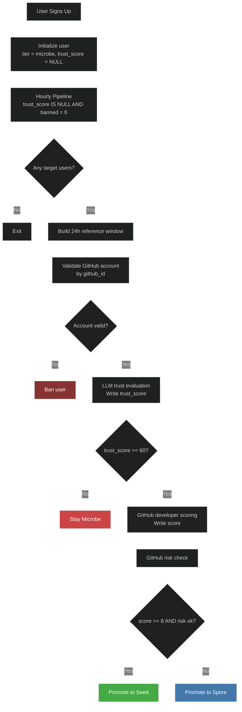
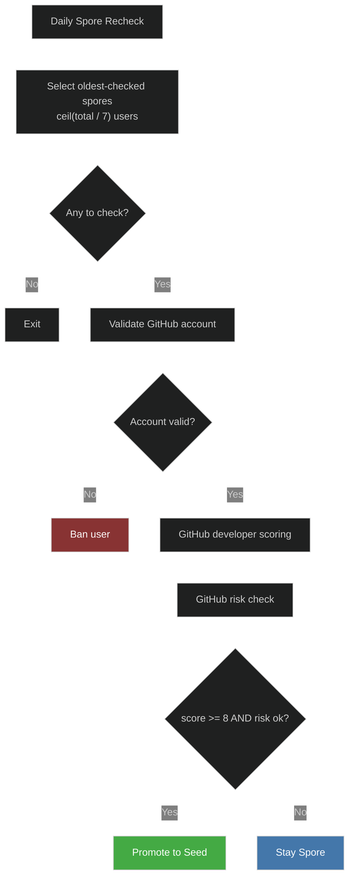

# User Pipeline

Two steady-state jobs that manage user tier progression:

1. **Hourly** — trust-score new users, promote from `microbe` to `spore` or `seed`
2. **Daily** — recheck `spore` users for promotion to `seed`

See [`PRODUCTION_ROLLOUT.md`](./PRODUCTION_ROLLOUT.md) for the rollout plan.

## Layout

```text
scripts/user-pipeline/
├── hourly-new-users.ts
├── daily-spore-recheck.ts
├── scoring/
│   ├── trust-score.ts
│   ├── trust-score-helpers.ts
│   ├── github_score.py
│   └── test_github_risk.py
├── shared/
│   ├── d1.ts
│   ├── email-cohort.ts
│   ├── github-identity.ts
│   ├── python.ts
│   └── scoring-pipeline.ts
├── manual/
│   ├── cleanup-github-users.ts
│   └── replay.ts
└── backfills/
    └── backfill-spore-scores.ts
```

## Local Python

Python scoring module (`github_score.py`) is called via `shared/python.ts`. Set `PYTHON_BIN` to override the interpreter (defaults to `python3.11`, then `python3`).

## Hourly New-User Pipeline

- Targets users where `trust_score IS NULL` and `banned = 0`
- Uses unbanned users from the last 24h as reference context for trust scoring
- Validates GitHub account by `github_id`, syncs `github_username` if renamed
- LLM trust scoring decides whether the user can leave `microbe`
- Scores developer activity for trusted users; applies GitHub risk check before `seed`
- Allows direct `microbe -> seed` for users who already qualify



## Daily Spore Recheck Pipeline

- Targets unbanned `spore` users, ordered by oldest `score_checked_at`
- Daily slice: `ceil(spore_count / 7)` — rotates full pool in ~1 week
- Validates GitHub account, syncs username, applies risk check before `seed`


